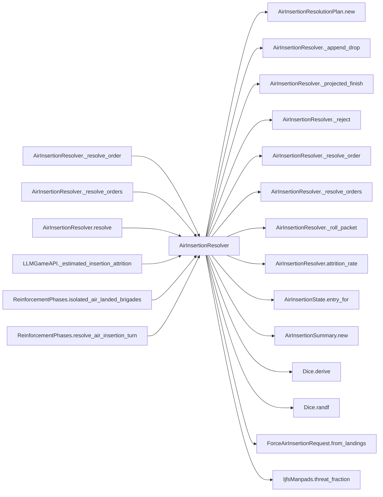

# AirInsertionResolver

> **Reading aid, not an execution contract.** No detected edge is not permission to reorder.
> GDScript reads and writes are conservative source analysis; transition writes are also
> checked against the mutation manifest. Potential conflicts may refer to different object
> instances or conditional branches.

Generator format v1; scan scope `scripts/**/*.gd` plus `project.godot` autoload aliases.
Generated from commit `8829181ae4b6`; input SHA-256 `1c5ff5483615f0cca5b2767540c56e9a13e1387c4c1a3c66db909a97ad2e94fb`;
tool/manifest/fixture SHA-256 `ea366ecafdb8f5cc7ecae22bb7554cd8802d1ed3433c5a903ecc07bbb7230f6c`; stable generation time `2026-08-02T09:03:12-04:00`.
Unresolved-analysis diagnostics on this page: **10**.

## Source summary

Pure calculator for the air insertion phase (plan 0032) — the PLA's non-amphibious path onto Taiwan. Each turn it flies the ordered brigades' battalions out of AirInsertionState.pool, up to a per-lift-class budget, rolls each battalion against the air-defence environment, and reports which ones came down alive and where.  Purity boundary: this computes the outcome (summary + landings) but writes NOTHING — not AirInsertionState, not GameData force fields, nothing that outlives the call. It lives under scripts/calc/ for exactly that reason (plan 0048). `ReinforcementPhases` hands what it returns to the two authorities that share the model: `ForceTransitions` for who moved, `AirInsertionTransitions` for what the lift cost. `caps_after` here is REPORT-ONLY — the authority derives the applied budget from the drop rows rather than copying it.  Dice: ONE derived substream per turn (`air_insertion:<turn>`), consumed only when a packet actually flies. No orders => no derive, no draws => the golden stream is untouched.

Source: `scripts/calc/AirInsertionResolver.gd`

## Placement in resolution code

| Caller | Call-site instance |
|---|---|
| [`AirInsertionResolver._resolve_order`](AirInsertionResolver.md) | `AirInsertionResolver._reject` at `166` |
| [`AirInsertionResolver._resolve_order`](AirInsertionResolver.md) | `AirInsertionResolver._reject` at `169` |
| [`AirInsertionResolver._resolve_order`](AirInsertionResolver.md) | `AirInsertionResolver._reject` at `174` |
| [`AirInsertionResolver._resolve_order`](AirInsertionResolver.md) | `AirInsertionResolver.attrition_rate` at `178` |
| [`AirInsertionResolver._resolve_order`](AirInsertionResolver.md) | `AirInsertionResolver._roll_packet` at `183` |
| [`AirInsertionResolver._resolve_order`](AirInsertionResolver.md) | `AirInsertionResolver._append_drop` at `192` |
| [`AirInsertionResolver._resolve_orders`](AirInsertionResolver.md) | `AirInsertionResolver._resolve_order` at `158` |
| [`AirInsertionResolver.resolve`](AirInsertionResolver.md) | `AirInsertionResolver._projected_finish` at `122` |
| [`AirInsertionResolver.resolve`](AirInsertionResolver.md) | `AirInsertionResolver._projected_finish` at `131` |
| [`AirInsertionResolver.resolve`](AirInsertionResolver.md) | `AirInsertionResolver._resolve_orders` at `146` |
| [`AirInsertionResolver.resolve`](AirInsertionResolver.md) | `AirInsertionResolver._projected_finish` at `148` |
| `LLMGameAPI._estimated_insertion_attrition` | `AirInsertionResolver.threat_from_ijfs_summary` at `407` |
| `LLMGameAPI._estimated_insertion_attrition` | `AirInsertionResolver.attrition_rate` at `411` |
| [`ReinforcementPhases.isolated_air_landed_brigades`](ordering_ReinforcementPhases_isolated_air_landed_brigades.md) | `AirInsertionResolver.isolated_brigades` at `355` |
| [`ReinforcementPhases.resolve_air_insertion_turn`](ordering_ReinforcementPhases_resolve_air_insertion_turn.md) | `AirInsertionResolver.resolve` at `300` |
| [`ReinforcementPhases.resolve_air_insertion_turn`](ordering_ReinforcementPhases_resolve_air_insertion_turn.md) | `AirInsertionResolver.threat_from_ijfs_summary` at `300` |

## Dependency diagram

## Model-field evidence

| Field | Read | Written |
|---|:---:|:---:|
| `AirInsertionResolutionPlan.budget` | yes | yes |
| `AirInsertionResolutionPlan.caps_after` | yes | yes |
| `AirInsertionResolutionPlan.config` | yes | yes |
| `AirInsertionResolutionPlan.dice` | yes | yes |
| `AirInsertionResolutionPlan.hex_can_receive` | yes | yes |
| `AirInsertionResolutionPlan.landings` | yes | yes |
| `AirInsertionResolutionPlan.orders` | yes | yes |
| `AirInsertionResolutionPlan.pool_sent` | yes | yes |
| `AirInsertionResolutionPlan.state` | yes | yes |
| `AirInsertionResolutionPlan.substream` | yes | yes |
| `AirInsertionResolutionPlan.summary` | yes | yes |
| `AirInsertionResolutionPlan.threat` | yes | yes |
| `AirInsertionResolutionPlan.turn_number` | yes | yes |
| `AirInsertionState.caps` | yes |  |
| `AirInsertionState.first_turn` | yes |  |
| `AirInsertionState.landed` | yes |  |
| `AirInsertionState.pool` | yes |  |
| `AirInsertionSummary.attrition_by_class` |  | yes |
| `AirInsertionSummary.battalions_landed` | yes | yes |
| `AirInsertionSummary.battalions_lost` | yes | yes |
| `AirInsertionSummary.caps_after` |  | yes |
| `AirInsertionSummary.caps_before` |  | yes |
| `AirInsertionSummary.drops` | yes | yes |
| `AirInsertionSummary.pending_battalions` |  | yes |
| `AirInsertionSummary.pending_brigades` |  | yes |
| `AirInsertionSummary.rejected` | yes | yes |
| `ForceAirInsertionRequest.landings` |  | yes |
| `ForceAirInsertionRequest.turn_number` |  | yes |

## Method dependencies

| Method | Calls (transitive effects are included above) |
|---|---|
| `_append_drop` | — |
| `_projected_finish` | — |
| `_reject` | — |
| `_resolve_order` | `AirInsertionResolver._append_drop`, `AirInsertionResolver._reject`, `AirInsertionResolver._roll_packet`, `AirInsertionResolver.attrition_rate`, `AirInsertionState.entry_for`, `Dice.derive` |
| `_resolve_orders` | `AirInsertionResolver._resolve_order` |
| `_roll_packet` | `Dice.randf` |
| `attrition_rate` | `IjfsManpads.threat_fraction` |
| `isolated_brigades` | — |
| `resolve` | `AirInsertionResolutionPlan.new`, `AirInsertionResolver._projected_finish`, `AirInsertionResolver._resolve_orders`, `AirInsertionSummary.new`, `ForceAirInsertionRequest.from_landings` |
| `threat_from_ijfs_summary` | — |

## Analysis limits found here

Showing 10 of 10 diagnostics; class pages provide the narrower context.

| Kind | Source | Why it matters |
|---|---|---|
| `dynamic_dispatch` | `scripts/calc/AirInsertionResolver.gd:60` `if connected.has(source_hex) or not bool(is_red_hex.call(source_hex)):` | A string/dynamic call has no statically known target. |
| `dynamic_dispatch` | `scripts/calc/AirInsertionResolver.gd:66` `for neighbor_value in neighbors_of.call(hex_id):` | A string/dynamic call has no statically known target. |
| `dynamic_dispatch` | `scripts/calc/AirInsertionResolver.gd:68` `if connected.has(neighbor) or not bool(is_red_hex.call(neighbor)):` | A string/dynamic call has no statically known target. |
| `dynamic_dispatch` | `scripts/calc/AirInsertionResolver.gd:80` `for neighbor_value in neighbors_of.call(hex_id):` | A string/dynamic call has no statically known target. |
| `untyped_iteration` | `scripts/calc/AirInsertionResolver.gd:157` `for order_value in plan.orders:` | The collection element type could not be proven. |
| `untyped_alias` | `scripts/calc/AirInsertionResolver.gd:164` `var entry := plan.state.entry_for(brigade_id)` | The receiver type could not be proven. |
| `dynamic_dispatch` | `scripts/calc/AirInsertionResolver.gd:168` `if not bool(plan.hex_can_receive.call(target_hex)):` | A string/dynamic call has no statically known target. |
| `untyped_alias` | `scripts/calc/AirInsertionResolver.gd:172` `var remaining := int(plan.budget.get(lift_class, 0))` | The receiver type could not be proven. |
| `untyped_alias` | `scripts/calc/AirInsertionResolver.gd:214` `var first := not landed.is_empty() and not plan.state.landed.has(brigade_id)` | The receiver type could not be proven. |
| `untyped_iteration` | `scripts/calc/AirInsertionResolver.gd:237` `for entry_value in state.pool:` | The collection element type could not be proven. |
