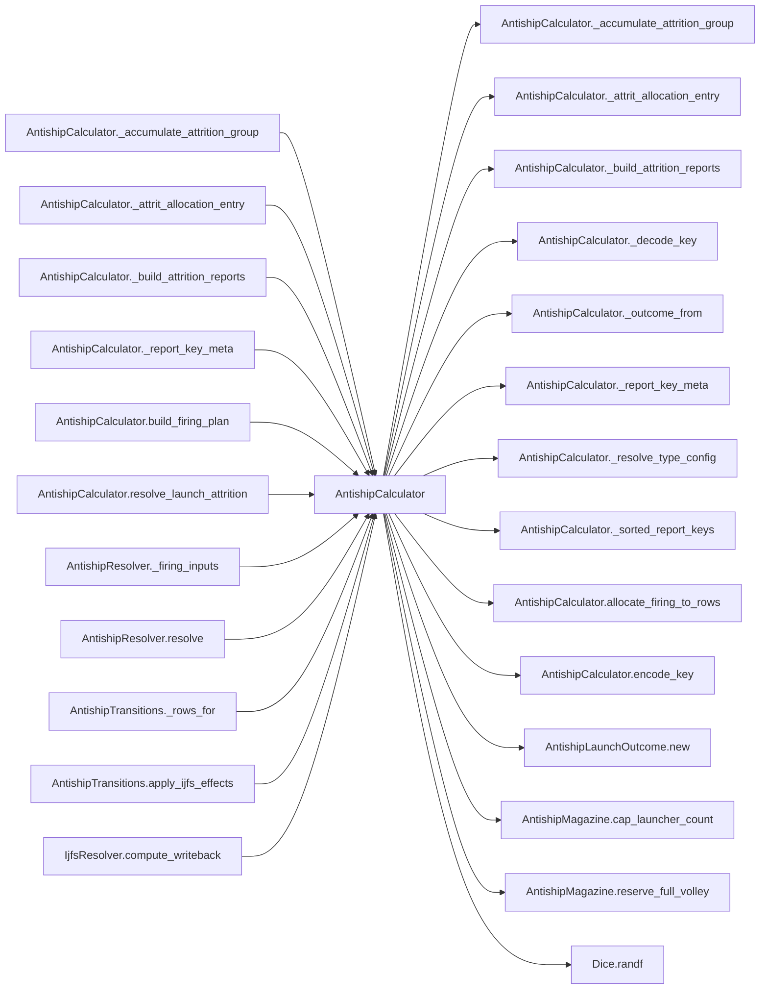

# AntishipCalculator

> **Reading aid, not an execution contract.** No detected edge is not permission to reorder.
> GDScript reads and writes are conservative source analysis; transition writes are also
> checked against the mutation manifest. Potential conflicts may refer to different object
> instances or conditional branches.

Generator format v1; scan scope `scripts/**/*.gd` plus `project.godot` autoload aliases.
Generated from commit `7bbf08693b44`; input SHA-256 `c879af92cf7693c7df1119a11083764377c92a9410144e7b95f361f509613378`;
tool/manifest/fixture SHA-256 `ea366ecafdb8f5cc7ecae22bb7554cd8802d1ed3433c5a903ecc07bbb7230f6c`; stable generation time `2026-08-02T17:09:31-04:00`.
Unresolved-analysis diagnostics on this page: **10**.

## Source summary

D3-B2 — anti-ship firing-plan stage. Faithful port of TIV: - services/antiship_firing_plan.build_firing_plan - services/antiship_allocation.allocate_firing_to_rows - services/antiship_launch_attrition.resolve_launch_attrition  HexCombat's AntishipSystem rows are pre-aggregated one-per-(TO, type_id) by AntishipLoaders, so the per-container row split is single-row here. allocate_firing_to_rows is still ported faithfully (proportional largest-remainder) for fidelity and direct unit testing.  Key encoding: TIV keys dicts on (location, type_key) tuples; GDScript dicts can't key on value-arrays, so we encode them as "<to>:<type>" strings. firing_percentages, destroyed_fire_percentages, ijfs_destroyed and the returned destroyed_firing_plan all use this encoding. type_key is always int in HexCombat data (TIV's non-numeric-type str fallback is unused).  RNG (launch attrition): inject a Dice; draw order mirrors the source exactly — per attempted shot, one randf() for detect/destroy, then a second randf() ONLY when the first kills (intercept-before- launch). The DB/pandas plumbing and the Final_Attrition_Pct reporting column are not ported.

Source: `scripts/calc/AntishipCalculator.gd`

## Placement in resolution code

| Caller | Call-site instance |
|---|---|
| [`AntishipCalculator._accumulate_attrition_group`](AntishipCalculator.md) | `AntishipCalculator.encode_key` at `200` |
| [`AntishipCalculator._attrit_allocation_entry`](AntishipCalculator.md) | `AntishipCalculator._resolve_type_config` at `168` |
| [`AntishipCalculator._build_attrition_reports`](AntishipCalculator.md) | `AntishipCalculator._outcome_from` at `273` |
| [`AntishipCalculator._report_key_meta`](AntishipCalculator.md) | `AntishipCalculator._decode_key` at `225` |
| [`AntishipCalculator.build_firing_plan`](AntishipCalculator.md) | `AntishipCalculator.encode_key` at `100` |
| [`AntishipCalculator.build_firing_plan`](AntishipCalculator.md) | `AntishipCalculator.allocate_firing_to_rows` at `125` |
| [`AntishipCalculator.resolve_launch_attrition`](AntishipCalculator.md) | `AntishipCalculator._attrit_allocation_entry` at `155` |
| [`AntishipCalculator.resolve_launch_attrition`](AntishipCalculator.md) | `AntishipCalculator._accumulate_attrition_group` at `156` |
| [`AntishipCalculator.resolve_launch_attrition`](AntishipCalculator.md) | `AntishipCalculator._report_key_meta` at `158` |
| [`AntishipCalculator.resolve_launch_attrition`](AntishipCalculator.md) | `AntishipCalculator._build_attrition_reports` at `159` |
| [`AntishipCalculator.resolve_launch_attrition`](AntishipCalculator.md) | `AntishipCalculator._sorted_report_keys` at `159` |
| [`AntishipResolver._firing_inputs`](AntishipResolver.md) | `AntishipCalculator.encode_key` at `206` |
| [`AntishipResolver.resolve`](AntishipResolver.md) | `AntishipCalculator.build_firing_plan` at `70` |
| [`AntishipResolver.resolve`](AntishipResolver.md) | `AntishipCalculator.resolve_launch_attrition` at `72` |
| `AntishipTransitions._rows_for` | `AntishipCalculator.encode_key` at `174` |
| `AntishipTransitions._rows_for` | `AntishipCalculator.encode_key` at `182` |
| `AntishipTransitions.apply_ijfs_effects` | `AntishipCalculator.encode_key` at `74` |
| [`IjfsResolver.compute_writeback`](IjfsResolver.md) | `AntishipCalculator.encode_key` at `222` |

## Dependency diagram

## Model-field evidence

| Field | Read | Written |
|---|:---:|:---:|
| `AntishipLaunchOutcome.attempted` |  | yes |
| `AntishipLaunchOutcome.launched` |  | yes |
| `AntishipLaunchOutcome.postlaunch_destroyed` |  | yes |
| `AntishipLaunchOutcome.prelaunch_destroyed` |  | yes |
| `AntishipLaunchOutcome.to_number` |  | yes |
| `AntishipLaunchOutcome.type_id` |  | yes |
| `AntishipMagazine.current_counts` | yes | yes |
| `AntishipMagazine.loadout` | yes |  |
| `AntishipSystem.destroyed_this_turn` | yes |  |
| `AntishipSystem.quantity` | yes |  |
| `AntishipSystem.to_number` | yes |  |
| `AntishipSystem.type_id` | yes |  |

## Method dependencies

| Method | Calls (transitive effects are included above) |
|---|---|
| `_accumulate_attrition_group` | `AntishipCalculator.encode_key` |
| `_attrit_allocation_entry` | `AntishipCalculator._resolve_type_config`, `Dice.randf` |
| `_build_attrition_reports` | `AntishipCalculator._outcome_from` |
| `_decode_key` | — |
| `_outcome_from` | `AntishipLaunchOutcome.new` |
| `_report_key_meta` | `AntishipCalculator._decode_key` |
| `_resolve_type_config` | — |
| `_sorted_report_keys` | — |
| `allocate_firing_to_rows` | — |
| `build_firing_plan` | `AntishipCalculator.allocate_firing_to_rows`, `AntishipCalculator.encode_key`, `AntishipMagazine.cap_launcher_count`, `AntishipMagazine.reserve_full_volley` |
| `encode_key` | — |
| `resolve_launch_attrition` | `AntishipCalculator._accumulate_attrition_group`, `AntishipCalculator._attrit_allocation_entry`, `AntishipCalculator._build_attrition_reports`, `AntishipCalculator._report_key_meta`, `AntishipCalculator._sorted_report_keys` |

## Analysis limits found here

Showing 10 of 10 diagnostics; class pages provide the narrower context.

| Kind | Source | Why it matters |
|---|---|---|
| `callable_or_lambda` | `scripts/calc/AntishipCalculator.gd:59` `order.sort_custom(func(a: int, b: int) -> bool: var ra: float = raw[a] - float(floors[a]) var rb: float = raw[b] - float(floors[b]) if ra != rb: return ra > rb return a < b)` | Callable/lambda dataflow is outside this analyser. |
| `nested_index_unanalysed` | `scripts/calc/AntishipCalculator.gd:66` `floors[order[i]] += 1` | Nested collection indexes exceed the balanced-chain subset; this statement contributes no field effects. |
| `untyped_alias` | `scripts/calc/AntishipCalculator.gd:102` `var truly_available := maxi(0, system.quantity)` | The receiver type could not be proven. |
| `multi_call_statement` | `scripts/calc/AntishipCalculator.gd:159` `return _build_attrition_reports(_sorted_report_keys(meta), meta, grouped, destroyed_firing_plan)` | Multiple calls share one statement; the map preserves lexical sites, not nested evaluation order. |
| `callable_or_lambda` | `scripts/calc/AntishipCalculator.gd:232` `sorted_keys.sort_custom(func(a: String, b: String) -> bool: var meta_a: Array = meta[a] var meta_b: Array = meta[b] if int(meta_a[0]) != int(meta_b[0]): return int(meta_a[0]) < …` | Callable/lambda dataflow is outside this analyser. |
| `untyped_alias` | `scripts/calc/AntishipCalculator.gd:310` `var type_key: Variant = int(type_part) if type_part.is_valid_int() else type_part` | The receiver type could not be proven. |
| `untyped_alias` | `scripts/model/AntishipMagazine.gd:32` `var info: Variant = loadout.get(int(type_id), null)` | The receiver type could not be proven. |
| `untyped_alias` | `scripts/model/AntishipMagazine.gd:53` `var info: Variant = loadout.get(int(type_id), null)` | The receiver type could not be proven. |
| `nested_index_unanalysed` | `scripts/model/AntishipMagazine.gd:109` `counts[pair[0]] = int(counts.get(pair[0], 0)) - int(pair[1])` | Nested collection indexes exceed the balanced-chain subset; this statement contributes no field effects. |
| `untyped_alias` | `scripts/model/AntishipMagazine.gd:184` `var mode: Variant = info.get("magazine_mode", "")` | The receiver type could not be proven. |
