# AntishipCrossing

> **Reading aid, not an execution contract.** No detected edge is not permission to reorder.
> GDScript reads and writes are conservative source analysis; transition writes are also
> checked against the mutation manifest. Potential conflicts may refer to different object
> instances or conditional branches.

Generator format v1; scan scope `scripts/**/*.gd` plus `project.godot` autoload aliases.
Generated from commit `8829181ae4b6`; input SHA-256 `1c5ff5483615f0cca5b2767540c56e9a13e1387c4c1a3c66db909a97ad2e94fb`;
tool/manifest/fixture SHA-256 `ea366ecafdb8f5cc7ecae22bb7554cd8802d1ed3433c5a903ecc07bbb7230f6c`; stable generation time `2026-08-02T09:03:12-04:00`.
Unresolved-analysis diagnostics on this page: **22**.

## Source summary

D3-B3 — anti-ship crossing-damage model. Faithful port of the COUNT-BASED pipeline in TIV services/antiship_crossing.py: resolve what ships are hit / damaged / sunk when anti-ship missiles are fired at the amphibious fleet during the crossing.  Seven stages, each consuming the injected Dice in source order (every RNG-consuming stage sorts its inputs first so the result is independent of caller iteration order): 1. launches      — systems firing -> missiles launched per munition, drawing the global munition pools (per-munition or shared store group); range tier gates participation; half of any unfillable shortfall still launches (partial fire). 2. in-flight      — per-munition failure draw against in_flight_failure_rate. 3. interception   — escort ships (CG/DDG/FFG/FFL) intercept missiles in groups of `group_size`. 4. homing         — surviving missiles home on the sent fleet weighted by target_value, with per-munition decoy discrimination. 5. terminal def.  — per-(ship_type, munition) terminal-defense roll; survivors become hits. 6. damage         — hits resolve into sunk/damaged hulls (fresh -> damaged -> sunk; re-hit fragility via damaged_hull_neut_multiplier; overkill -> wasted_hits).  SCOPE (documented divergence — see PLAN.md Decisions 2026-06-27 D3-B3): TIV's live `resolve_crossing_damage` dispatches stages 3 and 5/6 to PER-HULL variants (`_apply_interception_per_hull`, `_apply_terminal_defense_and_resolve_damage_per_hull`) that track individual escort magazines (hq10/hhq9 via `ship_ammo`) and damage-status combat multipliers (`ship_readiness_policy`) — subsystems HexCombat does not model. This port uses the equivalent COUNT-BASED stages (also present in the TIV source); every `test_antiship_crossing.py` assertion holds under them (escort attempts/success are set so per-hull ammo never binds, and the damage math is identical). Per-hull escort-magazine depletion is deferred (Open Question — when ship magazines are modeled). The RNG mirrors source formulas + draw order via the injected Dice, not Python's PRNG bitstream (per AGENTS.md).  Result is a Dictionary of per-stage ledgers plus computed `missile_stage_totals` (missile-event counts) and `casualty_totals` (hull counts) — deliberately separate units, never summed.

Source: `scripts/calc/AntishipCrossing.gd`

## Placement in resolution code

| Caller | Call-site instance |
|---|---|
| [`AntishipCrossing._add_partial_fire`](AntishipCrossing.md) | `AntishipCrossing._add` at `198` |
| [`AntishipCrossing._apply_homing`](AntishipCrossing.md) | `AntishipCrossing._cfg_num` at `352` |
| [`AntishipCrossing._apply_homing`](AntishipCrossing.md) | `AntishipCrossing._weighted_pool` at `359` |
| [`AntishipCrossing._apply_homing`](AntishipCrossing.md) | `AntishipCrossing._weighted_pool` at `360` |
| [`AntishipCrossing._apply_homing`](AntishipCrossing.md) | `AntishipCrossing._cfg_num` at `383` |
| [`AntishipCrossing._apply_homing`](AntishipCrossing.md) | `AntishipCrossing._add` at `403` |
| [`AntishipCrossing._apply_in_flight_failures`](AntishipCrossing.md) | `AntishipCrossing._cfg_num` at `227` |
| [`AntishipCrossing._apply_in_flight_failures`](AntishipCrossing.md) | `AntishipCrossing._add` at `232` |
| [`AntishipCrossing._apply_interception`](AntishipCrossing.md) | `AntishipCrossing._build_escort_defenders` at `258` |
| [`AntishipCrossing._apply_interception`](AntishipCrossing.md) | `AntishipCrossing._shuffled` at `279` |
| [`AntishipCrossing._apply_interception`](AntishipCrossing.md) | `AntishipCrossing._add` at `302` |
| [`AntishipCrossing._apply_interception`](AntishipCrossing.md) | `AntishipCrossing._choice` at `304` |
| [`AntishipCrossing._apply_interception`](AntishipCrossing.md) | `AntishipCrossing._add` at `309` |
| [`AntishipCrossing._apply_interception`](AntishipCrossing.md) | `AntishipCrossing._add` at `313` |
| [`AntishipCrossing._apply_interception`](AntishipCrossing.md) | `AntishipCrossing._add` at `315` |
| [`AntishipCrossing._apply_terminal_defense`](AntishipCrossing.md) | `AntishipCrossing._terminal_defense_prob` at `438` |
| [`AntishipCrossing._apply_terminal_defense`](AntishipCrossing.md) | `AntishipCrossing._add` at `447` |
| [`AntishipCrossing._build_escort_defenders`](AntishipCrossing.md) | `AntishipCrossing._cfg_num` at `247` |
| [`AntishipCrossing._build_escort_defenders`](AntishipCrossing.md) | `AntishipCrossing._cfg_num` at `247` |
| [`AntishipCrossing._choice`](AntishipCrossing.md) | `AntishipCrossing._ones` at `624` |
| [`AntishipCrossing._draw_loadout_from_pools`](AntishipCrossing.md) | `AntishipCrossing._draw_from_pool` at `182` |
| [`AntishipCrossing._draw_loadout_from_pools`](AntishipCrossing.md) | `AntishipCrossing._add` at `186` |
| [`AntishipCrossing._finalize`](AntishipCrossing.md) | `AntishipCrossing._sum` at `551` |
| [`AntishipCrossing._finalize`](AntishipCrossing.md) | `AntishipCrossing._sum` at `551` |
| [`AntishipCrossing._finalize`](AntishipCrossing.md) | `AntishipCrossing._sum` at `551` |
| [`AntishipCrossing._finalize`](AntishipCrossing.md) | `AntishipCrossing._sum` at `551` |
| [`AntishipCrossing._finalize`](AntishipCrossing.md) | `AntishipCrossing._sum` at `551` |
| [`AntishipCrossing._finalize`](AntishipCrossing.md) | `AntishipCrossing._sum` at `551` |
| [`AntishipCrossing._finalize`](AntishipCrossing.md) | `AntishipCrossing._sum` at `551` |
| [`AntishipCrossing._finalize`](AntishipCrossing.md) | `AntishipCrossing._sum` at `560` |
| [`AntishipCrossing._finalize`](AntishipCrossing.md) | `AntishipCrossing._sum` at `560` |
| [`AntishipCrossing._launch_stage_state`](AntishipCrossing.md) | `AntishipCrossing._target_set_for` at `109` |
| [`AntishipCrossing._launcher_can_reach_targets`](AntishipCrossing.md) | `AntishipCrossing._parse_source_to` at `165` |
| [`AntishipCrossing._launcher_can_reach_targets`](AntishipCrossing.md) | `AntishipCrossing._reachable_tos` at `169` |
| [`AntishipCrossing._randrange`](AntishipCrossing.md) | `AntishipCrossing._ones` at `628` |
| [`AntishipCrossing._resolve_damage`](AntishipCrossing.md) | `AntishipCrossing._cfg_num` at `464` |
| [`AntishipCrossing._resolve_damage`](AntishipCrossing.md) | `AntishipCrossing._sum` at `472` |
| [`AntishipCrossing._resolve_damage`](AntishipCrossing.md) | `AntishipCrossing._sum` at `473` |
| [`AntishipCrossing._resolve_damage`](AntishipCrossing.md) | `AntishipCrossing._cfg_num` at `488` |
| [`AntishipCrossing._resolve_damage`](AntishipCrossing.md) | `AntishipCrossing._shuffled` at `501` |
| [`AntishipCrossing._resolve_damage`](AntishipCrossing.md) | `AntishipCrossing._cfg_num` at `504` |
| [`AntishipCrossing._resolve_damage`](AntishipCrossing.md) | `AntishipCrossing._randrange` at `506` |
| [`AntishipCrossing._resolve_damage`](AntishipCrossing.md) | `AntishipCrossing._add` at `509` |
| [`AntishipCrossing._resolve_launch_row`](AntishipCrossing.md) | `AntishipCrossing._launcher_can_reach_targets` at `150` |
| [`AntishipCrossing._resolve_launch_row`](AntishipCrossing.md) | `AntishipCrossing._draw_loadout_from_pools` at `158` |
| [`AntishipCrossing._resolve_launch_row`](AntishipCrossing.md) | `AntishipCrossing._add_partial_fire` at `159` |
| [`AntishipCrossing._resolve_launches`](AntishipCrossing.md) | `AntishipCrossing._launch_stage_state` at `98` |
| [`AntishipCrossing._resolve_launches`](AntishipCrossing.md) | `AntishipCrossing._sorted_firing_rows` at `101` |
| [`AntishipCrossing._resolve_launches`](AntishipCrossing.md) | `AntishipCrossing._resolve_launch_row` at `102` |
| [`AntishipCrossing._terminal_defense_prob`](AntishipCrossing.md) | `AntishipCrossing._cfg_num` at `415` |
| [`AntishipCrossing._terminal_defense_prob`](AntishipCrossing.md) | `AntishipCrossing._cfg_num` at `416` |
| [`AntishipCrossing._terminal_defense_prob`](AntishipCrossing.md) | `AntishipCrossing._cfg_num` at `417` |
| [`AntishipCrossing._weighted_pool`](AntishipCrossing.md) | `AntishipCrossing._cfg_num` at `337` |
| [`AntishipCrossing.resolve_crossing_damage`](AntishipCrossing.md) | `AntishipCrossing.validate_combat_catalog` at `44` |
| [`AntishipCrossing.resolve_crossing_damage`](AntishipCrossing.md) | `AntishipCrossing.validate_crossing_config` at `45` |
| [`AntishipCrossing.resolve_crossing_damage`](AntishipCrossing.md) | `AntishipCrossing._new_result` at `47` |
| [`AntishipCrossing.resolve_crossing_damage`](AntishipCrossing.md) | `AntishipCrossing._finalize` at `49` |
| [`AntishipCrossing.resolve_crossing_damage`](AntishipCrossing.md) | `AntishipCrossing._normalize_snapshots` at `51` |
| [`AntishipCrossing.resolve_crossing_damage`](AntishipCrossing.md) | `AntishipCrossing._catalog_parts` at `52` |
| [`AntishipCrossing.resolve_crossing_damage`](AntishipCrossing.md) | `AntishipCrossing._resolve_launches` at `55` |
| [`AntishipCrossing.resolve_crossing_damage`](AntishipCrossing.md) | `AntishipCrossing._apply_in_flight_failures` at `56` |
| [`AntishipCrossing.resolve_crossing_damage`](AntishipCrossing.md) | `AntishipCrossing._apply_interception` at `57` |
| [`AntishipCrossing.resolve_crossing_damage`](AntishipCrossing.md) | `AntishipCrossing._apply_homing` at `59` |
| [`AntishipCrossing.resolve_crossing_damage`](AntishipCrossing.md) | `AntishipCrossing._apply_terminal_defense` at `60` |
| [`AntishipCrossing.resolve_crossing_damage`](AntishipCrossing.md) | `AntishipCrossing._resolve_damage` at `61` |
| [`AntishipCrossing.resolve_crossing_damage`](AntishipCrossing.md) | `AntishipCrossing._finalize` at `63` |
| [`AntishipCrossing.validate_combat_catalog`](AntishipCrossing.md) | `AntishipCrossing._fail` at `651` |
| [`AntishipCrossing.validate_combat_catalog`](AntishipCrossing.md) | `AntishipCrossing._fail` at `653` |
| [`AntishipCrossing.validate_combat_catalog`](AntishipCrossing.md) | `AntishipCrossing._fail` at `659` |
| [`AntishipCrossing.validate_combat_catalog`](AntishipCrossing.md) | `AntishipCrossing._fail` at `661` |
| [`AntishipCrossing.validate_combat_catalog`](AntishipCrossing.md) | `AntishipCrossing._fail` at `667` |
| [`AntishipCrossing.validate_combat_catalog`](AntishipCrossing.md) | `AntishipCrossing._fail` at `670` |
| [`AntishipCrossing.validate_combat_catalog`](AntishipCrossing.md) | `AntishipCrossing._fail` at `672` |
| [`AntishipCrossing.validate_combat_catalog`](AntishipCrossing.md) | `AntishipCrossing._fail` at `675` |
| [`AntishipCrossing.validate_combat_catalog`](AntishipCrossing.md) | `AntishipCrossing._fail` at `679` |
| [`AntishipCrossing.validate_combat_catalog`](AntishipCrossing.md) | `AntishipCrossing._fail` at `683` |
| [`AntishipCrossing.validate_combat_catalog`](AntishipCrossing.md) | `AntishipCrossing._fail` at `686` |
| [`AntishipCrossing.validate_combat_catalog`](AntishipCrossing.md) | `AntishipCrossing._fail` at `690` |
| [`AntishipCrossing.validate_crossing_config`](AntishipCrossing.md) | `AntishipCrossing._fail` at `698` |
| [`AntishipCrossing.validate_crossing_config`](AntishipCrossing.md) | `AntishipCrossing._fail` at `700` |
| [`AntishipCrossing.validate_crossing_config`](AntishipCrossing.md) | `AntishipCrossing._fail` at `704` |
| [`AntishipCrossing.validate_crossing_config`](AntishipCrossing.md) | `AntishipCrossing._fail` at `709` |
| [`AntishipResolver.resolve`](AntishipResolver.md) | `AntishipCrossing.resolve_crossing_damage` at `90` |

## Dependency diagram

```mermaid
flowchart LR
  n_31f3751f5663["AntishipCrossing"]
  n_c4c596ee7a5f["AntishipCrossing._add_partial_fire"] --> n_31f3751f5663
  n_c1eabdbaf2bc["AntishipCrossing._apply_homing"] --> n_31f3751f5663
  n_4d12792918ca["AntishipCrossing._apply_in_flight_failures"] --> n_31f3751f5663
  n_858facd6e643["AntishipCrossing._apply_interception"] --> n_31f3751f5663
  n_2d5dc617c98b["AntishipCrossing._apply_terminal_defense"] --> n_31f3751f5663
  n_1d534005a11c["AntishipCrossing._build_escort_defenders"] --> n_31f3751f5663
  n_ba3b146e6316["AntishipCrossing._choice"] --> n_31f3751f5663
  n_bc41f26c6636["AntishipCrossing._draw_loadout_from_pools"] --> n_31f3751f5663
  n_3f8dc49ca5df["AntishipCrossing._finalize"] --> n_31f3751f5663
  n_45762580996c["AntishipCrossing._launch_stage_state"] --> n_31f3751f5663
  n_1f40f749280d["AntishipCrossing._launcher_can_reach_targets"] --> n_31f3751f5663
  n_562ce2b53a7c["AntishipCrossing._randrange"] --> n_31f3751f5663
  n_0ee2b77e25e3["AntishipCrossing._resolve_damage"] --> n_31f3751f5663
  n_7cbbf2504ab4["AntishipCrossing._resolve_launch_row"] --> n_31f3751f5663
  n_fe8c21c09dc3["AntishipCrossing._resolve_launches"] --> n_31f3751f5663
  n_37ea549dedb1["AntishipCrossing._terminal_defense_prob"] --> n_31f3751f5663
  n_8f2c6ccbdeb8["AntishipCrossing._weighted_pool"] --> n_31f3751f5663
  n_ea203248d255["AntishipCrossing.resolve_crossing_damage"] --> n_31f3751f5663
  n_fd154dc918ae["AntishipCrossing.validate_combat_catalog"] --> n_31f3751f5663
  n_562168ae7032["AntishipCrossing.validate_crossing_config"] --> n_31f3751f5663
  n_3290dd700f24["AntishipResolver.resolve"] --> n_31f3751f5663
  n_31f3751f5663 --> n_a9a434094183["AntishipCrossing._add"]
  n_31f3751f5663 --> n_ceab0279515c["AntishipCrossing._add_partial_fire"]
  n_31f3751f5663 --> n_508f5949c7fc["AntishipCrossing._apply_homing"]
  n_31f3751f5663 --> n_0681365844ce["AntishipCrossing._apply_in_flight_failures"]
  n_31f3751f5663 --> n_d334ad968c31["AntishipCrossing._apply_interception"]
  n_31f3751f5663 --> n_dea7dd17bd16["AntishipCrossing._apply_terminal_defense"]
  n_31f3751f5663 --> n_842803b1a797["AntishipCrossing._build_escort_defenders"]
  n_31f3751f5663 --> n_c31a6f6deaff["AntishipCrossing._catalog_parts"]
  n_31f3751f5663 --> n_8b03e136b57f["AntishipCrossing._cfg_num"]
  n_31f3751f5663 --> n_7a4f5d65c99f["AntishipCrossing._choice"]
  n_31f3751f5663 --> n_48c8d43ff834["AntishipCrossing._draw_from_pool"]
  n_31f3751f5663 --> n_92da15464d77["AntishipCrossing._draw_loadout_from_pools"]
  n_31f3751f5663 --> n_5d7103ab0e8d["AntishipCrossing._fail"]
  n_31f3751f5663 --> n_ee78f74ccc04["AntishipCrossing._finalize"]
  n_31f3751f5663 --> n_fbcf95b3a7fd["AntishipCrossing._launch_stage_state"]
  n_31f3751f5663 --> n_cb327a1d0875["AntishipCrossing._launcher_can_reach_targets"]
  n_31f3751f5663 --> n_e9c6a0b885b3["AntishipCrossing._new_result"]
  n_31f3751f5663 --> n_d797747fd405["AntishipCrossing._normalize_snapshots"]
  n_31f3751f5663 --> n_5b7749e701dc["AntishipCrossing._ones"]
  n_31f3751f5663 --> n_8879b560de24["AntishipCrossing._parse_source_to"]
  n_31f3751f5663 --> n_66d9fc7578a8["AntishipCrossing._randrange"]
  n_31f3751f5663 --> n_bae3ef19f151["AntishipCrossing._reachable_tos"]
  n_31f3751f5663 --> n_b676dc7ab8cc["AntishipCrossing._resolve_damage"]
  n_31f3751f5663 --> n_313e4a5ecb67["AntishipCrossing._resolve_launch_row"]
  n_31f3751f5663 --> n_d7e114dda0db["AntishipCrossing._resolve_launches"]
  n_31f3751f5663 --> n_4d24fede9031["AntishipCrossing._shuffled"]
  n_31f3751f5663 --> n_a629a7a895b1["AntishipCrossing._sorted_firing_rows"]
  n_31f3751f5663 --> n_7027e86947dc["AntishipCrossing._sum"]
  n_31f3751f5663 --> n_c532ca2a4e82["AntishipCrossing._target_set_for"]
  n_31f3751f5663 --> n_c10c2c90b8c4["AntishipCrossing._terminal_defense_prob"]
  n_31f3751f5663 --> n_103c46f9d36c["AntishipCrossing._weighted_pool"]
  n_31f3751f5663 --> n_98acc1e9ece7["AntishipCrossing.validate_combat_catalog"]
  n_31f3751f5663 --> n_046671d05af6["AntishipCrossing.validate_crossing_config"]
  n_31f3751f5663 --> n_d3c7d78dad81["Dice.randf"]
  n_31f3751f5663 --> n_6c92ed726cad["Dice.shuffle_indices"]
  n_31f3751f5663 --> n_49dbc2ad475b["Dice.weighted_choice"]
  n_31f3751f5663 --> n_afdea48836e2["Dice.weighted_choices"]
```

## Model-field evidence

| Field | Read | Written |
|---|:---:|:---:|
| `AntishipCrossingContext.active_tos` | yes |  |
| `AntishipCrossingContext.combat_catalog` | yes |  |
| `AntishipCrossingContext.crossing_config` | yes |  |
| `AntishipCrossingContext.escort_sam` | yes |  |
| `AntishipCrossingContext.ship_snapshots` | yes |  |
| `AntishipCrossingContext.systems_fired` | yes |  |
| `AntishipCrossingContext.target_tos` | yes |  |
| `AntishipCrossingContext.to_adjacency` | yes |  |

## Method dependencies

| Method | Calls (transitive effects are included above) |
|---|---|
| `_add` | — |
| `_add_partial_fire` | `AntishipCrossing._add` |
| `_apply_homing` | `AntishipCrossing._add`, `AntishipCrossing._cfg_num`, `AntishipCrossing._weighted_pool`, `Dice.randf`, `Dice.weighted_choices` |
| `_apply_in_flight_failures` | `AntishipCrossing._add`, `AntishipCrossing._cfg_num`, `Dice.randf` |
| `_apply_interception` | `AntishipCrossing._add`, `AntishipCrossing._build_escort_defenders`, `AntishipCrossing._choice`, `AntishipCrossing._shuffled`, `Dice.randf` |
| `_apply_terminal_defense` | `AntishipCrossing._add`, `AntishipCrossing._terminal_defense_prob`, `Dice.randf` |
| `_build_escort_defenders` | `AntishipCrossing._cfg_num` |
| `_catalog_parts` | — |
| `_cfg_num` | — |
| `_choice` | `AntishipCrossing._ones`, `Dice.weighted_choice` |
| `_draw_from_pool` | — |
| `_draw_loadout_from_pools` | `AntishipCrossing._add`, `AntishipCrossing._draw_from_pool` |
| `_fail` | — |
| `_finalize` | `AntishipCrossing._sum` |
| `_launch_stage_state` | `AntishipCrossing._target_set_for` |
| `_launcher_can_reach_targets` | `AntishipCrossing._parse_source_to`, `AntishipCrossing._reachable_tos` |
| `_new_result` | — |
| `_normalize_snapshots` | — |
| `_ones` | — |
| `_parse_source_to` | — |
| `_randrange` | `AntishipCrossing._ones`, `Dice.weighted_choice` |
| `_reachable_tos` | — |
| `_resolve_damage` | `AntishipCrossing._add`, `AntishipCrossing._cfg_num`, `AntishipCrossing._randrange`, `AntishipCrossing._shuffled`, `AntishipCrossing._sum`, `Dice.randf` |
| `_resolve_launch_row` | `AntishipCrossing._add_partial_fire`, `AntishipCrossing._draw_loadout_from_pools`, `AntishipCrossing._launcher_can_reach_targets` |
| `_resolve_launches` | `AntishipCrossing._launch_stage_state`, `AntishipCrossing._resolve_launch_row`, `AntishipCrossing._sorted_firing_rows` |
| `_shuffled` | `Dice.shuffle_indices` |
| `_sorted_firing_rows` | — |
| `_sum` | — |
| `_target_set_for` | — |
| `_terminal_defense_prob` | `AntishipCrossing._cfg_num` |
| `_weighted_pool` | `AntishipCrossing._cfg_num` |
| `resolve_crossing_damage` | `AntishipCrossing._apply_homing`, `AntishipCrossing._apply_in_flight_failures`, `AntishipCrossing._apply_interception`, `AntishipCrossing._apply_terminal_defense`, `AntishipCrossing._catalog_parts`, `AntishipCrossing._finalize`, `AntishipCrossing._new_result`, `AntishipCrossing._normalize_snapshots`, `AntishipCrossing._resolve_damage`, `AntishipCrossing._resolve_launches`, `AntishipCrossing.validate_combat_catalog`, `AntishipCrossing.validate_crossing_config` |
| `validate_combat_catalog` | `AntishipCrossing._fail` |
| `validate_crossing_config` | `AntishipCrossing._fail` |

## Analysis limits found here

Showing 22 of 22 diagnostics; class pages provide the narrower context.

| Kind | Source | Why it matters |
|---|---|---|
| `untyped_alias` | `scripts/calc/AntishipCrossing.gd:76` `var store_group: Variant = munitions[name].get("store_group")` | The receiver type could not be proven. |
| `untyped_iteration` | `scripts/calc/AntishipCrossing.gd:101` `for row in _sorted_firing_rows(context.systems_fired):` | The collection element type could not be proven. |
| `callable_or_lambda` | `scripts/calc/AntishipCrossing.gd:129` `rows.sort_custom(func(a: Dictionary, b: Dictionary) -> bool: var la := str(a.get("location", a.get("to", ""))) var lb := str(b.get("location", b.get("to", ""))) if la != lb: ret…` | Callable/lambda dataflow is outside this analyser. |
| `untyped_alias` | `scripts/calc/AntishipCrossing.gd:165` `var source_to: Variant = _parse_source_to(row.get("location", row.get("to")))` | The receiver type could not be proven. |
| `untyped_alias` | `scripts/calc/AntishipCrossing.gd:205` `var group: Variant = munition_to_group[munition]` | The receiver type could not be proven. |
| `multi_call_statement` | `scripts/calc/AntishipCrossing.gd:247` `defenders.append({ "ship_type": ship_type, "attempts": int(_cfg_num(cfg, "attempts", 0)), "success_prob": _cfg_num(cfg, "success_prob", 0.0), })` | Multiple calls share one statement; the map preserves lexical sites, not nested evaluation order. |
| `nested_index_unanalysed` | `scripts/calc/AntishipCrossing.gd:374` `decoy_types[snap["ship_type"]] = true` | Nested collection indexes exceed the balanced-chain subset; this statement contributes no field effects. |
| `nested_index_unanalysed` | `scripts/calc/AntishipCrossing.gd:467` `surviving_sent[snap["ship_type"]] = int(snap["surviving_sent"])` | Nested collection indexes exceed the balanced-chain subset; this statement contributes no field effects. |
| `multi_call_statement` | `scripts/calc/AntishipCrossing.gd:551` `result["missile_stage_totals"] = { "launched": _sum(result["launched_by_munition"]), "failed_in_flight": _sum(result["failed_in_flight_by_munition"]), "intercepted": _sum(result…` | Multiple calls share one statement; the map preserves lexical sites, not nested evaluation order. |
| `multi_call_statement` | `scripts/calc/AntishipCrossing.gd:560` `result["casualty_totals"] = { "destroyed": _sum(result["destroyed_by_ship_type"]), "damaged": _sum(result["damaged_by_ship_type"]), }` | Multiple calls share one statement; the map preserves lexical sites, not nested evaluation order. |
| `unresolved_receiver` | `scripts/calc/AntishipCrossing.gd:573` `snaps.append({"ship_type": str(s.ship_type), "surviving_sent": int(s.surviving_sent)})` | A protected field name appeared on an unresolved receiver. |
| `untyped_alias` | `scripts/calc/AntishipCrossing.gd:584` `var value: Variant = mapping.get(key)` | The receiver type could not be proven. |
| `multi_call_statement` | `scripts/calc/AntishipCrossing.gd:624` `return arr[dice.weighted_choice(_ones(arr.size()))]` | Multiple calls share one statement; the map preserves lexical sites, not nested evaluation order. |
| `multi_call_statement` | `scripts/calc/AntishipCrossing.gd:628` `return dice.weighted_choice(_ones(n))` | Multiple calls share one statement; the map preserves lexical sites, not nested evaluation order. |
| `untyped_alias` | `scripts/calc/AntishipCrossing.gd:648` `var munitions: Variant = catalog.get("munitions")` | The receiver type could not be proven. |
| `untyped_alias` | `scripts/calc/AntishipCrossing.gd:649` `var launchers: Variant = catalog.get("launchers")` | The receiver type could not be proven. |
| `untyped_alias` | `scripts/calc/AntishipCrossing.gd:665` `var loadout: Variant = spec.get("missiles")` | The receiver type could not be proven. |
| `untyped_alias` | `scripts/calc/AntishipCrossing.gd:677` `var store_groups: Variant = catalog.get("store_groups", {})` | The receiver type could not be proven. |
| `untyped_alias` | `scripts/calc/AntishipCrossing.gd:681` `var group_spec: Variant = store_groups[group_name]` | The receiver type could not be proven. |
| `untyped_alias` | `scripts/calc/AntishipCrossing.gd:684` `var qty: Variant = group_spec.get("quantity")` | The receiver type could not be proven. |
| `untyped_alias` | `scripts/calc/AntishipCrossing.gd:688` `var group: Variant = munitions[name].get("store_group")` | The receiver type could not be proven. |
| `untyped_alias` | `scripts/calc/AntishipCrossing.gd:696` `var section: Variant = config.get(key)` | The receiver type could not be proven. |
