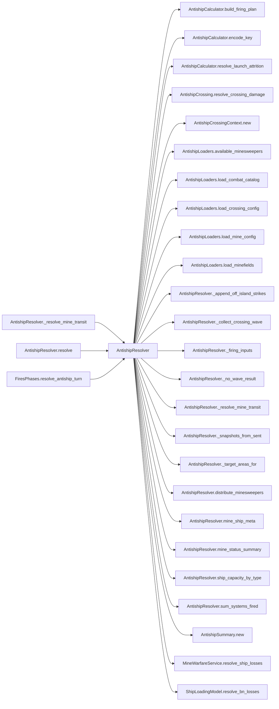

# AntishipResolver

> **Reading aid, not an execution contract.** No detected edge is not permission to reorder.
> GDScript reads and writes are conservative source analysis; transition writes are also
> checked against the mutation manifest. Potential conflicts may refer to different object
> instances or conditional branches.

Generator format v1; scan scope `scripts/**/*.gd` plus `project.godot` autoload aliases.
Generated from commit `7bbf08693b44`; input SHA-256 `c879af92cf7693c7df1119a11083764377c92a9410144e7b95f361f509613378`;
tool/manifest/fixture SHA-256 `ea366ecafdb8f5cc7ecae22bb7554cd8802d1ed3433c5a903ecc07bbb7230f6c`; stable generation time `2026-08-02T17:09:31-04:00`.
Unresolved-analysis diagnostics on this page: **42**.

## Source summary

Pure resolver for the D3 anti-ship + mine-warfare phase (refactor_audit item 10, Phase C): derives the firing percentages from the post-IJFS establishment, builds the firing plan, resolves launch attrition, the crossing, and the geometric mine transit, then converts ship losses to BNs lost at sea. Receives the ALREADY-DERIVED "antiship:<turn>" substream — it never touches the base combat stream.  It writes NO anti-ship state (plan 0043): the IJFS effects have already been applied by AntishipTransitions before it is called, and the launch destruction it reports is returned as typed AntishipLaunchOutcome rows for the same authority to apply afterwards. What it reports is turned into state by the FiresPhases coordinator calling three authorities: drowned BNs leave the reserve and their rosters through ForceTransitions.apply_crossing_loss, the crossing ledger (lost_at_sea_accumulator, pending_lost_at_sea) is booked through SealiftTransitions, and only last_antiship_summary — a phase_output, owned by nobody — plus the EventBus emit are assigned in the coordinator itself. TO lookups arrive as plain maps so this file never reaches for the GameData autoload.  It lives in scripts/calc/ as of plan 0050. Between 0043 and then it stayed in the since-deleted scripts/resolvers/ (dissolved by plan 0055) for ONE reason — `remaining_reserve_after_losses` rewrote `entry["bns"]` on the caller's live `ship_reserve` entries in place, which made this a mixed file by the role-directory rule. Plan 0044 replaced that seam with `ForceTransitions.apply_crossing_loss` and left the function with no production caller at all, so 0050 deleted it (its two-BN partial-prune case moved to tests/transitions/force_transitions_test.gd) and the file passed the `calc/` test: it writes NO campaign state, including through arrays and dictionaries it was handed. Data sources (single source of truth — used only by this resolver).

Source: `scripts/calc/AntishipResolver.gd`

## Placement in resolution code

| Caller | Call-site instance |
|---|---|
| [`AntishipResolver._resolve_mine_transit`](AntishipResolver.md) | `AntishipResolver.distribute_minesweepers` at `243` |
| [`AntishipResolver._resolve_mine_transit`](AntishipResolver.md) | `AntishipResolver.mine_ship_meta` at `243` |
| [`AntishipResolver.resolve`](AntishipResolver.md) | `AntishipResolver._collect_crossing_wave` at `55` |
| [`AntishipResolver.resolve`](AntishipResolver.md) | `AntishipResolver._no_wave_result` at `58` |
| [`AntishipResolver.resolve`](AntishipResolver.md) | `AntishipResolver._target_areas_for` at `60` |
| [`AntishipResolver.resolve`](AntishipResolver.md) | `AntishipResolver._firing_inputs` at `64` |
| [`AntishipResolver.resolve`](AntishipResolver.md) | `AntishipResolver._append_off_island_strikes` at `76` |
| [`AntishipResolver.resolve`](AntishipResolver.md) | `AntishipResolver._snapshots_from_sent` at `83` |
| [`AntishipResolver.resolve`](AntishipResolver.md) | `AntishipResolver._resolve_mine_transit` at `92` |
| [`AntishipResolver.resolve`](AntishipResolver.md) | `AntishipResolver.ship_capacity_by_type` at `98` |
| [`AntishipResolver.resolve`](AntishipResolver.md) | `AntishipResolver.sum_systems_fired` at `106` |
| [`AntishipResolver.resolve`](AntishipResolver.md) | `AntishipResolver.mine_status_summary` at `112` |
| [`FiresPhases.resolve_antiship_turn`](ordering_FiresPhases_resolve_antiship_turn.md) | `AntishipResolver.resolve` at `120` |

## Dependency diagram

## Model-field evidence

| Field | Read | Written |
|---|:---:|:---:|
| `AntishipCrossingContext.active_tos` | yes | yes |
| `AntishipCrossingContext.combat_catalog` | yes | yes |
| `AntishipCrossingContext.crossing_config` | yes | yes |
| `AntishipCrossingContext.escort_sam` | yes | yes |
| `AntishipCrossingContext.ship_snapshots` | yes | yes |
| `AntishipCrossingContext.systems_fired` | yes | yes |
| `AntishipCrossingContext.target_tos` | yes | yes |
| `AntishipCrossingContext.to_adjacency` | yes | yes |
| `AntishipLaunchOutcome.attempted` |  | yes |
| `AntishipLaunchOutcome.launched` |  | yes |
| `AntishipLaunchOutcome.postlaunch_destroyed` |  | yes |
| `AntishipLaunchOutcome.prelaunch_destroyed` |  | yes |
| `AntishipLaunchOutcome.to_number` |  | yes |
| `AntishipLaunchOutcome.type_id` |  | yes |
| `AntishipMagazine.current_counts` | yes | yes |
| `AntishipMagazine.loadout` | yes |  |
| `AntishipResolutionContext.active_tos` | yes |  |
| `AntishipResolutionContext.antiship_systems` | yes |  |
| `AntishipResolutionContext.beach_to_to` | yes |  |
| `AntishipResolutionContext.crossing_reserve` | yes |  |
| `AntishipResolutionContext.escort_sam` | yes |  |
| `AntishipResolutionContext.lost_at_sea_accumulator` | yes |  |
| `AntishipResolutionContext.sent_by_type` | yes |  |
| `AntishipResolutionContext.ship_defs` | yes |  |
| `AntishipResolutionContext.to_adjacency` | yes |  |
| `AntishipSummary.bns_lost_at_sea` |  | yes |
| `AntishipSummary.crossing_casualties` |  | yes |
| `AntishipSummary.destroyed_by_ship_type` |  | yes |
| `AntishipSummary.mine_status` |  | yes |
| `AntishipSummary.resolved_turn` |  | yes |
| `AntishipSummary.sent_by_type` |  | yes |
| `AntishipSummary.systems_fired_count` |  | yes |
| `AntishipSummary.target_beaches` |  | yes |
| `AntishipSummary.target_tos` |  | yes |
| `AntishipSummary.unliftable_bn` |  | yes |
| `AntishipSystem.destroyed_this_turn` | yes |  |
| `AntishipSystem.quantity` | yes |  |
| `AntishipSystem.suppressed_now` | yes |  |
| `AntishipSystem.to_number` | yes |  |
| `AntishipSystem.type_id` | yes |  |
| `Minefield.beach_id` | yes | yes |
| `Minefield.dangerous_mines` | yes | yes |
| `Minefield.lane_cleared` | yes | yes |
| `Minefield.mines_per_sweeper_per_day` |  | yes |
| `Minefield.minesweepers_assigned` | yes | yes |
| `Minefield.name` |  | yes |
| `Minefield.num_mines` | yes | yes |
| `Minefield.remaining_mines` | yes | yes |
| `Minefield.ships_destroyed` | yes | yes |
| `Minefield.to_number` |  | yes |
| `ShipDef.carrying_capacity_bn_equiv` | yes |  |
| `ShipDef.category` | yes |  |
| `ShipDef.is_decoy` | yes |  |
| `ShipDef.mine_neutralization_likelihood` | yes |  |
| `ShipDef.name` | yes |  |

## Method dependencies

| Method | Calls (transitive effects are included above) |
|---|---|
| `_append_off_island_strikes` | — |
| `_collect_crossing_wave` | — |
| `_firing_inputs` | `AntishipCalculator.encode_key` |
| `_no_wave_result` | — |
| `_resolve_mine_transit` | `AntishipLoaders.available_minesweepers`, `AntishipLoaders.load_mine_config`, `AntishipLoaders.load_minefields`, `AntishipResolver.distribute_minesweepers`, `AntishipResolver.mine_ship_meta`, `MineWarfareService.resolve_ship_losses` |
| `_snapshots_from_sent` | — |
| `_target_areas_for` | — |
| `distribute_minesweepers` | — |
| `mine_ship_meta` | — |
| `mine_status_summary` | — |
| `resolve` | `AntishipCalculator.build_firing_plan`, `AntishipCalculator.resolve_launch_attrition`, `AntishipCrossing.resolve_crossing_damage`, `AntishipCrossingContext.new`, `AntishipLoaders.load_combat_catalog`, `AntishipLoaders.load_crossing_config`, `AntishipResolver._append_off_island_strikes`, `AntishipResolver._collect_crossing_wave`, `AntishipResolver._firing_inputs`, `AntishipResolver._no_wave_result`, `AntishipResolver._resolve_mine_transit`, `AntishipResolver._snapshots_from_sent`, `AntishipResolver._target_areas_for`, `AntishipResolver.mine_status_summary`, `AntishipResolver.ship_capacity_by_type`, `AntishipResolver.sum_systems_fired`, `AntishipSummary.new`, `ShipLoadingModel.resolve_bn_losses` |
| `ship_capacity_by_type` | — |
| `sum_systems_fired` | — |

## Analysis limits found here

Showing 30 of 42 diagnostics; class pages provide the narrower context.

| Kind | Source | Why it matters |
|---|---|---|
| `callable_or_lambda` | `scripts/calc/AntishipCalculator.gd:59` `order.sort_custom(func(a: int, b: int) -> bool: var ra: float = raw[a] - float(floors[a]) var rb: float = raw[b] - float(floors[b]) if ra != rb: return ra > rb return a < b)` | Callable/lambda dataflow is outside this analyser. |
| `nested_index_unanalysed` | `scripts/calc/AntishipCalculator.gd:66` `floors[order[i]] += 1` | Nested collection indexes exceed the balanced-chain subset; this statement contributes no field effects. |
| `untyped_alias` | `scripts/calc/AntishipCalculator.gd:102` `var truly_available := maxi(0, system.quantity)` | The receiver type could not be proven. |
| `multi_call_statement` | `scripts/calc/AntishipCalculator.gd:159` `return _build_attrition_reports(_sorted_report_keys(meta), meta, grouped, destroyed_firing_plan)` | Multiple calls share one statement; the map preserves lexical sites, not nested evaluation order. |
| `callable_or_lambda` | `scripts/calc/AntishipCalculator.gd:232` `sorted_keys.sort_custom(func(a: String, b: String) -> bool: var meta_a: Array = meta[a] var meta_b: Array = meta[b] if int(meta_a[0]) != int(meta_b[0]): return int(meta_a[0]) < …` | Callable/lambda dataflow is outside this analyser. |
| `untyped_alias` | `scripts/calc/AntishipCalculator.gd:310` `var type_key: Variant = int(type_part) if type_part.is_valid_int() else type_part` | The receiver type could not be proven. |
| `untyped_alias` | `scripts/calc/AntishipCrossing.gd:76` `var store_group: Variant = munitions[name].get("store_group")` | The receiver type could not be proven. |
| `untyped_iteration` | `scripts/calc/AntishipCrossing.gd:101` `for row in _sorted_firing_rows(context.systems_fired):` | The collection element type could not be proven. |
| `callable_or_lambda` | `scripts/calc/AntishipCrossing.gd:129` `rows.sort_custom(func(a: Dictionary, b: Dictionary) -> bool: var la := str(a.get("location", a.get("to", ""))) var lb := str(b.get("location", b.get("to", ""))) if la != lb: ret…` | Callable/lambda dataflow is outside this analyser. |
| `untyped_alias` | `scripts/calc/AntishipCrossing.gd:165` `var source_to: Variant = _parse_source_to(row.get("location", row.get("to")))` | The receiver type could not be proven. |
| `untyped_alias` | `scripts/calc/AntishipCrossing.gd:205` `var group: Variant = munition_to_group[munition]` | The receiver type could not be proven. |
| `multi_call_statement` | `scripts/calc/AntishipCrossing.gd:247` `defenders.append({ "ship_type": ship_type, "attempts": int(_cfg_num(cfg, "attempts", 0)), "success_prob": _cfg_num(cfg, "success_prob", 0.0), })` | Multiple calls share one statement; the map preserves lexical sites, not nested evaluation order. |
| `nested_index_unanalysed` | `scripts/calc/AntishipCrossing.gd:374` `decoy_types[snap["ship_type"]] = true` | Nested collection indexes exceed the balanced-chain subset; this statement contributes no field effects. |
| `nested_index_unanalysed` | `scripts/calc/AntishipCrossing.gd:467` `surviving_sent[snap["ship_type"]] = int(snap["surviving_sent"])` | Nested collection indexes exceed the balanced-chain subset; this statement contributes no field effects. |
| `multi_call_statement` | `scripts/calc/AntishipCrossing.gd:551` `result["missile_stage_totals"] = { "launched": _sum(result["launched_by_munition"]), "failed_in_flight": _sum(result["failed_in_flight_by_munition"]), "intercepted": _sum(result…` | Multiple calls share one statement; the map preserves lexical sites, not nested evaluation order. |
| `multi_call_statement` | `scripts/calc/AntishipCrossing.gd:560` `result["casualty_totals"] = { "destroyed": _sum(result["destroyed_by_ship_type"]), "damaged": _sum(result["damaged_by_ship_type"]), }` | Multiple calls share one statement; the map preserves lexical sites, not nested evaluation order. |
| `unresolved_receiver` | `scripts/calc/AntishipCrossing.gd:573` `snaps.append({"ship_type": str(s.ship_type), "surviving_sent": int(s.surviving_sent)})` | A protected field name appeared on an unresolved receiver. |
| `untyped_alias` | `scripts/calc/AntishipCrossing.gd:584` `var value: Variant = mapping.get(key)` | The receiver type could not be proven. |
| `multi_call_statement` | `scripts/calc/AntishipCrossing.gd:624` `return arr[dice.weighted_choice(_ones(arr.size()))]` | Multiple calls share one statement; the map preserves lexical sites, not nested evaluation order. |
| `multi_call_statement` | `scripts/calc/AntishipCrossing.gd:628` `return dice.weighted_choice(_ones(n))` | Multiple calls share one statement; the map preserves lexical sites, not nested evaluation order. |
| `untyped_alias` | `scripts/calc/AntishipCrossing.gd:648` `var munitions: Variant = catalog.get("munitions")` | The receiver type could not be proven. |
| `untyped_alias` | `scripts/calc/AntishipCrossing.gd:649` `var launchers: Variant = catalog.get("launchers")` | The receiver type could not be proven. |
| `untyped_alias` | `scripts/calc/AntishipCrossing.gd:665` `var loadout: Variant = spec.get("missiles")` | The receiver type could not be proven. |
| `untyped_alias` | `scripts/calc/AntishipCrossing.gd:677` `var store_groups: Variant = catalog.get("store_groups", {})` | The receiver type could not be proven. |
| `untyped_alias` | `scripts/calc/AntishipCrossing.gd:681` `var group_spec: Variant = store_groups[group_name]` | The receiver type could not be proven. |
| `untyped_alias` | `scripts/calc/AntishipCrossing.gd:684` `var qty: Variant = group_spec.get("quantity")` | The receiver type could not be proven. |
| `untyped_alias` | `scripts/calc/AntishipCrossing.gd:688` `var group: Variant = munitions[name].get("store_group")` | The receiver type could not be proven. |
| `untyped_alias` | `scripts/calc/AntishipCrossing.gd:696` `var section: Variant = config.get(key)` | The receiver type could not be proven. |
| `multi_call_statement` | `scripts/calc/AntishipResolver.gd:98` `var losses := ShipLoadingModel.resolve_bn_losses( destroyed_by_type, ship_capacity_by_type(context.ship_defs), bns_at_sea, context.lost_at_sea_accumulator, dice)` | Multiple calls share one statement; the map preserves lexical sites, not nested evaluation order. |
| `untyped_alias` | `scripts/calc/AntishipResolver.gd:209` `var available := maxi(0, system.quantity)` | The receiver type could not be proven. |
| _…_ | _12 additional diagnostics omitted from this page_ | See the called class pages. |
