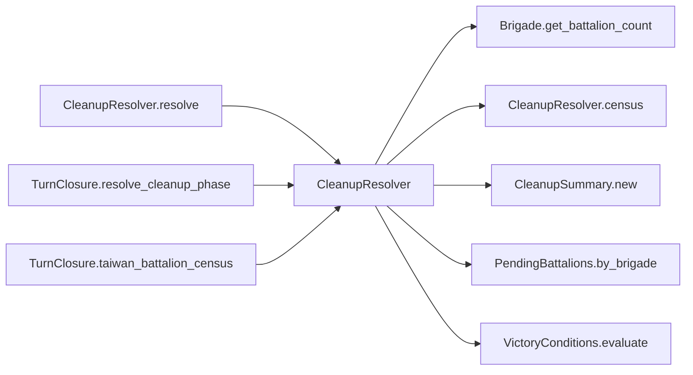

# CleanupResolver

> **Reading aid, not an execution contract.** No detected edge is not permission to reorder.
> GDScript reads and writes are conservative source analysis; transition writes are also
> checked against the mutation manifest. Potential conflicts may refer to different object
> instances or conditional branches.

Generator format v1; scan scope `scripts/**/*.gd` plus `project.godot` autoload aliases.
Generated from commit `7bbf08693b44`; input SHA-256 `c879af92cf7693c7df1119a11083764377c92a9410144e7b95f361f509613378`;
tool/manifest/fixture SHA-256 `ea366ecafdb8f5cc7ecae22bb7554cd8802d1ed3433c5a903ecc07bbb7230f6c`; stable generation time `2026-08-02T17:09:31-04:00`.
Unresolved-analysis diagnostics on this page: **4**.

## Source summary

Pure resolver for the D5-C cleanup phase (refactor_audit item 10, Phase C): runs the end-of-cleanup victory census + verdict and reports it. Consumes NO dice; no autoload/engine access; **applies no campaign state by any route** — which is what puts it in `calc/`.  It used to apply two things and no longer does (plan 0055). The anti-ship transient-flag reset and the brigade activity latch both moved up into `TurnClosure.resolve_cleanup_phase`. Neither belonged here: nothing in this file READS either mutation, so deferring them to the caller changes no decision and no die — the test `scripts/interleaved/` applies. `resolve` now takes the reset COUNT the caller already obtained rather than the systems array it would have reset. `TurnClosure` owns GameData.recompute_hex_ownership() and the EventBus.cleanup_resolved emit; the game_over / winner / _china_has_landed writes belong to `TurnLifecycleTransitions` (plan 0049), which derives all three from the CleanupSummary below. The `china_has_landed` key this file returns is consumed only by its own VictoryConditions call and is report-only to the outside — the authority re-derives it from the summary's census so the two cannot disagree. Count PLA (RED) vs ROC (GREEN) battalions on the hexes that count as "on Taiwan". victory_config.taiwan_hexes null => every placed hex counts (correct for the main-island scenario; offshore islands can't be distinguished until terrain/land data exists). Counts PRESENT (landed) battalions only: brigades wholly off-map (no hex_id) are excluded, AND a partially-arrived brigade's battalions that have not made it ashore yet are subtracted, so they don't inflate China's count.  `pending_pools` is every off-map battalion pool, in the shared {brigade_id, bns} entry shape — assemble it with GameStateData.pending_battalion_pools(), the one place that knows the full list. Passing a partial list here is the ghost-landing failure mode: the omitted pool's battalions get counted as ashore (plan 0034).

Source: `scripts/calc/CleanupResolver.gd`

## Placement in resolution code

| Caller | Call-site instance |
|---|---|
| [`CleanupResolver.resolve`](CleanupResolver.md) | `CleanupResolver.census` at `77` |
| [`TurnClosure.resolve_cleanup_phase`](ordering_TurnClosure_resolve_cleanup_phase.md) | `CleanupResolver.resolve` at `55` |
| [`TurnClosure.taiwan_battalion_census`](ordering_TurnClosure_taiwan_battalion_census.md) | `CleanupResolver.census` at `70` |

## Dependency diagram

## Model-field evidence

| Field | Read | Written |
|---|:---:|:---:|
| `Brigade.composition` | yes |  |
| `Brigade.hex_id` | yes |  |
| `Brigade.id` | yes |  |
| `Brigade.team` | yes |  |
| `CleanupSummary.antiship_systems_reset` |  | yes |
| `CleanupSummary.china_battalions_on_taiwan` |  | yes |
| `CleanupSummary.game_over` |  | yes |
| `CleanupSummary.taiwan_battalions_on_taiwan` |  | yes |
| `CleanupSummary.victory_reason` |  | yes |
| `CleanupSummary.winner` |  | yes |

## Method dependencies

| Method | Calls (transitive effects are included above) |
|---|---|
| `census` | `Brigade.get_battalion_count`, `PendingBattalions.by_brigade` |
| `resolve` | `CleanupResolver.census`, `CleanupSummary.new`, `VictoryConditions.evaluate` |

## Analysis limits found here

Showing 4 of 4 diagnostics; class pages provide the narrower context.

| Kind | Source | Why it matters |
|---|---|---|
| `untyped_alias` | `scripts/calc/CleanupResolver.gd:35` `var counted: Variant = victory_config.get("taiwan_hexes", null)` | The receiver type could not be proven. |
| `untyped_alias` | `scripts/calc/CleanupResolver.gd:51` `var not_ashore := int(not_ashore_by_brigade.get(brigade.id, 0))` | The receiver type could not be proven. |
| `untyped_alias` | `scripts/calc/CleanupResolver.gd:52` `var bn := maxi(0, brigade.get_battalion_count() - not_ashore)` | The receiver type could not be proven. |
| `unresolved_receiver` | `scripts/model/Brigade.gd:60` `total += battalion.qty` | A protected field name appeared on an unresolved receiver. |
