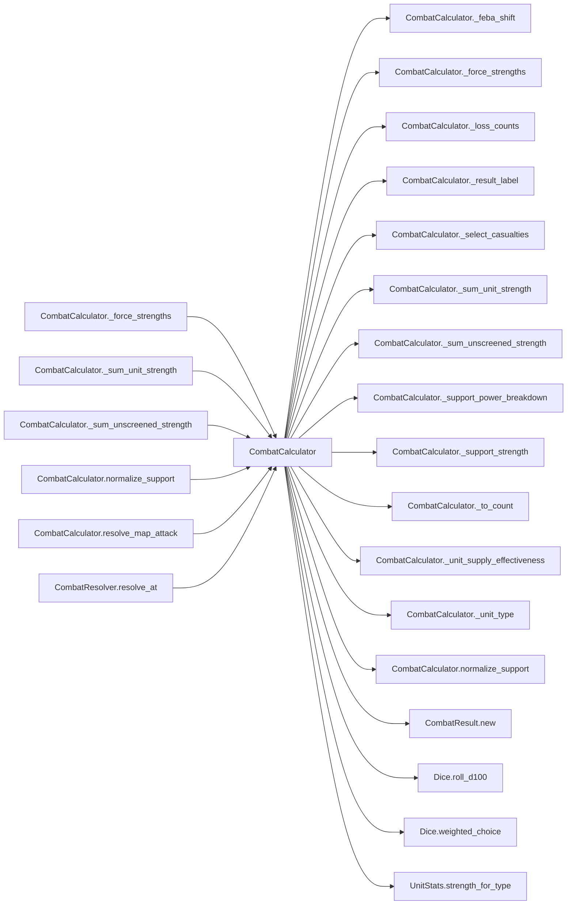

# CombatCalculator

> **Reading aid, not an execution contract.** No detected edge is not permission to reorder.
> GDScript reads and writes are conservative source analysis; transition writes are also
> checked against the mutation manifest. Potential conflicts may refer to different object
> instances or conditional branches.

Generator format v1; scan scope `scripts/**/*.gd` plus `project.godot` autoload aliases.
Generated from commit `8829181ae4b6`; input SHA-256 `1c5ff5483615f0cca5b2767540c56e9a13e1387c4c1a3c66db909a97ad2e94fb`;
tool/manifest/fixture SHA-256 `ea366ecafdb8f5cc7ecae22bb7554cd8802d1ed3433c5a903ecc07bbb7230f6c`; stable generation time `2026-08-02T09:03:12-04:00`.
Unresolved-analysis diagnostics on this page: **7**.

## Source summary

No source summary was found; see the access tables below.

Source: `scripts/calc/CombatCalculator.gd`

## Placement in resolution code

| Caller | Call-site instance |
|---|---|
| [`CombatCalculator._force_strengths`](CombatCalculator.md) | `CombatCalculator._sum_unit_strength` at `109` |
| [`CombatCalculator._force_strengths`](CombatCalculator.md) | `CombatCalculator._sum_unit_strength` at `110` |
| [`CombatCalculator._force_strengths`](CombatCalculator.md) | `CombatCalculator._sum_unscreened_strength` at `116` |
| [`CombatCalculator._force_strengths`](CombatCalculator.md) | `CombatCalculator._support_strength` at `121` |
| [`CombatCalculator._force_strengths`](CombatCalculator.md) | `CombatCalculator._support_strength` at `123` |
| [`CombatCalculator._force_strengths`](CombatCalculator.md) | `CombatCalculator._sum_unscreened_strength` at `129` |
| [`CombatCalculator._force_strengths`](CombatCalculator.md) | `CombatCalculator._support_strength` at `134` |
| [`CombatCalculator._force_strengths`](CombatCalculator.md) | `CombatCalculator._support_strength` at `136` |
| [`CombatCalculator._sum_unit_strength`](CombatCalculator.md) | `CombatCalculator._unit_type` at `251` |
| [`CombatCalculator._sum_unit_strength`](CombatCalculator.md) | `CombatCalculator._unit_supply_effectiveness` at `253` |
| [`CombatCalculator._sum_unscreened_strength`](CombatCalculator.md) | `CombatCalculator._unit_supply_effectiveness` at `261` |
| [`CombatCalculator.normalize_support`](CombatCalculator.md) | `CombatCalculator._to_count` at `233` |
| [`CombatCalculator.normalize_support`](CombatCalculator.md) | `CombatCalculator._to_count` at `233` |
| [`CombatCalculator.normalize_support`](CombatCalculator.md) | `CombatCalculator._to_count` at `233` |
| [`CombatCalculator.normalize_support`](CombatCalculator.md) | `CombatCalculator._to_count` at `233` |
| [`CombatCalculator.normalize_support`](CombatCalculator.md) | `CombatCalculator._to_count` at `233` |
| [`CombatCalculator.resolve_map_attack`](CombatCalculator.md) | `CombatCalculator.normalize_support` at `14` |
| [`CombatCalculator.resolve_map_attack`](CombatCalculator.md) | `CombatCalculator.normalize_support` at `15` |
| [`CombatCalculator.resolve_map_attack`](CombatCalculator.md) | `CombatCalculator._force_strengths` at `18` |
| [`CombatCalculator.resolve_map_attack`](CombatCalculator.md) | `CombatCalculator._loss_counts` at `28` |
| [`CombatCalculator.resolve_map_attack`](CombatCalculator.md) | `CombatCalculator._select_casualties` at `30` |
| [`CombatCalculator.resolve_map_attack`](CombatCalculator.md) | `CombatCalculator._select_casualties` at `31` |
| [`CombatCalculator.resolve_map_attack`](CombatCalculator.md) | `CombatCalculator._feba_shift` at `33` |
| [`CombatCalculator.resolve_map_attack`](CombatCalculator.md) | `CombatCalculator._support_power_breakdown` at `49` |
| [`CombatCalculator.resolve_map_attack`](CombatCalculator.md) | `CombatCalculator._support_power_breakdown` at `49` |
| [`CombatCalculator.resolve_map_attack`](CombatCalculator.md) | `CombatCalculator._result_label` at `49` |
| [`CombatResolver.resolve_at`](CombatResolver.md) | `CombatCalculator.resolve_map_attack` at `79` |

## Dependency diagram

## Model-field evidence

| Field | Read | Written |
|---|:---:|:---:|
| `CombatResult.attacker_casualties` |  | yes |
| `CombatResult.attacker_losses` |  | yes |
| `CombatResult.attacker_maneuver_strength` |  | yes |
| `CombatResult.attacker_strength` |  | yes |
| `CombatResult.combat_detail` |  | yes |
| `CombatResult.defender_casualties` |  | yes |
| `CombatResult.defender_losses` |  | yes |
| `CombatResult.defender_maneuver_strength` |  | yes |
| `CombatResult.defender_strength` |  | yes |
| `CombatResult.defender_terrain_modifier` |  | yes |
| `CombatResult.feba_movement_km` |  | yes |
| `CombatResult.force_ratio` |  | yes |
| `CombatResult.unmodified_force_ratio` |  | yes |
| `CombatRules.combat_attacker_advantage_ratio` | yes |  |
| `CombatRules.combat_attacker_ratio_slope` | yes |  |
| `CombatRules.combat_base_loss_rate` | yes |  |
| `CombatRules.combat_defender_advantage_ratio` | yes |  |
| `CombatRules.combat_defender_ratio_slope` | yes |  |
| `CombatRules.combat_loss_roll_midpoint` | yes |  |
| `CombatRules.combat_loss_roll_scale` | yes |  |
| `CombatRules.combat_max_attacker_loss_rate` | yes |  |
| `CombatRules.combat_max_defender_loss_rate` | yes |  |
| `CombatRules.combat_min_effective_strength` | yes |  |
| `CombatRules.combat_min_loss_rate` | yes |  |
| `CombatRules.default_combat_strength` | yes |  |
| `CombatRules.defender_terrain_modifier` | yes |  |
| `CombatRules.feba_balance_clamp` | yes |  |
| `CombatRules.feba_balance_gain` | yes |  |
| `CombatRules.feba_base_km` | yes |  |
| `CombatRules.feba_roll_factor_min` | yes |  |
| `CombatRules.feba_roll_factor_span` | yes |  |
| `CombatRules.maneuver_casualty_weight` | yes |  |
| `CombatRules.support_casualty_weight` | yes |  |
| `CombatRules.support_multipliers` | yes |  |
| `CombatRules.unscreened_support_strength` | yes |  |

## Method dependencies

| Method | Calls (transitive effects are included above) |
|---|---|
| `_feba_shift` | — |
| `_force_strengths` | `CombatCalculator._sum_unit_strength`, `CombatCalculator._sum_unscreened_strength`, `CombatCalculator._support_strength` |
| `_loss_counts` | — |
| `_result_label` | — |
| `_select_casualties` | `Dice.weighted_choice` |
| `_sum_unit_strength` | `CombatCalculator._unit_supply_effectiveness`, `CombatCalculator._unit_type`, `UnitStats.strength_for_type` |
| `_sum_unscreened_strength` | `CombatCalculator._unit_supply_effectiveness` |
| `_support_power_breakdown` | — |
| `_support_strength` | — |
| `_to_count` | — |
| `_unit_supply_effectiveness` | — |
| `_unit_type` | — |
| `normalize_support` | `CombatCalculator._to_count` |
| `resolve_map_attack` | `CombatCalculator._feba_shift`, `CombatCalculator._force_strengths`, `CombatCalculator._loss_counts`, `CombatCalculator._result_label`, `CombatCalculator._select_casualties`, `CombatCalculator._support_power_breakdown`, `CombatCalculator.normalize_support`, `CombatResult.new`, `Dice.roll_d100` |

## Analysis limits found here

Showing 7 of 7 diagnostics; class pages provide the narrower context.

| Kind | Source | Why it matters |
|---|---|---|
| `untyped_alias` | `scripts/calc/CombatCalculator.gd:16` `var defender_terrain_modifier = max(1.0, rules.defender_terrain_modifier)` | The receiver type could not be proven. |
| `multi_call_statement` | `scripts/calc/CombatCalculator.gd:49` `result.combat_detail = { "attacker": { "maneuver_unit_count": attacker_units.size(), "support_unit_count": attacker_support_units.size(), "unscreened": forces["attacker_unscreen…` | Multiple calls share one statement; the map preserves lexical sites, not nested evaluation order. |
| `untyped_alias` | `scripts/calc/CombatCalculator.gd:175` `var attacker_loss_rate := clampf( rules.combat_base_loss_rate - (ratio - 1.0) * rules.combat_attacker_ratio_slope + (attacker_loss_roll - rules.combat_loss_roll_midpoint) / rule…` | The receiver type could not be proven. |
| `untyped_alias` | `scripts/calc/CombatCalculator.gd:179` `var defender_loss_rate := clampf( rules.combat_base_loss_rate + (ratio - 1.0) * rules.combat_defender_ratio_slope + (defender_loss_roll - rules.combat_loss_roll_midpoint) / rule…` | The receiver type could not be proven. |
| `multi_call_statement` | `scripts/calc/CombatCalculator.gd:233` `return { "artillery": _to_count(raw_support.get("artillery")), "rocket_artillery": _to_count(raw_support.get("rocket_artillery")), "cas": _to_count(raw_support.get("cas")), "crb…` | Multiple calls share one statement; the map preserves lexical sites, not nested evaluation order. |
| `untyped_alias` | `scripts/calc/CombatCalculator.gd:269` `var multiplier := float(rules.support_multipliers.get(support_type, 0.0))` | The receiver type could not be proven. |
| `untyped_alias` | `scripts/calc/CombatCalculator.gd:278` `var multiplier := float(rules.support_multipliers.get(support_type, 0.0))` | The receiver type could not be proven. |
