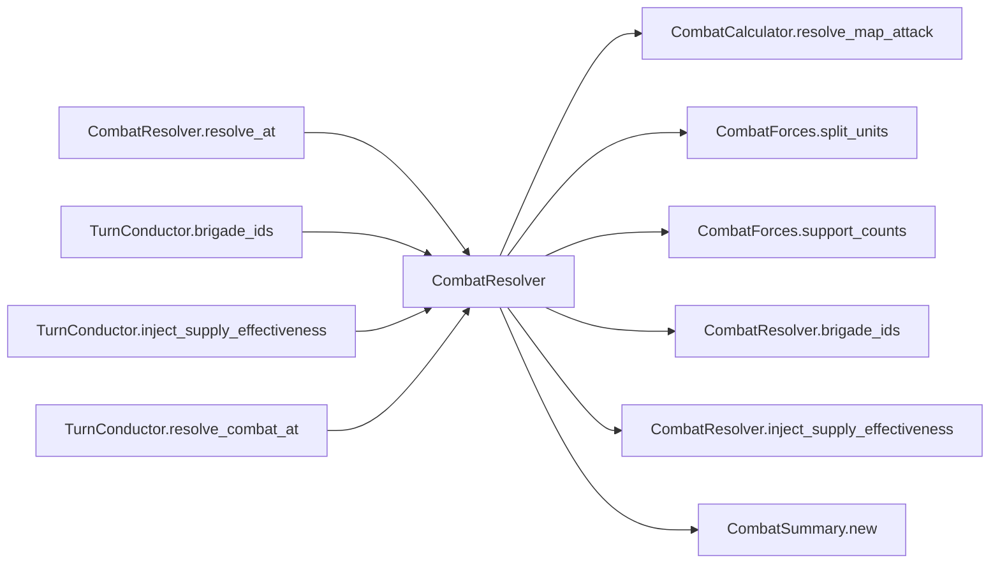

# CombatResolver

> **Reading aid, not an execution contract.** No detected edge is not permission to reorder.
> GDScript reads and writes are conservative source analysis; transition writes are also
> checked against the mutation manifest. Potential conflicts may refer to different object
> instances or conditional branches.

Generator format v1; scan scope `scripts/**/*.gd` plus `project.godot` autoload aliases.
Generated from commit `7bbf08693b44`; input SHA-256 `c879af92cf7693c7df1119a11083764377c92a9410144e7b95f361f509613378`;
tool/manifest/fixture SHA-256 `ea366ecafdb8f5cc7ecae22bb7554cd8802d1ed3433c5a903ecc07bbb7230f6c`; stable generation time `2026-08-02T17:09:31-04:00`.
Unresolved-analysis diagnostics on this page: **8**.

## Source summary

Pure resolver for the per-hex ground-combat core (refactor_audit item 10, Phase D): builds the maneuver/support forces from the contributor brigades, injects supply effectiveness, runs the ported CombatCalculator.resolve_map_attack (the SOLE base-dice-stream consumer in the game), and constructs the CombatSummary. It applies NOTHING — casualty application, FEBA accumulation, fought flags, ownership, and retreats stay in GameState, because combat at one hex mutates state the next hex's contributor gathering reads (the interleaving is part of the ported semantics, and application touches GameData indexes). Mirrors TIV boots_combat_service._inject_supply_effectiveness: Red maneuver units fight at full effectiveness while the Red DOS pool is positive, and at out_of_supply_effectiveness once it is exhausted (<= 0). Green has no DOS model, so its effectiveness stays 1.0.  isolated_brigade_ids (plan 0032) overrides that per brigade: an air-landed formation with no Red corridor back to a lodgement fights out of supply no matter how full the theatre pool is — the DOS tonnage exists, it just cannot reach a battalion behind enemy lines. Empty (the default) is the pre-0032 behaviour exactly.

Source: `scripts/calc/CombatResolver.gd`

## Placement in resolution code

| Caller | Call-site instance |
|---|---|
| [`CombatResolver.resolve_at`](CombatResolver.md) | `CombatResolver.inject_supply_effectiveness` at `77` |
| [`CombatResolver.resolve_at`](CombatResolver.md) | `CombatResolver.inject_supply_effectiveness` at `78` |
| [`CombatResolver.resolve_at`](CombatResolver.md) | `CombatResolver.brigade_ids` at `96` |
| [`CombatResolver.resolve_at`](CombatResolver.md) | `CombatResolver.brigade_ids` at `97` |
| [`TurnConductor.brigade_ids`](ordering_TurnConductor_brigade_ids.md) | `CombatResolver.brigade_ids` at `166` |
| [`TurnConductor.inject_supply_effectiveness`](ordering_TurnConductor_inject_supply_effectiveness.md) | `CombatResolver.inject_supply_effectiveness` at `160` |
| [`TurnConductor.resolve_combat_at`](ordering_TurnConductor_resolve_combat_at.md) | `CombatResolver.resolve_at` at `208` |

## Dependency diagram

## Model-field evidence

| Field | Read | Written |
|---|:---:|:---:|
| `Battalion.qty` | yes |  |
| `Battalion.type` | yes |  |
| `Brigade.composition` | yes |  |
| `Brigade.id` | yes |  |
| `CombatResult.attacker_casualties` |  | yes |
| `CombatResult.attacker_losses` | yes | yes |
| `CombatResult.attacker_maneuver_strength` |  | yes |
| `CombatResult.attacker_strength` |  | yes |
| `CombatResult.combat_detail` | yes | yes |
| `CombatResult.defender_casualties` |  | yes |
| `CombatResult.defender_losses` | yes | yes |
| `CombatResult.defender_maneuver_strength` |  | yes |
| `CombatResult.defender_strength` |  | yes |
| `CombatResult.defender_terrain_modifier` |  | yes |
| `CombatResult.feba_movement_km` | yes | yes |
| `CombatResult.force_ratio` |  | yes |
| `CombatResult.unmodified_force_ratio` |  | yes |
| `CombatRules.combat_attacker_advantage_ratio` | yes |  |
| `CombatRules.combat_attacker_ratio_slope` | yes |  |
| `CombatRules.combat_base_loss_rate` | yes |  |
| `CombatRules.combat_defender_advantage_ratio` | yes |  |
| `CombatRules.combat_defender_ratio_slope` | yes |  |
| `CombatRules.combat_loss_roll_midpoint` | yes |  |
| `CombatRules.combat_loss_roll_scale` | yes |  |
| `CombatRules.combat_max_attacker_loss_rate` | yes |  |
| `CombatRules.combat_max_defender_loss_rate` | yes |  |
| `CombatRules.combat_min_effective_strength` | yes |  |
| `CombatRules.combat_min_loss_rate` | yes |  |
| `CombatRules.default_combat_strength` | yes |  |
| `CombatRules.defender_terrain_modifier` | yes |  |
| `CombatRules.feba_balance_clamp` | yes |  |
| `CombatRules.feba_balance_gain` | yes |  |
| `CombatRules.feba_base_km` | yes |  |
| `CombatRules.feba_roll_factor_min` | yes |  |
| `CombatRules.feba_roll_factor_span` | yes |  |
| `CombatRules.isolated_red_brigade_ids` | yes |  |
| `CombatRules.maneuver_casualty_weight` | yes |  |
| `CombatRules.not_ashore_by_type` | yes |  |
| `CombatRules.red_out_of_supply_effectiveness` | yes |  |
| `CombatRules.red_supply_pool` | yes |  |
| `CombatRules.support_casualty_weight` | yes |  |
| `CombatRules.support_multipliers` | yes |  |
| `CombatRules.unscreened_support_strength` | yes |  |
| `CombatSummary.attacker_brigade_ids` |  | yes |
| `CombatSummary.attacker_losses` |  | yes |
| `CombatSummary.combat_detail` |  | yes |
| `CombatSummary.defender_brigade_ids` |  | yes |
| `CombatSummary.defender_losses` |  | yes |
| `CombatSummary.feba_movement_km` |  | yes |
| `CombatSummary.hex_id` |  | yes |

## Method dependencies

| Method | Calls (transitive effects are included above) |
|---|---|
| `brigade_ids` | — |
| `inject_supply_effectiveness` | — |
| `resolve_at` | `CombatCalculator.resolve_map_attack`, `CombatForces.split_units`, `CombatForces.support_counts`, `CombatResolver.brigade_ids`, `CombatResolver.inject_supply_effectiveness`, `CombatSummary.new` |

## Analysis limits found here

Showing 8 of 8 diagnostics; class pages provide the narrower context.

| Kind | Source | Why it matters |
|---|---|---|
| `untyped_alias` | `scripts/calc/CombatCalculator.gd:16` `var defender_terrain_modifier = max(1.0, rules.defender_terrain_modifier)` | The receiver type could not be proven. |
| `multi_call_statement` | `scripts/calc/CombatCalculator.gd:49` `result.combat_detail = { "attacker": { "maneuver_unit_count": attacker_units.size(), "support_unit_count": attacker_support_units.size(), "unscreened": forces["attacker_unscreen…` | Multiple calls share one statement; the map preserves lexical sites, not nested evaluation order. |
| `untyped_alias` | `scripts/calc/CombatCalculator.gd:175` `var attacker_loss_rate := clampf( rules.combat_base_loss_rate - (ratio - 1.0) * rules.combat_attacker_ratio_slope + (attacker_loss_roll - rules.combat_loss_roll_midpoint) / rule…` | The receiver type could not be proven. |
| `untyped_alias` | `scripts/calc/CombatCalculator.gd:179` `var defender_loss_rate := clampf( rules.combat_base_loss_rate + (ratio - 1.0) * rules.combat_defender_ratio_slope + (defender_loss_roll - rules.combat_loss_roll_midpoint) / rule…` | The receiver type could not be proven. |
| `multi_call_statement` | `scripts/calc/CombatCalculator.gd:233` `return { "artillery": _to_count(raw_support.get("artillery")), "rocket_artillery": _to_count(raw_support.get("rocket_artillery")), "cas": _to_count(raw_support.get("cas")), "crb…` | Multiple calls share one statement; the map preserves lexical sites, not nested evaluation order. |
| `untyped_alias` | `scripts/calc/CombatCalculator.gd:269` `var multiplier := float(rules.support_multipliers.get(support_type, 0.0))` | The receiver type could not be proven. |
| `untyped_alias` | `scripts/calc/CombatCalculator.gd:278` `var multiplier := float(rules.support_multipliers.get(support_type, 0.0))` | The receiver type could not be proven. |
| `multi_call_statement` | `scripts/model/CombatForces.gd:16` `return UnitStats.has_tag(unit_type, "artillery") or UnitStats.has_tag(unit_type, "rotary_wing")` | Multiple calls share one statement; the map preserves lexical sites, not nested evaluation order. |
