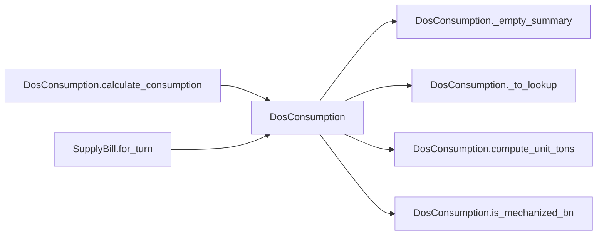

# DosConsumption

> **Reading aid, not an execution contract.** No detected edge is not permission to reorder.
> GDScript reads and writes are conservative source analysis; transition writes are also
> checked against the mutation manifest. Potential conflicts may refer to different object
> instances or conditional branches.

Generator format v1; scan scope `scripts/**/*.gd` plus `project.godot` autoload aliases.
Generated from commit `7bbf08693b44`; input SHA-256 `c879af92cf7693c7df1119a11083764377c92a9410144e7b95f361f509613378`;
tool/manifest/fixture SHA-256 `ea366ecafdb8f5cc7ecae22bb7554cd8802d1ed3433c5a903ecc07bbb7230f6c`; stable generation time `2026-08-02T17:09:31-04:00`.
Unresolved-analysis diagnostics on this page: **0**.

## Source summary

No source summary was found; see the access tables below.

Source: `scripts/calc/DosConsumption.gd`

## Placement in resolution code

| Caller | Call-site instance |
|---|---|
| [`DosConsumption.calculate_consumption`](DosConsumption.md) | `DosConsumption._empty_summary` at `70` |
| [`DosConsumption.calculate_consumption`](DosConsumption.md) | `DosConsumption._to_lookup` at `72` |
| [`DosConsumption.calculate_consumption`](DosConsumption.md) | `DosConsumption._to_lookup` at `73` |
| [`DosConsumption.calculate_consumption`](DosConsumption.md) | `DosConsumption.is_mechanized_bn` at `86` |
| [`DosConsumption.calculate_consumption`](DosConsumption.md) | `DosConsumption.compute_unit_tons` at `89` |
| [`SupplyBill.for_turn`](SupplyBill.md) | `DosConsumption.calculate_consumption` at `30` |

## Dependency diagram

## Model-field evidence

| Field | Read | Written |
|---|:---:|:---:|
| _No persistent model field was resolved_ | | |

## Method dependencies

| Method | Calls (transitive effects are included above) |
|---|---|
| `_empty_summary` | — |
| `_to_lookup` | — |
| `calculate_consumption` | `DosConsumption._empty_summary`, `DosConsumption._to_lookup`, `DosConsumption.compute_unit_tons`, `DosConsumption.is_mechanized_bn` |
| `compute_unit_tons` | — |
| `is_mechanized_bn` | — |

## Analysis limits found here

No unresolved constructs were recorded.
