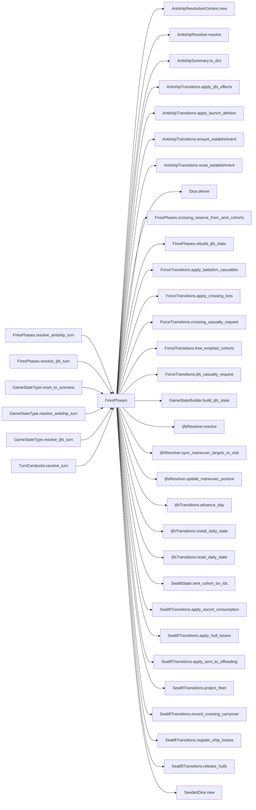

# FiresPhases

> **Reading aid, not an execution contract.** No detected edge is not permission to reorder.
> GDScript reads and writes are conservative source analysis; transition writes are also
> checked against the mutation manifest. Potential conflicts may refer to different object
> instances or conditional branches.

Generator format v1; scan scope `scripts/**/*.gd` plus `project.godot` autoload aliases.
Generated from commit `8829181ae4b6`; input SHA-256 `1c5ff5483615f0cca5b2767540c56e9a13e1387c4c1a3c66db909a97ad2e94fb`;
tool/manifest/fixture SHA-256 `ea366ecafdb8f5cc7ecae22bb7554cd8802d1ed3433c5a903ecc07bbb7230f6c`; stable generation time `2026-08-02T09:03:12-04:00`.
Unresolved-analysis diagnostics on this page: **231**.

## Source summary

The fires phases of the WeGo turn (plan 0038 step 2): Red's IJFS joint/air-missile fires and Green's coastal anti-ship + mine defence of the crossing. They are one group because they share the anti-ship firing systems — IJFS suppresses and destroys the very launchers the anti-ship phase then fires — and because both draw from their OWN dice substream, which is what keeps the ground-combat golden invariant byte-stable.  `TurnConductor` keeps the ORDERING (the when); this module only owns the how. Same contract as every other resolver: static, first argument `state: GameStateData` mutated in place, reads the GameData content autoload but never the GameState autoload singleton. The crossing's roster casualties go through `ForceTransitions` and every hull/fleet change through `SealiftTransitions`; this module computes and coordinates, and writes neither aggregate itself.

Source: `scripts/phases/FiresPhases.gd`

## Placement in resolution code

| Caller | Call-site instance |
|---|---|
| [`FiresPhases.resolve_antiship_turn`](ordering_FiresPhases_resolve_antiship_turn.md) | `FiresPhases.crossing_reserve_from_sent_cohorts` at `106` |
| [`FiresPhases.resolve_ijfs_turn`](ordering_FiresPhases_resolve_ijfs_turn.md) | `FiresPhases.rebuild_ijfs_state` at `20` |
| `GameStateType.reset_to_scenario` | `FiresPhases.reset_ijfs_state` at `182` |
| `GameStateType.reset_to_scenario` | `FiresPhases.reset_antiship_establishment` at `190` |
| `GameStateType.resolve_antiship_turn` | `FiresPhases.resolve_antiship_turn` at `282` |
| `GameStateType.resolve_ijfs_turn` | `FiresPhases.resolve_ijfs_turn` at `278` |
| [`TurnConductor.resolve_turn`](ordering_TurnConductor_resolve_turn.md) | `FiresPhases.resolve_ijfs_turn` at `38` |
| [`TurnConductor.resolve_turn`](ordering_TurnConductor_resolve_turn.md) | `FiresPhases.apply_ijfs_maneuver_casualties` at `41` |
| [`TurnConductor.resolve_turn`](ordering_TurnConductor_resolve_turn.md) | `FiresPhases.resolve_antiship_turn` at `46` |

## Dependency diagram

## Model-field evidence

| Field | Read | Written |
|---|:---:|:---:|
| `AntishipCrossingContext.active_tos` | yes | yes |
| `AntishipCrossingContext.combat_catalog` | yes | yes |
| `AntishipCrossingContext.crossing_config` | yes | yes |
| `AntishipCrossingContext.escort_sam` | yes | yes |
| `AntishipCrossingContext.ship_snapshots` | yes | yes |
| `AntishipCrossingContext.systems_fired` | yes | yes |
| `AntishipCrossingContext.target_tos` | yes | yes |
| `AntishipCrossingContext.to_adjacency` | yes | yes |
| `AntishipLaunchOutcome.attempted` | yes | yes |
| `AntishipLaunchOutcome.launched` | yes | yes |
| `AntishipLaunchOutcome.postlaunch_destroyed` | yes | yes |
| `AntishipLaunchOutcome.prelaunch_destroyed` | yes | yes |
| `AntishipLaunchOutcome.to_number` | yes | yes |
| `AntishipLaunchOutcome.type_id` | yes | yes |
| `AntishipMagazine.current_counts` | yes | yes |
| `AntishipMagazine.loadout` | yes |  |
| `AntishipResolutionContext.active_tos` | yes | yes |
| `AntishipResolutionContext.antiship_systems` | yes | yes |
| `AntishipResolutionContext.beach_to_to` | yes | yes |
| `AntishipResolutionContext.crossing_reserve` | yes | yes |
| `AntishipResolutionContext.escort_sam` | yes | yes |
| `AntishipResolutionContext.lost_at_sea_accumulator` | yes | yes |
| `AntishipResolutionContext.sent_by_type` | yes | yes |
| `AntishipResolutionContext.ship_defs` | yes | yes |
| `AntishipResolutionContext.to_adjacency` | yes | yes |
| `AntishipSummary.bns_lost_at_sea` | yes | yes |
| `AntishipSummary.crossing_casualties` | yes | yes |
| `AntishipSummary.destroyed_by_ship_type` | yes | yes |
| `AntishipSummary.mine_status` | yes | yes |
| `AntishipSummary.resolved_turn` | yes | yes |
| `AntishipSummary.sent_by_type` | yes | yes |
| `AntishipSummary.systems_fired_count` | yes | yes |
| `AntishipSummary.target_beaches` | yes | yes |
| `AntishipSummary.target_tos` | yes | yes |
| `AntishipSummary.unliftable_bn` | yes | yes |
| `AntishipSummary.wave_bns` | yes | yes |
| `AntishipSystem.active` |  | yes |
| `AntishipSystem.destroyed` | yes | yes |
| `AntishipSystem.destroyed_this_turn` | yes | yes |
| `AntishipSystem.detectability` |  | yes |
| `AntishipSystem.fired` | yes | yes |
| `AntishipSystem.ijfs_destroyed_cumulative` | yes | yes |
| `AntishipSystem.ijfs_profile` |  | yes |
| `AntishipSystem.launch_destroyed_cumulative` | yes | yes |
| `AntishipSystem.original_quantity` | yes | yes |
| `AntishipSystem.quantity` | yes | yes |
| `AntishipSystem.special` |  | yes |
| `AntishipSystem.suppressed_now` | yes | yes |
| `AntishipSystem.to_number` | yes | yes |
| `AntishipSystem.type_id` | yes | yes |
| `AntishipSystem.type_name` |  | yes |
| `Battalion.qty` | yes | yes |
| `Battalion.type` | yes |  |
| `Brigade.composition` | yes | yes |
| `Brigade.destroyed` | yes | yes |
| `Brigade.fought_last_turn` | yes |  |
| `Brigade.hex_id` | yes | yes |
| `Brigade.id` | yes |  |
| `Brigade.moved_last_turn` | yes |  |
| `Brigade.team` | yes |  |
| `Brigade.to_number` | yes |  |
| `ForceCasualtyReceipt.applied` |  | yes |
| `ForceCasualtyReceipt.battalion_type` |  | yes |
| `ForceCasualtyReceipt.brigade_id` |  | yes |
| `ForceCasualtyReceipt.cause` |  | yes |
| `ForceCasualtyReceipt.destroyed_brigade` |  | yes |
| `ForceCasualtyReceipt.removed_from_hex` |  | yes |
| `ForceCasualtyReceipt.requested` |  | yes |
| `ForceCasualtyReceipt.source_location` |  | yes |
| `ForceCasualtyRequest.battalion_type` | yes | yes |
| `ForceCasualtyRequest.brigade_id` | yes | yes |
| `ForceCasualtyRequest.cause` | yes | yes |
| `ForceCasualtyRequest.count` | yes | yes |
| `ForceCasualtyRequest.source_location` | yes | yes |
| `ForceCrossingCasualtyRequest.destination` | yes |  |
| `ForceCrossingCasualtyRequest.lost_ids` | yes | yes |
| `ForceCrossingCasualtyRequest.sealift_state` |  | yes |
| `ForceCrossingCasualtyRequest.ship_reserve` |  | yes |
| `ForceCrossingCasualtyRequest.source` | yes |  |
| `ForceCrossingCasualtyResult.error` |  | yes |
| `ForceCrossingCasualtyResult.receipts` |  | yes |
| `ForceCrossingCasualtyResult.success` | yes | yes |
| `GameDataStore.active_tos` | yes |  |
| `GameDataStore.amphibious_return_time_turns` | yes |  |
| `GameDataStore.beach_to_to` | yes |  |
| `GameDataStore.brigades` | yes |  |
| `GameDataStore.brigades_by_hex` | yes | yes |
| `GameDataStore.escort_reload_time_turns` | yes |  |
| `GameDataStore.mobilization_holdback` | yes |  |
| `GameDataStore.ship_defs` | yes |  |
| `GameDataStore.ship_defs_by_name` | yes |  |
| `GameDataStore.to_adjacency` | yes |  |
| `GameStateData._antiship_built` | yes | yes |
| `GameStateData._antiship_launch_turn` | yes | yes |
| `GameStateData._ijfs_day` | yes | yes |
| `GameStateData.antiship_containers` | yes | yes |
| `GameStateData.antiship_systems` | yes | yes |
| `GameStateData.fleet` | yes |  |
| `GameStateData.ijfs_state` | yes | yes |
| `GameStateData.last_antiship_summary` | yes | yes |
| `GameStateData.last_ijfs_air_oob` |  | yes |
| `GameStateData.last_ijfs_summary` | yes | yes |
| `GameStateData.last_ijfs_writeback` | yes | yes |
| `GameStateData.last_sealift_sent_by_type` | yes |  |
| `GameStateData.lost_at_sea_accumulator` | yes | yes |
| `GameStateData.pending_lost_at_sea` |  | yes |
| `GameStateData.sealift_state` | yes |  |
| `GameStateData.ship_reserve` | yes |  |
| `GameStateData.turn_number` | yes |  |
| `IjfsAirPackage.dedicated_size` | yes | yes |
| `IjfsAirPackage.initial_size` | yes | yes |
| `IjfsAirPackage.kind` | yes | yes |
| `IjfsAirPackage.members` | yes | yes |
| `IjfsAirPackage.munition_id` | yes | yes |
| `IjfsAirPackage.package_id` | yes | yes |
| `IjfsAirPackage.target_id` |  | yes |
| `IjfsAirPackage.to_number` | yes | yes |
| `IjfsDailyState.air_classes` | yes | yes |
| `IjfsDailyState.contest_log` | yes | yes |
| `IjfsDailyState.detection_log` | yes | yes |
| `IjfsDailyState.engagement_log` | yes | yes |
| `IjfsDailyState.exquisite_intel_overrides` | yes | yes |
| `IjfsDailyState.free_shot_log` | yes | yes |
| `IjfsDailyState.manpads_intercept_log` | yes | yes |
| `IjfsDailyState.munitions` | yes | yes |
| `IjfsDailyState.pairings` | yes | yes |
| `IjfsDailyState.scenario` | yes | yes |
| `IjfsDailyState.seed` | yes |  |
| `IjfsDailyState.source_files` | yes |  |
| `IjfsDailyState.squadron_force` | yes | yes |
| `IjfsDailyState.strike_log` | yes | yes |
| `IjfsDailyState.taiwan_ad_health_after` | yes | yes |
| `IjfsDailyState.taiwan_ad_health_after_missile_phase` | yes | yes |
| `IjfsDailyState.taiwan_ad_health_after_sead` | yes | yes |
| `IjfsDailyState.taiwan_ad_health_before` | yes | yes |
| `IjfsDailyState.targets` | yes | yes |
| `IjfsDailyState.warnings` | yes |  |
| `IjfsMunition.category` | yes | yes |
| `IjfsMunition.display_label` | yes | yes |
| `IjfsMunition.inventory_remaining` | yes | yes |
| `IjfsMunition.manpads_vulnerability` | yes | yes |
| `IjfsMunition.munition_id` | yes | yes |
| `IjfsMunition.munition_name` | yes | yes |
| `IjfsMunition.rounds_per_engagement_default` | yes | yes |
| `IjfsPairing.munition_id` | yes | yes |
| `IjfsPairing.order` |  | yes |
| `IjfsPairing.pairing_id` | yes | yes |
| `IjfsPairing.probability_destroyed` | yes | yes |
| `IjfsPairing.probability_suppressed_if_not_destroyed` | yes | yes |
| `IjfsPairing.rounds_expended_per_engagement` | yes | yes |
| `IjfsPairing.source_target_ids` | yes | yes |
| `IjfsPairing.target_category` | yes | yes |
| `IjfsPairing.target_effect_profile_id` |  | yes |
| `IjfsPairing.target_hardness` | yes | yes |
| `IjfsPairing.target_mobility` | yes | yes |
| `IjfsPairing.target_subcategory` | yes | yes |
| `IjfsSquadron.aircraft_class` | yes | yes |
| `IjfsSquadron.alive` | yes | yes |
| `IjfsSquadron.initial` | yes | yes |
| `IjfsSquadron.losses_campaign` | yes | yes |
| `IjfsSquadron.losses_today` | yes | yes |
| `IjfsSquadron.role` | yes | yes |
| `IjfsSquadron.rtb_today` | yes | yes |
| `IjfsSquadron.sead_assigned_today` | yes | yes |
| `IjfsSquadron.squadron_id` | yes | yes |
| `IjfsStrikeContext.current_day` | yes | yes |
| `IjfsStrikeContext.doctrine_rule_name` | yes | yes |
| `IjfsStrikeContext.doctrine_selection` | yes | yes |
| `IjfsStrikeContext.phase` | yes | yes |
| `IjfsStrikeContext.survivor_fraction` | yes | yes |
| `IjfsStrikePhaseContext.ad_attrition_enabled` | yes | yes |
| `IjfsStrikePhaseContext.air_engagement_dice` | yes | yes |
| `IjfsStrikePhaseContext.attacked` | yes | yes |
| `IjfsStrikePhaseContext.attrition` | yes | yes |
| `IjfsStrikePhaseContext.capacity_budget` | yes | yes |
| `IjfsStrikePhaseContext.current_day` | yes | yes |
| `IjfsStrikePhaseContext.munition_filter` | yes | yes |
| `IjfsStrikePhaseContext.organic_budget` | yes | yes |
| `IjfsStrikePhaseContext.packages_launched` | yes | yes |
| `IjfsStrikePhaseContext.release_rules` | yes | yes |
| `IjfsStrikePhaseContext.skip_reasons` | yes | yes |
| `IjfsStrikePhaseContext.z_day` | yes | yes |
| `IjfsTarget.category` | yes | yes |
| `IjfsTarget.destroyed` | yes | yes |
| `IjfsTarget.detectability_active` | yes | yes |
| `IjfsTarget.detectability_hiding` | yes | yes |
| `IjfsTarget.detected_this_turn` | yes | yes |
| `IjfsTarget.hardness` | yes | yes |
| `IjfsTarget.instance_index` | yes | yes |
| `IjfsTarget.intel_locked` | yes | yes |
| `IjfsTarget.known_to_red` | yes | yes |
| `IjfsTarget.last_detected_day` | yes | yes |
| `IjfsTarget.manpads_remaining` | yes | yes |
| `IjfsTarget.metadata` | yes | yes |
| `IjfsTarget.metadata[systems_remaining]` |  | yes |
| `IjfsTarget.metadata[to_number]` | yes | yes |
| `IjfsTarget.mobility` | yes | yes |
| `IjfsTarget.posture` | yes | yes |
| `IjfsTarget.quantity` | yes | yes |
| `IjfsTarget.sam_score` | yes | yes |
| `IjfsTarget.sead_result` | yes | yes |
| `IjfsTarget.source_target_id` | yes | yes |
| `IjfsTarget.subcategory` | yes | yes |
| `IjfsTarget.suppressed` | yes | yes |
| `IjfsTarget.suppressed_this_turn` | yes | yes |
| `IjfsTarget.target_id` | yes | yes |
| `IjfsWriteback.antiship_destroyed_by_type` | yes | yes |
| `IjfsWriteback.antiship_suppressed_by_type` | yes | yes |
| `IjfsWriteback.maneuver_casualties` | yes | yes |
| `IjfsWriteback.sam_destroyed` |  | yes |
| `IjfsWriteback.sam_suppressed` |  | yes |
| `Minefield.beach_id` | yes | yes |
| `Minefield.dangerous_mines` | yes | yes |
| `Minefield.lane_cleared` | yes | yes |
| `Minefield.mines_per_sweeper_per_day` |  | yes |
| `Minefield.minesweepers_assigned` | yes | yes |
| `Minefield.name` |  | yes |
| `Minefield.num_mines` | yes | yes |
| `Minefield.remaining_mines` | yes | yes |
| `Minefield.ships_destroyed` | yes | yes |
| `Minefield.to_number` |  | yes |
| `SealiftHullLossReceipt.applied_by_type` |  | yes |
| `SealiftHullLossReceipt.capped_types` | yes | yes |
| `SealiftHullLossReceipt.cause` |  | yes |
| `SealiftHullLossReceipt.requested_by_type` |  | yes |
| `SealiftHullLossReceipt.source_by_type` |  | yes |
| `SealiftHullReleasePlan.batches` | yes | yes |
| `SealiftState.cohorts` | yes | yes |
| `SealiftState.escort_reload` | yes | yes |
| `SealiftState.escort_sam` | yes | yes |
| `SealiftState.escort_sam_max` | yes |  |
| `SealiftState.escort_sam_threshold` | yes |  |
| `SealiftState.mainland_pool` | yes |  |
| `SealiftState.return_pipeline` | yes | yes |
| `ShipDef.carrying_capacity_bn_equiv` | yes |  |
| `ShipDef.category` | yes |  |
| `ShipDef.is_decoy` | yes |  |
| `ShipDef.mine_neutralization_likelihood` | yes |  |
| `ShipDef.name` | yes |  |
| `ShipState.destroyed` | yes | yes |
| `ShipState.fleet_surviving_total` | yes | yes |
| `ShipState.fleet_total` | yes |  |
| `ShipState.offloading` | yes | yes |
| `ShipState.ready` | yes | yes |
| `ShipState.returning` | yes | yes |
| `ShipState.ship_type` | yes |  |
| `ShipState.surviving_sent` | yes | yes |

## Method dependencies

| Method | Calls (transitive effects are included above) |
|---|---|
| `apply_ijfs_maneuver_casualties` | `ForceTransitions.apply_battalion_casualties`, `ForceTransitions.ijfs_casualty_request` |
| `crossing_reserve_from_sent_cohorts` | `SealiftState.sent_cohort_bn_ids` |
| `rebuild_ijfs_state` | `AntishipTransitions.ensure_establishment`, `GameStateBuilder.build_ijfs_state`, `IjfsTransitions.install_daily_state` |
| `reset_antiship_establishment` | `AntishipTransitions.reset_establishment` |
| `reset_ijfs_state` | `IjfsTransitions.reset_daily_state` |
| `resolve_antiship_turn` | `AntishipResolutionContext.new`, `AntishipResolver.resolve`, `AntishipSummary.to_dict`, `AntishipTransitions.apply_ijfs_effects`, `AntishipTransitions.apply_launch_attrition`, `AntishipTransitions.ensure_establishment`, `Dice.derive`, `FiresPhases.crossing_reserve_from_sent_cohorts`, `ForceTransitions.apply_crossing_loss`, `ForceTransitions.crossing_casualty_request`, `ForceTransitions.free_emptied_cohorts`, `SealiftState.sent_cohort_bn_ids`, `SealiftTransitions.apply_escort_consumption`, `SealiftTransitions.apply_hull_losses`, `SealiftTransitions.apply_sent_to_offloading`, `SealiftTransitions.project_fleet`, `SealiftTransitions.record_crossing_carryover`, `SealiftTransitions.register_ship_losses`, `SealiftTransitions.release_hulls`, `SeededDice.new` |
| `resolve_ijfs_turn` | `FiresPhases.rebuild_ijfs_state`, `IjfsResolver.resolve`, `IjfsTransitions.advance_day` |
| `sync_maneuver_targets_to_oob` | `IjfsResolver.sync_maneuver_targets_to_oob` |
| `update_maneuver_posture` | `IjfsResolver.update_maneuver_posture` |

## Analysis limits found here

Showing 30 of 231 diagnostics; class pages provide the narrower context.

| Kind | Source | Why it matters |
|---|---|---|
| `multi_call_statement` | `scripts/builders/AntishipSystemsBuilder.gd:19` `return { "systems": AntishipLoaders.load_systems(GROUPING_PATH, types), "containers": AntishipLoaders.load_containers(GROUPING_PATH, types), }` | Multiple calls share one statement; the map preserves lexical sites, not nested evaluation order. |
| `multi_call_statement` | `scripts/builders/IjfsStateBuilder.gd:40` `state.squadron_force = IjfsLoaders.expand_oob_to_squadrons(IjfsLoaders.load_oob(OOB_PATH))` | Multiple calls share one statement; the map preserves lexical sites, not nested evaluation order. |
| `multi_call_statement` | `scripts/builders/IjfsStateBuilder.gd:41` `IjfsLoaders.enrich_sam_scores(state.targets, IjfsLoaders.load_sam_capabilities(SAM_CAPS_PATH))` | Multiple calls share one statement; the map preserves lexical sites, not nested evaluation order. |
| `callable_or_lambda` | `scripts/calc/AntishipCalculator.gd:59` `order.sort_custom(func(a: int, b: int) -> bool: var ra: float = raw[a] - float(floors[a]) var rb: float = raw[b] - float(floors[b]) if ra != rb: return ra > rb return a < b)` | Callable/lambda dataflow is outside this analyser. |
| `nested_index_unanalysed` | `scripts/calc/AntishipCalculator.gd:66` `floors[order[i]] += 1` | Nested collection indexes exceed the balanced-chain subset; this statement contributes no field effects. |
| `untyped_alias` | `scripts/calc/AntishipCalculator.gd:102` `var truly_available := maxi(0, system.quantity)` | The receiver type could not be proven. |
| `multi_call_statement` | `scripts/calc/AntishipCalculator.gd:159` `return _build_attrition_reports(_sorted_report_keys(meta), meta, grouped, destroyed_firing_plan)` | Multiple calls share one statement; the map preserves lexical sites, not nested evaluation order. |
| `callable_or_lambda` | `scripts/calc/AntishipCalculator.gd:232` `sorted_keys.sort_custom(func(a: String, b: String) -> bool: var meta_a: Array = meta[a] var meta_b: Array = meta[b] if int(meta_a[0]) != int(meta_b[0]): return int(meta_a[0]) < …` | Callable/lambda dataflow is outside this analyser. |
| `untyped_alias` | `scripts/calc/AntishipCalculator.gd:310` `var type_key: Variant = int(type_part) if type_part.is_valid_int() else type_part` | The receiver type could not be proven. |
| `untyped_alias` | `scripts/calc/AntishipCrossing.gd:76` `var store_group: Variant = munitions[name].get("store_group")` | The receiver type could not be proven. |
| `untyped_iteration` | `scripts/calc/AntishipCrossing.gd:101` `for row in _sorted_firing_rows(context.systems_fired):` | The collection element type could not be proven. |
| `callable_or_lambda` | `scripts/calc/AntishipCrossing.gd:129` `rows.sort_custom(func(a: Dictionary, b: Dictionary) -> bool: var la := str(a.get("location", a.get("to", ""))) var lb := str(b.get("location", b.get("to", ""))) if la != lb: ret…` | Callable/lambda dataflow is outside this analyser. |
| `untyped_alias` | `scripts/calc/AntishipCrossing.gd:165` `var source_to: Variant = _parse_source_to(row.get("location", row.get("to")))` | The receiver type could not be proven. |
| `untyped_alias` | `scripts/calc/AntishipCrossing.gd:205` `var group: Variant = munition_to_group[munition]` | The receiver type could not be proven. |
| `multi_call_statement` | `scripts/calc/AntishipCrossing.gd:247` `defenders.append({ "ship_type": ship_type, "attempts": int(_cfg_num(cfg, "attempts", 0)), "success_prob": _cfg_num(cfg, "success_prob", 0.0), })` | Multiple calls share one statement; the map preserves lexical sites, not nested evaluation order. |
| `nested_index_unanalysed` | `scripts/calc/AntishipCrossing.gd:374` `decoy_types[snap["ship_type"]] = true` | Nested collection indexes exceed the balanced-chain subset; this statement contributes no field effects. |
| `nested_index_unanalysed` | `scripts/calc/AntishipCrossing.gd:467` `surviving_sent[snap["ship_type"]] = int(snap["surviving_sent"])` | Nested collection indexes exceed the balanced-chain subset; this statement contributes no field effects. |
| `multi_call_statement` | `scripts/calc/AntishipCrossing.gd:551` `result["missile_stage_totals"] = { "launched": _sum(result["launched_by_munition"]), "failed_in_flight": _sum(result["failed_in_flight_by_munition"]), "intercepted": _sum(result…` | Multiple calls share one statement; the map preserves lexical sites, not nested evaluation order. |
| `multi_call_statement` | `scripts/calc/AntishipCrossing.gd:560` `result["casualty_totals"] = { "destroyed": _sum(result["destroyed_by_ship_type"]), "damaged": _sum(result["damaged_by_ship_type"]), }` | Multiple calls share one statement; the map preserves lexical sites, not nested evaluation order. |
| `unresolved_receiver` | `scripts/calc/AntishipCrossing.gd:573` `snaps.append({"ship_type": str(s.ship_type), "surviving_sent": int(s.surviving_sent)})` | A protected field name appeared on an unresolved receiver. |
| `untyped_alias` | `scripts/calc/AntishipCrossing.gd:584` `var value: Variant = mapping.get(key)` | The receiver type could not be proven. |
| `multi_call_statement` | `scripts/calc/AntishipCrossing.gd:624` `return arr[dice.weighted_choice(_ones(arr.size()))]` | Multiple calls share one statement; the map preserves lexical sites, not nested evaluation order. |
| `multi_call_statement` | `scripts/calc/AntishipCrossing.gd:628` `return dice.weighted_choice(_ones(n))` | Multiple calls share one statement; the map preserves lexical sites, not nested evaluation order. |
| `untyped_alias` | `scripts/calc/AntishipCrossing.gd:648` `var munitions: Variant = catalog.get("munitions")` | The receiver type could not be proven. |
| `untyped_alias` | `scripts/calc/AntishipCrossing.gd:649` `var launchers: Variant = catalog.get("launchers")` | The receiver type could not be proven. |
| `untyped_alias` | `scripts/calc/AntishipCrossing.gd:665` `var loadout: Variant = spec.get("missiles")` | The receiver type could not be proven. |
| `untyped_alias` | `scripts/calc/AntishipCrossing.gd:677` `var store_groups: Variant = catalog.get("store_groups", {})` | The receiver type could not be proven. |
| `untyped_alias` | `scripts/calc/AntishipCrossing.gd:681` `var group_spec: Variant = store_groups[group_name]` | The receiver type could not be proven. |
| `untyped_alias` | `scripts/calc/AntishipCrossing.gd:684` `var qty: Variant = group_spec.get("quantity")` | The receiver type could not be proven. |
| `untyped_alias` | `scripts/calc/AntishipCrossing.gd:688` `var group: Variant = munitions[name].get("store_group")` | The receiver type could not be proven. |
| _…_ | _201 additional diagnostics omitted from this page_ | See the called class pages. |
