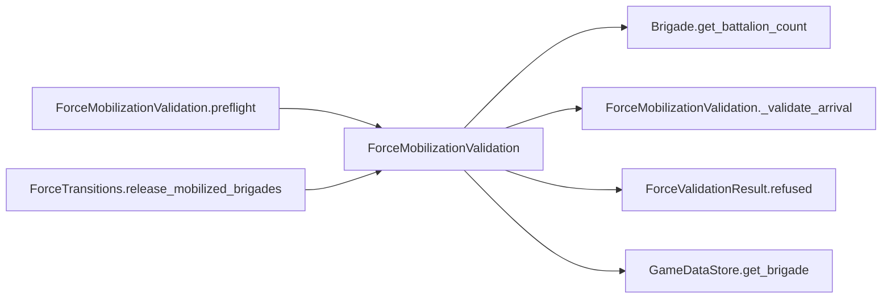

# ForceMobilizationValidation

> **Reading aid, not an execution contract.** No detected edge is not permission to reorder.
> GDScript reads and writes are conservative source analysis; transition writes are also
> checked against the mutation manifest. Potential conflicts may refer to different object
> instances or conditional branches.

Generator format v1; scan scope `scripts/**/*.gd` plus `project.godot` autoload aliases.
Generated from commit `7bbf08693b44`; input SHA-256 `c879af92cf7693c7df1119a11083764377c92a9410144e7b95f361f509613378`;
tool/manifest/fixture SHA-256 `ea366ecafdb8f5cc7ecae22bb7554cd8802d1ed3433c5a903ecc07bbb7230f6c`; stable generation time `2026-08-02T17:09:31-04:00`.
Unresolved-analysis diagnostics on this page: **3**.

## Source summary

Read-only all-or-nothing preflight for a mobilization release batch.

Source: `scripts/calc/ForceMobilizationValidation.gd`

## Placement in resolution code

| Caller | Call-site instance |
|---|---|
| [`ForceMobilizationValidation.preflight`](ForceMobilizationValidation.md) | `ForceMobilizationValidation._validate_arrival` at `26` |
| `ForceTransitions.release_mobilized_brigades` | `ForceMobilizationValidation.preflight` at `223` |

## Dependency diagram

## Model-field evidence

| Field | Read | Written |
|---|:---:|:---:|
| `Brigade.composition` | yes |  |
| `Brigade.destroyed` | yes |  |
| `Brigade.hex_id` | yes |  |
| `ForceMobilizationRequest.arrivals` | yes |  |
| `ForceMobilizationRequest.turn_number` | yes |  |
| `ForceValidationResult.error` |  | yes |
| `GameDataStore.brigades` | yes |  |
| `GameDataStore.hex_lookup` | yes |  |
| `MobilizationState.pending` | yes |  |

## Method dependencies

| Method | Calls (transitive effects are included above) |
|---|---|
| `_validate_arrival` | `Brigade.get_battalion_count`, `ForceValidationResult.refused`, `GameDataStore.get_brigade` |
| `preflight` | `ForceMobilizationValidation._validate_arrival`, `ForceValidationResult.refused` |

## Analysis limits found here

Showing 3 of 3 diagnostics; class pages provide the narrower context.

| Kind | Source | Why it matters |
|---|---|---|
| `untyped_iteration` | `scripts/calc/ForceMobilizationValidation.gd:13` `for entry_value in state.pending:` | The collection element type could not be proven. |
| `untyped_iteration` | `scripts/calc/ForceMobilizationValidation.gd:19` `for arrival_value in request.arrivals:` | The collection element type could not be proven. |
| `unresolved_receiver` | `scripts/model/Brigade.gd:60` `total += battalion.qty` | A protected field name appeared on an unresolved receiver. |
