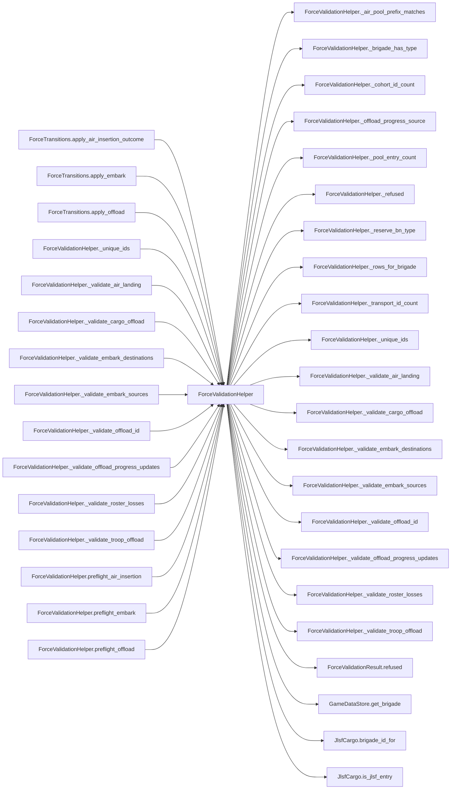

# ForceValidationHelper

> **Reading aid, not an execution contract.** No detected edge is not permission to reorder.
> GDScript reads and writes are conservative source analysis; transition writes are also
> checked against the mutation manifest. Potential conflicts may refer to different object
> instances or conditional branches.

Generator format v1; scan scope `scripts/**/*.gd` plus `project.godot` autoload aliases.
Generated from commit `7bbf08693b44`; input SHA-256 `c879af92cf7693c7df1119a11083764377c92a9410144e7b95f361f509613378`;
tool/manifest/fixture SHA-256 `ea366ecafdb8f5cc7ecae22bb7554cd8802d1ed3433c5a903ecc07bbb7230f6c`; stable generation time `2026-08-02T17:09:31-04:00`.
Unresolved-analysis diagnostics on this page: **13**.

## Source summary

Read-only preflight for ForceTransitions. It returns one typed refusal and never mutates live state. The authority converts that refusal into the operation-specific receipt before writing.

Source: `scripts/calc/ForceValidationHelper.gd`

## Placement in resolution code

| Caller | Call-site instance |
|---|---|
| `ForceTransitions.apply_air_insertion_outcome` | `ForceValidationHelper.preflight_air_insertion` at `148` |
| `ForceTransitions.apply_embark` | `ForceValidationHelper.preflight_embark` at `271` |
| `ForceTransitions.apply_offload` | `ForceValidationHelper.preflight_offload` at `432` |
| [`ForceValidationHelper._unique_ids`](ForceValidationHelper.md) | `ForceValidationHelper._refused` at `255` |
| [`ForceValidationHelper._validate_air_landing`](ForceValidationHelper.md) | `ForceValidationHelper._pool_entry_count` at `91` |
| [`ForceValidationHelper._validate_air_landing`](ForceValidationHelper.md) | `ForceValidationHelper._refused` at `92` |
| [`ForceValidationHelper._validate_air_landing`](ForceValidationHelper.md) | `ForceValidationHelper._air_pool_prefix_matches` at `93` |
| [`ForceValidationHelper._validate_air_landing`](ForceValidationHelper.md) | `ForceValidationHelper._refused` at `94` |
| [`ForceValidationHelper._validate_air_landing`](ForceValidationHelper.md) | `ForceValidationHelper._refused` at `97` |
| [`ForceValidationHelper._validate_air_landing`](ForceValidationHelper.md) | `ForceValidationHelper._refused` at `101` |
| [`ForceValidationHelper._validate_air_landing`](ForceValidationHelper.md) | `ForceValidationHelper._refused` at `104` |
| [`ForceValidationHelper._validate_air_landing`](ForceValidationHelper.md) | `ForceValidationHelper._refused` at `106` |
| [`ForceValidationHelper._validate_cargo_offload`](ForceValidationHelper.md) | `ForceValidationHelper._validate_offload_id` at `171` |
| [`ForceValidationHelper._validate_embark_destinations`](ForceValidationHelper.md) | `ForceValidationHelper._transport_id_count` at `58` |
| [`ForceValidationHelper._validate_embark_destinations`](ForceValidationHelper.md) | `ForceValidationHelper._refused` at `59` |
| [`ForceValidationHelper._validate_embark_sources`](ForceValidationHelper.md) | `ForceValidationHelper._refused` at `38` |
| [`ForceValidationHelper._validate_embark_sources`](ForceValidationHelper.md) | `ForceValidationHelper._rows_for_brigade` at `39` |
| [`ForceValidationHelper._validate_embark_sources`](ForceValidationHelper.md) | `ForceValidationHelper._refused` at `43` |
| [`ForceValidationHelper._validate_embark_sources`](ForceValidationHelper.md) | `ForceValidationHelper._refused` at `45` |
| [`ForceValidationHelper._validate_embark_sources`](ForceValidationHelper.md) | `ForceValidationHelper._refused` at `50` |
| [`ForceValidationHelper._validate_offload_id`](ForceValidationHelper.md) | `ForceValidationHelper._refused` at `233` |
| [`ForceValidationHelper._validate_offload_id`](ForceValidationHelper.md) | `ForceValidationHelper._cohort_id_count` at `245` |
| [`ForceValidationHelper._validate_offload_id`](ForceValidationHelper.md) | `ForceValidationHelper._refused` at `246` |
| [`ForceValidationHelper._validate_offload_progress_updates`](ForceValidationHelper.md) | `ForceValidationHelper._refused` at `185` |
| [`ForceValidationHelper._validate_offload_progress_updates`](ForceValidationHelper.md) | `ForceValidationHelper._refused` at `189` |
| [`ForceValidationHelper._validate_offload_progress_updates`](ForceValidationHelper.md) | `ForceValidationHelper._refused` at `195` |
| [`ForceValidationHelper._validate_offload_progress_updates`](ForceValidationHelper.md) | `ForceValidationHelper._refused` at `197` |
| [`ForceValidationHelper._validate_offload_progress_updates`](ForceValidationHelper.md) | `ForceValidationHelper._refused` at `199` |
| [`ForceValidationHelper._validate_offload_progress_updates`](ForceValidationHelper.md) | `ForceValidationHelper._offload_progress_source` at `200` |
| [`ForceValidationHelper._validate_offload_progress_updates`](ForceValidationHelper.md) | `ForceValidationHelper._cohort_id_count` at `201` |
| [`ForceValidationHelper._validate_offload_progress_updates`](ForceValidationHelper.md) | `ForceValidationHelper._refused` at `203` |
| [`ForceValidationHelper._validate_offload_progress_updates`](ForceValidationHelper.md) | `ForceValidationHelper._refused` at `206` |
| [`ForceValidationHelper._validate_roster_losses`](ForceValidationHelper.md) | `ForceValidationHelper._refused` at `358` |
| [`ForceValidationHelper._validate_troop_offload`](ForceValidationHelper.md) | `ForceValidationHelper._refused` at `145` |
| [`ForceValidationHelper._validate_troop_offload`](ForceValidationHelper.md) | `ForceValidationHelper._refused` at `148` |
| [`ForceValidationHelper._validate_troop_offload`](ForceValidationHelper.md) | `ForceValidationHelper._refused` at `151` |
| [`ForceValidationHelper._validate_troop_offload`](ForceValidationHelper.md) | `ForceValidationHelper._validate_offload_id` at `154` |
| [`ForceValidationHelper._validate_troop_offload`](ForceValidationHelper.md) | `ForceValidationHelper._reserve_bn_type` at `158` |
| [`ForceValidationHelper._validate_troop_offload`](ForceValidationHelper.md) | `ForceValidationHelper._brigade_has_type` at `159` |
| [`ForceValidationHelper._validate_troop_offload`](ForceValidationHelper.md) | `ForceValidationHelper._refused` at `160` |
| [`ForceValidationHelper.preflight_air_insertion`](ForceValidationHelper.md) | `ForceValidationHelper._refused` at `68` |
| [`ForceValidationHelper.preflight_air_insertion`](ForceValidationHelper.md) | `ForceValidationHelper._refused` at `77` |
| [`ForceValidationHelper.preflight_air_insertion`](ForceValidationHelper.md) | `ForceValidationHelper._validate_air_landing` at `79` |
| [`ForceValidationHelper.preflight_air_insertion`](ForceValidationHelper.md) | `ForceValidationHelper._validate_roster_losses` at `82` |
| [`ForceValidationHelper.preflight_embark`](ForceValidationHelper.md) | `ForceValidationHelper._refused` at `12` |
| [`ForceValidationHelper.preflight_embark`](ForceValidationHelper.md) | `ForceValidationHelper._refused` at `15` |
| [`ForceValidationHelper.preflight_embark`](ForceValidationHelper.md) | `ForceValidationHelper._refused` at `17` |
| [`ForceValidationHelper.preflight_embark`](ForceValidationHelper.md) | `ForceValidationHelper._refused` at `19` |
| [`ForceValidationHelper.preflight_embark`](ForceValidationHelper.md) | `ForceValidationHelper._unique_ids` at `20` |
| [`ForceValidationHelper.preflight_embark`](ForceValidationHelper.md) | `ForceValidationHelper._validate_embark_sources` at `23` |
| [`ForceValidationHelper.preflight_embark`](ForceValidationHelper.md) | `ForceValidationHelper._validate_embark_destinations` at `26` |
| [`ForceValidationHelper.preflight_offload`](ForceValidationHelper.md) | `ForceValidationHelper._refused` at `117` |
| [`ForceValidationHelper.preflight_offload`](ForceValidationHelper.md) | `ForceValidationHelper._refused` at `120` |
| [`ForceValidationHelper.preflight_offload`](ForceValidationHelper.md) | `ForceValidationHelper._validate_troop_offload` at `123` |
| [`ForceValidationHelper.preflight_offload`](ForceValidationHelper.md) | `ForceValidationHelper._validate_cargo_offload` at `128` |
| [`ForceValidationHelper.preflight_offload`](ForceValidationHelper.md) | `ForceValidationHelper._validate_offload_progress_updates` at `132` |

## Dependency diagram

## Model-field evidence

| Field | Read | Written |
|---|:---:|:---:|
| `AirInsertionState.landed` | yes |  |
| `AirInsertionState.pool` | yes |  |
| `Brigade.composition` | yes |  |
| `Brigade.destroyed` | yes |  |
| `Brigade.hex_id` | yes |  |
| `ForceAirInsertionRequest.landings` | yes |  |
| `ForceEmbarkRequest.batch_bn_ids` | yes |  |
| `ForceEmbarkRequest.batch_hulls_by_type` | yes |  |
| `ForceEmbarkRequest.brigade_specs` | yes |  |
| `ForceEmbarkRequest.destination` | yes |  |
| `ForceEmbarkRequest.source` | yes |  |
| `ForceOffloadRequest.cargo_arrivals` | yes |  |
| `ForceOffloadRequest.destination` | yes |  |
| `ForceOffloadRequest.landings` | yes |  |
| `ForceOffloadRequest.progress_updates` | yes |  |
| `ForceOffloadRequest.source` | yes |  |
| `ForceValidationResult.error` |  | yes |
| `GameDataStore.brigades` | yes |  |
| `GameDataStore.hex_lookup` | yes |  |
| `SealiftState.cohorts` | yes |  |
| `SealiftState.mainland_pool` | yes |  |

## Method dependencies

| Method | Calls (transitive effects are included above) |
|---|---|
| `_air_pool_prefix_matches` | — |
| `_brigade_has_type` | — |
| `_cohort_id_count` | — |
| `_offload_progress_source` | `JlsfCargo.is_jlsf_entry` |
| `_pool_entry_count` | — |
| `_refused` | `ForceValidationResult.refused` |
| `_reserve_bn_type` | — |
| `_rows_for_brigade` | — |
| `_transport_id_count` | — |
| `_unique_ids` | `ForceValidationHelper._refused` |
| `_validate_air_landing` | `ForceValidationHelper._air_pool_prefix_matches`, `ForceValidationHelper._pool_entry_count`, `ForceValidationHelper._refused`, `GameDataStore.get_brigade` |
| `_validate_cargo_offload` | `ForceValidationHelper._validate_offload_id`, `JlsfCargo.brigade_id_for` |
| `_validate_embark_destinations` | `ForceValidationHelper._refused`, `ForceValidationHelper._transport_id_count` |
| `_validate_embark_sources` | `ForceValidationHelper._refused`, `ForceValidationHelper._rows_for_brigade` |
| `_validate_offload_id` | `ForceValidationHelper._cohort_id_count`, `ForceValidationHelper._refused`, `JlsfCargo.is_jlsf_entry` |
| `_validate_offload_progress_updates` | `ForceValidationHelper._cohort_id_count`, `ForceValidationHelper._offload_progress_source`, `ForceValidationHelper._refused` |
| `_validate_roster_losses` | `ForceValidationHelper._refused`, `GameDataStore.get_brigade` |
| `_validate_troop_offload` | `ForceValidationHelper._brigade_has_type`, `ForceValidationHelper._refused`, `ForceValidationHelper._reserve_bn_type`, `ForceValidationHelper._validate_offload_id`, `GameDataStore.get_brigade` |
| `preflight_air_insertion` | `ForceValidationHelper._refused`, `ForceValidationHelper._validate_air_landing`, `ForceValidationHelper._validate_roster_losses` |
| `preflight_embark` | `ForceValidationHelper._refused`, `ForceValidationHelper._unique_ids`, `ForceValidationHelper._validate_embark_destinations`, `ForceValidationHelper._validate_embark_sources` |
| `preflight_offload` | `ForceValidationHelper._refused`, `ForceValidationHelper._validate_cargo_offload`, `ForceValidationHelper._validate_offload_progress_updates`, `ForceValidationHelper._validate_troop_offload` |

## Analysis limits found here

Showing 13 of 13 diagnostics; class pages provide the narrower context.

| Kind | Source | Why it matters |
|---|---|---|
| `untyped_alias` | `scripts/calc/ForceValidationHelper.gd:20` `var batch_ids: Variant = _unique_ids(request.batch_bn_ids, "embark batch")` | The receiver type could not be proven. |
| `untyped_iteration` | `scripts/calc/ForceValidationHelper.gd:33` `for spec_value in request.brigade_specs:` | The collection element type could not be proven. |
| `untyped_iteration` | `scripts/calc/ForceValidationHelper.gd:73` `for landing_value in request.landings:` | The collection element type could not be proven. |
| `untyped_alias` | `scripts/calc/ForceValidationHelper.gd:99` `var expected_first := not landed_bns.is_empty() and not air_state.landed.has(brigade_id)` | The receiver type could not be proven. |
| `untyped_iteration` | `scripts/calc/ForceValidationHelper.gd:122` `for landing_value in request.landings:` | The collection element type could not be proven. |
| `untyped_iteration` | `scripts/calc/ForceValidationHelper.gd:127` `for arrival_value in request.cargo_arrivals:` | The collection element type could not be proven. |
| `unresolved_receiver` | `scripts/calc/ForceValidationHelper.gd:286` `if String(battalion_value.type) == battalion_type and int(battalion_value.qty) > 0:` | A protected field name appeared on an unresolved receiver. |
| `unresolved_receiver` | `scripts/calc/ForceValidationHelper.gd:298` `for id_value in cohort.bn_ids:` | A protected field name appeared on an unresolved receiver. |
| `untyped_iteration` | `scripts/calc/ForceValidationHelper.gd:298` `for id_value in cohort.bn_ids:` | The collection element type could not be proven. |
| `unresolved_receiver` | `scripts/calc/ForceValidationHelper.gd:307` `if cohort.cohort_state != state_label:` | A protected field name appeared on an unresolved receiver. |
| `unresolved_receiver` | `scripts/calc/ForceValidationHelper.gd:309` `for id_value in cohort.bn_ids:` | A protected field name appeared on an unresolved receiver. |
| `untyped_iteration` | `scripts/calc/ForceValidationHelper.gd:309` `for id_value in cohort.bn_ids:` | The collection element type could not be proven. |
| `unresolved_receiver` | `scripts/calc/ForceValidationHelper.gd:356` `available += int(battalion_value.qty)` | A protected field name appeared on an unresolved receiver. |
