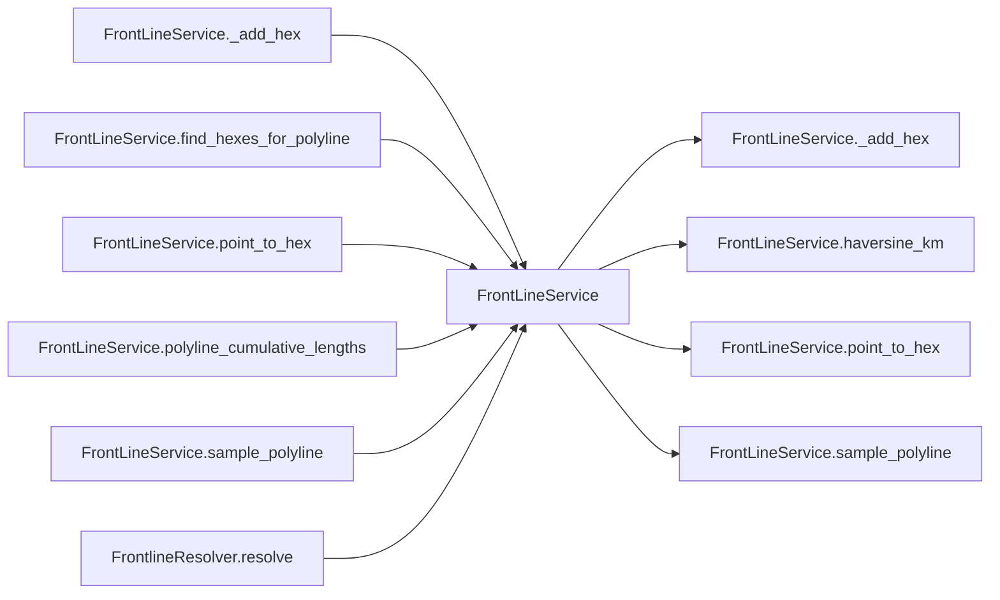

# FrontLineService

> **Reading aid, not an execution contract.** No detected edge is not permission to reorder.
> GDScript reads and writes are conservative source analysis; transition writes are also
> checked against the mutation manifest. Potential conflicts may refer to different object
> instances or conditional branches.

Generator format v1; scan scope `scripts/**/*.gd` plus `project.godot` autoload aliases.
Generated from commit `7bbf08693b44`; input SHA-256 `c879af92cf7693c7df1119a11083764377c92a9410144e7b95f361f509613378`;
tool/manifest/fixture SHA-256 `ea366ecafdb8f5cc7ecae22bb7554cd8802d1ed3433c5a903ecc07bbb7230f6c`; stable generation time `2026-08-02T17:09:31-04:00`.
Unresolved-analysis diagnostics on this page: **1**.

## Source summary

No source summary was found; see the access tables below.

Source: `scripts/calc/FrontLineService.gd`

## Placement in resolution code

| Caller | Call-site instance |
|---|---|
| [`FrontLineService._add_hex`](FrontLineService.md) | `FrontLineService.point_to_hex` at `94` |
| [`FrontLineService.find_hexes_for_polyline`](FrontLineService.md) | `FrontLineService.sample_polyline` at `87` |
| [`FrontLineService.find_hexes_for_polyline`](FrontLineService.md) | `FrontLineService._add_hex` at `89` |
| [`FrontLineService.point_to_hex`](FrontLineService.md) | `FrontLineService.haversine_km` at `60` |
| [`FrontLineService.polyline_cumulative_lengths`](FrontLineService.md) | `FrontLineService.haversine_km` at `25` |
| [`FrontLineService.sample_polyline`](FrontLineService.md) | `FrontLineService.haversine_km` at `74` |
| [`FrontlineResolver.resolve`](FrontlineResolver.md) | `FrontLineService.find_hexes_for_polyline` at `20` |
| [`FrontlineResolver.resolve`](FrontlineResolver.md) | `FrontLineService.distribute_units_along_hexes` at `35` |

## Dependency diagram

## Model-field evidence

| Field | Read | Written |
|---|:---:|:---:|
| _No persistent model field was resolved_ | | |

## Method dependencies

| Method | Calls (transitive effects are included above) |
|---|---|
| `_add_hex` | `FrontLineService.point_to_hex` |
| `distribute_units_along_hexes` | — |
| `find_hexes_for_polyline` | `FrontLineService._add_hex`, `FrontLineService.sample_polyline` |
| `haversine_km` | — |
| `interpolate_along_line` | — |
| `point_to_hex` | `FrontLineService.haversine_km` |
| `polyline_cumulative_lengths` | `FrontLineService.haversine_km` |
| `sample_polyline` | `FrontLineService.haversine_km` |

## Analysis limits found here

Showing 1 of 1 diagnostics; class pages provide the narrower context.

| Kind | Source | Why it matters |
|---|---|---|
| `nested_index_unanalysed` | `scripts/calc/FrontLineService.gd:108` `result[str(unit_ids[k])] = str(hex_sequence[idx])` | Nested collection indexes exceed the balanced-chain subset; this statement contributes no field effects. |
