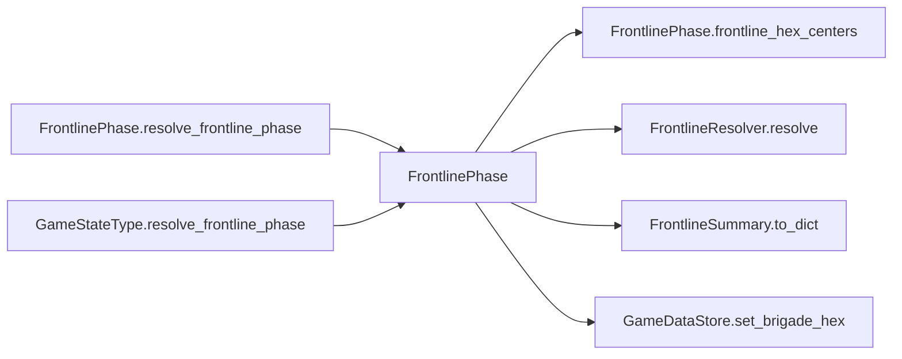

# FrontlinePhase

> **Reading aid, not an execution contract.** No detected edge is not permission to reorder.
> GDScript reads and writes are conservative source analysis; transition writes are also
> checked against the mutation manifest. Potential conflicts may refer to different object
> instances or conditional branches.

Generator format v1; scan scope `scripts/**/*.gd` plus `project.godot` autoload aliases.
Generated from commit `8829181ae4b6`; input SHA-256 `1c5ff5483615f0cca5b2767540c56e9a13e1387c4c1a3c66db909a97ad2e94fb`;
tool/manifest/fixture SHA-256 `ea366ecafdb8f5cc7ecae22bb7554cd8802d1ed3433c5a903ecc07bbb7230f6c`; stable generation time `2026-08-02T09:03:12-04:00`.
Unresolved-analysis diagnostics on this page: **7**.

## Source summary

No source summary was found; see the access tables below.

Source: `scripts/phases/FrontlinePhase.gd`

## Placement in resolution code

| Caller | Call-site instance |
|---|---|
| [`FrontlinePhase.resolve_frontline_phase`](ordering_FrontlinePhase_resolve_frontline_phase.md) | `FrontlinePhase.frontline_hex_centers` at `18` |
| `GameStateType.resolve_frontline_phase` | `FrontlinePhase.resolve_frontline_phase` at `294` |

## Dependency diagram

## Model-field evidence

| Field | Read | Written |
|---|:---:|:---:|
| `Brigade.destroyed` | yes |  |
| `Brigade.entry_bearing` |  | yes |
| `Brigade.hex_id` | yes | yes |
| `Brigade.id` | yes |  |
| `Brigade.team` | yes |  |
| `ForcePlacementReceipt.brigade_id` |  | yes |
| `ForcePlacementReceipt.destination` |  | yes |
| `ForcePlacementReceipt.new_hex` |  | yes |
| `ForcePlacementReceipt.old_hex` |  | yes |
| `ForcePlacementReceipt.phase` |  | yes |
| `ForcePlacementRequest.brigade_id` | yes | yes |
| `ForcePlacementRequest.destination` | yes | yes |
| `ForcePlacementRequest.destination_hex` | yes | yes |
| `ForcePlacementRequest.entry_bearing` | yes |  |
| `ForcePlacementRequest.has_entry_bearing` | yes |  |
| `ForcePlacementRequest.phase` | yes | yes |
| `FrontlineSummary.affected_brigades` | yes | yes |
| `FrontlineSummary.hex_sequence` | yes | yes |
| `FrontlineSummary.moves` | yes | yes |
| `GameDataStore.brigades` | yes |  |
| `GameDataStore.brigades_by_hex` | yes | yes |
| `GameDataStore.hex_lookup` | yes |  |
| `GameDataStore.hexes` | yes |  |
| `GameStateData.last_frontline_summary` | yes | yes |
| `Hex.center` | yes |  |
| `Hex.id` | yes |  |

## Method dependencies

| Method | Calls (transitive effects are included above) |
|---|---|
| `frontline_hex_centers` | — |
| `resolve_frontline_phase` | `FrontlinePhase.frontline_hex_centers`, `FrontlineResolver.resolve`, `FrontlineSummary.to_dict`, `GameDataStore.set_brigade_hex` |

## Analysis limits found here

Showing 7 of 7 diagnostics; class pages provide the narrower context.

| Kind | Source | Why it matters |
|---|---|---|
| `multi_call_statement` | `scripts/GameData.gd:559` `ForceTransitions.place_brigade(self, ForcePlacementRequest.ashore(brigade_id, hex_id, "GameData façade"))` | Multiple calls share one statement; the map preserves lexical sites, not nested evaluation order. |
| `nested_index_unanalysed` | `scripts/calc/FrontLineService.gd:108` `result[str(unit_ids[k])] = str(hex_sequence[idx])` | Nested collection indexes exceed the balanced-chain subset; this statement contributes no field effects. |
| `multi_call_statement` | `scripts/phases/FrontlinePhase.gd:18` `state.last_frontline_summary = FrontlineResolver.resolve(polyline_coords, frontline_hex_centers(), candidate_brigades)` | Multiple calls share one statement; the map preserves lexical sites, not nested evaluation order. |
| `untyped_iteration` | `scripts/phases/FrontlinePhase.gd:19` `for brigade_id in state.last_frontline_summary.moves.keys():` | The collection element type could not be proven. |
| `multi_call_statement` | `scripts/transitions/ForceTransitions.gd:53` `return place_brigade(data_store, ForcePlacementRequest.off_map(brigade_id, "remove"))` | Multiple calls share one statement; the map preserves lexical sites, not nested evaluation order. |
| `callable_or_lambda` | `scripts/transitions/ForceTransitions.gd:587` `data_store.brigades_by_hex[old_hex] = (data_store.brigades_by_hex[old_hex] as Array).filter( func(id: String) -> bool: return id != brigade.id)` | Callable/lambda dataflow is outside this analyser. |
| `untyped_alias` | `scripts/transitions/ForceTransitions.gd:601` `var violations := data_store.validate_runtime_indexes()` | The receiver type could not be proven. |
