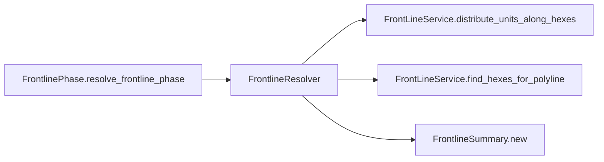

# FrontlineResolver

> **Reading aid, not an execution contract.** No detected edge is not permission to reorder.
> GDScript reads and writes are conservative source analysis; transition writes are also
> checked against the mutation manifest. Potential conflicts may refer to different object
> instances or conditional branches.

Generator format v1; scan scope `scripts/**/*.gd` plus `project.godot` autoload aliases.
Generated from commit `8829181ae4b6`; input SHA-256 `1c5ff5483615f0cca5b2767540c56e9a13e1387c4c1a3c66db909a97ad2e94fb`;
tool/manifest/fixture SHA-256 `ea366ecafdb8f5cc7ecae22bb7554cd8802d1ed3433c5a903ecc07bbb7230f6c`; stable generation time `2026-08-02T09:03:12-04:00`.
Unresolved-analysis diagnostics on this page: **1**.

## Source summary

Pure resolver for the D5 front-line phase (refactor_audit item 10, Phase B): maps the drawn polyline to a hex sequence (FrontLineService) and redistributes the drawing side's brigades evenly along it. Deterministic — consumes no dice; affected ids are sorted before distribution. No autoload/engine access — GameState's thin wrapper passes the hex centers + candidate brigades in, applies the returned moves via GameData.set_brigade_hex, and owns the EventBus.frontline_resolved emit. polyline_coords: [[lat, lon], …] drawn front line. hex_centers: [{id, lat, lon}, …] flat hex-center records (GameState._frontline_hex_centers()). candidate_brigades: the drawing side's live brigades (Red today — TIV's single-side filter; the caller owns team selection). Only those whose current hex is on the line reshuffle. Returns a FrontlineSummary (empty when the polyline maps to no hexes); the caller applies summary.moves — this class moves nothing itself.

Source: `scripts/calc/FrontlineResolver.gd`

## Placement in resolution code

| Caller | Call-site instance |
|---|---|
| [`FrontlinePhase.resolve_frontline_phase`](ordering_FrontlinePhase_resolve_frontline_phase.md) | `FrontlineResolver.resolve` at `18` |

## Dependency diagram

## Model-field evidence

| Field | Read | Written |
|---|:---:|:---:|
| `Brigade.hex_id` | yes |  |
| `Brigade.id` | yes |  |
| `FrontlineSummary.affected_brigades` |  | yes |
| `FrontlineSummary.hex_sequence` |  | yes |
| `FrontlineSummary.moves` |  | yes |

## Method dependencies

| Method | Calls (transitive effects are included above) |
|---|---|
| `resolve` | `FrontLineService.distribute_units_along_hexes`, `FrontLineService.find_hexes_for_polyline`, `FrontlineSummary.new` |

## Analysis limits found here

Showing 1 of 1 diagnostics; class pages provide the narrower context.

| Kind | Source | Why it matters |
|---|---|---|
| `nested_index_unanalysed` | `scripts/calc/FrontLineService.gd:108` `result[str(unit_ids[k])] = str(hex_sequence[idx])` | Nested collection indexes exceed the balanced-chain subset; this statement contributes no field effects. |
