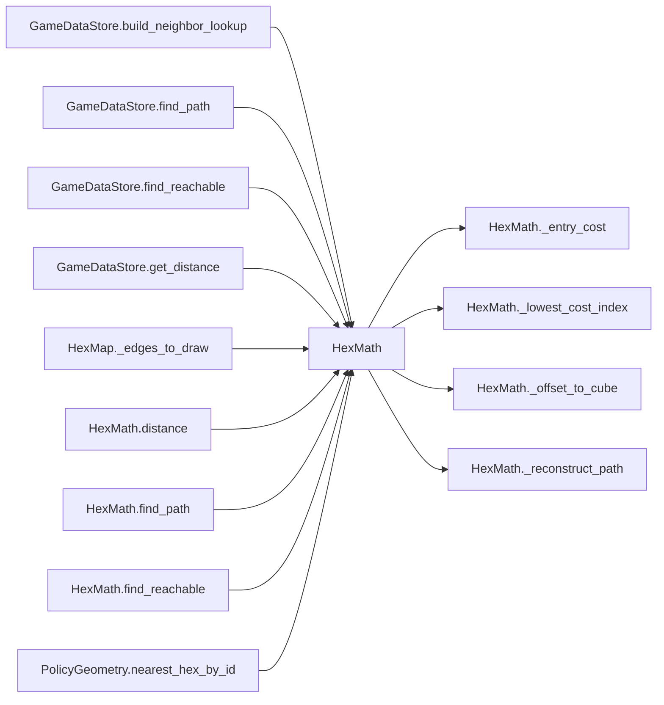

# HexMath

> **Reading aid, not an execution contract.** No detected edge is not permission to reorder.
> GDScript reads and writes are conservative source analysis; transition writes are also
> checked against the mutation manifest. Potential conflicts may refer to different object
> instances or conditional branches.

Generator format v1; scan scope `scripts/**/*.gd` plus `project.godot` autoload aliases.
Generated from commit `7bbf08693b44`; input SHA-256 `c879af92cf7693c7df1119a11083764377c92a9410144e7b95f361f509613378`;
tool/manifest/fixture SHA-256 `ea366ecafdb8f5cc7ecae22bb7554cd8802d1ed3433c5a903ecc07bbb7230f6c`; stable generation time `2026-08-02T17:09:31-04:00`.
Unresolved-analysis diagnostics on this page: **4**.

## Source summary

No source summary was found; see the access tables below.

Source: `scripts/calc/HexMath.gd`

## Placement in resolution code

| Caller | Call-site instance |
|---|---|
| `GameDataStore.build_neighbor_lookup` | `HexMath.neighbor_coords` at `197` |
| `GameDataStore.find_path` | `HexMath.find_path` at `517` |
| `GameDataStore.find_reachable` | `HexMath.find_reachable` at `523` |
| `GameDataStore.get_distance` | `HexMath.distance` at `511` |
| `HexMap._edges_to_draw` | `HexMath.neighbor_coords` at `458` |
| [`HexMath.distance`](HexMath.md) | `HexMath._offset_to_cube` at `48` |
| [`HexMath.distance`](HexMath.md) | `HexMath._offset_to_cube` at `49` |
| [`HexMath.find_path`](HexMath.md) | `HexMath._lowest_cost_index` at `77` |
| [`HexMath.find_path`](HexMath.md) | `HexMath._reconstruct_path` at `85` |
| [`HexMath.find_path`](HexMath.md) | `HexMath._entry_cost` at `90` |
| [`HexMath.find_reachable`](HexMath.md) | `HexMath._lowest_cost_index` at `113` |
| [`HexMath.find_reachable`](HexMath.md) | `HexMath._entry_cost` at `124` |
| `PolicyGeometry.nearest_hex_by_id` | `HexMath.distance` at `37` |

## Dependency diagram

## Model-field evidence

| Field | Read | Written |
|---|:---:|:---:|
| _No persistent model field was resolved_ | | |

## Method dependencies

| Method | Calls (transitive effects are included above) |
|---|---|
| `_entry_cost` | — |
| `_lowest_cost_index` | — |
| `_offset_to_cube` | — |
| `_reconstruct_path` | — |
| `distance` | `HexMath._offset_to_cube` |
| `find_path` | `HexMath._entry_cost`, `HexMath._lowest_cost_index`, `HexMath._reconstruct_path` |
| `find_reachable` | `HexMath._entry_cost`, `HexMath._lowest_cost_index` |
| `neighbor_coords` | — |

## Analysis limits found here

Showing 4 of 4 diagnostics; class pages provide the narrower context.

| Kind | Source | Why it matters |
|---|---|---|
| `dynamic_dispatch` | `scripts/calc/HexMath.gd:57` `return entry_cost.call(hex_id)` | A string/dynamic call has no statically known target. |
| `dynamic_dispatch` | `scripts/calc/HexMath.gd:87` `for neighbor_id in get_neighbors.call(current_id):` | A string/dynamic call has no statically known target. |
| `dynamic_dispatch` | `scripts/calc/HexMath.gd:121` `for neighbor_id in get_neighbors.call(current_id):` | A string/dynamic call has no statically known target. |
| `dynamic_dispatch` | `scripts/calc/HexMath.gd:133` `for neighbor_id in get_neighbors.call(start_id):` | A string/dynamic call has no statically known target. |
