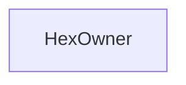

# HexOwner

> **Reading aid, not an execution contract.** No detected edge is not permission to reorder.
> GDScript reads and writes are conservative source analysis; transition writes are also
> checked against the mutation manifest. Potential conflicts may refer to different object
> instances or conditional branches.

Generator format v1; scan scope `scripts/**/*.gd` plus `project.godot` autoload aliases.
Generated from commit `8829181ae4b6`; input SHA-256 `1c5ff5483615f0cca5b2767540c56e9a13e1387c4c1a3c66db909a97ad2e94fb`;
tool/manifest/fixture SHA-256 `ea366ecafdb8f5cc7ecae22bb7554cd8802d1ed3433c5a903ecc07bbb7230f6c`; stable generation time `2026-08-02T09:03:12-04:00`.
Unresolved-analysis diagnostics on this page: **0**.

## Source summary

No source summary was found; see the access tables below.

Source: `scripts/calc/HexOwner.gd`

## Placement in resolution code

No analysed calculator/coordinator call site reaches this class directly.

## Dependency diagram

## Model-field evidence

| Field | Read | Written |
|---|:---:|:---:|
| _No persistent model field was resolved_ | | |

## Method dependencies

| Method | Calls (transitive effects are included above) |
|---|---|

## Analysis limits found here

No unresolved constructs were recorded.
