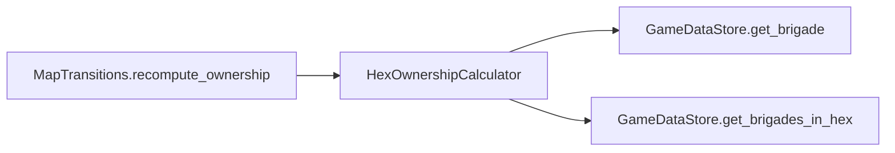

# HexOwnershipCalculator

> **Reading aid, not an execution contract.** No detected edge is not permission to reorder.
> GDScript reads and writes are conservative source analysis; transition writes are also
> checked against the mutation manifest. Potential conflicts may refer to different object
> instances or conditional branches.

Generator format v1; scan scope `scripts/**/*.gd` plus `project.godot` autoload aliases.
Generated from commit `8829181ae4b6`; input SHA-256 `1c5ff5483615f0cca5b2767540c56e9a13e1387c4c1a3c66db909a97ad2e94fb`;
tool/manifest/fixture SHA-256 `ea366ecafdb8f5cc7ecae22bb7554cd8802d1ed3433c5a903ecc07bbb7230f6c`; stable generation time `2026-08-02T09:03:12-04:00`.
Unresolved-analysis diagnostics on this page: **1**.

## Source summary

Derives hex ownership from brigade occupancy (plan 0047). Pure: it reads the placement index through `GameDataStore`'s public queries and returns plain dictionaries. It writes nothing, holds no `HexState`, and never repairs the placement index — `MapTransitions` applies what it returns.  THE ABSENCE IS THE RULE, AND IT IS THE WHOLE MECHANIC. A hex with no live brigade is ABSENT from both results below, and that absence is what keeps a port Red after Red's garrison moves inland. Callers must ITERATE the returned entries. The moment anyone writes `owners.get(hex_id, HexOwner.GREEN)` over every hex instead, sticky ownership is gone and every seized port un-seizes the turn it is left empty — a silent rewrite of plan 0006's whole infrastructure mechanic that no type error would catch.  Brigade PRESENCE decides occupancy, not landed battalion count: a brigade whose battalions are all still afloat still holds the ground it stands on. Destroyed brigades hold nothing. Occupancy of every hex in `hex_ids` that has at least one live brigade: hex_id -> {"red": bool, "green": bool}. A hex with no live brigade is absent from the result.

Source: `scripts/calc/HexOwnershipCalculator.gd`

## Placement in resolution code

| Caller | Call-site instance |
|---|---|
| `MapTransitions.recompute_ownership` | `HexOwnershipCalculator.occupancy_from_placements` at `64` |
| `MapTransitions.recompute_ownership` | `HexOwnershipCalculator.owners_from_occupancy` at `66` |

## Dependency diagram

## Model-field evidence

| Field | Read | Written |
|---|:---:|:---:|
| `Brigade.destroyed` | yes |  |
| `Brigade.team` | yes |  |
| `GameDataStore.brigades` | yes |  |
| `GameDataStore.brigades_by_hex` | yes |  |

## Method dependencies

| Method | Calls (transitive effects are included above) |
|---|---|
| `occupancy_from_placements` | `GameDataStore.get_brigade`, `GameDataStore.get_brigades_in_hex` |
| `owners_from_occupancy` | — |

## Analysis limits found here

Showing 1 of 1 diagnostics; class pages provide the narrower context.

| Kind | Source | Why it matters |
|---|---|---|
| `untyped_iteration` | `scripts/calc/HexOwnershipCalculator.gd:27` `for brigade_id_value in data_store.get_brigades_in_hex(hex_id):` | The collection element type could not be proven. |
