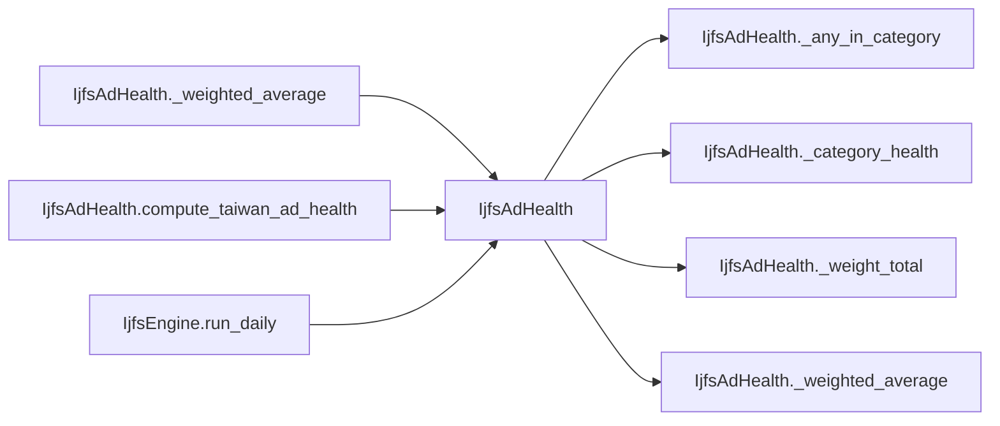

# IjfsAdHealth

> **Reading aid, not an execution contract.** No detected edge is not permission to reorder.
> GDScript reads and writes are conservative source analysis; transition writes are also
> checked against the mutation manifest. Potential conflicts may refer to different object
> instances or conditional branches.

Generator format v1; scan scope `scripts/**/*.gd` plus `project.godot` autoload aliases.
Generated from commit `7bbf08693b44`; input SHA-256 `c879af92cf7693c7df1119a11083764377c92a9410144e7b95f361f509613378`;
tool/manifest/fixture SHA-256 `ea366ecafdb8f5cc7ecae22bb7554cd8802d1ed3433c5a903ecc07bbb7230f6c`; stable generation time `2026-08-02T17:09:31-04:00`.
Unresolved-analysis diagnostics on this page: **0**.

## Source summary

Port of ijfs_standalone/ad_health.py. Taiwan air-defense health: per-category alive-and-unsuppressed fraction, SAM × radar coupled effective health.

Source: `scripts/calc/IjfsAdHealth.gd`

## Placement in resolution code

| Caller | Call-site instance |
|---|---|
| [`IjfsAdHealth._weighted_average`](IjfsAdHealth.md) | `IjfsAdHealth._weight_total` at `51` |
| [`IjfsAdHealth.compute_taiwan_ad_health`](IjfsAdHealth.md) | `IjfsAdHealth._category_health` at `16` |
| [`IjfsAdHealth.compute_taiwan_ad_health`](IjfsAdHealth.md) | `IjfsAdHealth._any_in_category` at `18` |
| [`IjfsAdHealth.compute_taiwan_ad_health`](IjfsAdHealth.md) | `IjfsAdHealth._weighted_average` at `20` |
| [`IjfsAdHealth.compute_taiwan_ad_health`](IjfsAdHealth.md) | `IjfsAdHealth._weighted_average` at `21` |
| [`IjfsAdHealth.compute_taiwan_ad_health`](IjfsAdHealth.md) | `IjfsAdHealth._weight_total` at `23` |
| [`IjfsAdHealth.compute_taiwan_ad_health`](IjfsAdHealth.md) | `IjfsAdHealth._weight_total` at `24` |
| [`IjfsEngine.run_daily`](ordering_IjfsEngine_run_daily.md) | `IjfsAdHealth.compute_taiwan_ad_health` at `131` |
| [`IjfsEngine.run_daily`](ordering_IjfsEngine_run_daily.md) | `IjfsAdHealth.compute_taiwan_ad_health` at `139` |
| [`IjfsEngine.run_daily`](ordering_IjfsEngine_run_daily.md) | `IjfsAdHealth.compute_taiwan_ad_health` at `156` |
| [`IjfsEngine.run_daily`](ordering_IjfsEngine_run_daily.md) | `IjfsAdHealth.compute_taiwan_ad_health` at `170` |

## Dependency diagram

## Model-field evidence

| Field | Read | Written |
|---|:---:|:---:|
| `IjfsTarget.category` | yes |  |
| `IjfsTarget.destroyed` | yes |  |
| `IjfsTarget.suppressed` | yes |  |

## Method dependencies

| Method | Calls (transitive effects are included above) |
|---|---|
| `_any_in_category` | — |
| `_category_health` | — |
| `_weight_total` | — |
| `_weighted_average` | `IjfsAdHealth._weight_total` |
| `compute_taiwan_ad_health` | `IjfsAdHealth._any_in_category`, `IjfsAdHealth._category_health`, `IjfsAdHealth._weight_total`, `IjfsAdHealth._weighted_average` |

## Analysis limits found here

No unresolved constructs were recorded.
