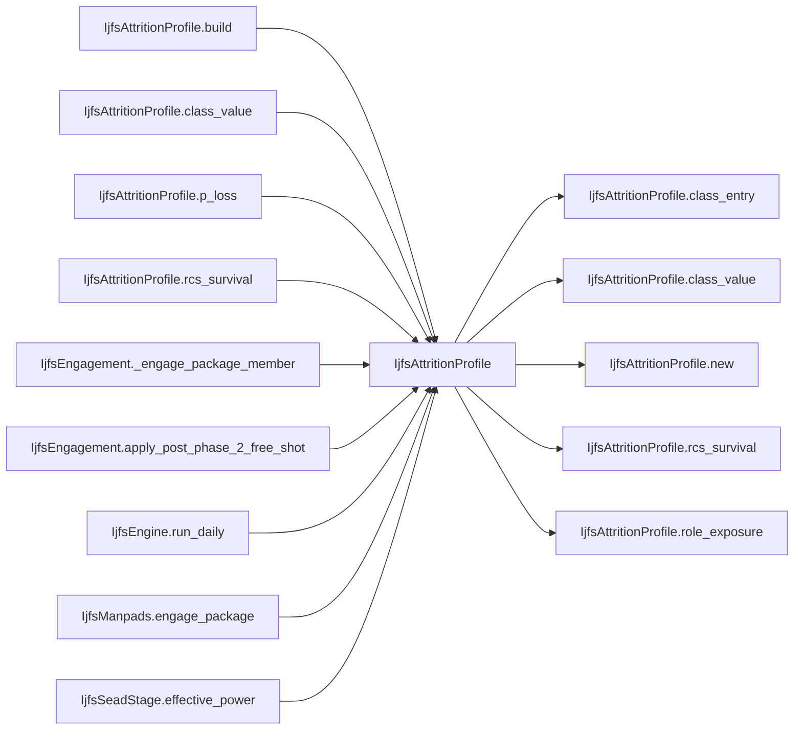

# IjfsAttritionProfile

> **Reading aid, not an execution contract.** No detected edge is not permission to reorder.
> GDScript reads and writes are conservative source analysis; transition writes are also
> checked against the mutation manifest. Potential conflicts may refer to different object
> instances or conditional branches.

Generator format v1; scan scope `scripts/**/*.gd` plus `project.godot` autoload aliases.
Generated from commit `8829181ae4b6`; input SHA-256 `1c5ff5483615f0cca5b2767540c56e9a13e1387c4c1a3c66db909a97ad2e94fb`;
tool/manifest/fixture SHA-256 `ea366ecafdb8f5cc7ecae22bb7554cd8802d1ed3433c5a903ecc07bbb7230f6c`; stable generation time `2026-08-02T09:03:12-04:00`.
Unresolved-analysis diagnostics on this page: **1**.

## Source summary

How survivable one Red airframe is, per attrition source. Built once per IJFS day from the scenario and air_classes, then handed to every path that can kill an aircraft, so all of them agree on the two modifiers and none of them re-derives one.  Two modifiers, and they are deliberately CUMULATIVE (plan 0060 R2, USER ruling 2026-08-01):  * **RCS survival** — signature. A low-observable airframe is harder to engage at all. This one has been live since the port. * **Role exposure** — altitude and profile. `isr 0.7 / sead 1.0 / strike 1.2`: an ISR aircraft orbits high and clean, a strike aircraft comes in low with ordnance on the wings. Until 2026-08-01 `red_aircraft_attrition_and_sead.role_exposure_multipliers` was DEAD DATA — IjfsLoaders required the block to exist and nothing read a single field in it — so the only per-aircraft modifier in the whole model was RCS.  They are not alternatives and they do not replace one another: signature and flight profile are different survival advantages, and a stealthy striker should get both.  The class table is reached through here as well, rather than by every caller doing `air_classes["classes"].get(name, {})` with its own default, which is how two call sites drift apart on what a missing class means. Per-airframe RCS survival: `1 + rcs * RCS_SURVIVAL_FACTOR`, floored so an implausibly low signature cannot make an airframe effectively unkillable.

Source: `scripts/calc/IjfsAttritionProfile.gd`

## Placement in resolution code

| Caller | Call-site instance |
|---|---|
| [`IjfsAttritionProfile.build`](IjfsAttritionProfile.md) | `IjfsAttritionProfile.new` at `42` |
| [`IjfsAttritionProfile.class_value`](IjfsAttritionProfile.md) | `IjfsAttritionProfile.class_entry` at `57` |
| [`IjfsAttritionProfile.p_loss`](IjfsAttritionProfile.md) | `IjfsAttritionProfile.role_exposure` at `71` |
| [`IjfsAttritionProfile.p_loss`](IjfsAttritionProfile.md) | `IjfsAttritionProfile.rcs_survival` at `71` |
| [`IjfsAttritionProfile.rcs_survival`](IjfsAttritionProfile.md) | `IjfsAttritionProfile.class_value` at `61` |
| [`IjfsEngagement._engage_package_member`](IjfsEngagement.md) | `IjfsAttritionProfile.role_exposure` at `111` |
| [`IjfsEngagement._engage_package_member`](IjfsEngagement.md) | `IjfsAttritionProfile.rcs_survival` at `111` |
| [`IjfsEngagement._engage_package_member`](IjfsEngagement.md) | `IjfsAttritionProfile.p_loss` at `115` |
| [`IjfsEngagement.apply_post_phase_2_free_shot`](IjfsEngagement.md) | `IjfsAttritionProfile.p_loss` at `177` |
| [`IjfsEngine.run_daily`](ordering_IjfsEngine_run_daily.md) | `IjfsAttritionProfile.build` at `103` |
| [`IjfsManpads.engage_package`](IjfsManpads.md) | `IjfsAttritionProfile.p_loss` at `125` |
| [`IjfsSeadStage.effective_power`](IjfsSeadStage.md) | `IjfsAttritionProfile.class_value` at `223` |
| [`IjfsSeadStage.effective_power`](IjfsSeadStage.md) | `IjfsAttritionProfile.class_value` at `224` |
| [`IjfsSeadStage.effective_power`](IjfsSeadStage.md) | `IjfsAttritionProfile.class_value` at `225` |

## Dependency diagram

## Model-field evidence

| Field | Read | Written |
|---|:---:|:---:|
| _No persistent model field was resolved_ | | |

## Method dependencies

| Method | Calls (transitive effects are included above) |
|---|---|
| `build` | `IjfsAttritionProfile.new` |
| `class_entry` | — |
| `class_value` | `IjfsAttritionProfile.class_entry` |
| `p_loss` | `IjfsAttritionProfile.rcs_survival`, `IjfsAttritionProfile.role_exposure` |
| `rcs_survival` | `IjfsAttritionProfile.class_value` |
| `role_exposure` | — |

## Analysis limits found here

Showing 1 of 1 diagnostics; class pages provide the narrower context.

| Kind | Source | Why it matters |
|---|---|---|
| `multi_call_statement` | `scripts/calc/IjfsAttritionProfile.gd:71` `return clampf(base_rate * role_exposure(role) * rcs_survival(aircraft_class), 0.0, 1.0)` | Multiple calls share one statement; the map preserves lexical sites, not nested evaluation order. |
