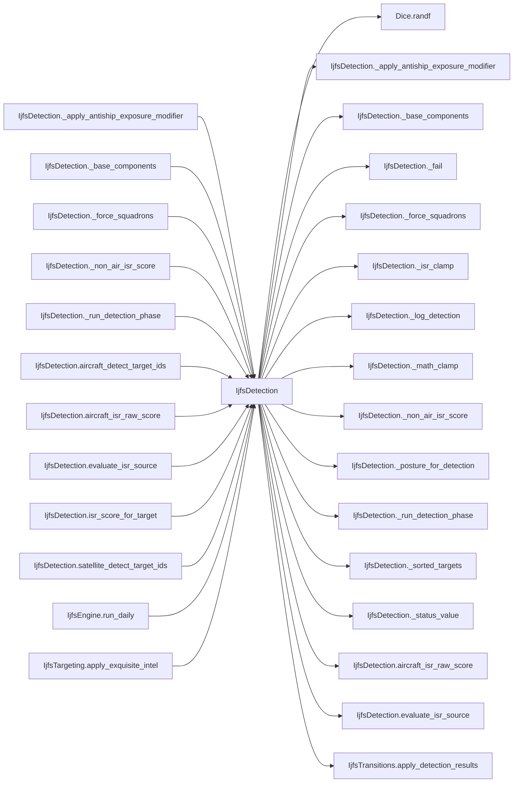

# IjfsDetection

> **Reading aid, not an execution contract.** No detected edge is not permission to reorder.
> GDScript reads and writes are conservative source analysis; transition writes are also
> checked against the mutation manifest. Potential conflicts may refer to different object
> instances or conditional branches.

Generator format v1; scan scope `scripts/**/*.gd` plus `project.godot` autoload aliases.
Generated from commit `8829181ae4b6`; input SHA-256 `1c5ff5483615f0cca5b2767540c56e9a13e1387c4c1a3c66db909a97ad2e94fb`;
tool/manifest/fixture SHA-256 `ea366ecafdb8f5cc7ecae22bb7554cd8802d1ed3433c5a903ecc07bbb7230f6c`; stable generation time `2026-08-02T09:03:12-04:00`.
Unresolved-analysis diagnostics on this page: **7**.

## Source summary

No source summary was found; see the access tables below.

Source: `scripts/interleaved/IjfsDetection.gd`

## Placement in resolution code

| Caller | Call-site instance |
|---|---|
| [`IjfsDetection._apply_antiship_exposure_modifier`](IjfsDetection.md) | `IjfsDetection._math_clamp` at `214` |
| [`IjfsDetection._base_components`](IjfsDetection.md) | `IjfsDetection._posture_for_detection` at `110` |
| [`IjfsDetection._base_components`](IjfsDetection.md) | `IjfsDetection._apply_antiship_exposure_modifier` at `126` |
| [`IjfsDetection._force_squadrons`](IjfsDetection.md) | `IjfsDetection._fail` at `231` |
| [`IjfsDetection._non_air_isr_score`](IjfsDetection.md) | `IjfsDetection.evaluate_isr_source` at `104` |
| [`IjfsDetection._run_detection_phase`](IjfsDetection.md) | `IjfsDetection._sorted_targets` at `142` |
| [`IjfsDetection._run_detection_phase`](IjfsDetection.md) | `IjfsDetection._log_detection` at `148` |
| [`IjfsDetection._run_detection_phase`](IjfsDetection.md) | `IjfsDetection._base_components` at `150` |
| [`IjfsDetection._run_detection_phase`](IjfsDetection.md) | `IjfsDetection._non_air_isr_score` at `154` |
| [`IjfsDetection._run_detection_phase`](IjfsDetection.md) | `IjfsDetection._math_clamp` at `156` |
| [`IjfsDetection._run_detection_phase`](IjfsDetection.md) | `IjfsDetection._math_clamp` at `167` |
| [`IjfsDetection._run_detection_phase`](IjfsDetection.md) | `IjfsDetection._log_detection` at `176` |
| [`IjfsDetection.aircraft_detect_target_ids`](IjfsDetection.md) | `IjfsDetection.aircraft_isr_raw_score` at `135` |
| [`IjfsDetection.aircraft_detect_target_ids`](IjfsDetection.md) | `IjfsDetection._run_detection_phase` at `136` |
| [`IjfsDetection.aircraft_isr_raw_score`](IjfsDetection.md) | `IjfsDetection._force_squadrons` at `85` |
| [`IjfsDetection.aircraft_isr_raw_score`](IjfsDetection.md) | `IjfsDetection._math_clamp` at `91` |
| [`IjfsDetection.evaluate_isr_source`](IjfsDetection.md) | `IjfsDetection._status_value` at `48` |
| [`IjfsDetection.evaluate_isr_source`](IjfsDetection.md) | `IjfsDetection._status_value` at `49` |
| [`IjfsDetection.evaluate_isr_source`](IjfsDetection.md) | `IjfsDetection._status_value` at `51` |
| [`IjfsDetection.evaluate_isr_source`](IjfsDetection.md) | `IjfsDetection._status_value` at `52` |
| [`IjfsDetection.evaluate_isr_source`](IjfsDetection.md) | `IjfsDetection._isr_clamp` at `61` |
| [`IjfsDetection.isr_score_for_target`](IjfsDetection.md) | `IjfsDetection.evaluate_isr_source` at `72` |
| [`IjfsDetection.satellite_detect_target_ids`](IjfsDetection.md) | `IjfsDetection._run_detection_phase` at `131` |
| [`IjfsEngine.run_daily`](ordering_IjfsEngine_run_daily.md) | `IjfsDetection.satellite_detect_target_ids` at `133` |
| [`IjfsEngine.run_daily`](ordering_IjfsEngine_run_daily.md) | `IjfsDetection.apply_detection_ids` at `135` |
| [`IjfsEngine.run_daily`](ordering_IjfsEngine_run_daily.md) | `IjfsDetection.aircraft_detect_target_ids` at `163` |
| [`IjfsEngine.run_daily`](ordering_IjfsEngine_run_daily.md) | `IjfsDetection.apply_detection_ids` at `165` |
| [`IjfsTargeting.apply_exquisite_intel`](IjfsTargeting.md) | `IjfsDetection.evaluate_isr_source` at `244` |

## Dependency diagram

## Model-field evidence

| Field | Read | Written |
|---|:---:|:---:|
| `IjfsSquadron.aircraft_class` | yes |  |
| `IjfsSquadron.alive` | yes |  |
| `IjfsSquadron.role` | yes |  |
| `IjfsTarget.category` | yes |  |
| `IjfsTarget.destroyed` | yes |  |
| `IjfsTarget.detectability_active` | yes |  |
| `IjfsTarget.detectability_hiding` | yes |  |
| `IjfsTarget.detected_this_turn` |  | yes |
| `IjfsTarget.intel_locked` | yes |  |
| `IjfsTarget.known_to_red` |  | yes |
| `IjfsTarget.last_detected_day` |  | yes |
| `IjfsTarget.metadata` | yes |  |
| `IjfsTarget.mobility` | yes |  |
| `IjfsTarget.posture` | yes |  |
| `IjfsTarget.source_target_id` | yes |  |
| `IjfsTarget.subcategory` | yes |  |
| `IjfsTarget.target_id` | yes |  |

## Method dependencies

| Method | Calls (transitive effects are included above) |
|---|---|
| `_apply_antiship_exposure_modifier` | `IjfsDetection._math_clamp` |
| `_base_components` | `IjfsDetection._apply_antiship_exposure_modifier`, `IjfsDetection._posture_for_detection` |
| `_fail` | — |
| `_force_squadrons` | `IjfsDetection._fail` |
| `_isr_clamp` | — |
| `_log_detection` | — |
| `_math_clamp` | — |
| `_non_air_isr_score` | `IjfsDetection.evaluate_isr_source` |
| `_posture_for_detection` | — |
| `_run_detection_phase` | `Dice.randf`, `IjfsDetection._base_components`, `IjfsDetection._log_detection`, `IjfsDetection._math_clamp`, `IjfsDetection._non_air_isr_score`, `IjfsDetection._sorted_targets` |
| `_sorted_targets` | — |
| `_status_value` | — |
| `aircraft_detect_target_ids` | `IjfsDetection._run_detection_phase`, `IjfsDetection.aircraft_isr_raw_score` |
| `aircraft_isr_raw_score` | `IjfsDetection._force_squadrons`, `IjfsDetection._math_clamp` |
| `apply_detection_ids` | `IjfsTransitions.apply_detection_results` |
| `evaluate_isr_source` | `IjfsDetection._isr_clamp`, `IjfsDetection._status_value` |
| `isr_score_for_target` | `IjfsDetection.evaluate_isr_source` |
| `satellite_detect_target_ids` | `IjfsDetection._run_detection_phase` |

## Analysis limits found here

Showing 7 of 7 diagnostics; class pages provide the narrower context.

| Kind | Source | Why it matters |
|---|---|---|
| `untyped_alias` | `scripts/interleaved/IjfsDetection.gd:12` `var override: Variant = source.get("runtime_capability_override", null)` | The receiver type could not be proven. |
| `untyped_alias` | `scripts/interleaved/IjfsDetection.gd:118` `var components := { "detectability_label": label, "satellite_floor": float(satellite_by_mobility.get(posture, 0.0)), "base_probability": float(detectability_label_base_probabili…` | The receiver type could not be proven. |
| `untyped_alias` | `scripts/interleaved/IjfsDetection.gd:147` `var method := "intel_locked" if target.intel_locked and target.mobility != "static" else "static_known"` | The receiver type could not be proven. |
| `untyped_alias` | `scripts/interleaved/IjfsDetection.gd:191` `var entry := { "phase": phase, "target_id": target.target_id, "source_target_id": target.source_target_id, "category": target.category, "subcategory": target.subcategory, "mobil…` | The receiver type could not be proven. |
| `callable_or_lambda` | `scripts/interleaved/IjfsDetection.gd:219` `sorted.sort_custom(func(a: IjfsTarget, b: IjfsTarget) -> bool: return a.target_id < b.target_id)` | Callable/lambda dataflow is outside this analyser. |
| `unresolved_receiver` | `scripts/interleaved/IjfsDetection.gd:219` `sorted.sort_custom(func(a: IjfsTarget, b: IjfsTarget) -> bool: return a.target_id < b.target_id)` | A protected field name appeared on an unresolved receiver. |
| `untyped_alias` | `scripts/interleaved/IjfsDetection.gd:228` `var from_object: Variant = force.get("squadrons")` | The receiver type could not be proven. |
