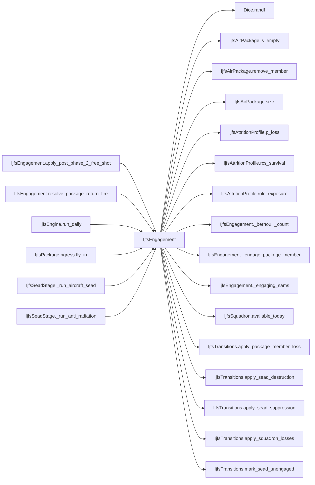

# IjfsEngagement

> **Reading aid, not an execution contract.** No detected edge is not permission to reorder.
> GDScript reads and writes are conservative source analysis; transition writes are also
> checked against the mutation manifest. Potential conflicts may refer to different object
> instances or conditional branches.

Generator format v1; scan scope `scripts/**/*.gd` plus `project.godot` autoload aliases.
Generated from commit `7bbf08693b44`; input SHA-256 `c879af92cf7693c7df1119a11083764377c92a9410144e7b95f361f509613378`;
tool/manifest/fixture SHA-256 `ea366ecafdb8f5cc7ecae22bb7554cd8802d1ed3433c5a903ecc07bbb7230f6c`; stable generation time `2026-08-02T17:09:31-04:00`.
Unresolved-analysis diagnostics on this page: **11**.

## Source summary

Port of ijfs_standalone/engagement.py — what a SAM does, on both sides of the exchange: one SAM being engaged, and surviving SAMs shooting back.  The ORCHESTRATION moved out on 2026-08-01 (plan 0060 R11): IjfsSeadStage decides which weapon engages which emitter and with how much power, and calls `engage_sam_target` per target. What stays here is the per-target and per-airframe arithmetic both stages share.  RNG: every Python rng.random() maps to dice.randf(), preserving draw order — a destroy roll, then a suppression roll only when the target survives; return-fire / free-shot loops iterate squadrons in force order, drawing once per alive aircraft.  Per-airframe survivability is NOT computed here: it comes from IjfsAttritionProfile, which every path that can kill an aircraft shares. Since 2026-08-01 (plan 0060 R2) that means loss probabilities carry role exposure as well as RCS survival.

Source: `scripts/interleaved/IjfsEngagement.gd`

## Placement in resolution code

| Caller | Call-site instance |
|---|---|
| [`IjfsEngagement.apply_post_phase_2_free_shot`](IjfsEngagement.md) | `IjfsEngagement._bernoulli_count` at `178` |
| [`IjfsEngagement.resolve_package_return_fire`](IjfsEngagement.md) | `IjfsEngagement._engaging_sams` at `87` |
| [`IjfsEngagement.resolve_package_return_fire`](IjfsEngagement.md) | `IjfsEngagement._engage_package_member` at `90` |
| [`IjfsEngine.run_daily`](ordering_IjfsEngine_run_daily.md) | `IjfsEngagement.resolve_package_return_fire` at `153` |
| [`IjfsEngine.run_daily`](ordering_IjfsEngine_run_daily.md) | `IjfsEngagement.apply_post_phase_2_free_shot` at `172` |
| [`IjfsPackageIngress.fly_in`](IjfsPackageIngress.md) | `IjfsEngagement.resolve_package_return_fire` at `64` |
| [`IjfsSeadStage._run_aircraft_sead`](IjfsSeadStage.md) | `IjfsEngagement.engage_sam_target` at `249` |
| [`IjfsSeadStage._run_anti_radiation`](IjfsSeadStage.md) | `IjfsEngagement.engage_sam_target` at `77` |

## Dependency diagram

## Model-field evidence

| Field | Read | Written |
|---|:---:|:---:|
| `IjfsAirPackage.dedicated_size` | yes | yes |
| `IjfsAirPackage.kind` | yes |  |
| `IjfsAirPackage.members` | yes | yes |
| `IjfsAirPackage.munition_id` | yes |  |
| `IjfsAirPackage.package_id` | yes |  |
| `IjfsAirPackage.to_number` | yes |  |
| `IjfsDailyState.scenario` | yes |  |
| `IjfsDailyState.targets` | yes |  |
| `IjfsSquadron.aircraft_class` | yes |  |
| `IjfsSquadron.alive` | yes | yes |
| `IjfsSquadron.losses_campaign` | yes | yes |
| `IjfsSquadron.losses_today` | yes | yes |
| `IjfsSquadron.role` | yes |  |
| `IjfsSquadron.rtb_today` | yes | yes |
| `IjfsSquadron.sead_assigned_today` | yes | yes |
| `IjfsSquadron.squadron_id` | yes |  |
| `IjfsTarget.category` | yes |  |
| `IjfsTarget.destroyed` | yes | yes |
| `IjfsTarget.detected_this_turn` |  | yes |
| `IjfsTarget.known_to_red` |  | yes |
| `IjfsTarget.metadata` | yes |  |
| `IjfsTarget.sam_score` | yes |  |
| `IjfsTarget.sead_result` | yes | yes |
| `IjfsTarget.subcategory` | yes |  |
| `IjfsTarget.suppressed` | yes | yes |
| `IjfsTarget.suppressed_this_turn` |  | yes |
| `IjfsTarget.target_id` | yes |  |

## Method dependencies

| Method | Calls (transitive effects are included above) |
|---|---|
| `_bernoulli_count` | `Dice.randf` |
| `_engage_package_member` | `Dice.randf`, `IjfsAirPackage.remove_member`, `IjfsAirPackage.size`, `IjfsAttritionProfile.p_loss`, `IjfsAttritionProfile.rcs_survival`, `IjfsAttritionProfile.role_exposure`, `IjfsTransitions.apply_package_member_loss` |
| `_engaging_sams` | — |
| `apply_post_phase_2_free_shot` | `IjfsAttritionProfile.p_loss`, `IjfsEngagement._bernoulli_count`, `IjfsSquadron.available_today`, `IjfsTransitions.apply_squadron_losses` |
| `engage_sam_target` | `Dice.randf`, `IjfsTransitions.apply_sead_destruction`, `IjfsTransitions.apply_sead_suppression`, `IjfsTransitions.mark_sead_unengaged` |
| `resolve_package_return_fire` | `IjfsAirPackage.is_empty`, `IjfsEngagement._engage_package_member`, `IjfsEngagement._engaging_sams` |

## Analysis limits found here

Showing 11 of 11 diagnostics; class pages provide the narrower context.

| Kind | Source | Why it matters |
|---|---|---|
| `multi_call_statement` | `scripts/calc/IjfsAttritionProfile.gd:71` `return clampf(base_rate * role_exposure(role) * rcs_survival(aircraft_class), 0.0, 1.0)` | Multiple calls share one statement; the map preserves lexical sites, not nested evaluation order. |
| `untyped_alias` | `scripts/interleaved/IjfsEngagement.gd:84` `var factor := float(state.scenario.get(IjfsLoaders.SAM_RETURN_FIRE_KNOB, 0.0))` | The receiver type could not be proven. |
| `untyped_alias` | `scripts/interleaved/IjfsEngagement.gd:100` `var members_before := package.size()` | The receiver type could not be proven. |
| `untyped_alias` | `scripts/interleaved/IjfsEngagement.gd:106` `var score := maxi(1, target.sam_score)` | The receiver type could not be proven. |
| `multi_call_statement` | `scripts/interleaved/IjfsEngagement.gd:111` `var raw := factor * float(score) * profile.role_exposure(victim.role) * profile.rcs_survival(victim.aircraft_class)` | Multiple calls share one statement; the map preserves lexical sites, not nested evaluation order. |
| `untyped_alias` | `scripts/interleaved/IjfsEngagement.gd:115` `var p_loss := profile.p_loss(factor * float(score), victim.aircraft_class, victim.role)` | The receiver type could not be proven. |
| `multi_call_statement` | `scripts/interleaved/IjfsEngagement.gd:122` `IjfsTransitions.apply_package_member_loss( package.remove_member(candidate), package.kind == IjfsAirPackage.SEAD)` | Multiple calls share one statement; the map preserves lexical sites, not nested evaluation order. |
| `callable_or_lambda` | `scripts/interleaved/IjfsEngagement.gd:155` `engaging.sort_custom(func(a: IjfsTarget, b: IjfsTarget) -> bool: return a.target_id < b.target_id)` | Callable/lambda dataflow is outside this analyser. |
| `unresolved_receiver` | `scripts/interleaved/IjfsEngagement.gd:155` `engaging.sort_custom(func(a: IjfsTarget, b: IjfsTarget) -> bool: return a.target_id < b.target_id)` | A protected field name appeared on an unresolved receiver. |
| `untyped_alias` | `scripts/interleaved/IjfsEngagement.gd:174` `var exposed := sq.available_today()` | The receiver type could not be proven. |
| `untyped_alias` | `scripts/interleaved/IjfsEngagement.gd:177` `var p_loss := profile.p_loss(loss_rate, sq.aircraft_class, sq.role)` | The receiver type could not be proven. |
