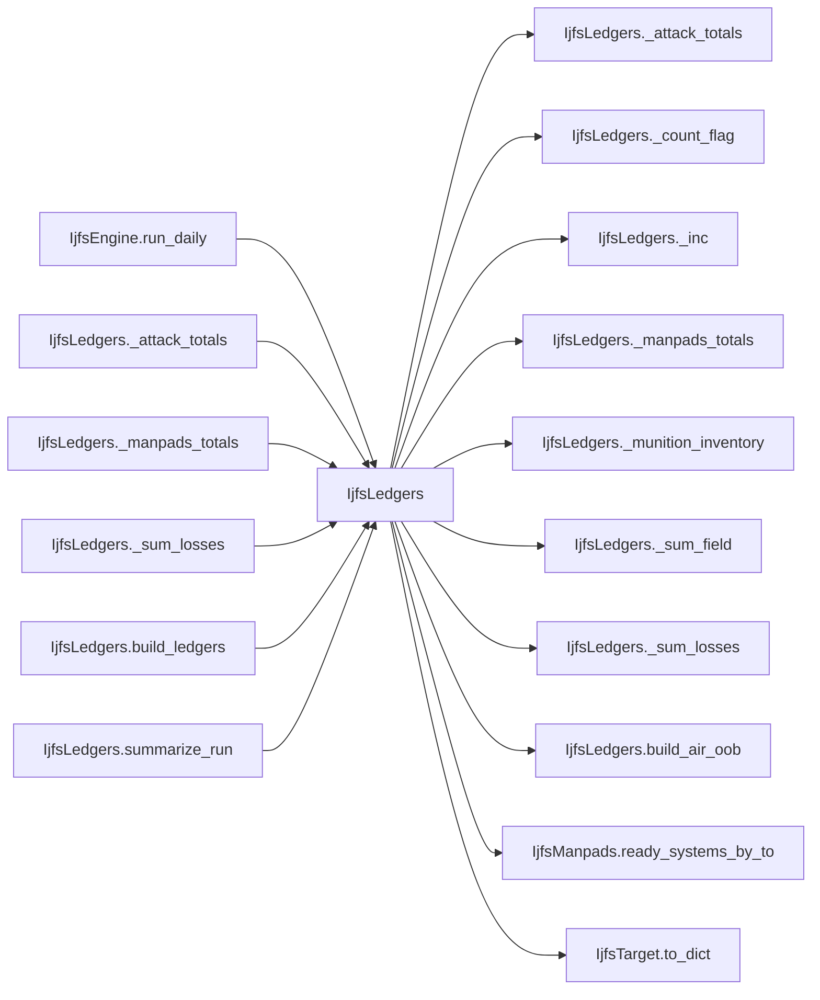

# IjfsLedgers

> **Reading aid, not an execution contract.** No detected edge is not permission to reorder.
> GDScript reads and writes are conservative source analysis; transition writes are also
> checked against the mutation manifest. Potential conflicts may refer to different object
> instances or conditional branches.

Generator format v1; scan scope `scripts/**/*.gd` plus `project.godot` autoload aliases.
Generated from commit `7bbf08693b44`; input SHA-256 `c879af92cf7693c7df1119a11083764377c92a9410144e7b95f361f509613378`;
tool/manifest/fixture SHA-256 `ea366ecafdb8f5cc7ecae22bb7554cd8802d1ed3433c5a903ecc07bbb7230f6c`; stable generation time `2026-08-02T17:09:31-04:00`.
Unresolved-analysis diagnostics on this page: **10**.

## Source summary

The IJFS day's REPORTING half: the run summary (port of ijfs_standalone logging_utils.summarize_run) and the in-memory ledger bundle that replaces the oracle's write_outputs file IO. Pure — it reads the finished IjfsDailyState and mutates nothing.  Extracted from IjfsEngine 2026-08-01 (plan 0060). The engine was at its dependency ceiling of 14 and plan 0060 adds three collaborators to it, so the ceiling had to be PAID rather than raised. Reporting was the right thing to move: it is the only part of the engine that names IjfsSquadron and IjfsMunition purely to serialize them, and a day's orchestration should not also own the shape of the record it leaves behind. --- Summary (port of logging_utils.summarize_run) ----------------------------------------------

Source: `scripts/calc/IjfsLedgers.gd`

## Placement in resolution code

| Caller | Call-site instance |
|---|---|
| [`IjfsEngine.run_daily`](ordering_IjfsEngine_run_daily.md) | `IjfsLedgers.summarize_run` at `180` |
| [`IjfsEngine.run_daily`](ordering_IjfsEngine_run_daily.md) | `IjfsLedgers.build_ledgers` at `184` |
| [`IjfsLedgers._attack_totals`](IjfsLedgers.md) | `IjfsLedgers._inc` at `86` |
| [`IjfsLedgers._manpads_totals`](IjfsLedgers.md) | `IjfsLedgers._sum_field` at `111` |
| [`IjfsLedgers._sum_losses`](IjfsLedgers.md) | `IjfsLedgers._sum_field` at `228` |
| [`IjfsLedgers.build_ledgers`](IjfsLedgers.md) | `IjfsLedgers._munition_inventory` at `131` |
| [`IjfsLedgers.build_ledgers`](IjfsLedgers.md) | `IjfsLedgers.build_air_oob` at `131` |
| [`IjfsLedgers.summarize_run`](IjfsLedgers.md) | `IjfsLedgers._inc` at `32` |
| [`IjfsLedgers.summarize_run`](IjfsLedgers.md) | `IjfsLedgers._inc` at `33` |
| [`IjfsLedgers.summarize_run`](IjfsLedgers.md) | `IjfsLedgers._inc` at `39` |
| [`IjfsLedgers.summarize_run`](IjfsLedgers.md) | `IjfsLedgers._inc` at `41` |
| [`IjfsLedgers.summarize_run`](IjfsLedgers.md) | `IjfsLedgers._inc` at `44` |
| [`IjfsLedgers.summarize_run`](IjfsLedgers.md) | `IjfsLedgers._inc` at `46` |
| [`IjfsLedgers.summarize_run`](IjfsLedgers.md) | `IjfsLedgers._attack_totals` at `48` |
| [`IjfsLedgers.summarize_run`](IjfsLedgers.md) | `IjfsLedgers._sum_losses` at `50` |
| [`IjfsLedgers.summarize_run`](IjfsLedgers.md) | `IjfsLedgers._sum_losses` at `50` |
| [`IjfsLedgers.summarize_run`](IjfsLedgers.md) | `IjfsLedgers._sum_losses` at `50` |
| [`IjfsLedgers.summarize_run`](IjfsLedgers.md) | `IjfsLedgers._manpads_totals` at `50` |
| [`IjfsLedgers.summarize_run`](IjfsLedgers.md) | `IjfsLedgers._count_flag` at `50` |
| [`IjfsLedgers.summarize_run`](IjfsLedgers.md) | `IjfsLedgers._count_flag` at `50` |
| [`IjfsLedgers.summarize_run`](IjfsLedgers.md) | `IjfsLedgers._sum_losses` at `50` |
| [`IjfsLedgers.summarize_run`](IjfsLedgers.md) | `IjfsLedgers._sum_losses` at `50` |

## Dependency diagram

## Model-field evidence

| Field | Read | Written |
|---|:---:|:---:|
| `IjfsDailyState.air_classes` | yes |  |
| `IjfsDailyState.contest_log` | yes |  |
| `IjfsDailyState.detection_log` | yes |  |
| `IjfsDailyState.engagement_log` | yes |  |
| `IjfsDailyState.exquisite_intel_overrides` | yes |  |
| `IjfsDailyState.free_shot_log` | yes |  |
| `IjfsDailyState.manpads_intercept_log` | yes |  |
| `IjfsDailyState.munitions` | yes |  |
| `IjfsDailyState.seed` | yes |  |
| `IjfsDailyState.source_files` | yes |  |
| `IjfsDailyState.squadron_force` | yes |  |
| `IjfsDailyState.strike_log` | yes |  |
| `IjfsDailyState.taiwan_ad_health_after` | yes |  |
| `IjfsDailyState.taiwan_ad_health_after_missile_phase` | yes |  |
| `IjfsDailyState.taiwan_ad_health_after_sead` | yes |  |
| `IjfsDailyState.taiwan_ad_health_before` | yes |  |
| `IjfsDailyState.targets` | yes |  |
| `IjfsDailyState.warnings` | yes |  |
| `IjfsMunition.category` | yes |  |
| `IjfsMunition.display_label` | yes |  |
| `IjfsMunition.inventory_remaining` | yes |  |
| `IjfsMunition.munition_id` | yes |  |
| `IjfsMunition.munition_name` | yes |  |
| `IjfsMunition.rounds_per_engagement_default` | yes |  |
| `IjfsSquadron.aircraft_class` | yes |  |
| `IjfsSquadron.alive` | yes |  |
| `IjfsSquadron.initial` | yes |  |
| `IjfsSquadron.losses_campaign` | yes |  |
| `IjfsSquadron.losses_today` | yes |  |
| `IjfsSquadron.role` | yes |  |
| `IjfsSquadron.rtb_today` | yes |  |
| `IjfsSquadron.sead_assigned_today` | yes |  |
| `IjfsSquadron.squadron_id` | yes |  |
| `IjfsTarget.category` | yes |  |
| `IjfsTarget.destroyed` | yes |  |
| `IjfsTarget.detectability_active` | yes |  |
| `IjfsTarget.detectability_hiding` | yes |  |
| `IjfsTarget.detected_this_turn` | yes |  |
| `IjfsTarget.hardness` | yes |  |
| `IjfsTarget.instance_index` | yes |  |
| `IjfsTarget.intel_locked` | yes |  |
| `IjfsTarget.known_to_red` | yes |  |
| `IjfsTarget.last_detected_day` | yes |  |
| `IjfsTarget.manpads_remaining` | yes |  |
| `IjfsTarget.metadata` | yes |  |
| `IjfsTarget.mobility` | yes |  |
| `IjfsTarget.posture` | yes |  |
| `IjfsTarget.quantity` | yes |  |
| `IjfsTarget.sam_score` | yes |  |
| `IjfsTarget.sead_result` | yes |  |
| `IjfsTarget.source_target_id` | yes |  |
| `IjfsTarget.subcategory` | yes |  |
| `IjfsTarget.suppressed` | yes |  |
| `IjfsTarget.suppressed_this_turn` | yes |  |
| `IjfsTarget.target_id` | yes |  |

## Method dependencies

| Method | Calls (transitive effects are included above) |
|---|---|
| `_attack_totals` | `IjfsLedgers._inc` |
| `_count_flag` | — |
| `_inc` | — |
| `_manpads_totals` | `IjfsLedgers._sum_field`, `IjfsManpads.ready_systems_by_to` |
| `_munition_inventory` | — |
| `_sum_field` | — |
| `_sum_losses` | `IjfsLedgers._sum_field` |
| `build_air_oob` | — |
| `build_ledgers` | `IjfsLedgers._munition_inventory`, `IjfsLedgers.build_air_oob`, `IjfsTarget.to_dict` |
| `summarize_run` | `IjfsLedgers._attack_totals`, `IjfsLedgers._count_flag`, `IjfsLedgers._inc`, `IjfsLedgers._manpads_totals`, `IjfsLedgers._sum_losses` |

## Analysis limits found here

Showing 10 of 10 diagnostics; class pages provide the narrower context.

| Kind | Source | Why it matters |
|---|---|---|
| `untyped_iteration` | `scripts/calc/IjfsLedgers.gd:30` `for entry in state.detection_log:` | The collection element type could not be proven. |
| `untyped_iteration` | `scripts/calc/IjfsLedgers.gd:37` `for entry in state.strike_log:` | The collection element type could not be proven. |
| `untyped_iteration` | `scripts/calc/IjfsLedgers.gd:42` `for entry in state.engagement_log:` | The collection element type could not be proven. |
| `multi_call_statement` | `scripts/calc/IjfsLedgers.gd:50` `return { "target_counts_by_category_status": target_counts, "detections_by_mobility": detections_by_mobility, "detections_by_category": detections_by_category, "attacks": attack…` | Multiple calls share one statement; the map preserves lexical sites, not nested evaluation order. |
| `untyped_iteration` | `scripts/calc/IjfsLedgers.gd:106` `for entry in state.manpads_intercept_log:` | The collection element type could not be proven. |
| `multi_call_statement` | `scripts/calc/IjfsLedgers.gd:111` `return { "ready_systems_by_to": IjfsManpads.ready_systems_by_to(state.targets), "attempts": state.manpads_intercept_log.size(), "kills": kills, "aborts": aborts, "unaffected": i…` | Multiple calls share one statement; the map preserves lexical sites, not nested evaluation order. |
| `callable_or_lambda` | `scripts/calc/IjfsLedgers.gd:126` `sorted_targets.sort_custom(func(a: IjfsTarget, b: IjfsTarget) -> bool: return a.target_id < b.target_id)` | Callable/lambda dataflow is outside this analyser. |
| `unresolved_receiver` | `scripts/calc/IjfsLedgers.gd:126` `sorted_targets.sort_custom(func(a: IjfsTarget, b: IjfsTarget) -> bool: return a.target_id < b.target_id)` | A protected field name appeared on an unresolved receiver. |
| `multi_call_statement` | `scripts/calc/IjfsLedgers.gd:131` `return { "metadata": { "current_day": current_day, "seed": state.seed, "source_files": state.source_files.duplicate(), "created_by": "ijfs_standalone", }, "detection_log": state…` | Multiple calls share one statement; the map preserves lexical sites, not nested evaluation order. |
| `untyped_alias` | `scripts/interleaved/IjfsManpads.gd:56` `var to_key := str(int(target.metadata.get("to_number", 0)))` | The receiver type could not be proven. |
