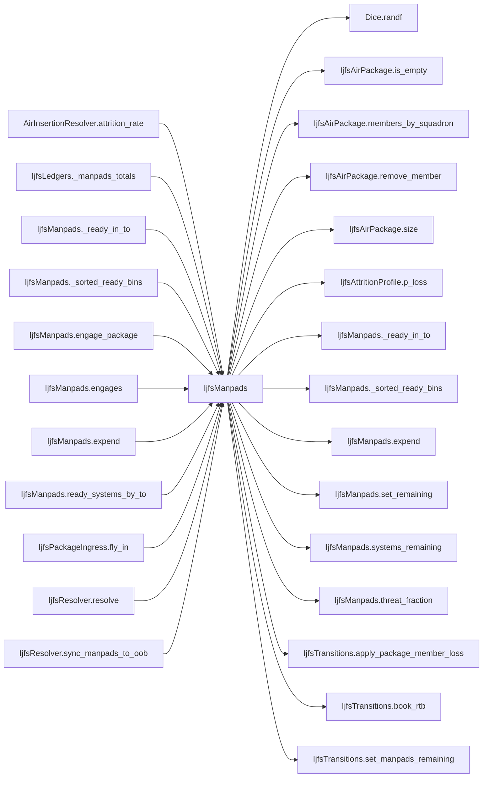

# IjfsManpads

> **Reading aid, not an execution contract.** No detected edge is not permission to reorder.
> GDScript reads and writes are conservative source analysis; transition writes are also
> checked against the mutation manifest. Potential conflicts may refer to different object
> instances or conditional branches.

Generator format v1; scan scope `scripts/**/*.gd` plus `project.godot` autoload aliases.
Generated from commit `7bbf08693b44`; input SHA-256 `c879af92cf7693c7df1119a11083764377c92a9410144e7b95f361f509613378`;
tool/manifest/fixture SHA-256 `ea366ecafdb8f5cc7ecae22bb7554cd8802d1ed3433c5a903ecc07bbb7230f6c`; stable generation time `2026-08-02T17:09:31-04:00`.
Unresolved-analysis diagnostics on this page: **11**.

## Source summary

MANPADS layer (2026-07-10, USER-approved divergence from the TIV oracle). Stinger MANPADS are per-TO container bins (category "MANPADS", stock held in the typed `IjfsTarget.manpads_remaining`) deliberately OUTSIDE the SEAD / AD-health SAM categories: passive-IR shoulder launchers are not SEAD-targetable, but they contest low-altitude air operations. Drains: usage (missiles expended per engagement, here), bombardment (bins stay strikeable through the normal strike path), ground losses (IjfsResolver.sync_manpads_to_oob scales bins with TO infantry survival).  ONE MECHANIC, ONE TRIGGER (plan 0060 R5/R6/R12, USER rulings 2026-08-01). MANPADS used to have two surfaces: an interception roll against every low-altitude strike, and an island-wide daily contest that taxed SEAD and strike squadrons for being in the campaign at all. BOTH are gone. A MANPADS engagement now exists only when a four-airframe manned package strikes a **Maneuver Unit** whose TO holds ready launchers — the shoulder-launched threat belongs to the low-altitude strike that actually flew into its envelope, and to nothing else. MANPADS does not protect SAM, radar, infrastructure or anti-ship targets, and it never touches ISR, SEAD or Attack UCAV aircraft.  Kill and abort are MUTUALLY EXCLUSIVE and share ONE draw, so attrition is not a rider on a successful abort: * **killed** — one selected member dies; the survivors press the attack at reduced effect; * **aborted** — every survivor returns and books RTB; today's strike is denied; * **unaffected** — the full surviving package presses.

Source: `scripts/interleaved/IjfsManpads.gd`

## Placement in resolution code

| Caller | Call-site instance |
|---|---|
| [`AirInsertionResolver.attrition_rate`](AirInsertionResolver.md) | `IjfsManpads.threat_fraction` at `35` |
| [`IjfsLedgers._manpads_totals`](IjfsLedgers.md) | `IjfsManpads.ready_systems_by_to` at `111` |
| [`IjfsManpads._ready_in_to`](IjfsManpads.md) | `IjfsManpads.systems_remaining` at `205` |
| [`IjfsManpads._sorted_ready_bins`](IjfsManpads.md) | `IjfsManpads.systems_remaining` at `217` |
| [`IjfsManpads.engage_package`](IjfsManpads.md) | `IjfsManpads._ready_in_to` at `123` |
| [`IjfsManpads.engage_package`](IjfsManpads.md) | `IjfsManpads.threat_fraction` at `125` |
| [`IjfsManpads.engage_package`](IjfsManpads.md) | `IjfsManpads.expend` at `162` |
| [`IjfsManpads.engages`](IjfsManpads.md) | `IjfsManpads._ready_in_to` at `106` |
| [`IjfsManpads.expend`](IjfsManpads.md) | `IjfsManpads._sorted_ready_bins` at `189` |
| [`IjfsManpads.expend`](IjfsManpads.md) | `IjfsManpads.systems_remaining` at `192` |
| [`IjfsManpads.expend`](IjfsManpads.md) | `IjfsManpads.set_remaining` at `194` |
| [`IjfsManpads.ready_systems_by_to`](IjfsManpads.md) | `IjfsManpads.systems_remaining` at `53` |
| [`IjfsPackageIngress.fly_in`](IjfsPackageIngress.md) | `IjfsManpads.engages` at `70` |
| [`IjfsPackageIngress.fly_in`](IjfsPackageIngress.md) | `IjfsManpads.engage_package` at `71` |
| [`IjfsResolver.resolve`](IjfsResolver.md) | `IjfsManpads.seed_manpads` at `26` |
| [`IjfsResolver.sync_manpads_to_oob`](IjfsResolver.md) | `IjfsManpads.systems_remaining` at `145` |

## Dependency diagram

## Model-field evidence

| Field | Read | Written |
|---|:---:|:---:|
| `IjfsAirPackage.dedicated_size` | yes | yes |
| `IjfsAirPackage.members` | yes | yes |
| `IjfsAirPackage.munition_id` | yes |  |
| `IjfsAirPackage.package_id` | yes |  |
| `IjfsDailyState.munitions` | yes |  |
| `IjfsDailyState.scenario` | yes |  |
| `IjfsDailyState.targets` | yes |  |
| `IjfsMunition.manpads_vulnerability` | yes |  |
| `IjfsMunition.munition_id` | yes |  |
| `IjfsSquadron.aircraft_class` | yes |  |
| `IjfsSquadron.alive` | yes | yes |
| `IjfsSquadron.losses_campaign` | yes | yes |
| `IjfsSquadron.losses_today` | yes | yes |
| `IjfsSquadron.role` | yes |  |
| `IjfsSquadron.rtb_today` | yes | yes |
| `IjfsSquadron.sead_assigned_today` | yes | yes |
| `IjfsSquadron.squadron_id` | yes |  |
| `IjfsTarget.category` | yes |  |
| `IjfsTarget.destroyed` | yes |  |
| `IjfsTarget.manpads_remaining` | yes | yes |
| `IjfsTarget.metadata` | yes |  |
| `IjfsTarget.metadata[systems_remaining]` |  | yes |
| `IjfsTarget.metadata[to_number]` | yes |  |
| `IjfsTarget.suppressed` | yes |  |
| `IjfsTarget.target_id` | yes |  |

## Method dependencies

| Method | Calls (transitive effects are included above) |
|---|---|
| `_ready_in_to` | `IjfsManpads.systems_remaining` |
| `_sorted_ready_bins` | `IjfsManpads.systems_remaining` |
| `engage_package` | `Dice.randf`, `IjfsAirPackage.is_empty`, `IjfsAirPackage.members_by_squadron`, `IjfsAirPackage.remove_member`, `IjfsAirPackage.size`, `IjfsAttritionProfile.p_loss`, `IjfsManpads._ready_in_to`, `IjfsManpads.expend`, `IjfsManpads.threat_fraction`, `IjfsTransitions.apply_package_member_loss`, `IjfsTransitions.book_rtb` |
| `engages` | `IjfsManpads._ready_in_to` |
| `expend` | `IjfsManpads._sorted_ready_bins`, `IjfsManpads.set_remaining`, `IjfsManpads.systems_remaining` |
| `ready_systems_by_to` | `IjfsManpads.systems_remaining` |
| `seed_manpads` | `IjfsTransitions.set_manpads_remaining` |
| `set_remaining` | `IjfsTransitions.set_manpads_remaining` |
| `systems_remaining` | — |
| `threat_fraction` | — |

## Analysis limits found here

Showing 11 of 11 diagnostics; class pages provide the narrower context.

| Kind | Source | Why it matters |
|---|---|---|
| `multi_call_statement` | `scripts/calc/IjfsAttritionProfile.gd:71` `return clampf(base_rate * role_exposure(role) * rcs_survival(aircraft_class), 0.0, 1.0)` | Multiple calls share one statement; the map preserves lexical sites, not nested evaluation order. |
| `untyped_alias` | `scripts/interleaved/IjfsManpads.gd:56` `var to_key := str(int(target.metadata.get("to_number", 0)))` | The receiver type could not be proven. |
| `untyped_alias` | `scripts/interleaved/IjfsManpads.gd:122` `var to_number := int(strike_target.metadata["to_number"])` | The receiver type could not be proven. |
| `untyped_alias` | `scripts/interleaved/IjfsManpads.gd:128` `var kill_factor := float(state.scenario.get(IjfsLoaders.MANPADS_KILL_FACTOR_KNOB, 0.0))` | The receiver type could not be proven. |
| `untyped_alias` | `scripts/interleaved/IjfsManpads.gd:129` `var members_before := package.size()` | The receiver type could not be proven. |
| `untyped_alias` | `scripts/interleaved/IjfsManpads.gd:138` `var p_kill := profile.p_loss( threat * kill_factor * munition.manpads_vulnerability, victim.aircraft_class, victim.role)` | The receiver type could not be proven. |
| `untyped_alias` | `scripts/interleaved/IjfsManpads.gd:140` `var p_abort := clampf(threat * ABORT_FACTOR * munition.manpads_vulnerability, 0.0, 1.0)` | The receiver type could not be proven. |
| `multi_call_statement` | `scripts/interleaved/IjfsManpads.gd:155` `IjfsTransitions.apply_package_member_loss(package.remove_member(candidate), false)` | Multiple calls share one statement; the map preserves lexical sites, not nested evaluation order. |
| `multi_call_statement` | `scripts/interleaved/IjfsManpads.gd:163` `return { "target_id": strike_target.target_id, "to_number": to_number, "munition_id": munition.munition_id, "package_id": package.package_id, "members_before": members_before, "…` | Multiple calls share one statement; the map preserves lexical sites, not nested evaluation order. |
| `callable_or_lambda` | `scripts/interleaved/IjfsManpads.gd:219` `bins.sort_custom(func(a: IjfsTarget, b: IjfsTarget) -> bool: return a.target_id < b.target_id)` | Callable/lambda dataflow is outside this analyser. |
| `unresolved_receiver` | `scripts/interleaved/IjfsManpads.gd:219` `bins.sort_custom(func(a: IjfsTarget, b: IjfsTarget) -> bool: return a.target_id < b.target_id)` | A protected field name appeared on an unresolved receiver. |
