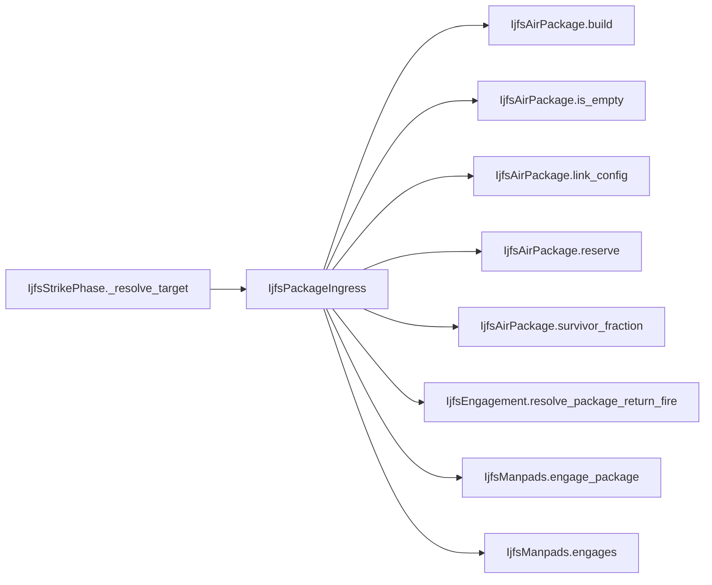

# IjfsPackageIngress

> **Reading aid, not an execution contract.** No detected edge is not permission to reorder.
> GDScript reads and writes are conservative source analysis; transition writes are also
> checked against the mutation manifest. Potential conflicts may refer to different object
> instances or conditional branches.

Generator format v1; scan scope `scripts/**/*.gd` plus `project.godot` autoload aliases.
Generated from commit `8829181ae4b6`; input SHA-256 `1c5ff5483615f0cca5b2767540c56e9a13e1387c4c1a3c66db909a97ad2e94fb`;
tool/manifest/fixture SHA-256 `ea366ecafdb8f5cc7ecae22bb7554cd8802d1ed3433c5a903ecc07bbb7230f6c`; stable generation time `2026-08-02T09:03:12-04:00`.
Unresolved-analysis diagnostics on this page: **22**.

## Computed effect warning

The source summary claims this class is pure, but the generated call closure reaches
protected writes: `IjfsSquadron.alive`, `IjfsSquadron.losses_campaign`, `IjfsSquadron.losses_today`, `IjfsSquadron.rtb_today`, `IjfsSquadron.sead_assigned_today`, `IjfsTarget.manpads_remaining`, `IjfsTarget.metadata[systems_remaining]`. Treat the computed evidence and
visible uncertainty as the safer reading; the source claim needs a separate fix.

## Source summary

Getting a four-airframe Organic package from the ramp to the target: assemble it, then fly it in past whatever defends the target's TO.  Plan 0060 R8 fixes the ORDER, and the order is the mechanic: 1. assemble the package from the linked squadrons' currently available airframes; 2. same-TO SAMs engage, one at a time in stable target-id order, each hit killing at most one member (plan 0060 R10); 3. if the target is a Maneuver Unit and at least one member survives, MANPADS takes exactly one draw and produces exactly one outcome.  Three things can then happen to the strike itself, and the caller needs all three distinguished: it presses (at `survivors / package_size` effect), it is DENIED because MANPADS drove the survivors home, or the package was wiped out on ingress — a spent sortie that delivered nothing, which is NOT the same as a strike that never launched for want of airframes.  `scripts/calc/` because it changes no campaign state directly: every kill, every RTB booking and every launcher expenditure happens inside IjfsManpads, which applies at its own draw point.

Source: `scripts/calc/IjfsPackageIngress.gd`

## Placement in resolution code

| Caller | Call-site instance |
|---|---|
| [`IjfsStrikePhase._resolve_target`](IjfsStrikePhase.md) | `IjfsPackageIngress.assemble` at `63` |
| [`IjfsStrikePhase._resolve_target`](IjfsStrikePhase.md) | `IjfsPackageIngress.fly_in` at `73` |

## Dependency diagram

## Model-field evidence

| Field | Read | Written |
|---|:---:|:---:|
| `IjfsAirPackage.dedicated_size` | yes | yes |
| `IjfsAirPackage.initial_size` | yes | yes |
| `IjfsAirPackage.kind` | yes | yes |
| `IjfsAirPackage.members` | yes | yes |
| `IjfsAirPackage.munition_id` | yes | yes |
| `IjfsAirPackage.package_id` | yes | yes |
| `IjfsAirPackage.target_id` |  | yes |
| `IjfsAirPackage.to_number` | yes | yes |
| `IjfsDailyState.contest_log` | yes | yes |
| `IjfsDailyState.manpads_intercept_log` | yes | yes |
| `IjfsDailyState.munitions` | yes |  |
| `IjfsDailyState.scenario` | yes |  |
| `IjfsDailyState.squadron_force` | yes |  |
| `IjfsDailyState.targets` | yes |  |
| `IjfsMunition.manpads_vulnerability` | yes |  |
| `IjfsMunition.munition_id` | yes |  |
| `IjfsSquadron.aircraft_class` | yes |  |
| `IjfsSquadron.alive` | yes | yes |
| `IjfsSquadron.losses_campaign` | yes | yes |
| `IjfsSquadron.losses_today` | yes | yes |
| `IjfsSquadron.role` | yes |  |
| `IjfsSquadron.rtb_today` | yes | yes |
| `IjfsSquadron.sead_assigned_today` | yes | yes |
| `IjfsSquadron.squadron_id` | yes |  |
| `IjfsStrikePhaseContext.ad_attrition_enabled` | yes |  |
| `IjfsStrikePhaseContext.attrition` | yes |  |
| `IjfsTarget.category` | yes |  |
| `IjfsTarget.destroyed` | yes |  |
| `IjfsTarget.manpads_remaining` | yes | yes |
| `IjfsTarget.metadata` | yes |  |
| `IjfsTarget.metadata[systems_remaining]` |  | yes |
| `IjfsTarget.metadata[to_number]` | yes |  |
| `IjfsTarget.sam_score` | yes |  |
| `IjfsTarget.suppressed` | yes |  |
| `IjfsTarget.target_id` | yes |  |

## Method dependencies

| Method | Calls (transitive effects are included above) |
|---|---|
| `assemble` | `IjfsAirPackage.build`, `IjfsAirPackage.link_config`, `IjfsAirPackage.reserve` |
| `fly_in` | `IjfsAirPackage.is_empty`, `IjfsAirPackage.link_config`, `IjfsAirPackage.survivor_fraction`, `IjfsEngagement.resolve_package_return_fire`, `IjfsManpads.engage_package`, `IjfsManpads.engages` |

## Analysis limits found here

Showing 22 of 22 diagnostics; class pages provide the narrower context.

| Kind | Source | Why it matters |
|---|---|---|
| `multi_call_statement` | `scripts/calc/IjfsAttritionProfile.gd:71` `return clampf(base_rate * role_exposure(role) * rcs_survival(aircraft_class), 0.0, 1.0)` | Multiple calls share one statement; the map preserves lexical sites, not nested evaluation order. |
| `source_effect_contradiction` | `scripts/calc/IjfsPackageIngress.gd:0` `source says 'changes no campaign state' but analysis found IjfsSquadron.alive, IjfsSquadron.losses_campaign, IjfsSquadron.losses_today, IjfsSquadron.rtb_today, IjfsSquadron.sead…` | Source prose claims purity while the resolved call closure reaches protected writes. |
| `untyped_alias` | `scripts/interleaved/IjfsEngagement.gd:84` `var factor := float(state.scenario.get(IjfsLoaders.SAM_RETURN_FIRE_KNOB, 0.0))` | The receiver type could not be proven. |
| `untyped_alias` | `scripts/interleaved/IjfsEngagement.gd:100` `var members_before := package.size()` | The receiver type could not be proven. |
| `untyped_alias` | `scripts/interleaved/IjfsEngagement.gd:106` `var score := maxi(1, target.sam_score)` | The receiver type could not be proven. |
| `multi_call_statement` | `scripts/interleaved/IjfsEngagement.gd:111` `var raw := factor * float(score) * profile.role_exposure(victim.role) * profile.rcs_survival(victim.aircraft_class)` | Multiple calls share one statement; the map preserves lexical sites, not nested evaluation order. |
| `untyped_alias` | `scripts/interleaved/IjfsEngagement.gd:115` `var p_loss := profile.p_loss(factor * float(score), victim.aircraft_class, victim.role)` | The receiver type could not be proven. |
| `multi_call_statement` | `scripts/interleaved/IjfsEngagement.gd:122` `IjfsTransitions.apply_package_member_loss( package.remove_member(candidate), package.kind == IjfsAirPackage.SEAD)` | Multiple calls share one statement; the map preserves lexical sites, not nested evaluation order. |
| `callable_or_lambda` | `scripts/interleaved/IjfsEngagement.gd:155` `engaging.sort_custom(func(a: IjfsTarget, b: IjfsTarget) -> bool: return a.target_id < b.target_id)` | Callable/lambda dataflow is outside this analyser. |
| `unresolved_receiver` | `scripts/interleaved/IjfsEngagement.gd:155` `engaging.sort_custom(func(a: IjfsTarget, b: IjfsTarget) -> bool: return a.target_id < b.target_id)` | A protected field name appeared on an unresolved receiver. |
| `untyped_alias` | `scripts/interleaved/IjfsManpads.gd:109` `var to_number := int(strike_target.metadata["to_number"])` | The receiver type could not be proven. |
| `untyped_alias` | `scripts/interleaved/IjfsManpads.gd:115` `var kill_factor := float(state.scenario.get(IjfsLoaders.MANPADS_KILL_FACTOR_KNOB, 0.0))` | The receiver type could not be proven. |
| `untyped_alias` | `scripts/interleaved/IjfsManpads.gd:116` `var members_before := package.size()` | The receiver type could not be proven. |
| `untyped_alias` | `scripts/interleaved/IjfsManpads.gd:125` `var p_kill := profile.p_loss( threat * kill_factor * munition.manpads_vulnerability, victim.aircraft_class, victim.role)` | The receiver type could not be proven. |
| `untyped_alias` | `scripts/interleaved/IjfsManpads.gd:127` `var p_abort := clampf(threat * ABORT_FACTOR * munition.manpads_vulnerability, 0.0, 1.0)` | The receiver type could not be proven. |
| `multi_call_statement` | `scripts/interleaved/IjfsManpads.gd:142` `IjfsTransitions.apply_package_member_loss(package.remove_member(candidate), false)` | Multiple calls share one statement; the map preserves lexical sites, not nested evaluation order. |
| `multi_call_statement` | `scripts/interleaved/IjfsManpads.gd:150` `return { "target_id": strike_target.target_id, "to_number": to_number, "munition_id": munition.munition_id, "package_id": package.package_id, "members_before": members_before, "…` | Multiple calls share one statement; the map preserves lexical sites, not nested evaluation order. |
| `callable_or_lambda` | `scripts/interleaved/IjfsManpads.gd:206` `bins.sort_custom(func(a: IjfsTarget, b: IjfsTarget) -> bool: return a.target_id < b.target_id)` | Callable/lambda dataflow is outside this analyser. |
| `unresolved_receiver` | `scripts/interleaved/IjfsManpads.gd:206` `bins.sort_custom(func(a: IjfsTarget, b: IjfsTarget) -> bool: return a.target_id < b.target_id)` | A protected field name appeared on an unresolved receiver. |
| `untyped_alias` | `scripts/model/ijfs/IjfsAirPackage.gd:62` `var link: Variant = entry.get("attrition_link", null)` | The receiver type could not be proven. |
| `untyped_alias` | `scripts/model/ijfs/IjfsAirPackage.gd:88` `var available := squadron.available_today()` | The receiver type could not be proven. |
| `untyped_iteration` | `scripts/model/ijfs/IjfsAirPackage.gd:102` `for i in range(pool.size()):` | The collection element type could not be proven. |
