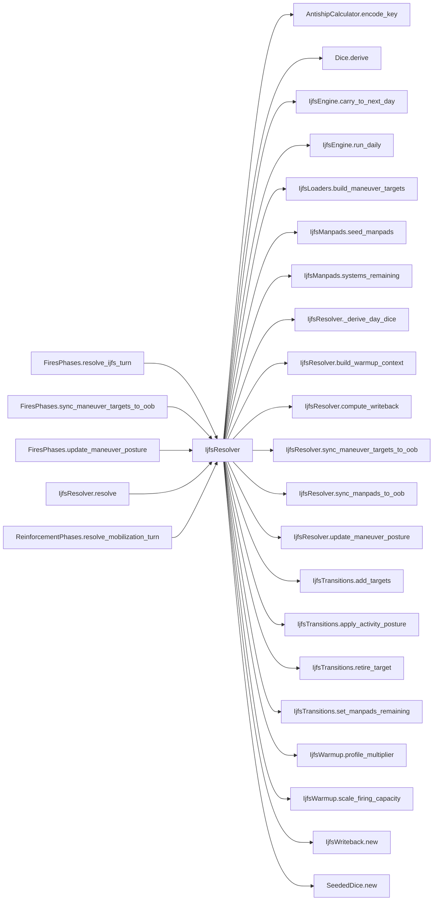

# IjfsResolver

> **Reading aid, not an execution contract.** No detected edge is not permission to reorder.
> GDScript reads and writes are conservative source analysis; transition writes are also
> checked against the mutation manifest. Potential conflicts may refer to different object
> instances or conditional branches.

Generator format v1; scan scope `scripts/**/*.gd` plus `project.godot` autoload aliases.
Generated from commit `7bbf08693b44`; input SHA-256 `c879af92cf7693c7df1119a11083764377c92a9410144e7b95f361f509613378`;
tool/manifest/fixture SHA-256 `ea366ecafdb8f5cc7ecae22bb7554cd8802d1ed3433c5a903ecc07bbb7230f6c`; stable generation time `2026-08-02T17:09:31-04:00`.
Unresolved-analysis diagnostics on this page: **116**.

## Source summary

Pure resolver for the D4 IJFS (Red joint/air-missile fires) phase (refactor_audit item 10, Phase C): syncs maneuver targets to the live OOB, applies the activity-posture detectability bias, runs the multi-day prelanding warmup (first IJFS) or one plain daily cycle, and computes the writeback D3 + the ground-casualty linkage consume. Derives its per-day "ijfs:<turn>:<i>" substreams from the passed base dice (SeededDice.derive is a pure hash — the base combat stream is never consumed). Mutates the passed IjfsDailyState/Brigade Resources — the sanctioned pattern; no autoload/engine access. GameState's wrapper owns the lazy ijfs_state build, the _ijfs_day/last_* field writes, and the EventBus.ijfs_resolved emit. Number of IJFS daily cycles run on the FIRST IJFS of the game when the scenario config carries no prelanding.days (the pre-invasion air campaign). Fallback only.

Source: `scripts/interleaved/IjfsResolver.gd`

## Placement in resolution code

| Caller | Call-site instance |
|---|---|
| [`FiresPhases.resolve_ijfs_turn`](ordering_FiresPhases_resolve_ijfs_turn.md) | `IjfsResolver.resolve` at `21` |
| [`FiresPhases.sync_maneuver_targets_to_oob`](ordering_FiresPhases_sync_maneuver_targets_to_oob.md) | `IjfsResolver.sync_maneuver_targets_to_oob` at `70` |
| [`FiresPhases.update_maneuver_posture`](ordering_FiresPhases_update_maneuver_posture.md) | `IjfsResolver.update_maneuver_posture` at `66` |
| [`IjfsResolver.resolve`](IjfsResolver.md) | `IjfsResolver.sync_maneuver_targets_to_oob` at `22` |
| [`IjfsResolver.resolve`](IjfsResolver.md) | `IjfsResolver.sync_manpads_to_oob` at `29` |
| [`IjfsResolver.resolve`](IjfsResolver.md) | `IjfsResolver.update_maneuver_posture` at `31` |
| [`IjfsResolver.resolve`](IjfsResolver.md) | `IjfsResolver._derive_day_dice` at `54` |
| [`IjfsResolver.resolve`](IjfsResolver.md) | `IjfsResolver.build_warmup_context` at `57` |
| [`IjfsResolver.resolve`](IjfsResolver.md) | `IjfsResolver._derive_day_dice` at `63` |
| [`IjfsResolver.resolve`](IjfsResolver.md) | `IjfsResolver.compute_writeback` at `65` |
| [`ReinforcementPhases.resolve_mobilization_turn`](ordering_ReinforcementPhases_resolve_mobilization_turn.md) | `IjfsResolver.add_maneuver_targets` at `262` |

## Dependency diagram

## Model-field evidence

| Field | Read | Written |
|---|:---:|:---:|
| `Battalion.qty` | yes |  |
| `Battalion.type` | yes |  |
| `Brigade.composition` | yes |  |
| `Brigade.destroyed` | yes |  |
| `Brigade.fought_last_turn` | yes |  |
| `Brigade.id` | yes |  |
| `Brigade.moved_last_turn` | yes |  |
| `Brigade.to_number` | yes |  |
| `IjfsAirPackage.dedicated_size` | yes | yes |
| `IjfsAirPackage.initial_size` | yes | yes |
| `IjfsAirPackage.kind` | yes | yes |
| `IjfsAirPackage.members` | yes | yes |
| `IjfsAirPackage.munition_id` | yes | yes |
| `IjfsAirPackage.package_id` | yes | yes |
| `IjfsAirPackage.target_id` |  | yes |
| `IjfsAirPackage.to_number` | yes | yes |
| `IjfsDailyState.air_classes` | yes |  |
| `IjfsDailyState.contest_log` | yes | yes |
| `IjfsDailyState.detection_log` | yes | yes |
| `IjfsDailyState.engagement_log` | yes | yes |
| `IjfsDailyState.exquisite_intel_overrides` | yes | yes |
| `IjfsDailyState.free_shot_log` | yes | yes |
| `IjfsDailyState.manpads_intercept_log` | yes | yes |
| `IjfsDailyState.munitions` | yes |  |
| `IjfsDailyState.pairings` | yes |  |
| `IjfsDailyState.scenario` | yes |  |
| `IjfsDailyState.seed` | yes |  |
| `IjfsDailyState.source_files` | yes |  |
| `IjfsDailyState.squadron_force` | yes |  |
| `IjfsDailyState.strike_log` | yes | yes |
| `IjfsDailyState.taiwan_ad_health_after` | yes | yes |
| `IjfsDailyState.taiwan_ad_health_after_missile_phase` | yes | yes |
| `IjfsDailyState.taiwan_ad_health_after_sead` | yes | yes |
| `IjfsDailyState.taiwan_ad_health_before` | yes | yes |
| `IjfsDailyState.targets` | yes | yes |
| `IjfsDailyState.warnings` | yes |  |
| `IjfsMunition.category` | yes |  |
| `IjfsMunition.display_label` | yes |  |
| `IjfsMunition.inventory_remaining` | yes | yes |
| `IjfsMunition.manpads_vulnerability` | yes |  |
| `IjfsMunition.munition_id` | yes |  |
| `IjfsMunition.munition_name` | yes |  |
| `IjfsMunition.rounds_per_engagement_default` | yes |  |
| `IjfsPairing.munition_id` | yes |  |
| `IjfsPairing.pairing_id` | yes |  |
| `IjfsPairing.probability_destroyed` | yes |  |
| `IjfsPairing.probability_suppressed_if_not_destroyed` | yes |  |
| `IjfsPairing.rounds_expended_per_engagement` | yes |  |
| `IjfsPairing.source_target_ids` | yes |  |
| `IjfsPairing.target_category` | yes |  |
| `IjfsPairing.target_hardness` | yes |  |
| `IjfsPairing.target_mobility` | yes |  |
| `IjfsPairing.target_subcategory` | yes |  |
| `IjfsSquadron.aircraft_class` | yes |  |
| `IjfsSquadron.alive` | yes | yes |
| `IjfsSquadron.initial` | yes |  |
| `IjfsSquadron.losses_campaign` | yes | yes |
| `IjfsSquadron.losses_today` | yes | yes |
| `IjfsSquadron.role` | yes |  |
| `IjfsSquadron.rtb_today` | yes | yes |
| `IjfsSquadron.sead_assigned_today` | yes | yes |
| `IjfsSquadron.squadron_id` | yes |  |
| `IjfsStrikeContext.current_day` | yes | yes |
| `IjfsStrikeContext.doctrine_rule_name` | yes | yes |
| `IjfsStrikeContext.doctrine_selection` | yes | yes |
| `IjfsStrikeContext.phase` | yes | yes |
| `IjfsStrikeContext.survivor_fraction` | yes | yes |
| `IjfsStrikePhaseContext.ad_attrition_enabled` | yes | yes |
| `IjfsStrikePhaseContext.air_engagement_dice` | yes | yes |
| `IjfsStrikePhaseContext.attacked` | yes | yes |
| `IjfsStrikePhaseContext.attrition` | yes | yes |
| `IjfsStrikePhaseContext.capacity_budget` | yes | yes |
| `IjfsStrikePhaseContext.current_day` | yes | yes |
| `IjfsStrikePhaseContext.munition_filter` | yes | yes |
| `IjfsStrikePhaseContext.organic_budget` | yes | yes |
| `IjfsStrikePhaseContext.packages_launched` | yes | yes |
| `IjfsStrikePhaseContext.release_rules` | yes | yes |
| `IjfsStrikePhaseContext.skip_reasons` | yes | yes |
| `IjfsStrikePhaseContext.z_day` | yes | yes |
| `IjfsTarget.category` | yes | yes |
| `IjfsTarget.destroyed` | yes | yes |
| `IjfsTarget.detectability_active` | yes | yes |
| `IjfsTarget.detectability_hiding` | yes | yes |
| `IjfsTarget.detected_this_turn` | yes | yes |
| `IjfsTarget.hardness` | yes | yes |
| `IjfsTarget.instance_index` | yes | yes |
| `IjfsTarget.intel_locked` | yes | yes |
| `IjfsTarget.known_to_red` | yes | yes |
| `IjfsTarget.last_detected_day` | yes | yes |
| `IjfsTarget.manpads_remaining` | yes | yes |
| `IjfsTarget.metadata` | yes | yes |
| `IjfsTarget.metadata[systems_remaining]` |  | yes |
| `IjfsTarget.metadata[to_number]` | yes |  |
| `IjfsTarget.mobility` | yes | yes |
| `IjfsTarget.posture` | yes | yes |
| `IjfsTarget.quantity` | yes | yes |
| `IjfsTarget.sam_score` | yes |  |
| `IjfsTarget.sead_result` | yes | yes |
| `IjfsTarget.source_target_id` | yes | yes |
| `IjfsTarget.subcategory` | yes | yes |
| `IjfsTarget.suppressed` | yes | yes |
| `IjfsTarget.suppressed_this_turn` | yes | yes |
| `IjfsTarget.target_id` | yes | yes |
| `IjfsWriteback.antiship_destroyed_by_type` |  | yes |
| `IjfsWriteback.antiship_suppressed_by_type` |  | yes |
| `IjfsWriteback.maneuver_casualties` |  | yes |
| `IjfsWriteback.sam_destroyed` |  | yes |
| `IjfsWriteback.sam_suppressed` |  | yes |

## Method dependencies

| Method | Calls (transitive effects are included above) |
|---|---|
| `_derive_day_dice` | `Dice.derive`, `SeededDice.new` |
| `add_maneuver_targets` | `IjfsLoaders.build_maneuver_targets`, `IjfsTransitions.add_targets` |
| `build_warmup_context` | `IjfsWarmup.profile_multiplier`, `IjfsWarmup.scale_firing_capacity` |
| `compute_writeback` | `AntishipCalculator.encode_key`, `IjfsWriteback.new` |
| `resolve` | `IjfsEngine.carry_to_next_day`, `IjfsEngine.run_daily`, `IjfsManpads.seed_manpads`, `IjfsResolver._derive_day_dice`, `IjfsResolver.build_warmup_context`, `IjfsResolver.compute_writeback`, `IjfsResolver.sync_maneuver_targets_to_oob`, `IjfsResolver.sync_manpads_to_oob`, `IjfsResolver.update_maneuver_posture` |
| `sync_maneuver_targets_to_oob` | `IjfsTransitions.retire_target` |
| `sync_manpads_to_oob` | `IjfsManpads.systems_remaining`, `IjfsTransitions.set_manpads_remaining` |
| `update_maneuver_posture` | `IjfsTransitions.apply_activity_posture` |

## Analysis limits found here

Showing 30 of 116 diagnostics; class pages provide the narrower context.

| Kind | Source | Why it matters |
|---|---|---|
| `multi_call_statement` | `scripts/calc/IjfsAttritionProfile.gd:71` `return clampf(base_rate * role_exposure(role) * rcs_survival(aircraft_class), 0.0, 1.0)` | Multiple calls share one statement; the map preserves lexical sites, not nested evaluation order. |
| `untyped_iteration` | `scripts/calc/IjfsLedgers.gd:30` `for entry in state.detection_log:` | The collection element type could not be proven. |
| `untyped_iteration` | `scripts/calc/IjfsLedgers.gd:37` `for entry in state.strike_log:` | The collection element type could not be proven. |
| `untyped_iteration` | `scripts/calc/IjfsLedgers.gd:42` `for entry in state.engagement_log:` | The collection element type could not be proven. |
| `multi_call_statement` | `scripts/calc/IjfsLedgers.gd:50` `return { "target_counts_by_category_status": target_counts, "detections_by_mobility": detections_by_mobility, "detections_by_category": detections_by_category, "attacks": attack…` | Multiple calls share one statement; the map preserves lexical sites, not nested evaluation order. |
| `untyped_iteration` | `scripts/calc/IjfsLedgers.gd:106` `for entry in state.manpads_intercept_log:` | The collection element type could not be proven. |
| `multi_call_statement` | `scripts/calc/IjfsLedgers.gd:111` `return { "ready_systems_by_to": IjfsManpads.ready_systems_by_to(state.targets), "attempts": state.manpads_intercept_log.size(), "kills": kills, "aborts": aborts, "unaffected": i…` | Multiple calls share one statement; the map preserves lexical sites, not nested evaluation order. |
| `callable_or_lambda` | `scripts/calc/IjfsLedgers.gd:126` `sorted_targets.sort_custom(func(a: IjfsTarget, b: IjfsTarget) -> bool: return a.target_id < b.target_id)` | Callable/lambda dataflow is outside this analyser. |
| `unresolved_receiver` | `scripts/calc/IjfsLedgers.gd:126` `sorted_targets.sort_custom(func(a: IjfsTarget, b: IjfsTarget) -> bool: return a.target_id < b.target_id)` | A protected field name appeared on an unresolved receiver. |
| `multi_call_statement` | `scripts/calc/IjfsLedgers.gd:131` `return { "metadata": { "current_day": current_day, "seed": state.seed, "source_files": state.source_files.duplicate(), "created_by": "ijfs_standalone", }, "detection_log": state…` | Multiple calls share one statement; the map preserves lexical sites, not nested evaluation order. |
| `untyped_alias` | `scripts/calc/IjfsStrikePhase.gd:43` `var pairing: Variant = selection["selected"]` | The receiver type could not be proven. |
| `untyped_alias` | `scripts/calc/IjfsStrikePhase.gd:47` `var reason: Variant = selection["reason"]` | The receiver type could not be proven. |
| `unresolved_receiver` | `scripts/calc/IjfsStrikePhase.gd:50` `var munition: Variant = state.munitions.get(pairing.munition_id, null)` | A protected field name appeared on an unresolved receiver. |
| `untyped_alias` | `scripts/calc/IjfsStrikePhase.gd:50` `var munition: Variant = state.munitions.get(pairing.munition_id, null)` | The receiver type could not be proven. |
| `unresolved_receiver` | `scripts/calc/IjfsStrikePhase.gd:51` `var is_organic: bool = munition != null and munition.category == "Organic"` | A protected field name appeared on an unresolved receiver. |
| `untyped_alias` | `scripts/calc/IjfsStrikePhase.gd:52` `var budget: Variant = ctx.organic_budget if is_organic else ctx.capacity_budget` | The receiver type could not be proven. |
| `unresolved_receiver` | `scripts/calc/IjfsStrikePhase.gd:53` `if budget != null and not budget.has_capacity(pairing.munition_id):` | A protected field name appeared on an unresolved receiver. |
| `unresolved_receiver` | `scripts/calc/IjfsStrikePhase.gd:63` `package = IjfsPackageIngress.assemble( state, pairing.munition_id, target, ctx.packages_launched, ctx.air_engagement_dice)` | A protected field name appeared on an unresolved receiver. |
| `unresolved_receiver` | `scripts/calc/IjfsStrikePhase.gd:69` `budget.try_consume(pairing.munition_id)` | A protected field name appeared on an unresolved receiver. |
| `untyped_alias` | `scripts/calc/IjfsStrikePhase.gd:107` `var row := target.to_dict()` | The receiver type could not be proven. |
| `untyped_alias` | `scripts/interleaved/IjfsDetection.gd:12` `var override: Variant = source.get("runtime_capability_override", null)` | The receiver type could not be proven. |
| `untyped_alias` | `scripts/interleaved/IjfsDetection.gd:118` `var components := { "detectability_label": label, "satellite_floor": float(satellite_by_mobility.get(posture, 0.0)), "base_probability": float(detectability_label_base_probabili…` | The receiver type could not be proven. |
| `untyped_alias` | `scripts/interleaved/IjfsDetection.gd:147` `var method := "intel_locked" if target.intel_locked and target.mobility != "static" else "static_known"` | The receiver type could not be proven. |
| `untyped_alias` | `scripts/interleaved/IjfsDetection.gd:191` `var entry := { "phase": phase, "target_id": target.target_id, "source_target_id": target.source_target_id, "category": target.category, "subcategory": target.subcategory, "mobil…` | The receiver type could not be proven. |
| `callable_or_lambda` | `scripts/interleaved/IjfsDetection.gd:219` `sorted.sort_custom(func(a: IjfsTarget, b: IjfsTarget) -> bool: return a.target_id < b.target_id)` | Callable/lambda dataflow is outside this analyser. |
| `unresolved_receiver` | `scripts/interleaved/IjfsDetection.gd:219` `sorted.sort_custom(func(a: IjfsTarget, b: IjfsTarget) -> bool: return a.target_id < b.target_id)` | A protected field name appeared on an unresolved receiver. |
| `untyped_alias` | `scripts/interleaved/IjfsDetection.gd:228` `var from_object: Variant = force.get("squadrons")` | The receiver type could not be proven. |
| `untyped_alias` | `scripts/interleaved/IjfsEngagement.gd:84` `var factor := float(state.scenario.get(IjfsLoaders.SAM_RETURN_FIRE_KNOB, 0.0))` | The receiver type could not be proven. |
| `untyped_alias` | `scripts/interleaved/IjfsEngagement.gd:100` `var members_before := package.size()` | The receiver type could not be proven. |
| `untyped_alias` | `scripts/interleaved/IjfsEngagement.gd:106` `var score := maxi(1, target.sam_score)` | The receiver type could not be proven. |
| _…_ | _86 additional diagnostics omitted from this page_ | See the called class pages. |
