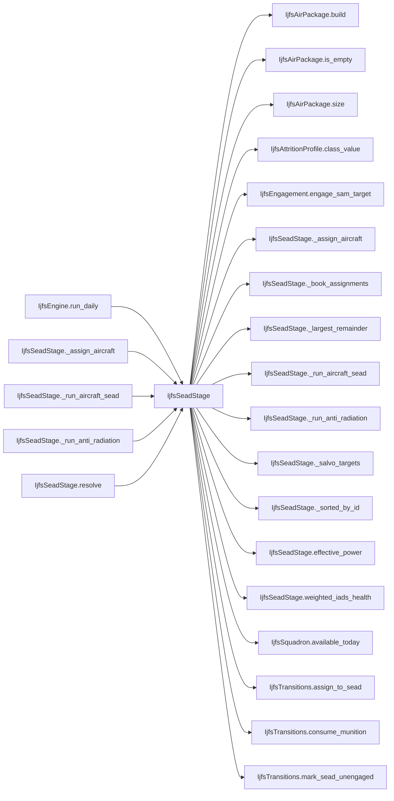

# IjfsSeadStage

> **Reading aid, not an execution contract.** No detected edge is not permission to reorder.
> GDScript reads and writes are conservative source analysis; transition writes are also
> checked against the mutation manifest. Potential conflicts may refer to different object
> instances or conditional branches.

Generator format v1; scan scope `scripts/**/*.gd` plus `project.godot` autoload aliases.
Generated from commit `8829181ae4b6`; input SHA-256 `1c5ff5483615f0cca5b2767540c56e9a13e1387c4c1a3c66db909a97ad2e94fb`;
tool/manifest/fixture SHA-256 `ea366ecafdb8f5cc7ecae22bb7554cd8802d1ed3433c5a903ecc07bbb7230f6c`; stable generation time `2026-08-02T09:03:12-04:00`.
Unresolved-analysis diagnostics on this page: **18**.

## Source summary

Red's daily SEAD effort, in the three stages plan 0060 R11 ruled (USER, 2026-08-01). It replaced a single aggregate sweep in which the WHOLE air force's summed `sead_eff` engaged every SAM, which made SEAD strength a free-floating property of the OOB rather than of anything Red decided to do.  **A — expendable anti-radiation.** Up to `salvos_per_day` four-missile salvos, against the highest-scoring ACTIVE emitters. This stage may home on an emitter whether or not Red detected it: the target signal IS the emission, so detection gating belongs to the aircraft stage and not to this weapon. Missiles are spent whether the salvo kills, suppresses or misses.  **B — weighted IADS health.** `remaining_unsuppressed_sam_score / initial_sam_score` over every SAM instance. Weighted by SCORE, not by instance count: nine Patriots and fifty Antelopes are not the same network, and a raw headcount would say they were.  **C — aircraft assignment with real effect.** Red commits `ceil(fraction x alive_strike_airframes x weighted_health)` HEADS. Alive J-16Ds fill the dedicated places first; ordinary strike aircraft make up the rest and each contributes a fraction of a J-16D's SEAD value. Those airframes leave the Organic strike pool for the day — which is what makes SEAD cost something — but stay exposed to return fire, because being assigned is exactly what puts them in the envelope.  `scripts/interleaved/`, not `calc/`: it applies at its own draw point, and the whole design depends on that. Stage A's outcomes decide which emitters Stage C even looks at, and Stage C's assignments decide which airframes the strike phase can still use — deferring either application would change how many dice the rest of the day consumes.

Source: `scripts/interleaved/IjfsSeadStage.gd`

## Placement in resolution code

| Caller | Call-site instance |
|---|---|
| [`IjfsEngine.run_daily`](ordering_IjfsEngine_run_daily.md) | `IjfsSeadStage.resolve` at `148` |
| [`IjfsSeadStage._assign_aircraft`](IjfsSeadStage.md) | `IjfsSeadStage._largest_remainder` at `146` |
| [`IjfsSeadStage._assign_aircraft`](IjfsSeadStage.md) | `IjfsSeadStage._book_assignments` at `152` |
| [`IjfsSeadStage._run_aircraft_sead`](IjfsSeadStage.md) | `IjfsSeadStage.effective_power` at `238` |
| [`IjfsSeadStage._run_aircraft_sead`](IjfsSeadStage.md) | `IjfsSeadStage._sorted_by_id` at `245` |
| [`IjfsSeadStage._run_anti_radiation`](IjfsSeadStage.md) | `IjfsSeadStage._salvo_targets` at `74` |
| [`IjfsSeadStage.resolve`](IjfsSeadStage.md) | `IjfsSeadStage._run_anti_radiation` at `46` |
| [`IjfsSeadStage.resolve`](IjfsSeadStage.md) | `IjfsSeadStage.weighted_iads_health` at `47` |
| [`IjfsSeadStage.resolve`](IjfsSeadStage.md) | `IjfsSeadStage._assign_aircraft` at `48` |
| [`IjfsSeadStage.resolve`](IjfsSeadStage.md) | `IjfsSeadStage._run_aircraft_sead` at `49` |

## Dependency diagram

## Model-field evidence

| Field | Read | Written |
|---|:---:|:---:|
| `IjfsAirPackage.dedicated_size` | yes | yes |
| `IjfsAirPackage.initial_size` |  | yes |
| `IjfsAirPackage.kind` |  | yes |
| `IjfsAirPackage.members` | yes | yes |
| `IjfsAirPackage.package_id` |  | yes |
| `IjfsDailyState.scenario` | yes |  |
| `IjfsDailyState.squadron_force` | yes |  |
| `IjfsDailyState.targets` | yes |  |
| `IjfsMunition.inventory_remaining` | yes | yes |
| `IjfsMunition.munition_id` | yes |  |
| `IjfsSquadron.aircraft_class` | yes |  |
| `IjfsSquadron.alive` | yes |  |
| `IjfsSquadron.role` | yes |  |
| `IjfsSquadron.rtb_today` | yes |  |
| `IjfsSquadron.sead_assigned_today` | yes | yes |
| `IjfsSquadron.squadron_id` | yes |  |
| `IjfsStrikePhaseContext.air_engagement_dice` | yes |  |
| `IjfsStrikePhaseContext.attrition` | yes |  |
| `IjfsTarget.category` | yes |  |
| `IjfsTarget.destroyed` | yes | yes |
| `IjfsTarget.detected_this_turn` | yes | yes |
| `IjfsTarget.known_to_red` |  | yes |
| `IjfsTarget.sam_score` | yes |  |
| `IjfsTarget.sead_result` | yes | yes |
| `IjfsTarget.subcategory` | yes |  |
| `IjfsTarget.suppressed` | yes | yes |
| `IjfsTarget.suppressed_this_turn` |  | yes |
| `IjfsTarget.target_id` | yes |  |

## Method dependencies

| Method | Calls (transitive effects are included above) |
|---|---|
| `_assign_aircraft` | `IjfsAirPackage.build`, `IjfsSeadStage._book_assignments`, `IjfsSeadStage._largest_remainder`, `IjfsSquadron.available_today` |
| `_book_assignments` | `IjfsTransitions.assign_to_sead` |
| `_largest_remainder` | `IjfsSquadron.available_today` |
| `_run_aircraft_sead` | `IjfsEngagement.engage_sam_target`, `IjfsSeadStage._sorted_by_id`, `IjfsSeadStage.effective_power` |
| `_run_anti_radiation` | `IjfsEngagement.engage_sam_target`, `IjfsSeadStage._salvo_targets`, `IjfsTransitions.consume_munition` |
| `_salvo_targets` | — |
| `_sorted_by_id` | — |
| `effective_power` | `IjfsAirPackage.is_empty`, `IjfsAirPackage.size`, `IjfsAttritionProfile.class_value` |
| `resolve` | `IjfsAirPackage.build`, `IjfsSeadStage._assign_aircraft`, `IjfsSeadStage._run_aircraft_sead`, `IjfsSeadStage._run_anti_radiation`, `IjfsSeadStage.weighted_iads_health`, `IjfsTransitions.mark_sead_unengaged` |
| `weighted_iads_health` | — |

## Analysis limits found here

Showing 18 of 18 diagnostics; class pages provide the narrower context.

| Kind | Source | Why it matters |
|---|---|---|
| `nested_index_unanalysed` | `scripts/interleaved/IjfsSeadStage.gd:67` `var munition: IjfsMunition = state.munitions[String(config["munition_id"])]` | Nested collection indexes exceed the balanced-chain subset; this statement contributes no field effects. |
| `callable_or_lambda` | `scripts/interleaved/IjfsSeadStage.gd:91` `candidates.sort_custom(func(a: IjfsTarget, b: IjfsTarget) -> bool: if a.sam_score != b.sam_score: return a.sam_score > b.sam_score return a.target_id < b.target_id)` | Callable/lambda dataflow is outside this analyser. |
| `unresolved_receiver` | `scripts/interleaved/IjfsSeadStage.gd:91` `candidates.sort_custom(func(a: IjfsTarget, b: IjfsTarget) -> bool: if a.sam_score != b.sam_score: return a.sam_score > b.sam_score return a.target_id < b.target_id)` | A protected field name appeared on an unresolved receiver. |
| `untyped_alias` | `scripts/interleaved/IjfsSeadStage.gd:110` `var score := maxi(0, target.sam_score)` | The receiver type could not be proven. |
| `untyped_alias` | `scripts/interleaved/IjfsSeadStage.gd:142` `var take := mini(squadron.available_today(), requirement - members.size())` | The receiver type could not be proven. |
| `untyped_alias` | `scripts/interleaved/IjfsSeadStage.gd:145` `var dedicated_heads := members.size()` | The receiver type could not be proven. |
| `untyped_alias` | `scripts/interleaved/IjfsSeadStage.gd:173` `var ordered := squadrons.duplicate()` | The receiver type could not be proven. |
| `callable_or_lambda` | `scripts/interleaved/IjfsSeadStage.gd:174` `ordered.sort_custom(func(a: IjfsSquadron, b: IjfsSquadron) -> bool: return a.squadron_id < b.squadron_id)` | Callable/lambda dataflow is outside this analyser. |
| `unresolved_receiver` | `scripts/interleaved/IjfsSeadStage.gd:174` `ordered.sort_custom(func(a: IjfsSquadron, b: IjfsSquadron) -> bool: return a.squadron_id < b.squadron_id)` | A protected field name appeared on an unresolved receiver. |
| `untyped_alias` | `scripts/interleaved/IjfsSeadStage.gd:183` `var exact := float(wanted) * float(squadron.available_today()) / float(pool)` | The receiver type could not be proven. |
| `untyped_alias` | `scripts/interleaved/IjfsSeadStage.gd:184` `var whole := mini(int(floor(exact)), squadron.available_today())` | The receiver type could not be proven. |
| `callable_or_lambda` | `scripts/interleaved/IjfsSeadStage.gd:189` `shares.sort_custom(func(a: Array, b: Array) -> bool: if not is_equal_approx(float(a[2]), float(b[2])): return float(a[2]) > float(b[2]) return (a[0] as IjfsSquadron).squadron_id…` | Callable/lambda dataflow is outside this analyser. |
| `untyped_alias` | `scripts/interleaved/IjfsSeadStage.gd:217` `var ordinary_eff := float(state.scenario.get(IjfsLoaders.SEAD_ASSIGNMENT_BLOCK, {}).get("ordinary_aircraft_sead_eff", 0.0))` | The receiver type could not be proven. |
| `untyped_iteration` | `scripts/interleaved/IjfsSeadStage.gd:221` `for index in range(package.size()):` | The collection element type could not be proven. |
| `untyped_alias` | `scripts/interleaved/IjfsSeadStage.gd:226` `var count := float(package.size())` | The receiver type could not be proven. |
| `untyped_alias` | `scripts/interleaved/IjfsSeadStage.gd:244` `var undetected_scalar := float(state.scenario.get(IjfsLoaders.SEAD_ASSIGNMENT_BLOCK, {}).get("sead_undetected_engagement", 1.0))` | The receiver type could not be proven. |
| `callable_or_lambda` | `scripts/interleaved/IjfsSeadStage.gd:257` `sorted.sort_custom(func(a: IjfsTarget, b: IjfsTarget) -> bool: return a.target_id < b.target_id)` | Callable/lambda dataflow is outside this analyser. |
| `unresolved_receiver` | `scripts/interleaved/IjfsSeadStage.gd:257` `sorted.sort_custom(func(a: IjfsTarget, b: IjfsTarget) -> bool: return a.target_id < b.target_id)` | A protected field name appeared on an unresolved receiver. |
