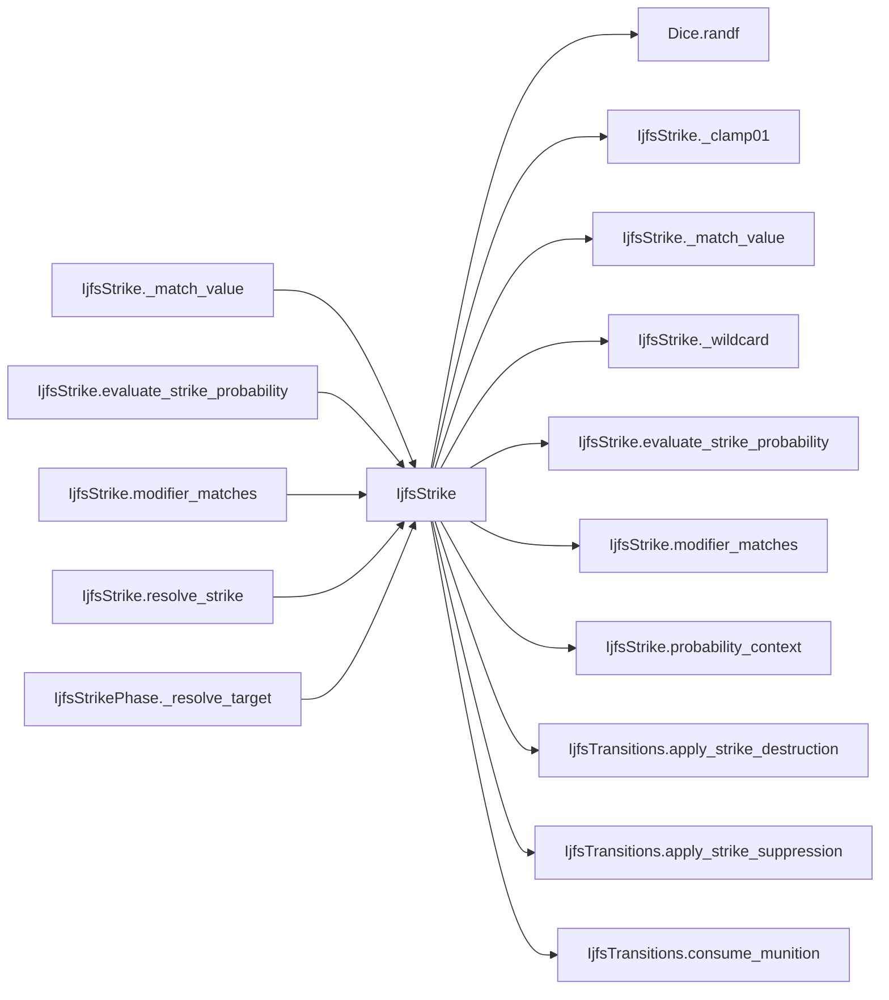

# IjfsStrike

> **Reading aid, not an execution contract.** No detected edge is not permission to reorder.
> GDScript reads and writes are conservative source analysis; transition writes are also
> checked against the mutation manifest. Potential conflicts may refer to different object
> instances or conditional branches.

Generator format v1; scan scope `scripts/**/*.gd` plus `project.godot` autoload aliases.
Generated from commit `7bbf08693b44`; input SHA-256 `c879af92cf7693c7df1119a11083764377c92a9410144e7b95f361f509613378`;
tool/manifest/fixture SHA-256 `ea366ecafdb8f5cc7ecae22bb7554cd8802d1ed3433c5a903ecc07bbb7230f6c`; stable generation time `2026-08-02T17:09:31-04:00`.
Unresolved-analysis diagnostics on this page: **5**.

## Source summary

No source summary was found; see the access tables below.

Source: `scripts/interleaved/IjfsStrike.gd`

## Placement in resolution code

| Caller | Call-site instance |
|---|---|
| [`IjfsStrike._match_value`](IjfsStrike.md) | `IjfsStrike._match_value` at `187` |
| [`IjfsStrike._match_value`](IjfsStrike.md) | `IjfsStrike._wildcard` at `190` |
| [`IjfsStrike.evaluate_strike_probability`](IjfsStrike.md) | `IjfsStrike._clamp01` at `54` |
| [`IjfsStrike.evaluate_strike_probability`](IjfsStrike.md) | `IjfsStrike._clamp01` at `54` |
| [`IjfsStrike.evaluate_strike_probability`](IjfsStrike.md) | `IjfsStrike.probability_context` at `63` |
| [`IjfsStrike.evaluate_strike_probability`](IjfsStrike.md) | `IjfsStrike.modifier_matches` at `69` |
| [`IjfsStrike.evaluate_strike_probability`](IjfsStrike.md) | `IjfsStrike._clamp01` at `86` |
| [`IjfsStrike.evaluate_strike_probability`](IjfsStrike.md) | `IjfsStrike._clamp01` at `87` |
| [`IjfsStrike.modifier_matches`](IjfsStrike.md) | `IjfsStrike._match_value` at `28` |
| [`IjfsStrike.resolve_strike`](IjfsStrike.md) | `IjfsStrike.evaluate_strike_probability` at `126` |
| [`IjfsStrike.resolve_strike`](IjfsStrike.md) | `IjfsStrike._clamp01` at `130` |
| [`IjfsStrike.resolve_strike`](IjfsStrike.md) | `IjfsStrike._clamp01` at `133` |
| [`IjfsStrikePhase._resolve_target`](IjfsStrikePhase.md) | `IjfsStrike.resolve_strike` at `80` |

## Dependency diagram

## Model-field evidence

| Field | Read | Written |
|---|:---:|:---:|
| `IjfsMunition.category` | yes |  |
| `IjfsMunition.inventory_remaining` | yes | yes |
| `IjfsMunition.munition_id` | yes |  |
| `IjfsPairing.munition_id` | yes |  |
| `IjfsPairing.pairing_id` | yes |  |
| `IjfsPairing.probability_destroyed` | yes |  |
| `IjfsPairing.probability_suppressed_if_not_destroyed` | yes |  |
| `IjfsPairing.rounds_expended_per_engagement` | yes |  |
| `IjfsStrikeContext.current_day` | yes |  |
| `IjfsStrikeContext.doctrine_rule_name` | yes |  |
| `IjfsStrikeContext.doctrine_selection` | yes |  |
| `IjfsStrikeContext.phase` | yes |  |
| `IjfsStrikeContext.survivor_fraction` | yes |  |
| `IjfsTarget.category` | yes |  |
| `IjfsTarget.destroyed` |  | yes |
| `IjfsTarget.hardness` | yes |  |
| `IjfsTarget.intel_locked` | yes |  |
| `IjfsTarget.known_to_red` |  | yes |
| `IjfsTarget.metadata` | yes |  |
| `IjfsTarget.mobility` | yes |  |
| `IjfsTarget.posture` | yes |  |
| `IjfsTarget.source_target_id` | yes |  |
| `IjfsTarget.subcategory` | yes |  |
| `IjfsTarget.suppressed` |  | yes |
| `IjfsTarget.suppressed_this_turn` |  | yes |
| `IjfsTarget.target_id` | yes |  |

## Method dependencies

| Method | Calls (transitive effects are included above) |
|---|---|
| `_clamp01` | — |
| `_match_value` | `IjfsStrike._match_value`, `IjfsStrike._wildcard` |
| `_wildcard` | — |
| `evaluate_strike_probability` | `IjfsStrike._clamp01`, `IjfsStrike.modifier_matches`, `IjfsStrike.probability_context` |
| `modifier_matches` | `IjfsStrike._match_value` |
| `probability_context` | — |
| `resolve_strike` | `Dice.randf`, `IjfsStrike._clamp01`, `IjfsStrike.evaluate_strike_probability`, `IjfsTransitions.apply_strike_destruction`, `IjfsTransitions.apply_strike_suppression`, `IjfsTransitions.consume_munition` |

## Analysis limits found here

Showing 5 of 5 diagnostics; class pages provide the narrower context.

| Kind | Source | Why it matters |
|---|---|---|
| `untyped_alias` | `scripts/interleaved/IjfsStrike.gd:21` `var match_value: Variant = modifier.get("match", {})` | The receiver type could not be proven. |
| `untyped_alias` | `scripts/interleaved/IjfsStrike.gd:50` `var base := float(pairing.probability_destroyed)` | The receiver type could not be proven. |
| `untyped_alias` | `scripts/interleaved/IjfsStrike.gd:51` `var modifiers_value: Variant = scenario.get("strike_probability_modifiers")` | The receiver type could not be proven. |
| `multi_call_statement` | `scripts/interleaved/IjfsStrike.gd:54` `return { "base": _clamp01(base), "final": _clamp01(base), "modifier_add_sum": 0.0, "modifier_mult_product": 1.0, "modifiers": [], "formula": "base_only", }` | Multiple calls share one statement; the map preserves lexical sites, not nested evaluation order. |
| `untyped_alias` | `scripts/interleaved/IjfsStrike.gd:109` `var rounds := int(pairing.rounds_expended_per_engagement)` | The receiver type could not be proven. |
