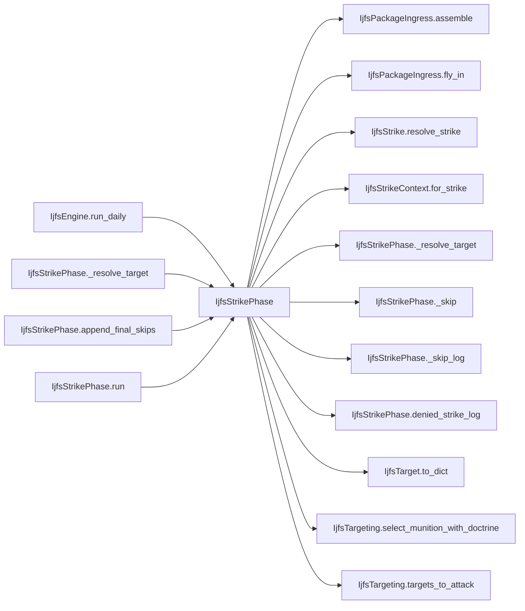

# IjfsStrikePhase

> **Reading aid, not an execution contract.** No detected edge is not permission to reorder.
> GDScript reads and writes are conservative source analysis; transition writes are also
> checked against the mutation manifest. Potential conflicts may refer to different object
> instances or conditional branches.

Generator format v1; scan scope `scripts/**/*.gd` plus `project.godot` autoload aliases.
Generated from commit `7bbf08693b44`; input SHA-256 `c879af92cf7693c7df1119a11083764377c92a9410144e7b95f361f509613378`;
tool/manifest/fixture SHA-256 `ea366ecafdb8f5cc7ecae22bb7554cd8802d1ed3433c5a903ecc07bbb7230f6c`; stable generation time `2026-08-02T17:09:31-04:00`.
Unresolved-analysis diagnostics on this page: **55**.

## Computed effect warning

The source summary claims this class is pure, but the generated call closure reaches
protected writes: `IjfsMunition.inventory_remaining`, `IjfsSquadron.alive`, `IjfsSquadron.losses_campaign`, `IjfsSquadron.losses_today`, `IjfsSquadron.rtb_today`, `IjfsSquadron.sead_assigned_today`, `IjfsTarget.destroyed`, `IjfsTarget.known_to_red`, `IjfsTarget.manpads_remaining`, `IjfsTarget.metadata[systems_remaining]`; _+2 more_. Treat the computed evidence and
visible uncertainty as the safer reading; the source claim needs a separate fix.

## Source summary

One IJFS strike pass — port of run_daily_ijfs._run_strike_phase / _append_final_skips / _skip_log. Runs TWICE per day (pre-AD, then post-AD) against the shared IjfsStrikePhaseContext, which is what lets the second pass see what the first already hit.  Extracted from IjfsEngine 2026-08-01 (plan 0060) alongside IjfsLedgers. The engine sat at its dependency ceiling of 14 while the plan adds three collaborators, so the ceiling is PAID by moving work out rather than raised. This half was the right one to move on its own merits too: the engine now reads as the ordering of a day's phases, and the mechanics of "select a munition, check the budget, roll the strike" live in one place with the target-by-target detail.  `scripts/calc/`, not `scripts/interleaved/`, and the distinction is exact: this file changes NO campaign state. It appends to the day's strike log and marks targets attacked in the phase context — per-run outputs the mutation manifest deliberately leaves unregistered — while every application it triggers happens one call deeper, inside IjfsManpads (the interception denial and the round it spends) or IjfsStrike (destruction and suppression), each of which does apply at its own draw point and lives in `interleaved/` for that reason. Resolve every eligible target for one pass. `phase` stays an explicit argument rather than a field on the day-scoped context: it differs between the two passes, and reading it out of a mutable bundle is how a pass silently runs under the wrong label.

Source: `scripts/calc/IjfsStrikePhase.gd`

## Placement in resolution code

| Caller | Call-site instance |
|---|---|
| [`IjfsEngine.run_daily`](ordering_IjfsEngine_run_daily.md) | `IjfsStrikePhase.run` at `137` |
| [`IjfsEngine.run_daily`](ordering_IjfsEngine_run_daily.md) | `IjfsStrikePhase.run` at `167` |
| [`IjfsEngine.run_daily`](ordering_IjfsEngine_run_daily.md) | `IjfsStrikePhase.append_final_skips` at `168` |
| [`IjfsStrikePhase._resolve_target`](IjfsStrikePhase.md) | `IjfsStrikePhase._skip` at `48` |
| [`IjfsStrikePhase._resolve_target`](IjfsStrikePhase.md) | `IjfsStrikePhase._skip` at `54` |
| [`IjfsStrikePhase._resolve_target`](IjfsStrikePhase.md) | `IjfsStrikePhase._skip` at `66` |
| [`IjfsStrikePhase._resolve_target`](IjfsStrikePhase.md) | `IjfsStrikePhase.denied_strike_log` at `76` |
| [`IjfsStrikePhase.append_final_skips`](IjfsStrikePhase.md) | `IjfsStrikePhase._skip_log` at `101` |
| [`IjfsStrikePhase.run`](IjfsStrikePhase.md) | `IjfsStrikePhase._resolve_target` at `29` |

## Dependency diagram

## Model-field evidence

| Field | Read | Written |
|---|:---:|:---:|
| `IjfsAirPackage.dedicated_size` | yes | yes |
| `IjfsAirPackage.initial_size` | yes | yes |
| `IjfsAirPackage.kind` | yes | yes |
| `IjfsAirPackage.members` | yes | yes |
| `IjfsAirPackage.munition_id` | yes | yes |
| `IjfsAirPackage.package_id` | yes | yes |
| `IjfsAirPackage.target_id` |  | yes |
| `IjfsAirPackage.to_number` | yes | yes |
| `IjfsDailyState.contest_log` | yes | yes |
| `IjfsDailyState.manpads_intercept_log` | yes | yes |
| `IjfsDailyState.munitions` | yes |  |
| `IjfsDailyState.pairings` | yes |  |
| `IjfsDailyState.scenario` | yes |  |
| `IjfsDailyState.squadron_force` | yes |  |
| `IjfsDailyState.strike_log` | yes | yes |
| `IjfsDailyState.targets` | yes |  |
| `IjfsMunition.category` | yes |  |
| `IjfsMunition.inventory_remaining` | yes | yes |
| `IjfsMunition.manpads_vulnerability` | yes |  |
| `IjfsMunition.munition_id` | yes |  |
| `IjfsPairing.munition_id` | yes |  |
| `IjfsPairing.pairing_id` | yes |  |
| `IjfsPairing.probability_destroyed` | yes |  |
| `IjfsPairing.probability_suppressed_if_not_destroyed` | yes |  |
| `IjfsPairing.rounds_expended_per_engagement` | yes |  |
| `IjfsPairing.source_target_ids` | yes |  |
| `IjfsPairing.target_category` | yes |  |
| `IjfsPairing.target_hardness` | yes |  |
| `IjfsPairing.target_mobility` | yes |  |
| `IjfsPairing.target_subcategory` | yes |  |
| `IjfsSquadron.aircraft_class` | yes |  |
| `IjfsSquadron.alive` | yes | yes |
| `IjfsSquadron.losses_campaign` | yes | yes |
| `IjfsSquadron.losses_today` | yes | yes |
| `IjfsSquadron.role` | yes |  |
| `IjfsSquadron.rtb_today` | yes | yes |
| `IjfsSquadron.sead_assigned_today` | yes | yes |
| `IjfsSquadron.squadron_id` | yes |  |
| `IjfsStrikeContext.current_day` | yes | yes |
| `IjfsStrikeContext.doctrine_rule_name` | yes | yes |
| `IjfsStrikeContext.doctrine_selection` | yes | yes |
| `IjfsStrikeContext.phase` | yes | yes |
| `IjfsStrikeContext.survivor_fraction` | yes | yes |
| `IjfsStrikePhaseContext.ad_attrition_enabled` | yes |  |
| `IjfsStrikePhaseContext.air_engagement_dice` | yes |  |
| `IjfsStrikePhaseContext.attacked` | yes | yes |
| `IjfsStrikePhaseContext.attrition` | yes |  |
| `IjfsStrikePhaseContext.capacity_budget` | yes |  |
| `IjfsStrikePhaseContext.current_day` | yes |  |
| `IjfsStrikePhaseContext.munition_filter` | yes |  |
| `IjfsStrikePhaseContext.organic_budget` | yes |  |
| `IjfsStrikePhaseContext.packages_launched` | yes | yes |
| `IjfsStrikePhaseContext.release_rules` | yes |  |
| `IjfsStrikePhaseContext.skip_reasons` | yes | yes |
| `IjfsStrikePhaseContext.z_day` | yes |  |
| `IjfsTarget.category` | yes |  |
| `IjfsTarget.destroyed` | yes | yes |
| `IjfsTarget.detectability_active` | yes |  |
| `IjfsTarget.detectability_hiding` | yes |  |
| `IjfsTarget.detected_this_turn` | yes |  |
| `IjfsTarget.hardness` | yes |  |
| `IjfsTarget.instance_index` | yes |  |
| `IjfsTarget.intel_locked` | yes |  |
| `IjfsTarget.known_to_red` | yes | yes |
| `IjfsTarget.last_detected_day` | yes |  |
| `IjfsTarget.manpads_remaining` | yes | yes |
| `IjfsTarget.metadata` | yes |  |
| `IjfsTarget.metadata[systems_remaining]` |  | yes |
| `IjfsTarget.metadata[to_number]` | yes |  |
| `IjfsTarget.mobility` | yes |  |
| `IjfsTarget.posture` | yes |  |
| `IjfsTarget.quantity` | yes |  |
| `IjfsTarget.sam_score` | yes |  |
| `IjfsTarget.sead_result` | yes |  |
| `IjfsTarget.source_target_id` | yes |  |
| `IjfsTarget.subcategory` | yes |  |
| `IjfsTarget.suppressed` | yes | yes |
| `IjfsTarget.suppressed_this_turn` | yes | yes |
| `IjfsTarget.target_id` | yes |  |

## Method dependencies

| Method | Calls (transitive effects are included above) |
|---|---|
| `_resolve_target` | `IjfsPackageIngress.assemble`, `IjfsPackageIngress.fly_in`, `IjfsStrike.resolve_strike`, `IjfsStrikeContext.for_strike`, `IjfsStrikePhase._skip`, `IjfsStrikePhase.denied_strike_log`, `IjfsTargeting.select_munition_with_doctrine` |
| `_skip` | — |
| `_skip_log` | `IjfsTarget.to_dict` |
| `append_final_skips` | `IjfsStrikePhase._skip_log`, `IjfsTargeting.targets_to_attack` |
| `denied_strike_log` | — |
| `run` | `IjfsStrikePhase._resolve_target`, `IjfsTargeting.targets_to_attack` |

## Analysis limits found here

Showing 30 of 55 diagnostics; class pages provide the narrower context.

| Kind | Source | Why it matters |
|---|---|---|
| `multi_call_statement` | `scripts/calc/IjfsAttritionProfile.gd:71` `return clampf(base_rate * role_exposure(role) * rcs_survival(aircraft_class), 0.0, 1.0)` | Multiple calls share one statement; the map preserves lexical sites, not nested evaluation order. |
| `source_effect_contradiction` | `scripts/calc/IjfsStrikePhase.gd:0` `source says 'changes NO campaign state' but analysis found IjfsMunition.inventory_remaining, IjfsSquadron.alive, IjfsSquadron.losses_campaign, IjfsSquadron.losses_today, IjfsSqu…` | Source prose claims purity while the resolved call closure reaches protected writes. |
| `untyped_alias` | `scripts/calc/IjfsStrikePhase.gd:43` `var pairing: Variant = selection["selected"]` | The receiver type could not be proven. |
| `untyped_alias` | `scripts/calc/IjfsStrikePhase.gd:47` `var reason: Variant = selection["reason"]` | The receiver type could not be proven. |
| `unresolved_receiver` | `scripts/calc/IjfsStrikePhase.gd:50` `var munition: Variant = state.munitions.get(pairing.munition_id, null)` | A protected field name appeared on an unresolved receiver. |
| `untyped_alias` | `scripts/calc/IjfsStrikePhase.gd:50` `var munition: Variant = state.munitions.get(pairing.munition_id, null)` | The receiver type could not be proven. |
| `unresolved_receiver` | `scripts/calc/IjfsStrikePhase.gd:51` `var is_organic: bool = munition != null and munition.category == "Organic"` | A protected field name appeared on an unresolved receiver. |
| `untyped_alias` | `scripts/calc/IjfsStrikePhase.gd:52` `var budget: Variant = ctx.organic_budget if is_organic else ctx.capacity_budget` | The receiver type could not be proven. |
| `unresolved_receiver` | `scripts/calc/IjfsStrikePhase.gd:53` `if budget != null and not budget.has_capacity(pairing.munition_id):` | A protected field name appeared on an unresolved receiver. |
| `unresolved_receiver` | `scripts/calc/IjfsStrikePhase.gd:63` `package = IjfsPackageIngress.assemble( state, pairing.munition_id, target, ctx.packages_launched, ctx.air_engagement_dice)` | A protected field name appeared on an unresolved receiver. |
| `unresolved_receiver` | `scripts/calc/IjfsStrikePhase.gd:69` `budget.try_consume(pairing.munition_id)` | A protected field name appeared on an unresolved receiver. |
| `untyped_alias` | `scripts/calc/IjfsStrikePhase.gd:107` `var row := target.to_dict()` | The receiver type could not be proven. |
| `untyped_alias` | `scripts/interleaved/IjfsEngagement.gd:84` `var factor := float(state.scenario.get(IjfsLoaders.SAM_RETURN_FIRE_KNOB, 0.0))` | The receiver type could not be proven. |
| `untyped_alias` | `scripts/interleaved/IjfsEngagement.gd:100` `var members_before := package.size()` | The receiver type could not be proven. |
| `untyped_alias` | `scripts/interleaved/IjfsEngagement.gd:106` `var score := maxi(1, target.sam_score)` | The receiver type could not be proven. |
| `multi_call_statement` | `scripts/interleaved/IjfsEngagement.gd:111` `var raw := factor * float(score) * profile.role_exposure(victim.role) * profile.rcs_survival(victim.aircraft_class)` | Multiple calls share one statement; the map preserves lexical sites, not nested evaluation order. |
| `untyped_alias` | `scripts/interleaved/IjfsEngagement.gd:115` `var p_loss := profile.p_loss(factor * float(score), victim.aircraft_class, victim.role)` | The receiver type could not be proven. |
| `multi_call_statement` | `scripts/interleaved/IjfsEngagement.gd:122` `IjfsTransitions.apply_package_member_loss( package.remove_member(candidate), package.kind == IjfsAirPackage.SEAD)` | Multiple calls share one statement; the map preserves lexical sites, not nested evaluation order. |
| `callable_or_lambda` | `scripts/interleaved/IjfsEngagement.gd:155` `engaging.sort_custom(func(a: IjfsTarget, b: IjfsTarget) -> bool: return a.target_id < b.target_id)` | Callable/lambda dataflow is outside this analyser. |
| `unresolved_receiver` | `scripts/interleaved/IjfsEngagement.gd:155` `engaging.sort_custom(func(a: IjfsTarget, b: IjfsTarget) -> bool: return a.target_id < b.target_id)` | A protected field name appeared on an unresolved receiver. |
| `untyped_alias` | `scripts/interleaved/IjfsManpads.gd:122` `var to_number := int(strike_target.metadata["to_number"])` | The receiver type could not be proven. |
| `untyped_alias` | `scripts/interleaved/IjfsManpads.gd:128` `var kill_factor := float(state.scenario.get(IjfsLoaders.MANPADS_KILL_FACTOR_KNOB, 0.0))` | The receiver type could not be proven. |
| `untyped_alias` | `scripts/interleaved/IjfsManpads.gd:129` `var members_before := package.size()` | The receiver type could not be proven. |
| `untyped_alias` | `scripts/interleaved/IjfsManpads.gd:138` `var p_kill := profile.p_loss( threat * kill_factor * munition.manpads_vulnerability, victim.aircraft_class, victim.role)` | The receiver type could not be proven. |
| `untyped_alias` | `scripts/interleaved/IjfsManpads.gd:140` `var p_abort := clampf(threat * ABORT_FACTOR * munition.manpads_vulnerability, 0.0, 1.0)` | The receiver type could not be proven. |
| `multi_call_statement` | `scripts/interleaved/IjfsManpads.gd:155` `IjfsTransitions.apply_package_member_loss(package.remove_member(candidate), false)` | Multiple calls share one statement; the map preserves lexical sites, not nested evaluation order. |
| `multi_call_statement` | `scripts/interleaved/IjfsManpads.gd:163` `return { "target_id": strike_target.target_id, "to_number": to_number, "munition_id": munition.munition_id, "package_id": package.package_id, "members_before": members_before, "…` | Multiple calls share one statement; the map preserves lexical sites, not nested evaluation order. |
| `callable_or_lambda` | `scripts/interleaved/IjfsManpads.gd:219` `bins.sort_custom(func(a: IjfsTarget, b: IjfsTarget) -> bool: return a.target_id < b.target_id)` | Callable/lambda dataflow is outside this analyser. |
| `unresolved_receiver` | `scripts/interleaved/IjfsManpads.gd:219` `bins.sort_custom(func(a: IjfsTarget, b: IjfsTarget) -> bool: return a.target_id < b.target_id)` | A protected field name appeared on an unresolved receiver. |
| `untyped_alias` | `scripts/interleaved/IjfsStrike.gd:21` `var match_value: Variant = modifier.get("match", {})` | The receiver type could not be proven. |
| _…_ | _25 additional diagnostics omitted from this page_ | See the called class pages. |
