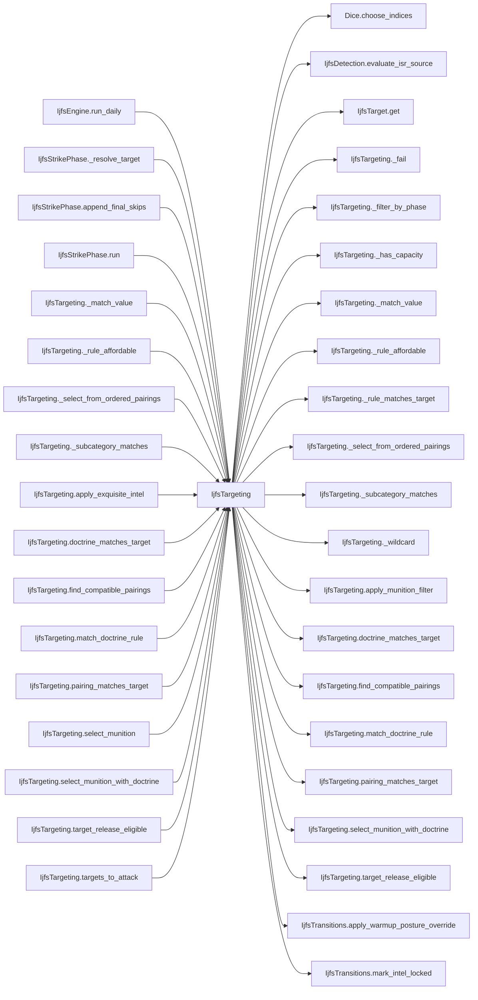

# IjfsTargeting

> **Reading aid, not an execution contract.** No detected edge is not permission to reorder.
> GDScript reads and writes are conservative source analysis; transition writes are also
> checked against the mutation manifest. Potential conflicts may refer to different object
> instances or conditional branches.

Generator format v1; scan scope `scripts/**/*.gd` plus `project.godot` autoload aliases.
Generated from commit `8829181ae4b6`; input SHA-256 `1c5ff5483615f0cca5b2767540c56e9a13e1387c4c1a3c66db909a97ad2e94fb`;
tool/manifest/fixture SHA-256 `ea366ecafdb8f5cc7ecae22bb7554cd8802d1ed3433c5a903ecc07bbb7230f6c`; stable generation time `2026-08-02T09:03:12-04:00`.
Unresolved-analysis diagnostics on this page: **26**.

## Source summary

No source summary was found; see the access tables below.

Source: `scripts/interleaved/IjfsTargeting.gd`

## Placement in resolution code

| Caller | Call-site instance |
|---|---|
| [`IjfsEngine.run_daily`](ordering_IjfsEngine_run_daily.md) | `IjfsTargeting.apply_posture_override` at `113` |
| [`IjfsEngine.run_daily`](ordering_IjfsEngine_run_daily.md) | `IjfsTargeting.apply_exquisite_intel` at `119` |
| [`IjfsStrikePhase._resolve_target`](IjfsStrikePhase.md) | `IjfsTargeting.select_munition_with_doctrine` at `40` |
| [`IjfsStrikePhase.append_final_skips`](IjfsStrikePhase.md) | `IjfsTargeting.targets_to_attack` at `97` |
| [`IjfsStrikePhase.run`](IjfsStrikePhase.md) | `IjfsTargeting.targets_to_attack` at `26` |
| [`IjfsTargeting._match_value`](IjfsTargeting.md) | `IjfsTargeting._wildcard` at `279` |
| [`IjfsTargeting._rule_affordable`](IjfsTargeting.md) | `IjfsTargeting._has_capacity` at `72` |
| [`IjfsTargeting._rule_affordable`](IjfsTargeting.md) | `IjfsTargeting._has_capacity` at `77` |
| [`IjfsTargeting._select_from_ordered_pairings`](IjfsTargeting.md) | `IjfsTargeting._rule_affordable` at `92` |
| [`IjfsTargeting._select_from_ordered_pairings`](IjfsTargeting.md) | `IjfsTargeting._has_capacity` at `95` |
| [`IjfsTargeting._select_from_ordered_pairings`](IjfsTargeting.md) | `IjfsTargeting._has_capacity` at `99` |
| [`IjfsTargeting._subcategory_matches`](IjfsTargeting.md) | `IjfsTargeting._wildcard` at `275` |
| [`IjfsTargeting.apply_exquisite_intel`](IjfsTargeting.md) | `IjfsTargeting._fail` at `239` |
| [`IjfsTargeting.doctrine_matches_target`](IjfsTargeting.md) | `IjfsTargeting._match_value` at `51` |
| [`IjfsTargeting.find_compatible_pairings`](IjfsTargeting.md) | `IjfsTargeting.pairing_matches_target` at `37` |
| [`IjfsTargeting.match_doctrine_rule`](IjfsTargeting.md) | `IjfsTargeting.doctrine_matches_target` at `62` |
| [`IjfsTargeting.pairing_matches_target`](IjfsTargeting.md) | `IjfsTargeting._subcategory_matches` at `25` |
| [`IjfsTargeting.pairing_matches_target`](IjfsTargeting.md) | `IjfsTargeting._wildcard` at `27` |
| [`IjfsTargeting.pairing_matches_target`](IjfsTargeting.md) | `IjfsTargeting._wildcard` at `29` |
| [`IjfsTargeting.select_munition`](IjfsTargeting.md) | `IjfsTargeting.select_munition_with_doctrine` at `163` |
| [`IjfsTargeting.select_munition_with_doctrine`](IjfsTargeting.md) | `IjfsTargeting._filter_by_phase` at `138` |
| [`IjfsTargeting.select_munition_with_doctrine`](IjfsTargeting.md) | `IjfsTargeting.find_compatible_pairings` at `138` |
| [`IjfsTargeting.select_munition_with_doctrine`](IjfsTargeting.md) | `IjfsTargeting.apply_munition_filter` at `140` |
| [`IjfsTargeting.select_munition_with_doctrine`](IjfsTargeting.md) | `IjfsTargeting.match_doctrine_rule` at `144` |
| [`IjfsTargeting.select_munition_with_doctrine`](IjfsTargeting.md) | `IjfsTargeting._select_from_ordered_pairings` at `152` |
| [`IjfsTargeting.select_munition_with_doctrine`](IjfsTargeting.md) | `IjfsTargeting._select_from_ordered_pairings` at `155` |
| [`IjfsTargeting.select_munition_with_doctrine`](IjfsTargeting.md) | `IjfsTargeting._select_from_ordered_pairings` at `158` |
| [`IjfsTargeting.target_release_eligible`](IjfsTargeting.md) | `IjfsTargeting._rule_matches_target` at `186` |
| [`IjfsTargeting.targets_to_attack`](IjfsTargeting.md) | `IjfsTargeting.target_release_eligible` at `13` |

## Dependency diagram

## Inner-class boundary

This outer script's budgets are implemented as inner classes. Godot reflects their
signatures but exposes no body AST, so their class-level effect table is intentionally
incomplete. Follow the linked Placement rows to inspect effects at each call site.

## Model-field evidence

| Field | Read | Written |
|---|:---:|:---:|
| `IjfsPairing.munition_id` | yes |  |
| `IjfsPairing.rounds_expended_per_engagement` | yes |  |
| `IjfsPairing.source_target_ids` | yes |  |
| `IjfsPairing.target_category` | yes |  |
| `IjfsPairing.target_hardness` | yes |  |
| `IjfsPairing.target_mobility` | yes |  |
| `IjfsPairing.target_subcategory` | yes |  |
| `IjfsTarget.category` | yes |  |
| `IjfsTarget.destroyed` | yes |  |
| `IjfsTarget.detected_this_turn` | yes |  |
| `IjfsTarget.hardness` | yes |  |
| `IjfsTarget.intel_locked` |  | yes |
| `IjfsTarget.metadata` | yes |  |
| `IjfsTarget.mobility` | yes |  |
| `IjfsTarget.posture` |  | yes |
| `IjfsTarget.source_target_id` | yes |  |
| `IjfsTarget.subcategory` | yes |  |
| `IjfsTarget.target_id` | yes |  |

## Method dependencies

| Method | Calls (transitive effects are included above) |
|---|---|
| `_fail` | — |
| `_filter_by_phase` | — |
| `_has_capacity` | — |
| `_match_value` | `IjfsTargeting._wildcard` |
| `_rule_affordable` | `IjfsTargeting._has_capacity` |
| `_rule_matches_target` | `IjfsTarget.get` |
| `_select_from_ordered_pairings` | `IjfsTargeting._has_capacity`, `IjfsTargeting._rule_affordable` |
| `_subcategory_matches` | `IjfsTargeting._wildcard` |
| `_wildcard` | — |
| `apply_exquisite_intel` | `Dice.choose_indices`, `IjfsDetection.evaluate_isr_source`, `IjfsTargeting._fail`, `IjfsTransitions.mark_intel_locked` |
| `apply_munition_filter` | — |
| `apply_posture_override` | `IjfsTransitions.apply_warmup_posture_override` |
| `doctrine_matches_target` | `IjfsTargeting._match_value` |
| `find_compatible_pairings` | `IjfsTargeting.pairing_matches_target` |
| `match_doctrine_rule` | `IjfsTargeting.doctrine_matches_target` |
| `pairing_matches_target` | `IjfsTargeting._subcategory_matches`, `IjfsTargeting._wildcard` |
| `select_munition` | `IjfsTargeting.select_munition_with_doctrine` |
| `select_munition_with_doctrine` | `IjfsTargeting._filter_by_phase`, `IjfsTargeting._select_from_ordered_pairings`, `IjfsTargeting.apply_munition_filter`, `IjfsTargeting.find_compatible_pairings`, `IjfsTargeting.match_doctrine_rule` |
| `target_release_eligible` | `IjfsTargeting._rule_matches_target` |
| `targets_to_attack` | `IjfsTargeting.target_release_eligible` |

## Analysis limits found here

Showing 26 of 26 diagnostics; class pages provide the narrower context.

| Kind | Source | Why it matters |
|---|---|---|
| `untyped_alias` | `scripts/interleaved/IjfsDetection.gd:12` `var override: Variant = source.get("runtime_capability_override", null)` | The receiver type could not be proven. |
| `inner_class_unanalysed` | `scripts/interleaved/IjfsTargeting.gd:0` `inner class IjfsPairingResource` | Godot reflected an inner class, but its indented method bodies are not analysed. |
| `inner_class_unanalysed` | `scripts/interleaved/IjfsTargeting.gd:0` `inner class IjfsTargetResource` | Godot reflected an inner class, but its indented method bodies are not analysed. |
| `callable_or_lambda` | `scripts/interleaved/IjfsTargeting.gd:16` `result.sort_custom(func(a: IjfsTarget, b: IjfsTarget) -> bool: return a.target_id < b.target_id)` | Callable/lambda dataflow is outside this analyser. |
| `unresolved_receiver` | `scripts/interleaved/IjfsTargeting.gd:16` `result.sort_custom(func(a: IjfsTarget, b: IjfsTarget) -> bool: return a.target_id < b.target_id)` | A protected field name appeared on an unresolved receiver. |
| `untyped_alias` | `scripts/interleaved/IjfsTargeting.gd:44` `var checks := { "category": target.category, "subcategory": target.subcategory, "mobility": target.mobility, "hardness": target.hardness, }` | The receiver type could not be proven. |
| `untyped_alias` | `scripts/interleaved/IjfsTargeting.gd:68` `var munition: Variant = inventory.get(rule.munition_id)` | The receiver type could not be proven. |
| `unresolved_receiver` | `scripts/interleaved/IjfsTargeting.gd:71` `if munition.category == "Organic":` | A protected field name appeared on an unresolved receiver. |
| `unresolved_receiver` | `scripts/interleaved/IjfsTargeting.gd:75` `if int(munition.inventory_remaining) < rule.rounds_expended_per_engagement:` | A protected field name appeared on an unresolved receiver. |
| `untyped_alias` | `scripts/interleaved/IjfsTargeting.gd:88` `var munition: Variant = inventory.get(rule.munition_id)` | The receiver type could not be proven. |
| `unresolved_receiver` | `scripts/interleaved/IjfsTargeting.gd:94` `if munition.category == "Organic":` | A protected field name appeared on an unresolved receiver. |
| `untyped_alias` | `scripts/interleaved/IjfsTargeting.gd:115` `var munition: Variant = inventory.get(rule.munition_id)` | The receiver type could not be proven. |
| `unresolved_receiver` | `scripts/interleaved/IjfsTargeting.gd:116` `var category := String(munition.category) if munition != null else ""` | A protected field name appeared on an unresolved receiver. |
| `untyped_alias` | `scripts/interleaved/IjfsTargeting.gd:116` `var category := String(munition.category) if munition != null else ""` | The receiver type could not be proven. |
| `multi_call_statement` | `scripts/interleaved/IjfsTargeting.gd:138` `var compatible := _filter_by_phase(find_compatible_pairings(target, pairings), inventory, phase)` | Multiple calls share one statement; the map preserves lexical sites, not nested evaluation order. |
| `untyped_alias` | `scripts/interleaved/IjfsTargeting.gd:145` `var doctrine_name: Variant = doctrine_rule.get("name") if doctrine_rule != null else null` | The receiver type could not be proven. |
| `untyped_alias` | `scripts/interleaved/IjfsTargeting.gd:169` `var rule_value: Variant = match[field]` | The receiver type could not be proven. |
| `untyped_alias` | `scripts/interleaved/IjfsTargeting.gd:170` `var target_value: Variant = target.get(String(field))` | The receiver type could not be proven. |
| `untyped_alias` | `scripts/interleaved/IjfsTargeting.gd:187` `var raw: Variant = rule.get("release_day")` | The receiver type could not be proven. |
| `untyped_alias` | `scripts/interleaved/IjfsTargeting.gd:198` `var mode: Variant = munition_filter.get("mode")` | The receiver type could not be proven. |
| `callable_or_lambda` | `scripts/interleaved/IjfsTargeting.gd:255` `candidates.sort_custom(func(a: IjfsTarget, b: IjfsTarget) -> bool: return a.target_id < b.target_id)` | Callable/lambda dataflow is outside this analyser. |
| `unresolved_receiver` | `scripts/interleaved/IjfsTargeting.gd:255` `candidates.sort_custom(func(a: IjfsTarget, b: IjfsTarget) -> bool: return a.target_id < b.target_id)` | A protected field name appeared on an unresolved receiver. |
| `untyped_iteration` | `scripts/interleaved/IjfsTargeting.gd:256` `for i in range(mini(count, candidates.size())):` | The collection element type could not be proven. |
| `untyped_alias` | `scripts/interleaved/IjfsTargeting.gd:259` `var k := mini(count, candidates.size())` | The receiver type could not be proven. |
| `untyped_alias` | `scripts/interleaved/IjfsTargeting.gd:260` `var indices := dice.choose_indices(candidates.size(), k)` | The receiver type could not be proven. |
| `dynamic_dispatch` | `scripts/interleaved/IjfsTargeting.gd:283` `return bool(budget.call("has_capacity", munition_id))` | A string/dynamic call has no statically known target. |
