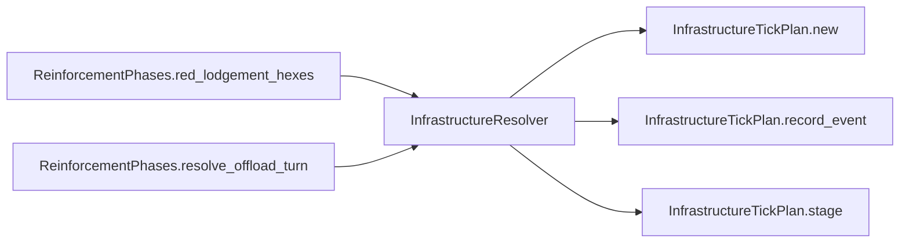

# InfrastructureResolver

> **Reading aid, not an execution contract.** No detected edge is not permission to reorder.
> GDScript reads and writes are conservative source analysis; transition writes are also
> checked against the mutation manifest. Potential conflicts may refer to different object
> instances or conditional branches.

Generator format v1; scan scope `scripts/**/*.gd` plus `project.godot` autoload aliases.
Generated from commit `7bbf08693b44`; input SHA-256 `c879af92cf7693c7df1119a11083764377c92a9410144e7b95f361f509613378`;
tool/manifest/fixture SHA-256 `ea366ecafdb8f5cc7ecae22bb7554cd8802d1ed3433c5a903ecc07bbb7230f6c`; stable generation time `2026-08-02T17:09:31-04:00`.
Unresolved-analysis diagnostics on this page: **3**.

## Source summary

Pure resolver for infrastructure seizure + JLSF repair clock. Source oracle: TIV infrastructure_manager.py (refresh_status_from_hex = seizure; progress_status = JLSF repair clock). Differences: in-memory state, repair requires hex still Red-held (pauses otherwise), status never regresses on recapture (contribution gated by ownership at read time in red_offload_nodes). No dice, no autoload access, and since plan 0047 no writes either: the tick is CALCULATED here and applied by InfrastructureTransitions, the aggregate's mutation authority. Decide what one turn of seizure + repair should do, writing nothing. owner_by_hex: hex_id -> owner string (HexOwner.* values, e.g. "red"). repair_turns_per_stage: ticks per repair stage (seized->degraded, degraded->operational); default 1 mirrors TIV (+1 turn per stage).  THE SEQUENTIAL-STAGING RULE. Each node's transitions are staged in LOCALS and the repair branch reads what the seizure branch just staged — exactly as the pre-0047 mutating `tick` read the status it had just written. That chain is production-reachable (see InfrastructureTickPlan's header), and a planner that evaluated both branches against the pre-tick snapshot would silently add a turn to it. Deferring application is safe DESPITE that only because nodes never read each other and no dice are involved — unlike the IJFS stages of plan 0046, where deferral would have changed which draws were consumed.  ONE DELIBERATE NON-EQUIVALENCE, on an unreachable path. `repair_turns_per_stage <= 0` used to arm a stage at 0 and decrement it to -1, writing a negative timer that `InfrastructureState.validate()` itself calls illegal. It is still STAGED that way here, but `InfrastructureTransitions.apply_node_plan` refuses the entry and leaves the node alone, so invalid state is no longer written. This is not a behaviour change in practice: the only production caller is `ReinforcementPhases.resolve_offload_turn`, which passes no argument at all and so takes the default of 1, and the value is not a scenario knob. Named here because the diff review round asked the question, and the answer should not have to be re-derived. (Verified independently by the tier-1 reviewer: a caller passing <= 0 is ABSENT.)

Source: `scripts/calc/InfrastructureResolver.gd`

## Placement in resolution code

| Caller | Call-site instance |
|---|---|
| [`ReinforcementPhases.red_lodgement_hexes`](ordering_ReinforcementPhases_red_lodgement_hexes.md) | `InfrastructureResolver.red_offload_nodes` at `370` |
| [`ReinforcementPhases.resolve_offload_turn`](ordering_ReinforcementPhases_resolve_offload_turn.md) | `InfrastructureResolver.plan_tick` at `150` |
| [`ReinforcementPhases.resolve_offload_turn`](ordering_ReinforcementPhases_resolve_offload_turn.md) | `InfrastructureResolver.red_offload_nodes` at `153` |

## Dependency diagram

## Model-field evidence

| Field | Read | Written |
|---|:---:|:---:|
| `InfrastructureDef.hex_id` | yes |  |
| `InfrastructureDef.kind` | yes |  |
| `InfrastructureDef.to_number` | yes |  |
| `InfrastructureNodeState.jlsf` | yes |  |
| `InfrastructureNodeState.node_status` | yes |  |
| `InfrastructureNodeState.repair_turns_remaining` | yes |  |
| `InfrastructureState.nodes` | yes |  |
| `InfrastructureTickPlan.events` | yes | yes |
| `InfrastructureTickPlan.node_states` |  | yes |

## Method dependencies

| Method | Calls (transitive effects are included above) |
|---|---|
| `plan_tick` | `InfrastructureTickPlan.new`, `InfrastructureTickPlan.record_event`, `InfrastructureTickPlan.stage` |
| `red_offload_nodes` | — |

## Analysis limits found here

Showing 3 of 3 diagnostics; class pages provide the narrower context.

| Kind | Source | Why it matters |
|---|---|---|
| `untyped_alias` | `scripts/calc/InfrastructureResolver.gd:38` `var def_val: Variant = infra_defs.get(id)` | The receiver type could not be proven. |
| `untyped_alias` | `scripts/calc/InfrastructureResolver.gd:44` `var is_red := String(owner_by_hex.get(def_data.hex_id, "")) == HexOwner.RED` | The receiver type could not be proven. |
| `untyped_alias` | `scripts/calc/InfrastructureResolver.gd:86` `var def_val: Variant = infra_defs.get(id)` | The receiver type could not be proven. |
