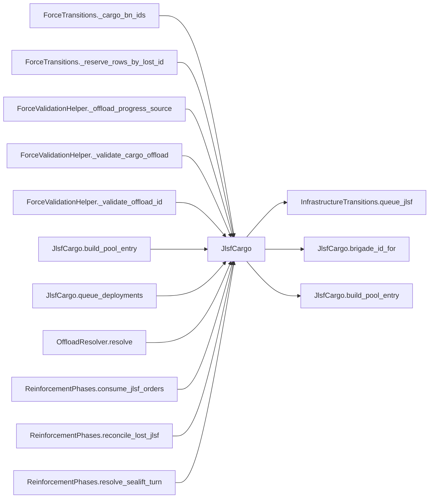

# JlsfCargo

> **Reading aid, not an execution contract.** No detected edge is not permission to reorder.
> GDScript reads and writes are conservative source analysis; transition writes are also
> checked against the mutation manifest. Potential conflicts may refer to different object
> instances or conditional branches.

Generator format v1; scan scope `scripts/**/*.gd` plus `project.godot` autoload aliases.
Generated from commit `7bbf08693b44`; input SHA-256 `c879af92cf7693c7df1119a11083764377c92a9410144e7b95f361f509613378`;
tool/manifest/fixture SHA-256 `ea366ecafdb8f5cc7ecae22bb7554cd8802d1ed3433c5a903ecc07bbb7230f6c`; stable generation time `2026-08-02T17:09:31-04:00`.
Unresolved-analysis diagnostics on this page: **2**.

## Source summary

Builds the pseudo mainland_pool entry for a JLSF deployment (plan 0006). The entry must satisfy the sealift/crossing plumbing contracts: a REAL locked_beach id (AntishipResolver derives crossing target beaches from it and push_errors on unknown ids), beach_hex = the target node's hex (where the detachment comes ashore), and unique BN ids (cohort binding + crossing attrition draw operate on BN id strings).

Source: `scripts/interleaved/JlsfCargo.gd`

## Placement in resolution code

| Caller | Call-site instance |
|---|---|
| `ForceTransitions._cargo_bn_ids` | `JlsfCargo.is_jlsf_entry` at `677` |
| `ForceTransitions._reserve_rows_by_lost_id` | `JlsfCargo.is_jlsf_entry` at `688` |
| [`ForceValidationHelper._offload_progress_source`](ForceValidationHelper.md) | `JlsfCargo.is_jlsf_entry` at `216` |
| [`ForceValidationHelper._validate_cargo_offload`](ForceValidationHelper.md) | `JlsfCargo.brigade_id_for` at `169` |
| [`ForceValidationHelper._validate_offload_id`](ForceValidationHelper.md) | `JlsfCargo.is_jlsf_entry` at `240` |
| [`JlsfCargo.build_pool_entry`](JlsfCargo.md) | `JlsfCargo.brigade_id_for` at `55` |
| [`JlsfCargo.queue_deployments`](JlsfCargo.md) | `JlsfCargo.build_pool_entry` at `105` |
| [`OffloadResolver.resolve`](OffloadResolver.md) | `JlsfCargo.is_jlsf_entry` at `60` |
| [`ReinforcementPhases.consume_jlsf_orders`](ordering_ReinforcementPhases_consume_jlsf_orders.md) | `JlsfCargo.queue_deployments` at `119` |
| [`ReinforcementPhases.reconcile_lost_jlsf`](ordering_ReinforcementPhases_reconcile_lost_jlsf.md) | `JlsfCargo.brigade_id_for` at `214` |
| [`ReinforcementPhases.resolve_sealift_turn`](ordering_ReinforcementPhases_resolve_sealift_turn.md) | `JlsfCargo.is_jlsf_entry` at `103` |

## Dependency diagram

## Model-field evidence

| Field | Read | Written |
|---|:---:|:---:|
| `InfrastructureDef.hex_id` | yes |  |
| `InfrastructureDef.id` | yes |  |
| `InfrastructureDef.to_number` | yes |  |
| `InfrastructureNodeState.jlsf` | yes | yes |
| `InfrastructureNodeState.node_status` | yes |  |
| `InfrastructureNodeState.repair_turns_remaining` | yes |  |
| `InfrastructureState.nodes` | yes |  |

## Method dependencies

| Method | Calls (transitive effects are included above) |
|---|---|
| `brigade_id_for` | — |
| `build_pool_entry` | `JlsfCargo.brigade_id_for` |
| `is_jlsf_entry` | — |
| `queue_deployments` | `InfrastructureTransitions.queue_jlsf`, `JlsfCargo.build_pool_entry` |

## Analysis limits found here

Showing 2 of 2 diagnostics; class pages provide the narrower context.

| Kind | Source | Why it matters |
|---|---|---|
| `untyped_alias` | `scripts/model/InfrastructureState.gd:43` `var node_val: Variant = nodes[id]` | The receiver type could not be proven. |
| `untyped_alias` | `scripts/transitions/InfrastructureTransitions.gd:144` `var node_value: Variant = state.nodes.get(port_id)` | The receiver type could not be proven. |
