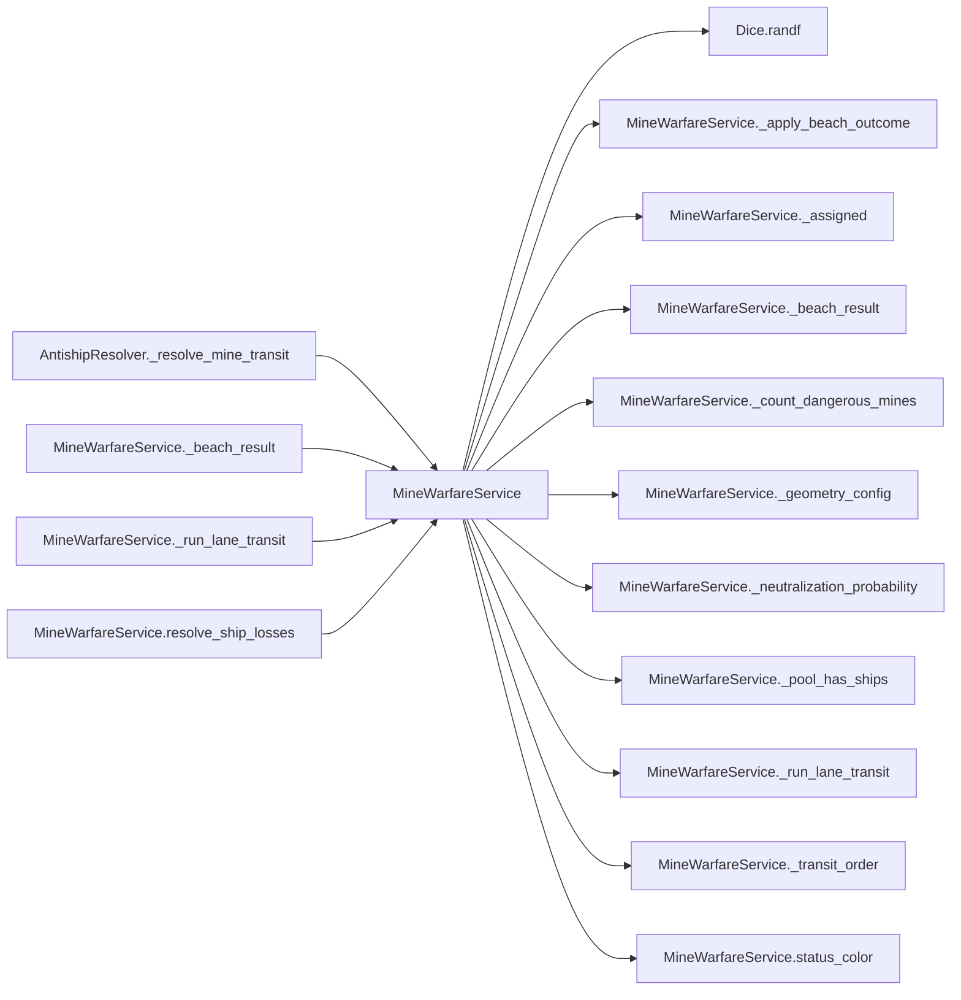

# MineWarfareService

> **Reading aid, not an execution contract.** No detected edge is not permission to reorder.
> GDScript reads and writes are conservative source analysis; transition writes are also
> checked against the mutation manifest. Potential conflicts may refer to different object
> instances or conditional branches.

Generator format v1; scan scope `scripts/**/*.gd` plus `project.godot` autoload aliases.
Generated from commit `8829181ae4b6`; input SHA-256 `1c5ff5483615f0cca5b2767540c56e9a13e1387c4c1a3c66db909a97ad2e94fb`;
tool/manifest/fixture SHA-256 `ea366ecafdb8f5cc7ecae22bb7554cd8802d1ed3433c5a903ecc07bbb7230f6c`; stable generation time `2026-08-02T09:03:12-04:00`.
Unresolved-analysis diagnostics on this page: **3**.

## Source summary

D3-C — mine warfare. GEOMETRIC danger model, port of TaiwanDefenseRefactor/mine_warfare.py (create_minefield / calculate_ship_path / count_dangerous_mines / process_mine_hits), adapted to HexCombat's per-turn count-based fleet.  The premise the user asked for: mines are pre-seeded across ALL candidate landing beaches, so a minefield only matters if the assault wave actually crosses that beach (some are never encountered). For an encountered field the goal is NOT to clear every mine but to push a LANE through it:  1. GEOMETRY (per beach, per turn until the lane is open). `num_mines` are scattered uniformly in a `length x width` field; the fleet takes a *randomized* straight approach path (random incident angle + entry point). Only mines within `danger_radius` (50 m) of that path line are DANGEROUS (typically a handful, not all `num_mines`). Each encounter re-rolls the layout + path via the injected Dice, so the dangerous count is "somewhat random". 2. PRE-LANDING CLEARING (knob). Assigned minesweepers clear the closest `assigned * prelanding_clear_per_sweeper` dangerous mines. The default is deliberately weak (~1-2): pre-landing sweeping mainly LOCATES the field, it does not open the lane. 3. TRANSIT. The surviving crossing fleet runs the lane in order — DECOYS first, then real ships by ascending value — each ship detonating the next dangerous mine. A decoy that survives a detonation continues down the lane and can trigger SUBSEQUENT mines (decoys are sponges). A ship that detonates a mine is neutralized with a probability set by its hardness (`neutralization_likelihood`). Amphibs (high-value carriers) are only at risk once dangerous mines remain after the decoys + sweepers have absorbed them. The first transit opens the lane (`lane_cleared`); later waves at that beach are safe.  Mutates the matched Minefield resources and the fleet_pool dict; returns a per-beach resolution list. Pure: geometry RNG + neutralization rolls go through the injected Dice (formula + draw order ported; NOT numpy's bitstream). Beaches are processed in ascending beach_id order so the shared fleet pool depletes deterministically and a hull never sinks at two beaches. Geometry defaults (overridable via config.geometry; see data/antiship/minefields.json).

Source: `scripts/calc/MineWarfareService.gd`

## Placement in resolution code

| Caller | Call-site instance |
|---|---|
| [`AntishipResolver._resolve_mine_transit`](AntishipResolver.md) | `MineWarfareService.resolve_ship_losses` at `243` |
| [`MineWarfareService._beach_result`](MineWarfareService.md) | `MineWarfareService.status_color` at `286` |
| [`MineWarfareService._run_lane_transit`](MineWarfareService.md) | `MineWarfareService._pool_has_ships` at `146` |
| [`MineWarfareService._run_lane_transit`](MineWarfareService.md) | `MineWarfareService._transit_order` at `147` |
| [`MineWarfareService._run_lane_transit`](MineWarfareService.md) | `MineWarfareService._neutralization_probability` at `156` |
| [`MineWarfareService.resolve_ship_losses`](MineWarfareService.md) | `MineWarfareService._geometry_config` at `65` |
| [`MineWarfareService.resolve_ship_losses`](MineWarfareService.md) | `MineWarfareService._beach_result` at `97` |
| [`MineWarfareService.resolve_ship_losses`](MineWarfareService.md) | `MineWarfareService._assigned` at `97` |
| [`MineWarfareService.resolve_ship_losses`](MineWarfareService.md) | `MineWarfareService._count_dangerous_mines` at `101` |
| [`MineWarfareService.resolve_ship_losses`](MineWarfareService.md) | `MineWarfareService._assigned` at `106` |
| [`MineWarfareService.resolve_ship_losses`](MineWarfareService.md) | `MineWarfareService._pool_has_ships` at `111` |
| [`MineWarfareService.resolve_ship_losses`](MineWarfareService.md) | `MineWarfareService._run_lane_transit` at `112` |
| [`MineWarfareService.resolve_ship_losses`](MineWarfareService.md) | `MineWarfareService._apply_beach_outcome` at `117` |
| [`MineWarfareService.resolve_ship_losses`](MineWarfareService.md) | `MineWarfareService._beach_result` at `119` |

## Dependency diagram

## Model-field evidence

| Field | Read | Written |
|---|:---:|:---:|
| `Minefield.beach_id` | yes |  |
| `Minefield.dangerous_mines` | yes | yes |
| `Minefield.lane_cleared` | yes | yes |
| `Minefield.minesweepers_assigned` | yes | yes |
| `Minefield.num_mines` | yes |  |
| `Minefield.remaining_mines` | yes | yes |
| `Minefield.ships_destroyed` | yes | yes |

## Method dependencies

| Method | Calls (transitive effects are included above) |
|---|---|
| `_apply_beach_outcome` | — |
| `_assigned` | — |
| `_beach_result` | `MineWarfareService.status_color` |
| `_count_dangerous_mines` | `Dice.randf` |
| `_geometry_config` | — |
| `_neutralization_probability` | — |
| `_pool_has_ships` | — |
| `_run_lane_transit` | `Dice.randf`, `MineWarfareService._neutralization_probability`, `MineWarfareService._pool_has_ships`, `MineWarfareService._transit_order` |
| `_transit_order` | — |
| `resolve_ship_losses` | `MineWarfareService._apply_beach_outcome`, `MineWarfareService._assigned`, `MineWarfareService._beach_result`, `MineWarfareService._count_dangerous_mines`, `MineWarfareService._geometry_config`, `MineWarfareService._pool_has_ships`, `MineWarfareService._run_lane_transit` |
| `status_color` | — |

## Analysis limits found here

Showing 3 of 3 diagnostics; class pages provide the narrower context.

| Kind | Source | Why it matters |
|---|---|---|
| `multi_call_statement` | `scripts/calc/MineWarfareService.gd:97` `resolutions.append(_beach_result(beach_id, minefield, {}, 0, 0, 0, 0, int(_assigned(assignments, beach_id, minefield))))` | Multiple calls share one statement; the map preserves lexical sites, not nested evaluation order. |
| `callable_or_lambda` | `scripts/calc/MineWarfareService.gd:250` `others.sort_custom(func(a, b): var va := float((ship_meta.get(a, {}) as Dictionary).get("value", 0.0)) var vb := float((ship_meta.get(b, {}) as Dictionary).get("value", 0.0)) if…` | Callable/lambda dataflow is outside this analyser. |
| `untyped_alias` | `scripts/calc/MineWarfareService.gd:269` `var raw: Variant = assignments.get(beach_id, assignments.get(str(beach_id), mf.minesweepers_assigned))` | The receiver type could not be proven. |
