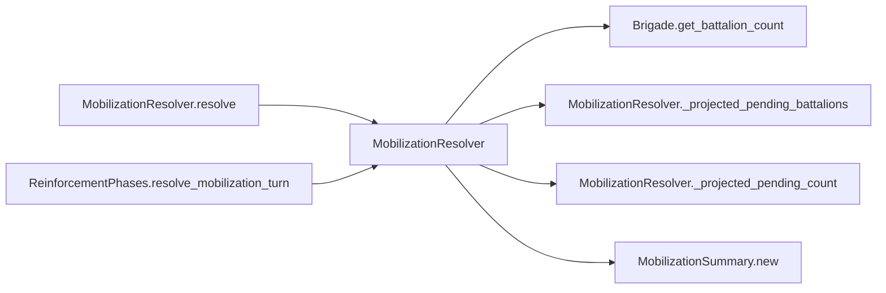

# MobilizationResolver

> **Reading aid, not an execution contract.** No detected edge is not permission to reorder.
> GDScript reads and writes are conservative source analysis; transition writes are also
> checked against the mutation manifest. Potential conflicts may refer to different object
> instances or conditional branches.

Generator format v1; scan scope `scripts/**/*.gd` plus `project.godot` autoload aliases.
Generated from commit `7bbf08693b44`; input SHA-256 `c879af92cf7693c7df1119a11083764377c92a9410144e7b95f361f509613378`;
tool/manifest/fixture SHA-256 `ea366ecafdb8f5cc7ecae22bb7554cd8802d1ed3433c5a903ecc07bbb7230f6c`; stable generation time `2026-08-02T17:09:31-04:00`.
Unresolved-analysis diagnostics on this page: **9**.

## Source summary

Pure calculator for the ROC mobilization phase (plan 0029 Tier A2): each turn, release the Green brigades whose mobilization is complete onto the map. Consumes NO dice — release is a schedule, not a roll — so a scenario that holds nobody back is byte-identical to the pre-0029 engine.  Purity boundary: this computes the outcome (MobilizationSummary) but writes NOTHING — not MobilizationState, not GameData force fields, nothing that outlives the call. It lives under scripts/calc/ for exactly that reason (plan 0048). `ReinforcementPhases` hands what it returns to `ForceTransitions`, which owns every field of MobilizationState.  Live map knowledge enters through the `arrival_hex_for` Callable so no autoload is touched here. How far from its garrison a displaced brigade will look for somewhere to form up. Six rings is generous next to a beachhead's radius; beyond that, waiting a turn is more honest than teleporting the formation across the island.

Source: `scripts/calc/MobilizationResolver.gd`

## Placement in resolution code

| Caller | Call-site instance |
|---|---|
| [`MobilizationResolver.resolve`](MobilizationResolver.md) | `MobilizationResolver._projected_pending_count` at `62` |
| [`MobilizationResolver.resolve`](MobilizationResolver.md) | `MobilizationResolver._projected_pending_battalions` at `63` |
| [`ReinforcementPhases.resolve_mobilization_turn`](ordering_ReinforcementPhases_resolve_mobilization_turn.md) | `MobilizationResolver.resolve` at `237` |
| [`ReinforcementPhases.resolve_mobilization_turn`](ordering_ReinforcementPhases_resolve_mobilization_turn.md) | `MobilizationResolver.find_arrival_hex` at `237` |

## Dependency diagram

## Model-field evidence

| Field | Read | Written |
|---|:---:|:---:|
| `Brigade.composition` | yes |  |
| `MobilizationState.pending` | yes |  |
| `MobilizationSummary.arrivals` |  | yes |
| `MobilizationSummary.battalions_arrived` | yes | yes |
| `MobilizationSummary.deferred` |  | yes |
| `MobilizationSummary.pending_battalions` |  | yes |
| `MobilizationSummary.pending_brigades` |  | yes |

## Method dependencies

| Method | Calls (transitive effects are included above) |
|---|---|
| `_projected_pending_battalions` | `Brigade.get_battalion_count` |
| `_projected_pending_count` | — |
| `find_arrival_hex` | — |
| `resolve` | `Brigade.get_battalion_count`, `MobilizationResolver._projected_pending_battalions`, `MobilizationResolver._projected_pending_count`, `MobilizationSummary.new` |

## Analysis limits found here

Showing 9 of 9 diagnostics; class pages provide the narrower context.

| Kind | Source | Why it matters |
|---|---|---|
| `untyped_iteration` | `scripts/calc/MobilizationResolver.gd:33` `for entry_value in state.pending:` | The collection element type could not be proven. |
| `dynamic_dispatch` | `scripts/calc/MobilizationResolver.gd:45` `var arrival_hex := String(arrival_hex_for.call(garrison_hex))` | A string/dynamic call has no statically known target. |
| `untyped_alias` | `scripts/calc/MobilizationResolver.gd:50` `var battalions := brigade.get_battalion_count()` | The receiver type could not be proven. |
| `untyped_iteration` | `scripts/calc/MobilizationResolver.gd:73` `for entry_value in state.pending:` | The collection element type could not be proven. |
| `untyped_iteration` | `scripts/calc/MobilizationResolver.gd:85` `for entry_value in state.pending:` | The collection element type could not be proven. |
| `dynamic_dispatch` | `scripts/calc/MobilizationResolver.gd:105` `if bool(is_available.call(garrison_hex)):` | A string/dynamic call has no statically known target. |
| `dynamic_dispatch` | `scripts/calc/MobilizationResolver.gd:113` `for neighbor_value in neighbors_of.call(hex_id):` | A string/dynamic call has no statically known target. |
| `dynamic_dispatch` | `scripts/calc/MobilizationResolver.gd:121` `if bool(is_available.call(hex_id)):` | A string/dynamic call has no statically known target. |
| `unresolved_receiver` | `scripts/model/Brigade.gd:60` `total += battalion.qty` | A protected field name appeared on an unresolved receiver. |
