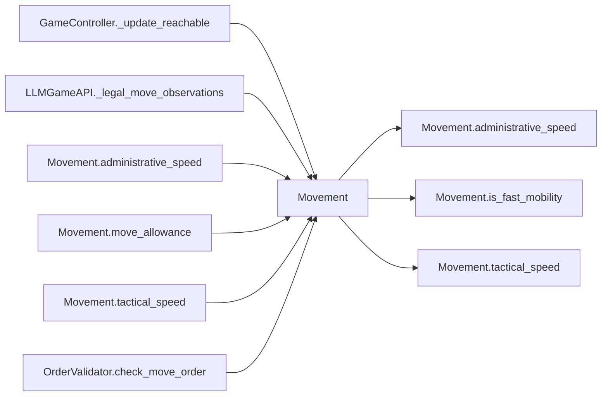

# Movement

> **Reading aid, not an execution contract.** No detected edge is not permission to reorder.
> GDScript reads and writes are conservative source analysis; transition writes are also
> checked against the mutation manifest. Potential conflicts may refer to different object
> instances or conditional branches.

Generator format v1; scan scope `scripts/**/*.gd` plus `project.godot` autoload aliases.
Generated from commit `8829181ae4b6`; input SHA-256 `1c5ff5483615f0cca5b2767540c56e9a13e1387c4c1a3c66db909a97ad2e94fb`;
tool/manifest/fixture SHA-256 `ea366ecafdb8f5cc7ecae22bb7554cd8802d1ed3433c5a903ecc07bbb7230f6c`; stable generation time `2026-08-02T09:03:12-04:00`.
Unresolved-analysis diagnostics on this page: **1**.

## Source summary

No source summary was found; see the access tables below.

Source: `scripts/calc/Movement.gd`

## Placement in resolution code

| Caller | Call-site instance |
|---|---|
| `GameController._update_reachable` | `Movement.move_allowance` at `82` |
| `LLMGameAPI._legal_move_observations` | `Movement.move_allowance` at `478` |
| `LLMGameAPI._legal_move_observations` | `Movement.move_allowance` at `478` |
| [`Movement.administrative_speed`](Movement.md) | `Movement.is_fast_mobility` at `32` |
| [`Movement.move_allowance`](Movement.md) | `Movement.tactical_speed` at `38` |
| [`Movement.move_allowance`](Movement.md) | `Movement.administrative_speed` at `40` |
| [`Movement.tactical_speed`](Movement.md) | `Movement.is_fast_mobility` at `28` |
| [`OrderValidator.check_move_order`](OrderValidator.md) | `Movement.move_allowance` at `61` |

## Dependency diagram

## Model-field evidence

| Field | Read | Written |
|---|:---:|:---:|
| `Brigade.nato_type` | yes |  |

## Method dependencies

| Method | Calls (transitive effects are included above) |
|---|---|
| `administrative_speed` | `Movement.is_fast_mobility` |
| `is_fast_mobility` | — |
| `move_allowance` | `Movement.administrative_speed`, `Movement.tactical_speed` |
| `tactical_speed` | `Movement.is_fast_mobility` |

## Analysis limits found here

Showing 1 of 1 diagnostics; class pages provide the narrower context.

| Kind | Source | Why it matters |
|---|---|---|
| `untyped_alias` | `scripts/calc/Movement.gd:19` `var nato_type_lower := brigade.nato_type.to_lower()` | The receiver type could not be proven. |
