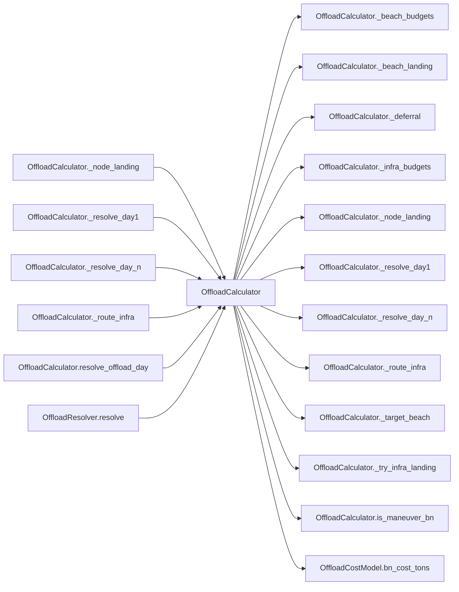

# OffloadCalculator

> **Reading aid, not an execution contract.** No detected edge is not permission to reorder.
> GDScript reads and writes are conservative source analysis; transition writes are also
> checked against the mutation manifest. Potential conflicts may refer to different object
> instances or conditional branches.

Generator format v1; scan scope `scripts/**/*.gd` plus `project.godot` autoload aliases.
Generated from commit `7bbf08693b44`; input SHA-256 `c879af92cf7693c7df1119a11083764377c92a9410144e7b95f361f509613378`;
tool/manifest/fixture SHA-256 `ea366ecafdb8f5cc7ecae22bb7554cd8802d1ed3433c5a903ecc07bbb7230f6c`; stable generation time `2026-08-02T17:09:31-04:00`.
Unresolved-analysis diagnostics on this page: **5**.

## Source summary

No source summary was found; see the access tables below.

Source: `scripts/calc/OffloadCalculator.gd`

## Placement in resolution code

| Caller | Call-site instance |
|---|---|
| [`OffloadCalculator._node_landing`](OffloadCalculator.md) | `OffloadCalculator._beach_landing` at `348` |
| [`OffloadCalculator._resolve_day1`](OffloadCalculator.md) | `OffloadCalculator.is_maneuver_bn` at `201` |
| [`OffloadCalculator._resolve_day1`](OffloadCalculator.md) | `OffloadCalculator.is_maneuver_bn` at `208` |
| [`OffloadCalculator._resolve_day_n`](OffloadCalculator.md) | `OffloadCalculator._beach_budgets` at `244` |
| [`OffloadCalculator._resolve_day_n`](OffloadCalculator.md) | `OffloadCalculator._infra_budgets` at `245` |
| [`OffloadCalculator._resolve_day_n`](OffloadCalculator.md) | `OffloadCalculator._target_beach` at `250` |
| [`OffloadCalculator._resolve_day_n`](OffloadCalculator.md) | `OffloadCalculator._beach_landing` at `263` |
| [`OffloadCalculator._resolve_day_n`](OffloadCalculator.md) | `OffloadCalculator._route_infra` at `268` |
| [`OffloadCalculator._resolve_day_n`](OffloadCalculator.md) | `OffloadCalculator._node_landing` at `270` |
| [`OffloadCalculator._resolve_day_n`](OffloadCalculator.md) | `OffloadCalculator._deferral` at `285` |
| [`OffloadCalculator._resolve_day_n`](OffloadCalculator.md) | `OffloadCalculator._deferral` at `287` |
| [`OffloadCalculator._route_infra`](OffloadCalculator.md) | `OffloadCalculator._try_infra_landing` at `332` |
| [`OffloadCalculator.resolve_offload_day`](OffloadCalculator.md) | `OffloadCalculator._resolve_day1` at `125` |
| [`OffloadCalculator.resolve_offload_day`](OffloadCalculator.md) | `OffloadCalculator._resolve_day_n` at `127` |
| [`OffloadResolver.resolve`](OffloadResolver.md) | `OffloadCalculator.beach_capacity_bns` at `67` |
| [`OffloadResolver.resolve`](OffloadResolver.md) | `OffloadCalculator.resolve_offload_day` at `68` |

## Dependency diagram

## Model-field evidence

| Field | Read | Written |
|---|:---:|:---:|
| `BeachDef.floating_piers` | yes |  |
| `BeachDef.jackup_barge` | yes |  |
| `BeachDef.offload_rate` | yes |  |

## Method dependencies

| Method | Calls (transitive effects are included above) |
|---|---|
| `_beach_budgets` | — |
| `_beach_landing` | — |
| `_deferral` | — |
| `_infra_budgets` | — |
| `_node_landing` | `OffloadCalculator._beach_landing` |
| `_resolve_day1` | `OffloadCalculator.is_maneuver_bn` |
| `_resolve_day_n` | `OffloadCalculator._beach_budgets`, `OffloadCalculator._beach_landing`, `OffloadCalculator._deferral`, `OffloadCalculator._infra_budgets`, `OffloadCalculator._node_landing`, `OffloadCalculator._route_infra`, `OffloadCalculator._target_beach`, `OffloadCostModel.bn_cost_tons` |
| `_route_infra` | `OffloadCalculator._try_infra_landing`, `OffloadCostModel.bn_cost_tons` |
| `_target_beach` | — |
| `_try_infra_landing` | — |
| `beach_capacity_bns` | — |
| `is_maneuver_bn` | — |
| `resolve_offload_day` | `OffloadCalculator._resolve_day1`, `OffloadCalculator._resolve_day_n` |

## Analysis limits found here

Showing 5 of 5 diagnostics; class pages provide the narrower context.

| Kind | Source | Why it matters |
|---|---|---|
| `untyped_alias` | `scripts/calc/OffloadCalculator.gd:103` `var bid := String(brigade.get("brigade_id", ""))` | The receiver type could not be proven. |
| `untyped_alias` | `scripts/calc/OffloadCalculator.gd:120` `var bid := String(brigade.get("brigade_id", ""))` | The receiver type could not be proven. |
| `untyped_alias` | `scripts/calc/OffloadCalculator.gd:172` `var locked := int(brigade.get("locked_beach", 0))` | The receiver type could not be proven. |
| `untyped_alias` | `scripts/calc/OffloadCalculator.gd:182` `var locked := int(brigade.get("locked_beach", 0))` | The receiver type could not be proven. |
| `untyped_iteration` | `scripts/calc/OffloadCalculator.gd:252` `for bn in brigade.get("bns", []):` | The collection element type could not be proven. |
