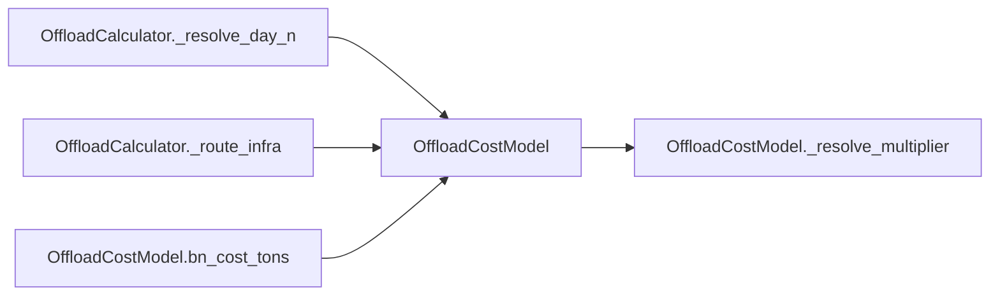

# OffloadCostModel

> **Reading aid, not an execution contract.** No detected edge is not permission to reorder.
> GDScript reads and writes are conservative source analysis; transition writes are also
> checked against the mutation manifest. Potential conflicts may refer to different object
> instances or conditional branches.

Generator format v1; scan scope `scripts/**/*.gd` plus `project.godot` autoload aliases.
Generated from commit `7bbf08693b44`; input SHA-256 `c879af92cf7693c7df1119a11083764377c92a9410144e7b95f361f509613378`;
tool/manifest/fixture SHA-256 `ea366ecafdb8f5cc7ecae22bb7554cd8802d1ed3433c5a903ecc07bbb7230f6c`; stable generation time `2026-08-02T17:09:31-04:00`.
Unresolved-analysis diagnostics on this page: **0**.

## Source summary

No source summary was found; see the access tables below.

Source: `scripts/calc/OffloadCostModel.gd`

## Placement in resolution code

| Caller | Call-site instance |
|---|---|
| [`OffloadCalculator._resolve_day_n`](OffloadCalculator.md) | `OffloadCostModel.bn_cost_tons` at `255` |
| [`OffloadCalculator._route_infra`](OffloadCalculator.md) | `OffloadCostModel.bn_cost_tons` at `328` |
| [`OffloadCalculator._route_infra`](OffloadCalculator.md) | `OffloadCostModel.bn_cost_tons` at `329` |
| [`OffloadCostModel.bn_cost_tons`](OffloadCostModel.md) | `OffloadCostModel._resolve_multiplier` at `22` |

## Dependency diagram

## Model-field evidence

| Field | Read | Written |
|---|:---:|:---:|
| _No persistent model field was resolved_ | | |

## Method dependencies

| Method | Calls (transitive effects are included above) |
|---|---|
| `_resolve_multiplier` | — |
| `bn_cost_tons` | `OffloadCostModel._resolve_multiplier` |
| `flat_config` | — |

## Analysis limits found here

No unresolved constructs were recorded.
