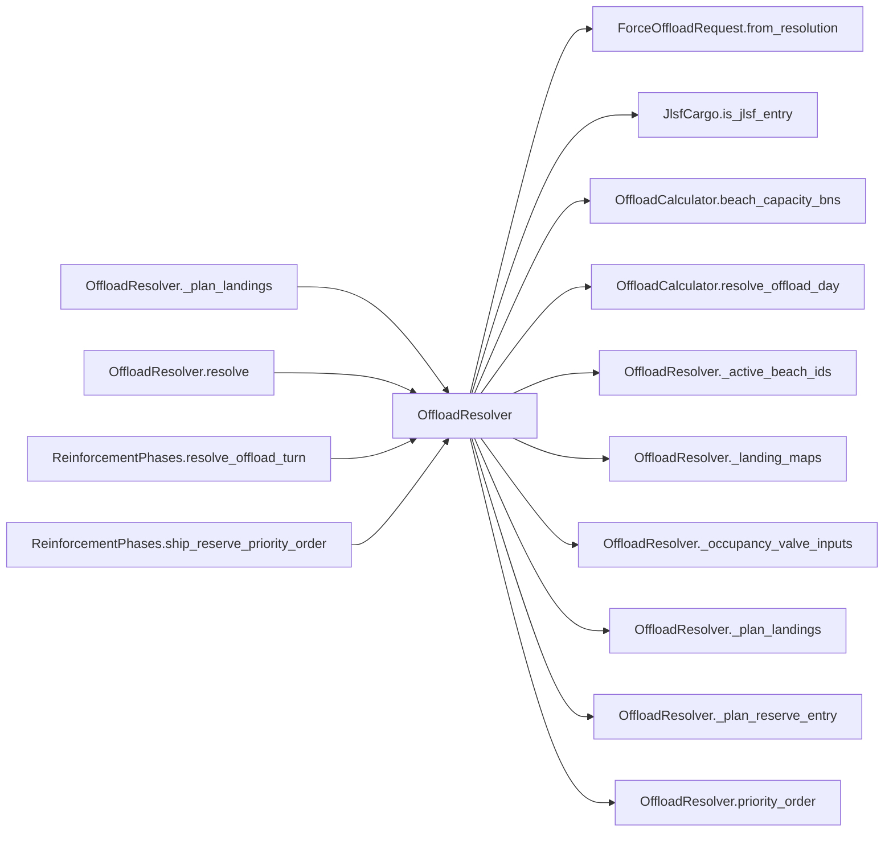

# OffloadResolver

> **Reading aid, not an execution contract.** No detected edge is not permission to reorder.
> GDScript reads and writes are conservative source analysis; transition writes are also
> checked against the mutation manifest. Potential conflicts may refer to different object
> instances or conditional branches.

Generator format v1; scan scope `scripts/**/*.gd` plus `project.godot` autoload aliases.
Generated from commit `8829181ae4b6`; input SHA-256 `1c5ff5483615f0cca5b2767540c56e9a13e1387c4c1a3c66db909a97ad2e94fb`;
tool/manifest/fixture SHA-256 `ea366ecafdb8f5cc7ecae22bb7554cd8802d1ed3433c5a903ecc07bbb7230f6c`; stable generation time `2026-08-02T09:03:12-04:00`.
Unresolved-analysis diagnostics on this page: **7**.

## Source summary

Pure resolver for the D1 amphibious offload phase: runs the OffloadCalculator day and reports exact troop/cargo landing plans without changing reserve or cohort membership. Consumes NO dice. ReinforcementPhases passes the typed request to ForceTransitions, then owns infrastructure, ownership, pending_lost_at_sea, fleet projection, and the EventBus emit.  CAVEAT, and it is the reason this file is named in plan 0058. "Without changing reserve or cohort MEMBERSHIP" is accurate and is not the whole story: this file appends the caller's live `ship_reserve` entries into `troop_reserve` (:63) and hands them to `OffloadCalculator` (:68), which writes `offload_progress_tons` into their BN dicts. So campaign state IS changed on this call path, transitively, through a helper. That makes this file a live instance of the blind spot `tools/validate_authority_call_placement.gd` documents — it sees direct authority calls, so this reads as clean and `scripts/calc/`'s claim is not actually true here today. Plan 0058 hoists the write into `ForceTransitions.apply_offload`; do not treat a green placement run as proof that this path applies nothing.

Source: `scripts/calc/OffloadResolver.gd`

## Placement in resolution code

| Caller | Call-site instance |
|---|---|
| [`OffloadResolver._plan_landings`](OffloadResolver.md) | `OffloadResolver._landing_maps` at `150` |
| [`OffloadResolver._plan_landings`](OffloadResolver.md) | `OffloadResolver._plan_reserve_entry` at `161` |
| [`OffloadResolver.resolve`](OffloadResolver.md) | `OffloadResolver._active_beach_ids` at `75` |
| [`OffloadResolver.resolve`](OffloadResolver.md) | `OffloadResolver._occupancy_valve_inputs` at `76` |
| [`OffloadResolver.resolve`](OffloadResolver.md) | `OffloadResolver.priority_order` at `78` |
| [`OffloadResolver.resolve`](OffloadResolver.md) | `OffloadResolver._plan_landings` at `82` |
| [`ReinforcementPhases.resolve_offload_turn`](ordering_ReinforcementPhases_resolve_offload_turn.md) | `OffloadResolver.empty_manifest` at `156` |
| [`ReinforcementPhases.resolve_offload_turn`](ordering_ReinforcementPhases_resolve_offload_turn.md) | `OffloadResolver.resolve` at `164` |
| [`ReinforcementPhases.ship_reserve_priority_order`](ordering_ReinforcementPhases_ship_reserve_priority_order.md) | `OffloadResolver.priority_order` at `198` |

## Dependency diagram

## Model-field evidence

| Field | Read | Written |
|---|:---:|:---:|
| `BeachDef.depth` | yes |  |
| `BeachDef.floating_piers` | yes |  |
| `BeachDef.hex_id` | yes |  |
| `BeachDef.jackup_barge` | yes |  |
| `BeachDef.offload_rate` | yes |  |
| `Brigade.destroyed` | yes |  |
| `Brigade.hex_id` | yes |  |
| `Brigade.team` | yes |  |
| `ForceOffloadRequest.cargo_arrivals` |  | yes |
| `ForceOffloadRequest.landings` |  | yes |

## Method dependencies

| Method | Calls (transitive effects are included above) |
|---|---|
| `_active_beach_ids` | — |
| `_landing_maps` | — |
| `_occupancy_valve_inputs` | — |
| `_plan_landings` | `OffloadResolver._landing_maps`, `OffloadResolver._plan_reserve_entry` |
| `_plan_reserve_entry` | — |
| `empty_manifest` | — |
| `priority_order` | — |
| `resolve` | `ForceOffloadRequest.from_resolution`, `JlsfCargo.is_jlsf_entry`, `OffloadCalculator.beach_capacity_bns`, `OffloadCalculator.resolve_offload_day`, `OffloadResolver._active_beach_ids`, `OffloadResolver._occupancy_valve_inputs`, `OffloadResolver._plan_landings`, `OffloadResolver.priority_order` |

## Analysis limits found here

Showing 7 of 7 diagnostics; class pages provide the narrower context.

| Kind | Source | Why it matters |
|---|---|---|
| `untyped_alias` | `scripts/OffloadCalculator.gd:113` `var bid := String(brigade.get("brigade_id", ""))` | The receiver type could not be proven. |
| `untyped_alias` | `scripts/OffloadCalculator.gd:124` `var bid := String(brigade.get("brigade_id", ""))` | The receiver type could not be proven. |
| `untyped_alias` | `scripts/OffloadCalculator.gd:170` `var locked := int(brigade.get("locked_beach", 0))` | The receiver type could not be proven. |
| `untyped_alias` | `scripts/OffloadCalculator.gd:180` `var locked := int(brigade.get("locked_beach", 0))` | The receiver type could not be proven. |
| `untyped_iteration` | `scripts/OffloadCalculator.gd:248` `for bn in brigade.get("bns", []):` | The collection element type could not be proven. |
| `multi_call_statement` | `scripts/calc/OffloadResolver.gd:78` `var manifest := OffloadCalculator.resolve_offload_day( turn_number, beach_capacity, troop_reserve, priority_order(troop_reserve), infra_nodes, cost_config, valve["occupancy"], v…` | Multiple calls share one statement; the map preserves lexical sites, not nested evaluation order. |
| `nested_index_unanalysed` | `scripts/calc/OffloadResolver.gd:191` `ids[brigade_id][String(landed["bn_id"])] = true` | Nested collection indexes exceed the balanced-chain subset; this statement contributes no field effects. |
