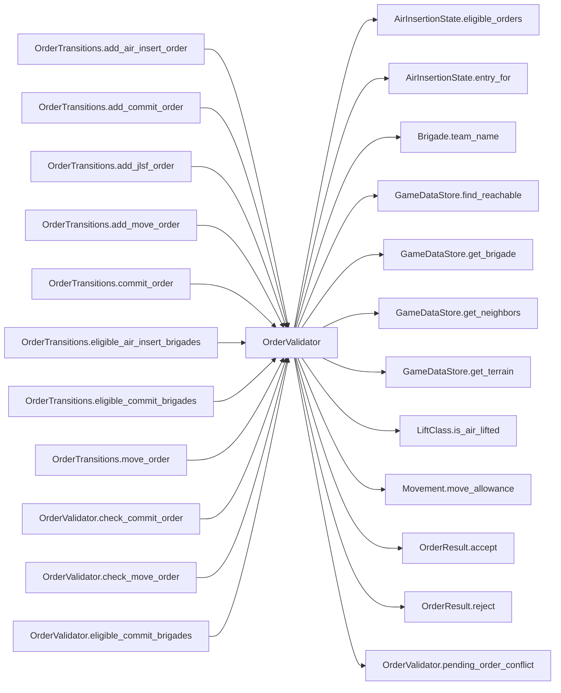

# OrderValidator

> **Reading aid, not an execution contract.** No detected edge is not permission to reorder.
> GDScript reads and writes are conservative source analysis; transition writes are also
> checked against the mutation manifest. Potential conflicts may refer to different object
> instances or conditional branches.

Generator format v1; scan scope `scripts/**/*.gd` plus `project.godot` autoload aliases.
Generated from commit `8829181ae4b6`; input SHA-256 `1c5ff5483615f0cca5b2767540c56e9a13e1387c4c1a3c66db909a97ad2e94fb`;
tool/manifest/fixture SHA-256 `ea366ecafdb8f5cc7ecae22bb7554cd8802d1ed3433c5a903ecc07bbb7230f6c`; stable generation time `2026-08-02T09:03:12-04:00`.
Unresolved-analysis diagnostics on this page: **15**.

## Source summary

Pure order legality for HexCombat's planning phase (plan 0014 P4; made pure and moved to scripts/calc/ by plan 0049). Every method answers "would this order be legal?" and NOTHING else — it appends to no buffer and holds no state. `OrderTransitions` is the only writer; it asks these questions and appends on accept, which is why a rejection cannot half-apply.  The content store arrives as an ARGUMENT (`store: GameDataStore`), never as the `GameData` autoload. That is not style: `OrderTransitions` calls into here, and an authority that read an autoload — even transitively — would breach the house rule. Passing the store also makes every check testable against a store built from scratch.  Rejections return a typed OrderResult (plan 0017): `OrderResult.reject(code, message)` on failure, `OrderResult.accept()` on success. Callers branch on `result.ok` and surface `result.code` / `result.message` (the LLM API feeds the message back to the agent). `eligible_commit_brigades` keeps its lone push_error — that guard is a programmer error (query fed a bad hex), not order validation.

Source: `scripts/calc/OrderValidator.gd`

## Placement in resolution code

| Caller | Call-site instance |
|---|---|
| `OrderTransitions.add_air_insert_order` | `OrderValidator.check_air_insert_order` at `88` |
| `OrderTransitions.add_commit_order` | `OrderValidator.check_commit_order` at `78` |
| `OrderTransitions.add_jlsf_order` | `OrderValidator.check_jlsf_order` at `98` |
| `OrderTransitions.add_move_order` | `OrderValidator.check_move_order` at `68` |
| `OrderTransitions.commit_order` | `OrderValidator.commit_order` at `62` |
| `OrderTransitions.eligible_air_insert_brigades` | `OrderValidator.eligible_air_insert_brigades` at `152` |
| `OrderTransitions.eligible_commit_brigades` | `OrderValidator.eligible_commit_brigades` at `148` |
| `OrderTransitions.move_order` | `OrderValidator.move_order` at `58` |
| [`OrderValidator.check_commit_order`](OrderValidator.md) | `OrderValidator.pending_order_conflict` at `90` |
| [`OrderValidator.check_move_order`](OrderValidator.md) | `OrderValidator.pending_order_conflict` at `57` |
| [`OrderValidator.eligible_commit_brigades`](OrderValidator.md) | `OrderValidator.pending_order_conflict` at `190` |

## Dependency diagram

## Inner-class boundary

This outer script's budgets are implemented as inner classes. Godot reflects their
signatures but exposes no body AST, so their class-level effect table is intentionally
incomplete. Follow the linked Placement rows to inspect effects at each call site.

## Model-field evidence

| Field | Read | Written |
|---|:---:|:---:|
| `AirInsertionState.pool` | yes |  |
| `Brigade.destroyed` | yes |  |
| `Brigade.hex_id` | yes |  |
| `Brigade.id` | yes |  |
| `Brigade.moved_admin_this_turn` | yes |  |
| `Brigade.nato_type` | yes |  |
| `Brigade.team` | yes |  |
| `CommitOrder.brigade_id` | yes | yes |
| `CommitOrder.target_hex` | yes | yes |
| `GameDataStore.brigades` | yes |  |
| `GameDataStore.hex_lookup` | yes |  |
| `GameDataStore.infrastructure` | yes |  |
| `GameDataStore.neighbor_lookup` | yes |  |
| `GameDataStore.terrain_types` | yes |  |
| `GameStateData.air_insert_orders` | yes |  |
| `GameStateData.air_insertion_state` | yes |  |
| `GameStateData.commitments` | yes |  |
| `GameStateData.jlsf_orders` | yes |  |
| `GameStateData.orders` | yes |  |
| `GameStateData.phase` | yes |  |
| `MoveOrder.brigade_id` | yes | yes |
| `MoveOrder.mode` | yes | yes |
| `MoveOrder.target_hex` | yes | yes |
| `OrderResult.code` |  | yes |
| `OrderResult.message` |  | yes |
| `OrderResult.ok` | yes | yes |
| `TerrainType.impassable` | yes |  |

## Method dependencies

| Method | Calls (transitive effects are included above) |
|---|---|
| `check_air_insert_order` | `AirInsertionState.entry_for`, `GameDataStore.get_brigade`, `GameDataStore.get_terrain`, `LiftClass.is_air_lifted`, `OrderResult.accept`, `OrderResult.reject` |
| `check_commit_order` | `Brigade.team_name`, `GameDataStore.get_brigade`, `GameDataStore.get_neighbors`, `OrderResult.reject`, `OrderValidator.pending_order_conflict` |
| `check_jlsf_order` | `OrderResult.accept`, `OrderResult.reject` |
| `check_move_order` | `Brigade.team_name`, `GameDataStore.find_reachable`, `GameDataStore.get_brigade`, `Movement.move_allowance`, `OrderResult.accept`, `OrderResult.reject`, `OrderValidator.pending_order_conflict` |
| `commit_order` | — |
| `eligible_air_insert_brigades` | `AirInsertionState.eligible_orders` |
| `eligible_commit_brigades` | `GameDataStore.get_neighbors`, `OrderValidator.pending_order_conflict` |
| `move_order` | — |
| `pending_order_conflict` | `OrderResult.accept`, `OrderResult.reject` |

## Analysis limits found here

Showing 15 of 15 diagnostics; class pages provide the narrower context.

| Kind | Source | Why it matters |
|---|---|---|
| `callable_or_lambda` | `scripts/GameData.gd:523` `return HexMath.find_reachable(start_id, max_distance, Callable(self, "get_neighbors"), _with_impassable(blocked), Callable(self, "_terrain_entry_cost"))` | Callable/lambda dataflow is outside this analyser. |
| `multi_call_statement` | `scripts/GameData.gd:523` `return HexMath.find_reachable(start_id, max_distance, Callable(self, "get_neighbors"), _with_impassable(blocked), Callable(self, "_terrain_entry_cost"))` | Multiple calls share one statement; the map preserves lexical sites, not nested evaluation order. |
| `dynamic_dispatch` | `scripts/calc/HexMath.gd:57` `return entry_cost.call(hex_id)` | A string/dynamic call has no statically known target. |
| `dynamic_dispatch` | `scripts/calc/HexMath.gd:121` `for neighbor_id in get_neighbors.call(current_id):` | A string/dynamic call has no statically known target. |
| `dynamic_dispatch` | `scripts/calc/HexMath.gd:133` `for neighbor_id in get_neighbors.call(start_id):` | A string/dynamic call has no statically known target. |
| `untyped_alias` | `scripts/calc/Movement.gd:19` `var nato_type_lower := brigade.nato_type.to_lower()` | The receiver type could not be proven. |
| `inner_class_unanalysed` | `scripts/calc/OrderValidator.gd:0` `inner class CommitOrderResource` | Godot reflected an inner class, but its indented method bodies are not analysed. |
| `inner_class_unanalysed` | `scripts/calc/OrderValidator.gd:0` `inner class MoveOrderResource` | Godot reflected an inner class, but its indented method bodies are not analysed. |
| `multi_call_statement` | `scripts/calc/OrderValidator.gd:51` `return OrderResult.reject(OrderResult.Code.TEAM_MISMATCH, "Move order team mismatch for %s: order=%s brigade=%s" % [order.brigade_id, Brigade.team_name(team), Brigade.team_name(…` | Multiple calls share one statement; the map preserves lexical sites, not nested evaluation order. |
| `untyped_alias` | `scripts/calc/OrderValidator.gd:62` `var reachable := store.find_reachable(brigade.hex_id, allowance)` | The receiver type could not be proven. |
| `multi_call_statement` | `scripts/calc/OrderValidator.gd:78` `return OrderResult.reject(OrderResult.Code.TEAM_MISMATCH, "Commit order team mismatch for %s: order=%s brigade=%s" % [order.brigade_id, Brigade.team_name(team), Brigade.team_nam…` | Multiple calls share one statement; the map preserves lexical sites, not nested evaluation order. |
| `untyped_iteration` | `scripts/calc/OrderValidator.gd:133` `for pending_value in state.air_insert_orders:` | The collection element type could not be proven. |
| `untyped_iteration` | `scripts/calc/OrderValidator.gd:182` `for brigade_value in store.brigades.values():` | The collection element type could not be proven. |
| `untyped_iteration` | `scripts/calc/OrderValidator.gd:201` `for pending_order in state.orders[team]:` | The collection element type could not be proven. |
| `untyped_iteration` | `scripts/calc/OrderValidator.gd:205` `for pending_commitment in state.commitments[team]:` | The collection element type could not be proven. |
