# ReinforcementPhases

> **Reading aid, not an execution contract.** No detected edge is not permission to reorder.
> GDScript reads and writes are conservative source analysis; transition writes are also
> checked against the mutation manifest. Potential conflicts may refer to different object
> instances or conditional branches.

Generator format v1; scan scope `scripts/**/*.gd` plus `project.godot` autoload aliases.
Generated from commit `8829181ae4b6`; input SHA-256 `1c5ff5483615f0cca5b2767540c56e9a13e1387c4c1a3c66db909a97ad2e94fb`;
tool/manifest/fixture SHA-256 `ea366ecafdb8f5cc7ecae22bb7554cd8802d1ed3433c5a903ecc07bbb7230f6c`; stable generation time `2026-08-02T09:03:12-04:00`.
Unresolved-analysis diagnostics on this page: **129**.

## Source summary

The "force arrives" phases of the WeGo turn (plan 0038): sealift → offload → ROC mobilization → air insertion, plus the helpers each needs. They run consecutively in `TurnConductor.resolve_turn` and share one job — putting battalions that were off-map onto the map — so they own their resolvers here instead of adding to `TurnConductor`'s fan-out.  `TurnConductor` keeps the ORDERING (the when); this module only owns the how. Same contract as every other resolver: static, first argument `state: GameStateData` mutated in place, reads the GameData content autoload but never the GameState autoload singleton. Every write is applied by the aggregate's authority — `ForceTransitions`, `SealiftTransitions`, `InfrastructureTransitions`, `AirInsertionTransitions` — and the resolvers below only calculate transition plans. Which fields each of those owns is in tools/mutation_authority_manifest.json and is deliberately not repeated here. --- Sealift phase (plan 0004) -----------------------------------------------------------------

Source: `scripts/phases/ReinforcementPhases.gd`

## Placement in resolution code

| Caller | Call-site instance |
|---|---|
| `GameStateType._rebuild_air_insertion_state` | `ReinforcementPhases.rebuild_air_insertion_state` at `313` |
| `GameStateType._rebuild_fleet` | `ReinforcementPhases.rebuild_fleet` at `350` |
| `GameStateType._rebuild_infrastructure_state` | `ReinforcementPhases.rebuild_infrastructure` at `267` |
| `GameStateType._rebuild_mobilization_state` | `ReinforcementPhases.rebuild_mobilization_state` at `300` |
| `GameStateType._rebuild_sealift_state` | `ReinforcementPhases.install_sealift_state` at `332` |
| `GameStateType._rebuild_ship_reserve` | `ReinforcementPhases.initialize_ship_reserve` at `324` |
| `GameStateType.resolve_air_insertion_turn` | `ReinforcementPhases.resolve_air_insertion_turn` at `320` |
| `GameStateType.resolve_mobilization_turn` | `ReinforcementPhases.resolve_mobilization_turn` at `307` |
| `GameStateType.resolve_offload_turn` | `ReinforcementPhases.resolve_unopposed_offload_turn` at `262` |
| `GameStateType.resolve_sealift_turn` | `ReinforcementPhases.resolve_sealift_turn` at `342` |
| `GameStateType.ship_reserve_priority_order` | `ReinforcementPhases.ship_reserve_priority_order` at `258` |
| [`ReinforcementPhases.isolated_air_landed_brigades`](ordering_ReinforcementPhases_isolated_air_landed_brigades.md) | `ReinforcementPhases.red_lodgement_hexes` at `355` |
| [`ReinforcementPhases.reconcile_lost_jlsf`](ordering_ReinforcementPhases_reconcile_lost_jlsf.md) | `ReinforcementPhases.reserve_or_pool_has` at `214` |
| [`ReinforcementPhases.red_lodgement_hexes`](ordering_ReinforcementPhases_red_lodgement_hexes.md) | `ReinforcementPhases.owner_by_hex` at `370` |
| [`ReinforcementPhases.resolve_air_insertion_turn`](ordering_ReinforcementPhases_resolve_air_insertion_turn.md) | `ReinforcementPhases.hex_can_receive_insertion` at `300` |
| [`ReinforcementPhases.resolve_mobilization_turn`](ordering_ReinforcementPhases_resolve_mobilization_turn.md) | `ReinforcementPhases.hex_can_receive_mobilized` at `237` |
| [`ReinforcementPhases.resolve_offload_turn`](ordering_ReinforcementPhases_resolve_offload_turn.md) | `ReinforcementPhases.owner_by_hex` at `146` |
| [`ReinforcementPhases.resolve_offload_turn`](ordering_ReinforcementPhases_resolve_offload_turn.md) | `ReinforcementPhases.owner_by_hex` at `164` |
| [`ReinforcementPhases.resolve_offload_turn`](ordering_ReinforcementPhases_resolve_offload_turn.md) | `ReinforcementPhases.reconcile_lost_jlsf` at `188` |
| [`ReinforcementPhases.resolve_sealift_turn`](ordering_ReinforcementPhases_resolve_sealift_turn.md) | `ReinforcementPhases.consume_jlsf_orders` at `70` |
| [`ReinforcementPhases.resolve_unopposed_offload_turn`](ordering_ReinforcementPhases_resolve_unopposed_offload_turn.md) | `ReinforcementPhases.resolve_offload_turn` at `134` |
| [`TurnConductor.resolve_turn`](ordering_TurnConductor_resolve_turn.md) | `ReinforcementPhases.resolve_sealift_turn` at `45` |
| [`TurnConductor.resolve_turn`](ordering_TurnConductor_resolve_turn.md) | `ReinforcementPhases.resolve_offload_turn` at `47` |
| [`TurnConductor.resolve_turn`](ordering_TurnConductor_resolve_turn.md) | `ReinforcementPhases.resolve_mobilization_turn` at `51` |
| [`TurnConductor.resolve_turn`](ordering_TurnConductor_resolve_turn.md) | `ReinforcementPhases.resolve_air_insertion_turn` at `57` |
| [`TurnConductor.resolve_turn`](ordering_TurnConductor_resolve_turn.md) | `ReinforcementPhases.isolated_air_landed_brigades` at `73` |

## Dependency diagram

```mermaid
flowchart LR
  n_c19901669e55["ReinforcementPhases"]
  n_2b7c9875e012["GameStateType._rebuild_air_insertion_state"] --> n_c19901669e55
  n_6bdcc1a206a9["GameStateType._rebuild_fleet"] --> n_c19901669e55
  n_ec3761f9ef23["GameStateType._rebuild_infrastructure_state"] --> n_c19901669e55
  n_19ab488bbdbf["GameStateType._rebuild_mobilization_state"] --> n_c19901669e55
  n_9388e90f53e4["GameStateType._rebuild_sealift_state"] --> n_c19901669e55
  n_cf086068afe1["GameStateType._rebuild_ship_reserve"] --> n_c19901669e55
  n_e78bf9954240["GameStateType.resolve_air_insertion_turn"] --> n_c19901669e55
  n_08987e640d31["GameStateType.resolve_mobilization_turn"] --> n_c19901669e55
  n_be93df8bec84["GameStateType.resolve_offload_turn"] --> n_c19901669e55
  n_4307a2f42078["GameStateType.resolve_sealift_turn"] --> n_c19901669e55
  n_5513a27c6113["GameStateType.ship_reserve_priority_order"] --> n_c19901669e55
  n_418450e46cf8["ReinforcementPhases.isolated_air_landed_brigades"] --> n_c19901669e55
  n_beb2704de310["ReinforcementPhases.reconcile_lost_jlsf"] --> n_c19901669e55
  n_a69475646f6e["ReinforcementPhases.red_lodgement_hexes"] --> n_c19901669e55
  n_6d582afd075e["ReinforcementPhases.resolve_air_insertion_turn"] --> n_c19901669e55
  n_e9f2ac00c499["ReinforcementPhases.resolve_mobilization_turn"] --> n_c19901669e55
  n_9c6d55218dbd["ReinforcementPhases.resolve_offload_turn"] --> n_c19901669e55
  n_1a7494fde3cf["ReinforcementPhases.resolve_sealift_turn"] --> n_c19901669e55
  n_631052401b39["ReinforcementPhases.resolve_unopposed_offload_turn"] --> n_c19901669e55
  n_580123a39c53["TurnConductor.resolve_turn"] --> n_c19901669e55
  n_c19901669e55 --> n_65cddeb5db9b["AirInsertionResolver.isolated_brigades"]
  n_c19901669e55 --> n_870ee08c2c22["AirInsertionResolver.resolve"]
  n_c19901669e55 --> n_acd2ff612d46["AirInsertionResolver.threat_from_ijfs_summary"]
  n_c19901669e55 --> n_050c63f4c74b["AirInsertionSummary.to_dict"]
  n_c19901669e55 --> n_ee145b64c7eb["AirInsertionTransitions.can_record_insertions"]
  n_c19901669e55 --> n_f96d1a9a0e75["AirInsertionTransitions.lift_request"]
  n_c19901669e55 --> n_a28bf66569a1["AirInsertionTransitions.rebuild_air_insertion_state"]
  n_c19901669e55 --> n_2f71f415842f["AirInsertionTransitions.record_insertions"]
  n_c19901669e55 --> n_3624b72bc562["ForceTransitions.apply_air_insertion_outcome"]
  n_c19901669e55 --> n_03912dc49b17["ForceTransitions.apply_embark"]
  n_c19901669e55 --> n_9ad9c128abe4["ForceTransitions.apply_offload"]
  n_c19901669e55 --> n_050de3aeb4b2["ForceTransitions.apply_queue_jlsf"]
  n_c19901669e55 --> n_432fbcaf77a4["ForceTransitions.apply_sent_cohort"]
  n_c19901669e55 --> n_5778067824ce["ForceTransitions.free_emptied_cohorts"]
  n_c19901669e55 --> n_540443926f1f["ForceTransitions.initialize_ship_reserve"]
  n_c19901669e55 --> n_48bbc6a25773["ForceTransitions.rebuild_mobilization_state"]
  n_c19901669e55 --> n_ba559bffa468["ForceTransitions.release_mobilized_brigades"]
  n_c19901669e55 --> n_dae5e3b7f67d["GameDataStore.air_insertion_attrition_config"]
  n_c19901669e55 --> n_f8538e14a365["GameDataStore.get_brigade"]
  n_c19901669e55 --> n_a0b72c72fb0c["GameDataStore.get_neighbors"]
  n_c19901669e55 --> n_11903916f414["GameDataStore.get_terrain"]
  n_c19901669e55 --> n_6765caa88896["GameDataStore.hex_owner_of"]
  n_c19901669e55 --> n_ab4a9a951e53["GameDataStore.recompute_hex_ownership"]
  n_c19901669e55 --> n_0b3bac0c39f6["IjfsResolver.add_maneuver_targets"]
  n_c19901669e55 --> n_f10541d6a128["InfrastructureResolver.plan_tick"]
  n_c19901669e55 --> n_d23af6c27ced["InfrastructureResolver.red_offload_nodes"]
  n_c19901669e55 --> n_a55579a31190["InfrastructureTransitions.apply_node_plan"]
  n_c19901669e55 --> n_92c95d4aa78a["InfrastructureTransitions.clear_jlsf"]
  n_c19901669e55 --> n_412c3fbbf481["InfrastructureTransitions.jlsf_in_transit_ids"]
  n_c19901669e55 --> n_a8bb0a5c5c43["InfrastructureTransitions.mark_jlsf_arrived"]
  n_c19901669e55 --> n_37bb6332b11f["InfrastructureTransitions.mark_jlsf_enroute"]
  n_c19901669e55 --> n_eb4dff20cc51["InfrastructureTransitions.rebuild_infrastructure"]
  n_c19901669e55 --> n_a3577796fcc1["JlsfCargo.brigade_id_for"]
  n_c19901669e55 --> n_c533c7cb8100["JlsfCargo.is_jlsf_entry"]
  n_c19901669e55 --> n_fe0d3b5cf6ba["JlsfCargo.queue_deployments"]
  n_c19901669e55 --> n_a5a6a7a98f64["MobilizationResolver.find_arrival_hex"]
  n_c19901669e55 --> n_a9f85ca1cae6["MobilizationResolver.resolve"]
  n_c19901669e55 --> n_1efba806a990["MobilizationSummary.force_request"]
  n_c19901669e55 --> n_098cac1574ea["MobilizationSummary.to_dict"]
  n_c19901669e55 --> n_bc2072340a14["OffloadResolver.empty_manifest"]
  n_c19901669e55 --> n_241c77fec0f5["OffloadResolver.priority_order"]
  n_c19901669e55 --> n_5fb2f99d61ed["OffloadResolver.resolve"]
  n_c19901669e55 --> n_118f06980739["OrderTransitions.consume_air_insert_orders"]
  n_c19901669e55 --> n_9b5ae6c5b34b["OrderTransitions.consume_jlsf_orders"]
  n_c19901669e55 --> n_8e7647fd70c5["ReinforcementPhases.consume_jlsf_orders"]
  n_c19901669e55 --> n_e7449070c04a["ReinforcementPhases.hex_can_receive_insertion"]
  n_c19901669e55 --> n_e12b98ac5258["ReinforcementPhases.hex_can_receive_mobilized"]
  n_c19901669e55 --> n_72930939608c["ReinforcementPhases.owner_by_hex"]
  n_c19901669e55 --> n_cf4797474b8a["ReinforcementPhases.reconcile_lost_jlsf"]
  n_c19901669e55 --> n_ed0c1837ed0f["ReinforcementPhases.red_lodgement_hexes"]
  n_c19901669e55 --> n_71b671c8dd92["ReinforcementPhases.reserve_or_pool_has"]
  n_c19901669e55 --> n_989e7bece212["ReinforcementPhases.resolve_offload_turn"]
  n_c19901669e55 --> n_3971fc0b1803["SealiftResolver.resolve"]
  n_c19901669e55 --> n_3c36ccee148f["SealiftTransitions.consume_ship_losses"]
  n_c19901669e55 --> n_cda53d74d937["SealiftTransitions.install_campaign_state"]
  n_c19901669e55 --> n_d5caf350498f["SealiftTransitions.project_fleet"]
  n_c19901669e55 --> n_2c36d3804202["SealiftTransitions.ready_by_type"]
  n_c19901669e55 --> n_f3d2d69b116f["SealiftTransitions.rebuild_fleet"]
  n_c19901669e55 --> n_67fb56885fb2["SealiftTransitions.release_hulls"]
  n_c19901669e55 --> n_68c7bd727b85["SealiftTransitions.swap_state"]
  n_c19901669e55 --> n_0abe6d952ab6["SealiftTransitions.tick_escort_reload"]
  n_c19901669e55 --> n_b04cf3072851["SealiftTransitions.tick_returns"]
```

## Model-field evidence

| Field | Read | Written |
|---|:---:|:---:|
| `AirInsertionResolutionPlan.budget` | yes | yes |
| `AirInsertionResolutionPlan.caps_after` | yes | yes |
| `AirInsertionResolutionPlan.config` | yes | yes |
| `AirInsertionResolutionPlan.dice` | yes | yes |
| `AirInsertionResolutionPlan.hex_can_receive` | yes | yes |
| `AirInsertionResolutionPlan.landings` | yes | yes |
| `AirInsertionResolutionPlan.orders` | yes | yes |
| `AirInsertionResolutionPlan.pool_sent` | yes | yes |
| `AirInsertionResolutionPlan.state` | yes | yes |
| `AirInsertionResolutionPlan.substream` | yes | yes |
| `AirInsertionResolutionPlan.summary` | yes | yes |
| `AirInsertionResolutionPlan.threat` | yes | yes |
| `AirInsertionResolutionPlan.turn_number` | yes | yes |
| `AirInsertionState.caps` | yes | yes |
| `AirInsertionState.first_turn` | yes | yes |
| `AirInsertionState.history` | yes | yes |
| `AirInsertionState.initial_caps` |  | yes |
| `AirInsertionState.landed` | yes | yes |
| `AirInsertionState.pool` | yes | yes |
| `AirInsertionSummary.attrition_by_class` | yes | yes |
| `AirInsertionSummary.battalions_landed` | yes | yes |
| `AirInsertionSummary.battalions_lost` | yes | yes |
| `AirInsertionSummary.caps_after` | yes | yes |
| `AirInsertionSummary.caps_before` | yes | yes |
| `AirInsertionSummary.drops` | yes | yes |
| `AirInsertionSummary.pending_battalions` | yes | yes |
| `AirInsertionSummary.pending_brigades` | yes | yes |
| `AirInsertionSummary.rejected` | yes | yes |
| `AirLiftRequest.drops` | yes | yes |
| `AirLiftRequest.turn_number` | yes | yes |
| `Battalion.qty` | yes | yes |
| `Battalion.type` | yes |  |
| `BeachDef.depth` | yes |  |
| `BeachDef.floating_piers` | yes |  |
| `BeachDef.hex_id` | yes |  |
| `BeachDef.jackup_barge` | yes |  |
| `BeachDef.offload_rate` | yes |  |
| `Brigade.composition` | yes | yes |
| `Brigade.destroyed` | yes | yes |
| `Brigade.entry_bearing` |  | yes |
| `Brigade.hex_id` | yes | yes |
| `Brigade.id` | yes |  |
| `Brigade.nato_type` | yes |  |
| `Brigade.team` | yes |  |
| `Brigade.to_number` | yes |  |
| `ForceAirInsertionReceipt.battalions_landed` |  | yes |
| `ForceAirInsertionReceipt.battalions_lost` |  | yes |
| `ForceAirInsertionReceipt.casualty_receipts` |  | yes |
| `ForceAirInsertionReceipt.error` | yes | yes |
| `ForceAirInsertionReceipt.placed_brigades` |  | yes |
| `ForceAirInsertionReceipt.placement_receipts` |  | yes |
| `ForceAirInsertionReceipt.pool_entries_drained` |  | yes |
| `ForceAirInsertionReceipt.success` | yes | yes |
| `ForceAirInsertionRequest.landings` | yes | yes |
| `ForceAirInsertionRequest.turn_number` |  | yes |
| `ForceCasualtyReceipt.applied` |  | yes |
| `ForceCasualtyReceipt.battalion_type` |  | yes |
| `ForceCasualtyReceipt.brigade_id` |  | yes |
| `ForceCasualtyReceipt.cause` |  | yes |
| `ForceCasualtyReceipt.destroyed_brigade` |  | yes |
| `ForceCasualtyReceipt.removed_from_hex` |  | yes |
| `ForceCasualtyReceipt.requested` |  | yes |
| `ForceCasualtyReceipt.source_location` |  | yes |
| `ForceCasualtyRequest.battalion_type` | yes | yes |
| `ForceCasualtyRequest.brigade_id` | yes | yes |
| `ForceCasualtyRequest.cause` | yes | yes |
| `ForceCasualtyRequest.count` | yes | yes |
| `ForceCasualtyRequest.source_location` | yes | yes |
| `ForceEmbarkReceipt.bn_ids_embarked` | yes | yes |
| `ForceEmbarkReceipt.brigade_id` |  | yes |
| `ForceEmbarkReceipt.error` | yes | yes |
| `ForceEmbarkReceipt.success` | yes | yes |
| `ForceEmbarkRequest.batch_bn_ids` | yes | yes |
| `ForceEmbarkRequest.batch_hulls_by_type` | yes | yes |
| `ForceEmbarkRequest.brigade_specs` | yes | yes |
| `ForceEmbarkRequest.destination` | yes |  |
| `ForceEmbarkRequest.ship_categories` | yes | yes |
| `ForceEmbarkRequest.source` | yes |  |
| `ForceMobilizationReceipt.arrived` |  | yes |
| `ForceMobilizationReceipt.battalions_arrived` |  | yes |
| `ForceMobilizationReceipt.deferred` |  | yes |
| `ForceMobilizationReceipt.error` | yes | yes |
| `ForceMobilizationReceipt.placed_brigades` | yes | yes |
| `ForceMobilizationReceipt.placement_receipts` |  | yes |
| `ForceMobilizationReceipt.success` | yes | yes |
| `ForceMobilizationRequest.arrivals` | yes | yes |
| `ForceMobilizationRequest.deferred` | yes | yes |
| `ForceMobilizationRequest.turn_number` | yes | yes |
| `ForceOffloadReceipt.bn_ids_landed` |  | yes |
| `ForceOffloadReceipt.error` | yes | yes |
| `ForceOffloadReceipt.landed_brigade_ids` |  | yes |
| `ForceOffloadReceipt.landings` |  | yes |
| `ForceOffloadReceipt.placement_receipts` |  | yes |
| `ForceOffloadReceipt.success` | yes | yes |
| `ForceOffloadRequest.cargo_arrivals` | yes | yes |
| `ForceOffloadRequest.destination` | yes |  |
| `ForceOffloadRequest.landings` | yes | yes |
| `ForceOffloadRequest.source` | yes |  |
| `ForcePlacementReceipt.brigade_id` |  | yes |
| `ForcePlacementReceipt.destination` |  | yes |
| `ForcePlacementReceipt.new_hex` | yes | yes |
| `ForcePlacementReceipt.old_hex` |  | yes |
| `ForcePlacementReceipt.phase` |  | yes |
| `ForcePlacementRequest.brigade_id` | yes | yes |
| `ForcePlacementRequest.destination` | yes | yes |
| `ForcePlacementRequest.destination_hex` | yes | yes |
| `ForcePlacementRequest.entry_bearing` | yes |  |
| `ForcePlacementRequest.has_entry_bearing` | yes |  |
| `ForcePlacementRequest.phase` | yes | yes |
| `ForceValidationResult.error` | yes | yes |
| `GameDataStore.amphibious_return_time_turns` | yes |  |
| `GameDataStore.auto_jlsf` | yes |  |
| `GameDataStore.beach_to_to` | yes |  |
| `GameDataStore.beaches` | yes |  |
| `GameDataStore.brigades` | yes |  |
| `GameDataStore.brigades_by_hex` | yes | yes |
| `GameDataStore.hex_lookup` | yes |  |
| `GameDataStore.hex_states` | yes |  |
| `GameDataStore.infrastructure` | yes |  |
| `GameDataStore.jlsf_lift_bn_equiv` | yes |  |
| `GameDataStore.neighbor_lookup` | yes |  |
| `GameDataStore.offload_weights` | yes |  |
| `GameDataStore.red_air_insertion` | yes |  |
| `GameDataStore.red_ship_reserve` | yes |  |
| `GameDataStore.ship_defs` | yes |  |
| `GameDataStore.terrain_types` | yes |  |
| `GameDataStore.use_offload_weight_matrix` | yes |  |
| `GameStateData._ijfs_day` | yes |  |
| `GameStateData.air_insert_orders` | yes | yes |
| `GameStateData.air_insertion_state` | yes | yes |
| `GameStateData.fleet` | yes | yes |
| `GameStateData.ijfs_state` | yes |  |
| `GameStateData.infrastructure_state` | yes | yes |
| `GameStateData.jlsf_orders` | yes | yes |
| `GameStateData.last_ijfs_summary` | yes |  |
| `GameStateData.last_sealift_sent_by_type` |  | yes |
| `GameStateData.lost_at_sea_accumulator` |  | yes |
| `GameStateData.mobilization_state` | yes | yes |
| `GameStateData.pending_lost_at_sea` | yes | yes |
| `GameStateData.sealift_state` | yes | yes |
| `GameStateData.ship_reserve` | yes | yes |
| `GameStateData.turn_number` | yes |  |
| `HexState.hex_owner` | yes | yes |
| `IjfsDailyState.targets` | yes | yes |
| `IjfsTarget.category` |  | yes |
| `IjfsTarget.destroyed` |  | yes |
| `IjfsTarget.detectability_active` |  | yes |
| `IjfsTarget.detectability_hiding` |  | yes |
| `IjfsTarget.detected_this_turn` |  | yes |
| `IjfsTarget.hardness` |  | yes |
| `IjfsTarget.instance_index` |  | yes |
| `IjfsTarget.known_to_red` |  | yes |
| `IjfsTarget.last_detected_day` |  | yes |
| `IjfsTarget.metadata` |  | yes |
| `IjfsTarget.mobility` |  | yes |
| `IjfsTarget.posture` |  | yes |
| `IjfsTarget.quantity` |  | yes |
| `IjfsTarget.source_target_id` |  | yes |
| `IjfsTarget.subcategory` |  | yes |
| `IjfsTarget.suppressed` |  | yes |
| `IjfsTarget.suppressed_this_turn` |  | yes |
| `IjfsTarget.target_id` | yes | yes |
| `InfrastructureDef.hex_id` | yes |  |
| `InfrastructureDef.id` | yes |  |
| `InfrastructureDef.kind` | yes |  |
| `InfrastructureDef.to_number` | yes |  |
| `InfrastructureNodeState.jlsf` | yes | yes |
| `InfrastructureNodeState.node_status` | yes | yes |
| `InfrastructureNodeState.repair_turns_remaining` | yes | yes |
| `InfrastructureState.nodes` | yes | yes |
| `InfrastructureTickPlan.events` | yes | yes |
| `InfrastructureTickPlan.node_states` | yes | yes |
| `MobilizationState.pending` | yes | yes |
| `MobilizationState.released` | yes | yes |
| `MobilizationSummary.arrivals` | yes | yes |
| `MobilizationSummary.battalions_arrived` | yes | yes |
| `MobilizationSummary.deferred` | yes | yes |
| `MobilizationSummary.pending_battalions` | yes | yes |
| `MobilizationSummary.pending_brigades` | yes | yes |
| `SealiftCohort.bn_ids` |  | yes |
| `SealiftCohort.cohort_state` |  | yes |
| `SealiftCohort.hulls_by_type` |  | yes |
| `SealiftHullReleasePlan.batches` | yes | yes |
| `SealiftState.cohorts` | yes | yes |
| `SealiftState.escort_reload` | yes | yes |
| `SealiftState.escort_sam` | yes | yes |
| `SealiftState.escort_sam_max` | yes |  |
| `SealiftState.escort_sam_threshold` | yes |  |
| `SealiftState.mainland_pool` | yes | yes |
| `SealiftState.return_pipeline` | yes | yes |
| `ShipDef.carrying_capacity_bn_equiv` | yes |  |
| `ShipDef.category` | yes |  |
| `ShipDef.infrastructure` | yes |  |
| `ShipDef.is_decoy` | yes |  |
| `ShipDef.name` | yes |  |
| `ShipDef.total_count` | yes |  |
| `ShipState.destroyed` | yes | yes |
| `ShipState.fleet_surviving_total` | yes | yes |
| `ShipState.fleet_total` | yes | yes |
| `ShipState.offloading` | yes | yes |
| `ShipState.ready` | yes | yes |
| `ShipState.returning` | yes | yes |
| `ShipState.ship_type` | yes | yes |
| `ShipState.surviving_sent` | yes | yes |
| `TerrainType.impassable` | yes |  |

## Method dependencies

| Method | Calls (transitive effects are included above) |
|---|---|
| `consume_jlsf_orders` | `ForceTransitions.apply_queue_jlsf`, `JlsfCargo.queue_deployments`, `OrderTransitions.consume_jlsf_orders` |
| `hex_can_receive_insertion` | `GameDataStore.get_terrain` |
| `hex_can_receive_mobilized` | `GameDataStore.get_terrain`, `GameDataStore.hex_owner_of` |
| `initialize_ship_reserve` | `ForceTransitions.initialize_ship_reserve` |
| `install_sealift_state` | `SealiftTransitions.install_campaign_state` |
| `isolated_air_landed_brigades` | `AirInsertionResolver.isolated_brigades`, `GameDataStore.get_brigade`, `GameDataStore.get_neighbors`, `GameDataStore.hex_owner_of`, `ReinforcementPhases.red_lodgement_hexes` |
| `owner_by_hex` | `GameDataStore.hex_owner_of` |
| `rebuild_air_insertion_state` | `AirInsertionTransitions.rebuild_air_insertion_state` |
| `rebuild_fleet` | `SealiftTransitions.rebuild_fleet` |
| `rebuild_infrastructure` | `InfrastructureTransitions.rebuild_infrastructure` |
| `rebuild_mobilization_state` | `ForceTransitions.rebuild_mobilization_state` |
| `reconcile_lost_jlsf` | `InfrastructureTransitions.clear_jlsf`, `InfrastructureTransitions.jlsf_in_transit_ids`, `JlsfCargo.brigade_id_for`, `ReinforcementPhases.reserve_or_pool_has` |
| `red_lodgement_hexes` | `InfrastructureResolver.red_offload_nodes`, `ReinforcementPhases.owner_by_hex` |
| `reserve_or_pool_has` | — |
| `resolve_air_insertion_turn` | `AirInsertionResolver.resolve`, `AirInsertionResolver.threat_from_ijfs_summary`, `AirInsertionSummary.to_dict`, `AirInsertionTransitions.can_record_insertions`, `AirInsertionTransitions.lift_request`, `AirInsertionTransitions.record_insertions`, `ForceTransitions.apply_air_insertion_outcome`, `GameDataStore.air_insertion_attrition_config`, `GameDataStore.recompute_hex_ownership`, `OrderTransitions.consume_air_insert_orders`, `ReinforcementPhases.hex_can_receive_insertion` |
| `resolve_mobilization_turn` | `ForceTransitions.release_mobilized_brigades`, `GameDataStore.get_brigade`, `GameDataStore.get_neighbors`, `GameDataStore.recompute_hex_ownership`, `IjfsResolver.add_maneuver_targets`, `MobilizationResolver.find_arrival_hex`, `MobilizationResolver.resolve`, `MobilizationSummary.force_request`, `MobilizationSummary.to_dict`, `ReinforcementPhases.hex_can_receive_mobilized` |
| `resolve_offload_turn` | `ForceTransitions.apply_offload`, `ForceTransitions.free_emptied_cohorts`, `GameDataStore.recompute_hex_ownership`, `InfrastructureResolver.plan_tick`, `InfrastructureResolver.red_offload_nodes`, `InfrastructureTransitions.apply_node_plan`, `InfrastructureTransitions.mark_jlsf_arrived`, `OffloadResolver.empty_manifest`, `OffloadResolver.resolve`, `ReinforcementPhases.owner_by_hex`, `ReinforcementPhases.reconcile_lost_jlsf`, `SealiftTransitions.consume_ship_losses`, `SealiftTransitions.project_fleet`, `SealiftTransitions.release_hulls` |
| `resolve_sealift_turn` | `ForceTransitions.apply_embark`, `ForceTransitions.apply_sent_cohort`, `InfrastructureTransitions.mark_jlsf_enroute`, `JlsfCargo.is_jlsf_entry`, `ReinforcementPhases.consume_jlsf_orders`, `SealiftResolver.resolve`, `SealiftTransitions.project_fleet`, `SealiftTransitions.ready_by_type`, `SealiftTransitions.tick_escort_reload`, `SealiftTransitions.tick_returns` |
| `resolve_unopposed_offload_turn` | `ReinforcementPhases.resolve_offload_turn`, `SealiftTransitions.swap_state` |
| `ship_reserve_priority_order` | `OffloadResolver.priority_order` |

## Analysis limits found here

Showing 30 of 129 diagnostics; class pages provide the narrower context.

| Kind | Source | Why it matters |
|---|---|---|
| `untyped_alias` | `scripts/OffloadCalculator.gd:113` `var bid := String(brigade.get("brigade_id", ""))` | The receiver type could not be proven. |
| `untyped_alias` | `scripts/OffloadCalculator.gd:124` `var bid := String(brigade.get("brigade_id", ""))` | The receiver type could not be proven. |
| `untyped_alias` | `scripts/OffloadCalculator.gd:170` `var locked := int(brigade.get("locked_beach", 0))` | The receiver type could not be proven. |
| `untyped_alias` | `scripts/OffloadCalculator.gd:180` `var locked := int(brigade.get("locked_beach", 0))` | The receiver type could not be proven. |
| `untyped_iteration` | `scripts/OffloadCalculator.gd:248` `for bn in brigade.get("bns", []):` | The collection element type could not be proven. |
| `dynamic_dispatch` | `scripts/calc/AirInsertionResolver.gd:60` `if connected.has(source_hex) or not bool(is_red_hex.call(source_hex)):` | A string/dynamic call has no statically known target. |
| `dynamic_dispatch` | `scripts/calc/AirInsertionResolver.gd:66` `for neighbor_value in neighbors_of.call(hex_id):` | A string/dynamic call has no statically known target. |
| `dynamic_dispatch` | `scripts/calc/AirInsertionResolver.gd:68` `if connected.has(neighbor) or not bool(is_red_hex.call(neighbor)):` | A string/dynamic call has no statically known target. |
| `dynamic_dispatch` | `scripts/calc/AirInsertionResolver.gd:80` `for neighbor_value in neighbors_of.call(hex_id):` | A string/dynamic call has no statically known target. |
| `untyped_iteration` | `scripts/calc/AirInsertionResolver.gd:157` `for order_value in plan.orders:` | The collection element type could not be proven. |
| `untyped_alias` | `scripts/calc/AirInsertionResolver.gd:164` `var entry := plan.state.entry_for(brigade_id)` | The receiver type could not be proven. |
| `dynamic_dispatch` | `scripts/calc/AirInsertionResolver.gd:168` `if not bool(plan.hex_can_receive.call(target_hex)):` | A string/dynamic call has no statically known target. |
| `untyped_alias` | `scripts/calc/AirInsertionResolver.gd:172` `var remaining := int(plan.budget.get(lift_class, 0))` | The receiver type could not be proven. |
| `untyped_alias` | `scripts/calc/AirInsertionResolver.gd:214` `var first := not landed.is_empty() and not plan.state.landed.has(brigade_id)` | The receiver type could not be proven. |
| `untyped_iteration` | `scripts/calc/AirInsertionResolver.gd:237` `for entry_value in state.pool:` | The collection element type could not be proven. |
| `untyped_iteration` | `scripts/calc/ForceMobilizationValidation.gd:13` `for entry_value in state.pending:` | The collection element type could not be proven. |
| `untyped_iteration` | `scripts/calc/ForceMobilizationValidation.gd:19` `for arrival_value in request.arrivals:` | The collection element type could not be proven. |
| `untyped_alias` | `scripts/calc/ForceValidationHelper.gd:20` `var batch_ids: Variant = _unique_ids(request.batch_bn_ids, "embark batch")` | The receiver type could not be proven. |
| `untyped_iteration` | `scripts/calc/ForceValidationHelper.gd:33` `for spec_value in request.brigade_specs:` | The collection element type could not be proven. |
| `untyped_iteration` | `scripts/calc/ForceValidationHelper.gd:73` `for landing_value in request.landings:` | The collection element type could not be proven. |
| `untyped_alias` | `scripts/calc/ForceValidationHelper.gd:99` `var expected_first := not landed_bns.is_empty() and not air_state.landed.has(brigade_id)` | The receiver type could not be proven. |
| `untyped_iteration` | `scripts/calc/ForceValidationHelper.gd:122` `for landing_value in request.landings:` | The collection element type could not be proven. |
| `untyped_iteration` | `scripts/calc/ForceValidationHelper.gd:127` `for arrival_value in request.cargo_arrivals:` | The collection element type could not be proven. |
| `unresolved_receiver` | `scripts/calc/ForceValidationHelper.gd:232` `if String(battalion_value.type) == battalion_type and int(battalion_value.qty) > 0:` | A protected field name appeared on an unresolved receiver. |
| `unresolved_receiver` | `scripts/calc/ForceValidationHelper.gd:244` `for id_value in cohort.bn_ids:` | A protected field name appeared on an unresolved receiver. |
| `untyped_iteration` | `scripts/calc/ForceValidationHelper.gd:244` `for id_value in cohort.bn_ids:` | The collection element type could not be proven. |
| `unresolved_receiver` | `scripts/calc/ForceValidationHelper.gd:253` `if cohort.cohort_state != state_label:` | A protected field name appeared on an unresolved receiver. |
| `unresolved_receiver` | `scripts/calc/ForceValidationHelper.gd:255` `for id_value in cohort.bn_ids:` | A protected field name appeared on an unresolved receiver. |
| `untyped_iteration` | `scripts/calc/ForceValidationHelper.gd:255` `for id_value in cohort.bn_ids:` | The collection element type could not be proven. |
| `unresolved_receiver` | `scripts/calc/ForceValidationHelper.gd:302` `available += int(battalion_value.qty)` | A protected field name appeared on an unresolved receiver. |
| _…_ | _99 additional diagnostics omitted from this page_ | See the called class pages. |
