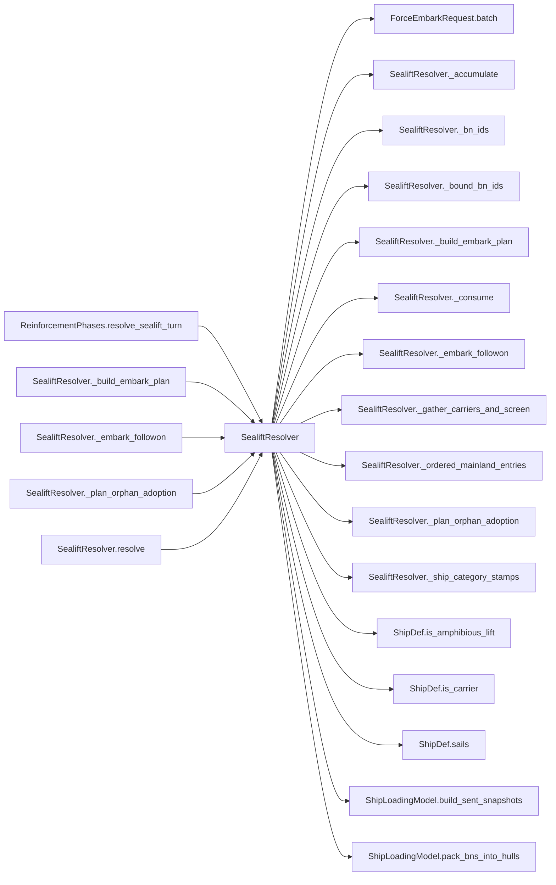

# SealiftResolver

> **Reading aid, not an execution contract.** No detected edge is not permission to reorder.
> GDScript reads and writes are conservative source analysis; transition writes are also
> checked against the mutation manifest. Potential conflicts may refer to different object
> instances or conditional branches.

Generator format v1; scan scope `scripts/**/*.gd` plus `project.godot` autoload aliases.
Generated from commit `7bbf08693b44`; input SHA-256 `c879af92cf7693c7df1119a11083764377c92a9410144e7b95f361f509613378`;
tool/manifest/fixture SHA-256 `ea366ecafdb8f5cc7ecae22bb7554cd8802d1ed3433c5a903ecc07bbb7230f6c`; stable generation time `2026-08-02T17:09:31-04:00`.
Unresolved-analysis diagnostics on this page: **7**.

## Source summary

Pure planner for the cross-turn sealift phase (plan 0004): runs at the top of each turn, BEFORE the anti-ship crossing. Two deterministic steps, no dice:  1. adopt  — any at-sea BN in ship_reserve not yet bound to a cohort (the programmed first echelon on turn 1, or a straggler) is wrapped in a "sent" cohort using the same minimum-lift derivation the crossing used before (ShipLoadingModel.build_sent_snapshots over the FULL carrier set), so the default scenario's sent fleet is unchanged. 2. embark — remaining ready AMPHIBIOUS capacity loads follow-on BNs from the mainland pool (departed brigades finished first, then new brigades), binding them in a new cohort.  The return/reload pipelines are ticked by the coordinator through SealiftTransitions BEFORE this runs, and the hulls they released arrive here as `returned_by_type` — they are available to sail the same turn they arrive back, so they join the local ready pool the packer works against.  Escorts (capacity 0) screen the wave and, unless they diverted to reload their SAM magazine, stay in the ready pool (same-turn round trip). Only carrier hulls (capacity > 0) enter cohorts and go busy. Amphibious-lift eligibility is classified by ShipDef.is_amphibious_lift() / is_carrier() / sails().  It lives in `scripts/calc/` rather than with the appliers for one reason and one reason only: that directory's claim is that it holds no file which writes campaign state, and this one qualifies as of plan 0045. `AntishipResolver` still sits under `resolvers/` because it still rewrites the caller's reserve entries in place — same rule, opposite answer.  Writes NO campaign state — not the sealift queues, not the cohorts, and not the battalion rows it plans over. Everything it decides comes back as a plan: cohort binding and mainland/reserve membership for ForceTransitions to apply, hull totals for SealiftTransitions, and the per-battalion carrier CATEGORY (plan 0006) as a {bn_id -> category} map rather than a stamp written into the reserve row. That last one used to be written here in place, which quietly made this planner a second writer of force-owned storage and could leave a category behind from an embark the authority then refused. state: SealiftState (READ for cohort/pool membership; never written here). ship_reserve: current active reserve (at-sea BNs). ready_by_type: {ship_type -> ready hull count} (from fleet ShipState.ready, before this turn's pipeline release). returned_by_type: {ship_type -> int} the pipeline released this turn. ship_defs: {ship_type -> ShipDef}.  Returns {

Source: `scripts/calc/SealiftResolver.gd`

## Placement in resolution code

| Caller | Call-site instance |
|---|---|
| [`ReinforcementPhases.resolve_sealift_turn`](ordering_ReinforcementPhases_resolve_sealift_turn.md) | `SealiftResolver.resolve` at `76` |
| [`SealiftResolver._build_embark_plan`](SealiftResolver.md) | `SealiftResolver._bn_ids` at `183` |
| [`SealiftResolver._embark_followon`](SealiftResolver.md) | `SealiftResolver._ordered_mainland_entries` at `137` |
| [`SealiftResolver._embark_followon`](SealiftResolver.md) | `SealiftResolver._gather_carriers_and_screen` at `141` |
| [`SealiftResolver._embark_followon`](SealiftResolver.md) | `SealiftResolver._consume` at `147` |
| [`SealiftResolver._embark_followon`](SealiftResolver.md) | `SealiftResolver._accumulate` at `148` |
| [`SealiftResolver._embark_followon`](SealiftResolver.md) | `SealiftResolver._build_embark_plan` at `149` |
| [`SealiftResolver._plan_orphan_adoption`](SealiftResolver.md) | `SealiftResolver._bound_bn_ids` at `96` |
| [`SealiftResolver._plan_orphan_adoption`](SealiftResolver.md) | `SealiftResolver._gather_carriers_and_screen` at `104` |
| [`SealiftResolver._plan_orphan_adoption`](SealiftResolver.md) | `SealiftResolver._consume` at `109` |
| [`SealiftResolver._plan_orphan_adoption`](SealiftResolver.md) | `SealiftResolver._accumulate` at `110` |
| [`SealiftResolver._plan_orphan_adoption`](SealiftResolver.md) | `SealiftResolver._bn_ids` at `111` |
| [`SealiftResolver._plan_orphan_adoption`](SealiftResolver.md) | `SealiftResolver._ship_category_stamps` at `111` |
| [`SealiftResolver.resolve`](SealiftResolver.md) | `SealiftResolver._plan_orphan_adoption` at `65` |
| [`SealiftResolver.resolve`](SealiftResolver.md) | `SealiftResolver._embark_followon` at `69` |
| [`SealiftResolver.resolve`](SealiftResolver.md) | `SealiftResolver._gather_carriers_and_screen` at `73` |

## Dependency diagram

## Model-field evidence

| Field | Read | Written |
|---|:---:|:---:|
| `ForceEmbarkRequest.batch_bn_ids` | yes | yes |
| `ForceEmbarkRequest.batch_hulls_by_type` |  | yes |
| `ForceEmbarkRequest.brigade_specs` |  | yes |
| `ForceEmbarkRequest.ship_categories` |  | yes |
| `SealiftState.cohorts` | yes |  |
| `SealiftState.mainland_pool` | yes |  |
| `ShipDef.carrying_capacity_bn_equiv` | yes |  |
| `ShipDef.category` | yes |  |
| `ShipDef.infrastructure` | yes |  |
| `ShipDef.is_decoy` | yes |  |
| `ShipDef.name` | yes |  |

## Method dependencies

| Method | Calls (transitive effects are included above) |
|---|---|
| `_accumulate` | — |
| `_bn_ids` | — |
| `_bound_bn_ids` | — |
| `_build_embark_plan` | `SealiftResolver._bn_ids` |
| `_consume` | — |
| `_embark_followon` | `SealiftResolver._accumulate`, `SealiftResolver._build_embark_plan`, `SealiftResolver._consume`, `SealiftResolver._gather_carriers_and_screen`, `SealiftResolver._ordered_mainland_entries`, `ShipLoadingModel.pack_bns_into_hulls` |
| `_gather_carriers_and_screen` | `ShipDef.is_amphibious_lift`, `ShipDef.is_carrier`, `ShipDef.sails` |
| `_ordered_mainland_entries` | — |
| `_plan_orphan_adoption` | `SealiftResolver._accumulate`, `SealiftResolver._bn_ids`, `SealiftResolver._bound_bn_ids`, `SealiftResolver._consume`, `SealiftResolver._gather_carriers_and_screen`, `SealiftResolver._ship_category_stamps`, `ShipLoadingModel.build_sent_snapshots` |
| `_ship_category_stamps` | — |
| `resolve` | `ForceEmbarkRequest.batch`, `SealiftResolver._embark_followon`, `SealiftResolver._gather_carriers_and_screen`, `SealiftResolver._plan_orphan_adoption` |

## Analysis limits found here

Showing 7 of 7 diagnostics; class pages provide the narrower context.

| Kind | Source | Why it matters |
|---|---|---|
| `multi_call_statement` | `scripts/calc/SealiftResolver.gd:111` `return { "bn_ids": _bn_ids(orphan_bns), "hulls_by_type": adopted_hulls, "ship_categories": _ship_category_stamps( orphan_bns, snapshot["bn_equiv_assigned"], ship_defs), }` | Multiple calls share one statement; the map preserves lexical sites, not nested evaluation order. |
| `untyped_alias` | `scripts/calc/SealiftResolver.gd:220` `var n := int(ready.get(ship_def.name, 0))` | The receiver type could not be proven. |
| `nested_index_unanalysed` | `scripts/calc/SealiftResolver.gd:251` `stamps[String((bns[idx] as Dictionary).get("id", ""))] = category` | Nested collection indexes exceed the balanced-chain subset; this statement contributes no field effects. |
| `unresolved_receiver` | `scripts/calc/SealiftResolver.gd:259` `for bn_id in cohort.bn_ids:` | A protected field name appeared on an unresolved receiver. |
| `untyped_iteration` | `scripts/calc/SealiftResolver.gd:259` `for bn_id in cohort.bn_ids:` | The collection element type could not be proven. |
| `callable_or_lambda` | `scripts/calc/ShipLoadingModel.gd:55` `sorted_carriers.sort_custom(func(a: Dictionary, b: Dictionary) -> bool: if not is_equal_approx(float(a["capacity"]), float(b["capacity"])): return float(a["capacity"]) > float(b…` | Callable/lambda dataflow is outside this analyser. |
| `callable_or_lambda` | `scripts/calc/ShipLoadingModel.gd:126` `sorted_carriers.sort_custom(func(a: Dictionary, b: Dictionary) -> bool: if not is_equal_approx(float(a["capacity"]), float(b["capacity"])): return float(a["capacity"]) > float(b…` | Callable/lambda dataflow is outside this analyser. |
