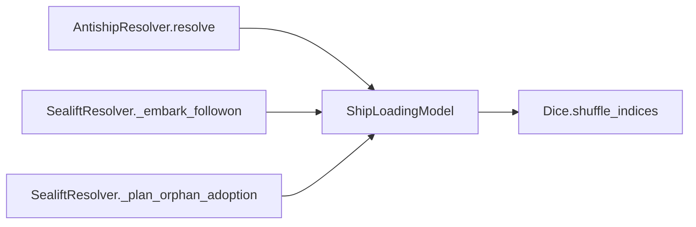

# ShipLoadingModel

> **Reading aid, not an execution contract.** No detected edge is not permission to reorder.
> GDScript reads and writes are conservative source analysis; transition writes are also
> checked against the mutation manifest. Potential conflicts may refer to different object
> instances or conditional branches.

Generator format v1; scan scope `scripts/**/*.gd` plus `project.godot` autoload aliases.
Generated from commit `7bbf08693b44`; input SHA-256 `c879af92cf7693c7df1119a11083764377c92a9410144e7b95f361f509613378`;
tool/manifest/fixture SHA-256 `ea366ecafdb8f5cc7ecae22bb7554cd8802d1ed3433c5a903ecc07bbb7230f6c`; stable generation time `2026-08-02T17:09:31-04:00`.
Unresolved-analysis diagnostics on this page: **3**.

## Source summary

D3-D BN <-> ship mapping. Bridges HexCombat's BN-carrying ship_reserve to the anti-ship crossing model (which targets a per-ship-type "sent" fleet) and back.  Source oracle: TaiwanInvasionViewer src/services/manifest_allocator.py - forward  (BNs -> ships):  capacity/eligibility concepts from _AllocationRun._assign_ships, but the hull-count derivation is HexCombat's (see build_sent_snapshots). - backward (ship loss -> BN loss): _AllocationRun._apply_casualties (lost-capacity sampling)  Two deliberate HexCombat simplifications (consistent with OffloadCalculator's abstraction level, logged as in-spirit divergences in PLAN.md): 1. Every BN is 1.0 BN-equiv. TIV weights each BN by configurator.get_unit_transport_weight(); HexCombat's offload models no per-type transport weight, so all BNs weigh 1.0 BN-equiv and all capacities are read in BN-equiv (data/ships.json carrying_capacity_bn_equiv) -- no tons. 2. The amphibious-vs-cargo ship-eligibility split is dropped. TIV's _ship_can_carry_battalion gates amphibious BNs to amphibious ship categories; OffloadCalculator already ignores ship eligibility, so any carrying ship (capacity > 0) may carry any BN here.  Pure RefCounted lib -- no Node/GameState/ShipState coupling. Forward packing is deterministic; only the backward BN selection draws from the injected Dice. Forward: derive the "sent" crossing fleet from the BNs still at sea.  HexCombat-specific minimum-lift derivation. TIV (_assign_ships) starts from a live sailing set of ships already in transit and assigns BNs to fill them; HexCombat has no ship-cycle, so we instead derive the smallest fleet that lifts the at-sea BNs: fill the highest-capacity carrier types first (capacity_bn_equiv desc, ties by ship_type), consuming ceil(remaining_bn / capacity) hulls per type, clamped to the ready count. The capacity/eligibility concepts follow TIV; the hull-count derivation is ours. The escort + decoy screen always sails on top.  Args: bn_count: int                  -- number of BNs still at sea (each 1.0 BN-equiv). carriers: Array of Dictionary  -- {ship_type:String, capacity:float, ready:int}; capacity > 0. screen:   Array of Dictionary  -- {ship_type:String, ready:int}; escorts + decoys (capacity 0) that sail with the wave as defensive screen / missile soak.  Returns Dictionary:

Source: `scripts/calc/ShipLoadingModel.gd`

## Placement in resolution code

| Caller | Call-site instance |
|---|---|
| [`AntishipResolver.resolve`](AntishipResolver.md) | `ShipLoadingModel.resolve_bn_losses` at `98` |
| [`SealiftResolver._embark_followon`](SealiftResolver.md) | `ShipLoadingModel.pack_bns_into_hulls` at `142` |
| [`SealiftResolver._plan_orphan_adoption`](SealiftResolver.md) | `ShipLoadingModel.build_sent_snapshots` at `105` |

## Dependency diagram

## Model-field evidence

| Field | Read | Written |
|---|:---:|:---:|
| _No persistent model field was resolved_ | | |

## Method dependencies

| Method | Calls (transitive effects are included above) |
|---|---|
| `build_sent_snapshots` | — |
| `pack_bns_into_hulls` | — |
| `resolve_bn_losses` | `Dice.shuffle_indices` |

## Analysis limits found here

Showing 3 of 3 diagnostics; class pages provide the narrower context.

| Kind | Source | Why it matters |
|---|---|---|
| `callable_or_lambda` | `scripts/calc/ShipLoadingModel.gd:55` `sorted_carriers.sort_custom(func(a: Dictionary, b: Dictionary) -> bool: if not is_equal_approx(float(a["capacity"]), float(b["capacity"])): return float(a["capacity"]) > float(b…` | Callable/lambda dataflow is outside this analyser. |
| `callable_or_lambda` | `scripts/calc/ShipLoadingModel.gd:126` `sorted_carriers.sort_custom(func(a: Dictionary, b: Dictionary) -> bool: if not is_equal_approx(float(a["capacity"]), float(b["capacity"])): return float(a["capacity"]) > float(b…` | Callable/lambda dataflow is outside this analyser. |
| `nested_index_unanalysed` | `scripts/calc/ShipLoadingModel.gd:219` `var bn: Dictionary = bns_at_sea[int(order[i])]` | Nested collection indexes exceed the balanced-chain subset; this statement contributes no field effects. |
