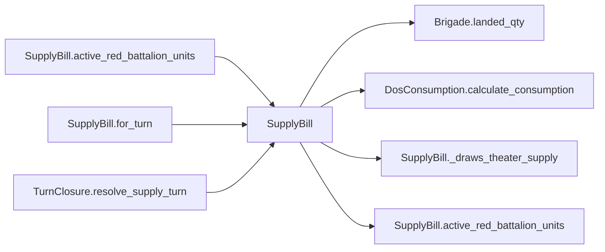

# SupplyBill

> **Reading aid, not an execution contract.** No detected edge is not permission to reorder.
> GDScript reads and writes are conservative source analysis; transition writes are also
> checked against the mutation manifest. Potential conflicts may refer to different object
> instances or conditional branches.

Generator format v1; scan scope `scripts/**/*.gd` plus `project.godot` autoload aliases.
Generated from commit `8829181ae4b6`; input SHA-256 `1c5ff5483615f0cca5b2767540c56e9a13e1387c4c1a3c66db909a97ad2e94fb`;
tool/manifest/fixture SHA-256 `ea366ecafdb8f5cc7ecae22bb7554cd8802d1ed3433c5a903ecc07bbb7230f6c`; stable generation time `2026-08-02T09:03:12-04:00`.
Unresolved-analysis diagnostics on this page: **3**.

## Source summary

Who eats today, and how much (plan 0049). Pure: it reads the content store's roster, decides which Red battalions draw Taiwan-theater supply and which brigades were active, and returns the consumption row `DosConsumption` computes. It applies NOTHING — `SupplyTransitions` alone moves the balance and appends the ledger row.  This is the gathering `TurnClosure.resolve_supply_turn` did inline before the supply aggregate got an authority. It moved here rather than into the authority because an authority may not read a content autoload, and it takes `not_ashore` as an ARGUMENT rather than calling `state.refresh_not_ashore_by_type()` itself: that method assigns a cache that outlives the call, which is exactly what a calculator may not do. The coordinator refreshes and passes the result in. units: DosConsumption battalion records ({brigade_id, type, brigade_type} per BN instance). not_ashore: brigade_id -> {battalion_type: count}, freshly recomputed by the caller. Returns the consumption summary Dictionary (the public/JSON contract for this phase).

Source: `scripts/calc/SupplyBill.gd`

## Placement in resolution code

| Caller | Call-site instance |
|---|---|
| [`SupplyBill.active_red_battalion_units`](SupplyBill.md) | `SupplyBill._draws_theater_supply` at `42` |
| [`SupplyBill.for_turn`](SupplyBill.md) | `SupplyBill._draws_theater_supply` at `24` |
| [`SupplyBill.for_turn`](SupplyBill.md) | `SupplyBill.active_red_battalion_units` at `30` |
| [`TurnClosure.resolve_supply_turn`](ordering_TurnClosure_resolve_supply_turn.md) | `SupplyBill.for_turn` at `34` |

## Dependency diagram

## Model-field evidence

| Field | Read | Written |
|---|:---:|:---:|
| `Battalion.qty` | yes |  |
| `Battalion.type` | yes |  |
| `Brigade.composition` | yes |  |
| `Brigade.destroyed` | yes |  |
| `Brigade.fought_this_turn` | yes |  |
| `Brigade.hex_id` | yes |  |
| `Brigade.id` | yes |  |
| `Brigade.moved_this_turn` | yes |  |
| `Brigade.nato_type` | yes |  |
| `Brigade.team` | yes |  |
| `GameDataStore.brigades` | yes |  |

## Method dependencies

| Method | Calls (transitive effects are included above) |
|---|---|
| `_draws_theater_supply` | — |
| `active_red_battalion_units` | `Brigade.landed_qty`, `SupplyBill._draws_theater_supply` |
| `for_turn` | `DosConsumption.calculate_consumption`, `SupplyBill._draws_theater_supply`, `SupplyBill.active_red_battalion_units` |

## Analysis limits found here

Showing 3 of 3 diagnostics; class pages provide the narrower context.

| Kind | Source | Why it matters |
|---|---|---|
| `untyped_iteration` | `scripts/calc/SupplyBill.gd:22` `for brigade_value in store.brigades.values():` | The collection element type could not be proven. |
| `multi_call_statement` | `scripts/calc/SupplyBill.gd:30` `return DosConsumption.calculate_consumption( active_red_battalion_units(store, not_ashore), moved_ids, engaged_ids, turn_number)` | Multiple calls share one statement; the map preserves lexical sites, not nested evaluation order. |
| `untyped_iteration` | `scripts/calc/SupplyBill.gd:40` `for brigade_value in store.brigades.values():` | The collection element type could not be proven. |
