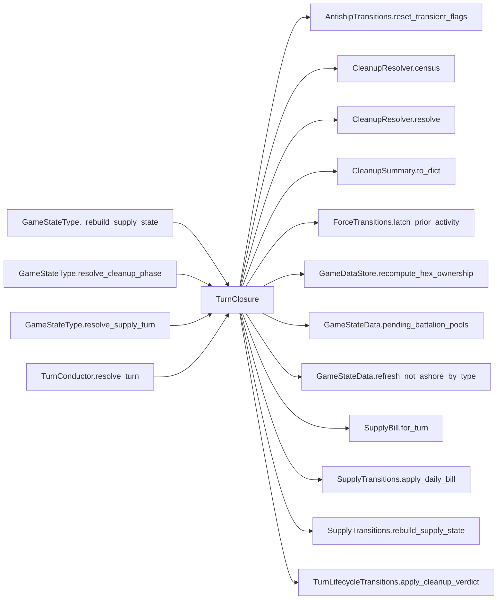

# TurnClosure

> **Reading aid, not an execution contract.** No detected edge is not permission to reorder.
> GDScript reads and writes are conservative source analysis; transition writes are also
> checked against the mutation manifest. Potential conflicts may refer to different object
> instances or conditional branches.

Generator format v1; scan scope `scripts/**/*.gd` plus `project.godot` autoload aliases.
Generated from commit `7bbf08693b44`; input SHA-256 `c879af92cf7693c7df1119a11083764377c92a9410144e7b95f361f509613378`;
tool/manifest/fixture SHA-256 `ea366ecafdb8f5cc7ecae22bb7554cd8802d1ed3433c5a903ecc07bbb7230f6c`; stable generation time `2026-08-02T17:09:31-04:00`.
Unresolved-analysis diagnostics on this page: **14**.

## Computed effect warning

The source summary claims this class is pure, but the generated call closure reaches
protected writes: `AntishipSystem.active`, `AntishipSystem.destroyed_this_turn`, `AntishipSystem.fired`, `AntishipSystem.suppressed_now`, `Brigade.fought_last_turn`, `Brigade.fought_this_turn`, `Brigade.moved_admin_this_turn`, `Brigade.moved_last_turn`, `Brigade.moved_this_turn`, `Brigade.organization`; _+7 more_. Treat the computed evidence and
visible uncertainty as the safer reading; the source claim needs a separate fix.

## Source summary

The end-of-turn accounting pair (plan 0038 step 3): supply bills who fought, cleanup censuses who is left. They run last, back to back, and neither draws dice — supply reads the flags combat just set (`moved_this_turn`, `fought_this_turn`), cleanup then latches those flags into their prior-turn counterparts, clears the anti-ship per-turn flags, recounts both sides and decides whether the game is over. (The per-turn flags themselves are cleared by `begin_next_turn`, not here.) Both of the cleanup phase's applications live in THIS file rather than in `CleanupResolver`, which is pure — plan 0055.  `TurnConductor` keeps the ORDERING (the when); this module only owns the how. Same contract as every other resolver: static, first argument `state: GameStateData` mutated in place, reads the GameData content autoload but never the GameState autoload singleton. --- Supply phase — the DOS bill for the day --------------------------------------------------- Rebuild the Red DOS pool for a (re)loaded scenario. GameState reaches the supply authority through this module rather than naming it directly, the same way `_rebuild_infrastructure_state` reaches `InfrastructureTransitions` through `ReinforcementPhases` — the phase's owner is its door.

Source: `scripts/phases/TurnClosure.gd`

## Placement in resolution code

| Caller | Call-site instance |
|---|---|
| `GameStateType._rebuild_supply_state` | `TurnClosure.rebuild_supply_state` at `346` |
| `GameStateType.resolve_cleanup_phase` | `TurnClosure.resolve_cleanup_phase` at `288` |
| `GameStateType.resolve_supply_turn` | `TurnClosure.resolve_supply_turn` at `272` |
| [`TurnConductor.resolve_turn`](ordering_TurnConductor_resolve_turn.md) | `TurnClosure.resolve_supply_turn` at `94` |
| [`TurnConductor.resolve_turn`](ordering_TurnConductor_resolve_turn.md) | `TurnClosure.resolve_cleanup_phase` at `95` |

## Dependency diagram

## Model-field evidence

| Field | Read | Written |
|---|:---:|:---:|
| `AirInsertionState.pool` | yes |  |
| `AntishipSystem.active` |  | yes |
| `AntishipSystem.destroyed_this_turn` |  | yes |
| `AntishipSystem.fired` |  | yes |
| `AntishipSystem.suppressed_now` |  | yes |
| `Battalion.qty` | yes |  |
| `Battalion.type` | yes |  |
| `Brigade.composition` | yes |  |
| `Brigade.destroyed` | yes |  |
| `Brigade.fought_last_turn` |  | yes |
| `Brigade.fought_this_turn` | yes | yes |
| `Brigade.hex_id` | yes |  |
| `Brigade.id` | yes |  |
| `Brigade.moved_admin_this_turn` | yes | yes |
| `Brigade.moved_last_turn` |  | yes |
| `Brigade.moved_this_turn` | yes | yes |
| `Brigade.nato_type` | yes |  |
| `Brigade.organization` | yes | yes |
| `Brigade.team` | yes |  |
| `CleanupSummary.antiship_systems_reset` | yes | yes |
| `CleanupSummary.china_battalions_on_taiwan` | yes | yes |
| `CleanupSummary.game_over` | yes | yes |
| `CleanupSummary.taiwan_battalions_on_taiwan` | yes | yes |
| `CleanupSummary.victory_reason` | yes | yes |
| `CleanupSummary.winner` | yes | yes |
| `ForceActivityRequest.operation` | yes | yes |
| `GameDataStore.brigades` | yes |  |
| `GameDataStore.brigades_by_hex` | yes |  |
| `GameDataStore.hex_lookup` | yes |  |
| `GameDataStore.hex_states` | yes |  |
| `GameDataStore.victory_config` | yes |  |
| `GameStateData._china_has_landed` | yes | yes |
| `GameStateData.air_insertion_state` | yes |  |
| `GameStateData.antiship_systems` | yes |  |
| `GameStateData.game_over` |  | yes |
| `GameStateData.last_cleanup_summary` | yes | yes |
| `GameStateData.not_ashore_by_type` | yes | yes |
| `GameStateData.sealift_state` | yes |  |
| `GameStateData.ship_reserve` | yes |  |
| `GameStateData.supply_state` | yes | yes |
| `GameStateData.turn_number` | yes |  |
| `GameStateData.winner` |  | yes |
| `HexState.hex_owner` |  | yes |
| `SealiftState.mainland_pool` | yes |  |
| `SupplyState.current_dos_tons` | yes | yes |
| `SupplyState.day_history` | yes | yes |

## Method dependencies

| Method | Calls (transitive effects are included above) |
|---|---|
| `rebuild_supply_state` | `SupplyTransitions.rebuild_supply_state` |
| `resolve_cleanup_phase` | `AntishipTransitions.reset_transient_flags`, `CleanupResolver.resolve`, `CleanupSummary.to_dict`, `ForceTransitions.latch_prior_activity`, `GameDataStore.recompute_hex_ownership`, `GameStateData.pending_battalion_pools`, `TurnLifecycleTransitions.apply_cleanup_verdict` |
| `resolve_supply_turn` | `GameStateData.refresh_not_ashore_by_type`, `SupplyBill.for_turn`, `SupplyTransitions.apply_daily_bill` |
| `taiwan_battalion_census` | `CleanupResolver.census`, `GameStateData.pending_battalion_pools` |

## Analysis limits found here

Showing 14 of 14 diagnostics; class pages provide the narrower context.

| Kind | Source | Why it matters |
|---|---|---|
| `untyped_alias` | `scripts/calc/CleanupResolver.gd:35` `var counted: Variant = victory_config.get("taiwan_hexes", null)` | The receiver type could not be proven. |
| `untyped_alias` | `scripts/calc/CleanupResolver.gd:51` `var not_ashore := int(not_ashore_by_brigade.get(brigade.id, 0))` | The receiver type could not be proven. |
| `untyped_alias` | `scripts/calc/CleanupResolver.gd:52` `var bn := maxi(0, brigade.get_battalion_count() - not_ashore)` | The receiver type could not be proven. |
| `untyped_iteration` | `scripts/calc/HexOwnershipCalculator.gd:27` `for brigade_id_value in data_store.get_brigades_in_hex(hex_id):` | The collection element type could not be proven. |
| `untyped_iteration` | `scripts/calc/SupplyBill.gd:22` `for brigade_value in store.brigades.values():` | The collection element type could not be proven. |
| `multi_call_statement` | `scripts/calc/SupplyBill.gd:30` `return DosConsumption.calculate_consumption( active_red_battalion_units(store, not_ashore), moved_ids, engaged_ids, turn_number)` | Multiple calls share one statement; the map preserves lexical sites, not nested evaluation order. |
| `untyped_iteration` | `scripts/calc/SupplyBill.gd:40` `for brigade_value in store.brigades.values():` | The collection element type could not be proven. |
| `unresolved_receiver` | `scripts/model/Brigade.gd:60` `total += battalion.qty` | A protected field name appeared on an unresolved receiver. |
| `multi_call_statement` | `scripts/model/GameStateData.gd:126` `not_ashore_by_type = PendingBattalions.by_brigade_and_type(pending_battalion_pools())` | Multiple calls share one statement; the map preserves lexical sites, not nested evaluation order. |
| `source_effect_contradiction` | `scripts/phases/TurnClosure.gd:0` `source says 'pure —' but analysis found AntishipSystem.active, AntishipSystem.destroyed_this_turn, AntishipSystem.fired, AntishipSystem.suppressed_now, Brigade.fought_last_turn,…` | Source prose claims purity while the resolved call closure reaches protected writes. |
| `untyped_alias` | `scripts/phases/TurnClosure.gd:33` `var not_ashore := state.refresh_not_ashore_by_type()` | The receiver type could not be proven. |
| `multi_call_statement` | `scripts/phases/TurnClosure.gd:55` `var outcome := CleanupResolver.resolve( reset_count, GameData.brigades, state.pending_battalion_pools(), GameData.victory_config, state.turn_number, state._china_has_landed)` | Multiple calls share one statement; the map preserves lexical sites, not nested evaluation order. |
| `multi_call_statement` | `scripts/phases/TurnClosure.gd:70` `return CleanupResolver.census( GameData.brigades, state.pending_battalion_pools(), GameData.victory_config)` | Multiple calls share one statement; the map preserves lexical sites, not nested evaluation order. |
| `untyped_alias` | `scripts/transitions/MapTransitions.gd:98` `var state_value: Variant = data_store.hex_states.get(hex_id)` | The receiver type could not be proven. |
