# TurnConductor

> **Reading aid, not an execution contract.** No detected edge is not permission to reorder.
> GDScript reads and writes are conservative source analysis; transition writes are also
> checked against the mutation manifest. Potential conflicts may refer to different object
> instances or conditional branches.

Generator format v1; scan scope `scripts/**/*.gd` plus `project.godot` autoload aliases.
Generated from commit `8829181ae4b6`; input SHA-256 `1c5ff5483615f0cca5b2767540c56e9a13e1387c4c1a3c66db909a97ad2e94fb`;
tool/manifest/fixture SHA-256 `ea366ecafdb8f5cc7ecae22bb7554cd8802d1ed3433c5a903ecc07bbb7230f6c`; stable generation time `2026-08-02T09:03:12-04:00`.
Unresolved-analysis diagnostics on this page: **359**.

## Source summary

Static turn orchestration for HexCombat's WeGo resolution (plan 0014 P3). Every public method takes `state: GameStateData` as its first argument, mutates it in place, and returns the same typed value the pre-refactor GameState method returned. Reading the GameData content autoload (map/OOB/scenario content) is allowed — it is the universal read-only content source, not runtime state — but this class NEVER takes the GameState autoload singleton as a parameter, which is what makes it unit-testable against a GameStateData built from scratch. GameState.gd's resolve_* methods are now one-line delegating wrappers to these.  Plan 0038: the phases themselves live in sibling modules — arrivals (sealift, offload, ROC mobilization, air insertion) in `ReinforcementPhases`, fires (IJFS, anti-ship) in `FiresPhases`, end-of-turn accounting (supply, cleanup) in `TurnClosure`; force mutations shared across phases go through `ForceTransitions`. What is left here is the turn's ORDER plus the phases whose application interleaves with it: movement, ground combat, FEBA retreats, and the façade-only front-line phase. `resolve_turn` below still holds the full ordered call list — the modules own the HOW of a phase, never the WHEN.

Source: `scripts/phases/TurnConductor.gd`

## Placement in resolution code

| Caller | Call-site instance |
|---|---|
| `GameStateType.resolve_turn` | `TurnConductor.resolve_turn` at `223` |
| [`TurnConductor.apply_feba_retreats`](ordering_TurnConductor_apply_feba_retreats.md) | `TurnConductor.find_retreat_hex` at `289` |
| [`TurnConductor.resolve_combat_at`](ordering_TurnConductor_resolve_combat_at.md) | `TurnConductor.combat_contributors_for` at `174` |
| [`TurnConductor.resolve_combat_at`](ordering_TurnConductor_resolve_combat_at.md) | `TurnConductor.combat_contributors_for` at `175` |
| [`TurnConductor.resolve_combat_at`](ordering_TurnConductor_resolve_combat_at.md) | `TurnConductor.defender_combat_modifier` at `189` |
| [`TurnConductor.resolve_turn`](ordering_TurnConductor_resolve_turn.md) | `TurnConductor.apply_move_orders` at `65` |
| [`TurnConductor.resolve_turn`](ordering_TurnConductor_resolve_turn.md) | `TurnConductor.apply_move_orders` at `66` |
| [`TurnConductor.resolve_turn`](ordering_TurnConductor_resolve_turn.md) | `TurnConductor.find_contested_hexes` at `70` |
| [`TurnConductor.resolve_turn`](ordering_TurnConductor_resolve_turn.md) | `TurnConductor.resolve_combat_at` at `85` |
| [`TurnConductor.resolve_turn`](ordering_TurnConductor_resolve_turn.md) | `TurnConductor.apply_feba_retreats` at `89` |

## Dependency diagram

```mermaid
flowchart LR
  n_9e4200c7ed88["TurnConductor"]
  n_98ba16994af9["GameStateType.resolve_turn"] --> n_9e4200c7ed88
  n_22d3a4fdb849["TurnConductor.apply_feba_retreats"] --> n_9e4200c7ed88
  n_bbff18c4ec73["TurnConductor.resolve_combat_at"] --> n_9e4200c7ed88
  n_580123a39c53["TurnConductor.resolve_turn"] --> n_9e4200c7ed88
  n_9e4200c7ed88 --> n_6d61e2a4ec31["Brigade.landed_battalion_count"]
  n_9e4200c7ed88 --> n_893adb903651["CombatResolver.brigade_ids"]
  n_9e4200c7ed88 --> n_a29acb4f4c7e["CombatResolver.inject_supply_effectiveness"]
  n_9e4200c7ed88 --> n_a79aa34fdf09["CombatResolver.resolve_at"]
  n_9e4200c7ed88 --> n_b69f1322c207["CombatRules.new"]
  n_9e4200c7ed88 --> n_18b99cbee55e["Dice.derive"]
  n_9e4200c7ed88 --> n_393267cb200d["FiresPhases.apply_ijfs_maneuver_casualties"]
  n_9e4200c7ed88 --> n_d00a505af655["FiresPhases.resolve_antiship_turn"]
  n_9e4200c7ed88 --> n_c37265469568["FiresPhases.resolve_ijfs_turn"]
  n_9e4200c7ed88 --> n_1c0000d13f4c["ForceTransitions.apply_battalion_casualties"]
  n_9e4200c7ed88 --> n_3bb037660b9c["ForceTransitions.ground_combat_casualty_request"]
  n_9e4200c7ed88 --> n_1a2114b8c4ea["ForceTransitions.pending_pool_roster_violations"]
  n_9e4200c7ed88 --> n_7a903576ee73["GameDataStore.apply_feba_delta"]
  n_9e4200c7ed88 --> n_8db5402817f3["GameDataStore.clear_feba"]
  n_9e4200c7ed88 --> n_f8538e14a365["GameDataStore.get_brigade"]
  n_9e4200c7ed88 --> n_167e76d5b12d["GameDataStore.get_brigades_in_hex"]
  n_9e4200c7ed88 --> n_a0b72c72fb0c["GameDataStore.get_neighbors"]
  n_9e4200c7ed88 --> n_11903916f414["GameDataStore.get_terrain"]
  n_9e4200c7ed88 --> n_158bb4af4330["GameDataStore.mark_brigade_fought"]
  n_9e4200c7ed88 --> n_4ddd18d0cccf["GameDataStore.mark_brigade_moved"]
  n_9e4200c7ed88 --> n_ab4a9a951e53["GameDataStore.recompute_hex_ownership"]
  n_9e4200c7ed88 --> n_7f87d1c40e49["GameDataStore.set_brigade_hex"]
  n_9e4200c7ed88 --> n_f308a59f19a5["GameDataStore.validate_runtime_indexes"]
  n_9e4200c7ed88 --> n_6b71d93aa811["GameStateData.refresh_not_ashore_by_type"]
  n_9e4200c7ed88 --> n_ca656b093dca["MoveOrder.is_administrative"]
  n_9e4200c7ed88 --> n_94e744f35dae["ReinforcementPhases.isolated_air_landed_brigades"]
  n_9e4200c7ed88 --> n_8c5de71f1269["ReinforcementPhases.resolve_air_insertion_turn"]
  n_9e4200c7ed88 --> n_f6b08af83bfd["ReinforcementPhases.resolve_mobilization_turn"]
  n_9e4200c7ed88 --> n_989e7bece212["ReinforcementPhases.resolve_offload_turn"]
  n_9e4200c7ed88 --> n_47f7446193b6["ReinforcementPhases.resolve_sealift_turn"]
  n_9e4200c7ed88 --> n_3eca1f04028f["SeededDice.new"]
  n_9e4200c7ed88 --> n_c7f0f2fd972e["TurnClosure.resolve_cleanup_phase"]
  n_9e4200c7ed88 --> n_46ad34c5cfb9["TurnClosure.resolve_supply_turn"]
  n_9e4200c7ed88 --> n_26457c5f0e8c["TurnConductor.apply_feba_retreats"]
  n_9e4200c7ed88 --> n_c9326bfbfb5f["TurnConductor.apply_move_orders"]
  n_9e4200c7ed88 --> n_d89300c81fb2["TurnConductor.combat_contributors_for"]
  n_9e4200c7ed88 --> n_f236cdb37db8["TurnConductor.defender_combat_modifier"]
  n_9e4200c7ed88 --> n_ef529b145593["TurnConductor.find_contested_hexes"]
  n_9e4200c7ed88 --> n_524290ea1783["TurnConductor.find_retreat_hex"]
  n_9e4200c7ed88 --> n_50ee658a0e14["TurnConductor.resolve_combat_at"]
  n_9e4200c7ed88 --> n_514ce3b89548["TurnLifecycleTransitions.begin_resolution"]
  n_9e4200c7ed88 --> n_967d27e6049d["TurnLifecycleTransitions.end_resolution"]
```

## Model-field evidence

| Field | Read | Written |
|---|:---:|:---:|
| `AirInsertionResolutionPlan.budget` | yes | yes |
| `AirInsertionResolutionPlan.caps_after` | yes | yes |
| `AirInsertionResolutionPlan.config` | yes | yes |
| `AirInsertionResolutionPlan.dice` | yes | yes |
| `AirInsertionResolutionPlan.hex_can_receive` | yes | yes |
| `AirInsertionResolutionPlan.landings` | yes | yes |
| `AirInsertionResolutionPlan.orders` | yes | yes |
| `AirInsertionResolutionPlan.pool_sent` | yes | yes |
| `AirInsertionResolutionPlan.state` | yes | yes |
| `AirInsertionResolutionPlan.substream` | yes | yes |
| `AirInsertionResolutionPlan.summary` | yes | yes |
| `AirInsertionResolutionPlan.threat` | yes | yes |
| `AirInsertionResolutionPlan.turn_number` | yes | yes |
| `AirInsertionState.caps` | yes | yes |
| `AirInsertionState.first_turn` | yes |  |
| `AirInsertionState.history` | yes | yes |
| `AirInsertionState.landed` | yes | yes |
| `AirInsertionState.pool` | yes | yes |
| `AirInsertionSummary.attrition_by_class` | yes | yes |
| `AirInsertionSummary.battalions_landed` | yes | yes |
| `AirInsertionSummary.battalions_lost` | yes | yes |
| `AirInsertionSummary.caps_after` | yes | yes |
| `AirInsertionSummary.caps_before` | yes | yes |
| `AirInsertionSummary.drops` | yes | yes |
| `AirInsertionSummary.pending_battalions` | yes | yes |
| `AirInsertionSummary.pending_brigades` | yes | yes |
| `AirInsertionSummary.rejected` | yes | yes |
| `AirLiftRequest.drops` | yes | yes |
| `AirLiftRequest.turn_number` | yes | yes |
| `AntishipCrossingContext.active_tos` | yes | yes |
| `AntishipCrossingContext.combat_catalog` | yes | yes |
| `AntishipCrossingContext.crossing_config` | yes | yes |
| `AntishipCrossingContext.escort_sam` | yes | yes |
| `AntishipCrossingContext.ship_snapshots` | yes | yes |
| `AntishipCrossingContext.systems_fired` | yes | yes |
| `AntishipCrossingContext.target_tos` | yes | yes |
| `AntishipCrossingContext.to_adjacency` | yes | yes |
| `AntishipLaunchOutcome.attempted` | yes | yes |
| `AntishipLaunchOutcome.launched` | yes | yes |
| `AntishipLaunchOutcome.postlaunch_destroyed` | yes | yes |
| `AntishipLaunchOutcome.prelaunch_destroyed` | yes | yes |
| `AntishipLaunchOutcome.to_number` | yes | yes |
| `AntishipLaunchOutcome.type_id` | yes | yes |
| `AntishipMagazine.current_counts` | yes | yes |
| `AntishipMagazine.loadout` | yes |  |
| `AntishipResolutionContext.active_tos` | yes | yes |
| `AntishipResolutionContext.antiship_systems` | yes | yes |
| `AntishipResolutionContext.beach_to_to` | yes | yes |
| `AntishipResolutionContext.crossing_reserve` | yes | yes |
| `AntishipResolutionContext.escort_sam` | yes | yes |
| `AntishipResolutionContext.lost_at_sea_accumulator` | yes | yes |
| `AntishipResolutionContext.sent_by_type` | yes | yes |
| `AntishipResolutionContext.ship_defs` | yes | yes |
| `AntishipResolutionContext.to_adjacency` | yes | yes |
| `AntishipSummary.bns_lost_at_sea` | yes | yes |
| `AntishipSummary.crossing_casualties` | yes | yes |
| `AntishipSummary.destroyed_by_ship_type` | yes | yes |
| `AntishipSummary.mine_status` | yes | yes |
| `AntishipSummary.resolved_turn` | yes | yes |
| `AntishipSummary.sent_by_type` | yes | yes |
| `AntishipSummary.systems_fired_count` | yes | yes |
| `AntishipSummary.target_beaches` | yes | yes |
| `AntishipSummary.target_tos` | yes | yes |
| `AntishipSummary.unliftable_bn` | yes | yes |
| `AntishipSummary.wave_bns` | yes | yes |
| `AntishipSystem.active` |  | yes |
| `AntishipSystem.destroyed` | yes | yes |
| `AntishipSystem.destroyed_this_turn` | yes | yes |
| `AntishipSystem.detectability` |  | yes |
| `AntishipSystem.fired` | yes | yes |
| `AntishipSystem.ijfs_destroyed_cumulative` | yes | yes |
| `AntishipSystem.ijfs_profile` |  | yes |
| `AntishipSystem.launch_destroyed_cumulative` | yes | yes |
| `AntishipSystem.original_quantity` | yes | yes |
| `AntishipSystem.quantity` | yes | yes |
| `AntishipSystem.special` |  | yes |
| `AntishipSystem.suppressed_now` | yes | yes |
| `AntishipSystem.to_number` | yes | yes |
| `AntishipSystem.type_id` | yes | yes |
| `AntishipSystem.type_name` |  | yes |
| `Battalion.qty` | yes | yes |
| `Battalion.type` | yes |  |
| `BeachDef.depth` | yes |  |
| `BeachDef.floating_piers` | yes |  |
| `BeachDef.hex_id` | yes |  |
| `BeachDef.jackup_barge` | yes |  |
| `BeachDef.offload_rate` | yes |  |
| `Brigade.composition` | yes | yes |
| `Brigade.destroyed` | yes | yes |
| `Brigade.entry_bearing` |  | yes |
| `Brigade.fought_last_turn` | yes | yes |
| `Brigade.fought_this_turn` | yes | yes |
| `Brigade.hex_id` | yes | yes |
| `Brigade.id` | yes |  |
| `Brigade.moved_admin_this_turn` | yes | yes |
| `Brigade.moved_last_turn` | yes | yes |
| `Brigade.moved_this_turn` | yes | yes |
| `Brigade.nato_type` | yes |  |
| `Brigade.organization` | yes | yes |
| `Brigade.team` | yes |  |
| `Brigade.to_number` | yes |  |
| `CleanupSummary.antiship_systems_reset` | yes | yes |
| `CleanupSummary.china_battalions_on_taiwan` | yes | yes |
| `CleanupSummary.game_over` | yes | yes |
| `CleanupSummary.taiwan_battalions_on_taiwan` | yes | yes |
| `CleanupSummary.victory_reason` | yes | yes |
| `CleanupSummary.winner` | yes | yes |
| `CombatResult.attacker_casualties` | yes | yes |
| `CombatResult.attacker_losses` | yes | yes |
| `CombatResult.attacker_maneuver_strength` |  | yes |
| `CombatResult.attacker_strength` |  | yes |
| `CombatResult.combat_detail` | yes | yes |
| `CombatResult.defender_casualties` | yes | yes |
| `CombatResult.defender_losses` | yes | yes |
| `CombatResult.defender_maneuver_strength` |  | yes |
| `CombatResult.defender_strength` |  | yes |
| `CombatResult.defender_terrain_modifier` |  | yes |
| `CombatResult.feba_movement_km` | yes | yes |
| `CombatResult.force_ratio` |  | yes |
| `CombatResult.unmodified_force_ratio` |  | yes |
| `CombatRules.combat_attacker_advantage_ratio` | yes | yes |
| `CombatRules.combat_attacker_ratio_slope` | yes | yes |
| `CombatRules.combat_base_loss_rate` | yes | yes |
| `CombatRules.combat_defender_advantage_ratio` | yes | yes |
| `CombatRules.combat_defender_ratio_slope` | yes | yes |
| `CombatRules.combat_loss_roll_midpoint` | yes | yes |
| `CombatRules.combat_loss_roll_scale` | yes | yes |
| `CombatRules.combat_max_attacker_loss_rate` | yes | yes |
| `CombatRules.combat_max_defender_loss_rate` | yes | yes |
| `CombatRules.combat_min_effective_strength` | yes | yes |
| `CombatRules.combat_min_loss_rate` | yes | yes |
| `CombatRules.default_combat_strength` | yes | yes |
| `CombatRules.defender_terrain_modifier` | yes | yes |
| `CombatRules.feba_balance_clamp` | yes | yes |
| `CombatRules.feba_balance_gain` | yes | yes |
| `CombatRules.feba_base_km` | yes | yes |
| `CombatRules.feba_roll_factor_min` | yes | yes |
| `CombatRules.feba_roll_factor_span` | yes | yes |
| `CombatRules.isolated_red_brigade_ids` | yes | yes |
| `CombatRules.maneuver_casualty_weight` | yes | yes |
| `CombatRules.not_ashore_by_type` | yes | yes |
| `CombatRules.red_out_of_supply_effectiveness` | yes | yes |
| `CombatRules.red_supply_pool` | yes | yes |
| `CombatRules.support_casualty_weight` | yes | yes |
| `CombatRules.support_multipliers` | yes | yes |
| `CombatRules.unscreened_support_strength` | yes | yes |
| `CombatSummary.attacker_brigade_ids` |  | yes |
| `CombatSummary.attacker_losses` |  | yes |
| `CombatSummary.combat_detail` |  | yes |
| `CombatSummary.defender_brigade_ids` |  | yes |
| `CombatSummary.defender_losses` |  | yes |
| `CombatSummary.feba_movement_km` |  | yes |
| `CombatSummary.hex_id` | yes | yes |
| `CombatSummary.owner_after` |  | yes |
| `CommitOrder.brigade_id` | yes |  |
| `CommitOrder.target_hex` | yes |  |
| `ForceActivityRequest.operation` | yes | yes |
| `ForceAirInsertionReceipt.battalions_landed` |  | yes |
| `ForceAirInsertionReceipt.battalions_lost` |  | yes |
| `ForceAirInsertionReceipt.casualty_receipts` |  | yes |
| `ForceAirInsertionReceipt.error` | yes | yes |
| `ForceAirInsertionReceipt.placed_brigades` |  | yes |
| `ForceAirInsertionReceipt.placement_receipts` |  | yes |
| `ForceAirInsertionReceipt.pool_entries_drained` |  | yes |
| `ForceAirInsertionReceipt.success` | yes | yes |
| `ForceAirInsertionRequest.landings` | yes | yes |
| `ForceAirInsertionRequest.turn_number` |  | yes |
| `ForceCasualtyReceipt.applied` |  | yes |
| `ForceCasualtyReceipt.battalion_type` |  | yes |
| `ForceCasualtyReceipt.brigade_id` |  | yes |
| `ForceCasualtyReceipt.cause` |  | yes |
| `ForceCasualtyReceipt.destroyed_brigade` |  | yes |
| `ForceCasualtyReceipt.removed_from_hex` |  | yes |
| `ForceCasualtyReceipt.requested` |  | yes |
| `ForceCasualtyReceipt.source_location` |  | yes |
| `ForceCasualtyRequest.battalion_type` | yes | yes |
| `ForceCasualtyRequest.brigade_id` | yes | yes |
| `ForceCasualtyRequest.cause` | yes | yes |
| `ForceCasualtyRequest.count` | yes | yes |
| `ForceCasualtyRequest.source_location` | yes | yes |
| `ForceCrossingCasualtyRequest.destination` | yes |  |
| `ForceCrossingCasualtyRequest.lost_ids` | yes | yes |
| `ForceCrossingCasualtyRequest.sealift_state` |  | yes |
| `ForceCrossingCasualtyRequest.ship_reserve` |  | yes |
| `ForceCrossingCasualtyRequest.source` | yes |  |
| `ForceCrossingCasualtyResult.error` |  | yes |
| `ForceCrossingCasualtyResult.receipts` |  | yes |
| `ForceCrossingCasualtyResult.success` | yes | yes |
| `ForceEmbarkReceipt.bn_ids_embarked` | yes | yes |
| `ForceEmbarkReceipt.brigade_id` |  | yes |
| `ForceEmbarkReceipt.error` | yes | yes |
| `ForceEmbarkReceipt.success` | yes | yes |
| `ForceEmbarkRequest.batch_bn_ids` | yes | yes |
| `ForceEmbarkRequest.batch_hulls_by_type` | yes | yes |
| `ForceEmbarkRequest.brigade_specs` | yes | yes |
| `ForceEmbarkRequest.destination` | yes |  |
| `ForceEmbarkRequest.ship_categories` | yes | yes |
| `ForceEmbarkRequest.source` | yes |  |
| `ForceMobilizationReceipt.arrived` |  | yes |
| `ForceMobilizationReceipt.battalions_arrived` |  | yes |
| `ForceMobilizationReceipt.deferred` |  | yes |
| `ForceMobilizationReceipt.error` | yes | yes |
| `ForceMobilizationReceipt.placed_brigades` | yes | yes |
| `ForceMobilizationReceipt.placement_receipts` |  | yes |
| `ForceMobilizationReceipt.success` | yes | yes |
| `ForceMobilizationRequest.arrivals` | yes | yes |
| `ForceMobilizationRequest.deferred` | yes | yes |
| `ForceMobilizationRequest.turn_number` | yes | yes |
| `ForceOffloadReceipt.bn_ids_landed` |  | yes |
| `ForceOffloadReceipt.error` | yes | yes |
| `ForceOffloadReceipt.landed_brigade_ids` |  | yes |
| `ForceOffloadReceipt.landings` |  | yes |
| `ForceOffloadReceipt.placement_receipts` |  | yes |
| `ForceOffloadReceipt.success` | yes | yes |
| `ForceOffloadRequest.cargo_arrivals` | yes | yes |
| `ForceOffloadRequest.destination` | yes |  |
| `ForceOffloadRequest.landings` | yes | yes |
| `ForceOffloadRequest.source` | yes |  |
| `ForcePlacementReceipt.brigade_id` |  | yes |
| `ForcePlacementReceipt.destination` |  | yes |
| `ForcePlacementReceipt.new_hex` | yes | yes |
| `ForcePlacementReceipt.old_hex` |  | yes |
| `ForcePlacementReceipt.phase` |  | yes |
| `ForcePlacementRequest.brigade_id` | yes | yes |
| `ForcePlacementRequest.destination` | yes | yes |
| `ForcePlacementRequest.destination_hex` | yes | yes |
| `ForcePlacementRequest.entry_bearing` | yes |  |
| `ForcePlacementRequest.has_entry_bearing` | yes |  |
| `ForcePlacementRequest.phase` | yes | yes |
| `ForceValidationResult.error` | yes | yes |
| `GameDataStore.active_tos` | yes |  |
| `GameDataStore.amphibious_return_time_turns` | yes |  |
| `GameDataStore.auto_jlsf` | yes |  |
| `GameDataStore.beach_to_to` | yes |  |
| `GameDataStore.beaches` | yes |  |
| `GameDataStore.brigades` | yes |  |
| `GameDataStore.brigades_by_hex` | yes | yes |
| `GameDataStore.combat_attacker_advantage_ratio` | yes |  |
| `GameDataStore.combat_attacker_ratio_slope` | yes |  |
| `GameDataStore.combat_base_loss_rate` | yes |  |
| `GameDataStore.combat_defender_advantage_ratio` | yes |  |
| `GameDataStore.combat_defender_ratio_slope` | yes |  |
| `GameDataStore.combat_loss_roll_midpoint` | yes |  |
| `GameDataStore.combat_loss_roll_scale` | yes |  |
| `GameDataStore.combat_max_attacker_loss_rate` | yes |  |
| `GameDataStore.combat_max_defender_loss_rate` | yes |  |
| `GameDataStore.combat_min_effective_strength` | yes |  |
| `GameDataStore.combat_min_loss_rate` | yes |  |
| `GameDataStore.default_combat_strength` | yes |  |
| `GameDataStore.disabled_phases` | yes |  |
| `GameDataStore.escort_reload_time_turns` | yes |  |
| `GameDataStore.feba_balance_clamp` | yes |  |
| `GameDataStore.feba_balance_gain` | yes |  |
| `GameDataStore.feba_base_km` | yes |  |
| `GameDataStore.feba_roll_factor_min` | yes |  |
| `GameDataStore.feba_roll_factor_span` | yes |  |
| `GameDataStore.hex_lookup` | yes |  |
| `GameDataStore.hex_states` | yes |  |
| `GameDataStore.infrastructure` | yes |  |
| `GameDataStore.jlsf_lift_bn_equiv` | yes |  |
| `GameDataStore.maneuver_casualty_weight` | yes |  |
| `GameDataStore.mobilization_holdback` | yes |  |
| `GameDataStore.neighbor_lookup` | yes |  |
| `GameDataStore.offload_weights` | yes |  |
| `GameDataStore.red_air_insertion` | yes |  |
| `GameDataStore.red_out_of_supply_effectiveness` | yes |  |
| `GameDataStore.red_ship_reserve` | yes |  |
| `GameDataStore.ship_defs` | yes |  |
| `GameDataStore.ship_defs_by_name` | yes |  |
| `GameDataStore.support_casualty_weight` | yes |  |
| `GameDataStore.support_multipliers` | yes |  |
| `GameDataStore.terrain_types` | yes |  |
| `GameDataStore.to_adjacency` | yes |  |
| `GameDataStore.unscreened_support_strength` | yes |  |
| `GameDataStore.use_offload_weight_matrix` | yes |  |
| `GameDataStore.victory_config` | yes |  |
| `GameStateData._antiship_built` | yes | yes |
| `GameStateData._antiship_launch_turn` | yes | yes |
| `GameStateData._china_has_landed` | yes | yes |
| `GameStateData._ijfs_day` | yes | yes |
| `GameStateData.air_insert_orders` | yes | yes |
| `GameStateData.air_insertion_state` | yes |  |
| `GameStateData.antiship_containers` | yes | yes |
| `GameStateData.antiship_systems` | yes | yes |
| `GameStateData.commitments` | yes |  |
| `GameStateData.fleet` | yes |  |
| `GameStateData.game_over` |  | yes |
| `GameStateData.ijfs_state` | yes | yes |
| `GameStateData.infrastructure_state` | yes |  |
| `GameStateData.isolated_air_landed_brigades` | yes | yes |
| `GameStateData.jlsf_orders` | yes | yes |
| `GameStateData.last_air_insertion_summary` |  | yes |
| `GameStateData.last_antiship_summary` | yes | yes |
| `GameStateData.last_cleanup_summary` | yes | yes |
| `GameStateData.last_combat_summaries` |  | yes |
| `GameStateData.last_contested_hexes` | yes | yes |
| `GameStateData.last_ijfs_air_oob` |  | yes |
| `GameStateData.last_ijfs_summary` | yes | yes |
| `GameStateData.last_ijfs_writeback` | yes | yes |
| `GameStateData.last_mobilization_summary` |  | yes |
| `GameStateData.last_offload_summary` |  | yes |
| `GameStateData.last_sealift_sent_by_type` | yes | yes |
| `GameStateData.lost_at_sea_accumulator` | yes | yes |
| `GameStateData.mobilization_state` | yes |  |
| `GameStateData.not_ashore_by_type` | yes | yes |
| `GameStateData.orders` | yes |  |
| `GameStateData.pending_lost_at_sea` | yes | yes |
| `GameStateData.phase` | yes | yes |
| `GameStateData.sealift_state` | yes |  |
| `GameStateData.ship_reserve` | yes |  |
| `GameStateData.supply_state` | yes |  |
| `GameStateData.turn_number` | yes |  |
| `GameStateData.winner` |  | yes |
| `HexState.feba_km` | yes | yes |
| `HexState.hex_owner` | yes | yes |
| `IjfsAirPackage.dedicated_size` | yes | yes |
| `IjfsAirPackage.initial_size` | yes | yes |
| `IjfsAirPackage.kind` | yes | yes |
| `IjfsAirPackage.members` | yes | yes |
| `IjfsAirPackage.munition_id` | yes | yes |
| `IjfsAirPackage.package_id` | yes | yes |
| `IjfsAirPackage.target_id` |  | yes |
| `IjfsAirPackage.to_number` | yes | yes |
| `IjfsDailyState.air_classes` | yes | yes |
| `IjfsDailyState.contest_log` | yes | yes |
| `IjfsDailyState.detection_log` | yes | yes |
| `IjfsDailyState.engagement_log` | yes | yes |
| `IjfsDailyState.exquisite_intel_overrides` | yes | yes |
| `IjfsDailyState.free_shot_log` | yes | yes |
| `IjfsDailyState.manpads_intercept_log` | yes | yes |
| `IjfsDailyState.munitions` | yes | yes |
| `IjfsDailyState.pairings` | yes | yes |
| `IjfsDailyState.scenario` | yes | yes |
| `IjfsDailyState.seed` | yes |  |
| `IjfsDailyState.source_files` | yes |  |
| `IjfsDailyState.squadron_force` | yes | yes |
| `IjfsDailyState.strike_log` | yes | yes |
| `IjfsDailyState.taiwan_ad_health_after` | yes | yes |
| `IjfsDailyState.taiwan_ad_health_after_missile_phase` | yes | yes |
| `IjfsDailyState.taiwan_ad_health_after_sead` | yes | yes |
| `IjfsDailyState.taiwan_ad_health_before` | yes | yes |
| `IjfsDailyState.targets` | yes | yes |
| `IjfsDailyState.warnings` | yes |  |
| `IjfsMunition.category` | yes | yes |
| `IjfsMunition.display_label` | yes | yes |
| `IjfsMunition.inventory_remaining` | yes | yes |
| `IjfsMunition.manpads_vulnerability` | yes | yes |
| `IjfsMunition.munition_id` | yes | yes |
| `IjfsMunition.munition_name` | yes | yes |
| `IjfsMunition.rounds_per_engagement_default` | yes | yes |
| `IjfsPairing.munition_id` | yes | yes |
| `IjfsPairing.order` |  | yes |
| `IjfsPairing.pairing_id` | yes | yes |
| `IjfsPairing.probability_destroyed` | yes | yes |
| `IjfsPairing.probability_suppressed_if_not_destroyed` | yes | yes |
| `IjfsPairing.rounds_expended_per_engagement` | yes | yes |
| `IjfsPairing.source_target_ids` | yes | yes |
| `IjfsPairing.target_category` | yes | yes |
| `IjfsPairing.target_effect_profile_id` |  | yes |
| `IjfsPairing.target_hardness` | yes | yes |
| `IjfsPairing.target_mobility` | yes | yes |
| `IjfsPairing.target_subcategory` | yes | yes |
| `IjfsSquadron.aircraft_class` | yes | yes |
| `IjfsSquadron.alive` | yes | yes |
| `IjfsSquadron.initial` | yes | yes |
| `IjfsSquadron.losses_campaign` | yes | yes |
| `IjfsSquadron.losses_today` | yes | yes |
| `IjfsSquadron.role` | yes | yes |
| `IjfsSquadron.rtb_today` | yes | yes |
| `IjfsSquadron.sead_assigned_today` | yes | yes |
| `IjfsSquadron.squadron_id` | yes | yes |
| `IjfsStrikeContext.current_day` | yes | yes |
| `IjfsStrikeContext.doctrine_rule_name` | yes | yes |
| `IjfsStrikeContext.doctrine_selection` | yes | yes |
| `IjfsStrikeContext.phase` | yes | yes |
| `IjfsStrikeContext.survivor_fraction` | yes | yes |
| `IjfsStrikePhaseContext.ad_attrition_enabled` | yes | yes |
| `IjfsStrikePhaseContext.air_engagement_dice` | yes | yes |
| `IjfsStrikePhaseContext.attacked` | yes | yes |
| `IjfsStrikePhaseContext.attrition` | yes | yes |
| `IjfsStrikePhaseContext.capacity_budget` | yes | yes |
| `IjfsStrikePhaseContext.current_day` | yes | yes |
| `IjfsStrikePhaseContext.munition_filter` | yes | yes |
| `IjfsStrikePhaseContext.organic_budget` | yes | yes |
| `IjfsStrikePhaseContext.packages_launched` | yes | yes |
| `IjfsStrikePhaseContext.release_rules` | yes | yes |
| `IjfsStrikePhaseContext.skip_reasons` | yes | yes |
| `IjfsStrikePhaseContext.z_day` | yes | yes |
| `IjfsTarget.category` | yes | yes |
| `IjfsTarget.destroyed` | yes | yes |
| `IjfsTarget.detectability_active` | yes | yes |
| `IjfsTarget.detectability_hiding` | yes | yes |
| `IjfsTarget.detected_this_turn` | yes | yes |
| `IjfsTarget.hardness` | yes | yes |
| `IjfsTarget.instance_index` | yes | yes |
| `IjfsTarget.intel_locked` | yes | yes |
| `IjfsTarget.known_to_red` | yes | yes |
| `IjfsTarget.last_detected_day` | yes | yes |
| `IjfsTarget.manpads_remaining` | yes | yes |
| `IjfsTarget.metadata` | yes | yes |
| `IjfsTarget.metadata[systems_remaining]` |  | yes |
| `IjfsTarget.metadata[to_number]` | yes | yes |
| `IjfsTarget.mobility` | yes | yes |
| `IjfsTarget.posture` | yes | yes |
| `IjfsTarget.quantity` | yes | yes |
| `IjfsTarget.sam_score` | yes | yes |
| `IjfsTarget.sead_result` | yes | yes |
| `IjfsTarget.source_target_id` | yes | yes |
| `IjfsTarget.subcategory` | yes | yes |
| `IjfsTarget.suppressed` | yes | yes |
| `IjfsTarget.suppressed_this_turn` | yes | yes |
| `IjfsTarget.target_id` | yes | yes |
| `IjfsWriteback.antiship_destroyed_by_type` | yes | yes |
| `IjfsWriteback.antiship_suppressed_by_type` | yes | yes |
| `IjfsWriteback.maneuver_casualties` | yes | yes |
| `IjfsWriteback.sam_destroyed` |  | yes |
| `IjfsWriteback.sam_suppressed` |  | yes |
| `InfrastructureDef.hex_id` | yes |  |
| `InfrastructureDef.id` | yes |  |
| `InfrastructureDef.kind` | yes |  |
| `InfrastructureDef.to_number` | yes |  |
| `InfrastructureNodeState.jlsf` | yes | yes |
| `InfrastructureNodeState.node_status` | yes | yes |
| `InfrastructureNodeState.repair_turns_remaining` | yes | yes |
| `InfrastructureState.nodes` | yes |  |
| `InfrastructureTickPlan.events` | yes | yes |
| `InfrastructureTickPlan.node_states` | yes | yes |
| `Minefield.beach_id` | yes | yes |
| `Minefield.dangerous_mines` | yes | yes |
| `Minefield.lane_cleared` | yes | yes |
| `Minefield.mines_per_sweeper_per_day` |  | yes |
| `Minefield.minesweepers_assigned` | yes | yes |
| `Minefield.name` |  | yes |
| `Minefield.num_mines` | yes | yes |
| `Minefield.remaining_mines` | yes | yes |
| `Minefield.ships_destroyed` | yes | yes |
| `Minefield.to_number` |  | yes |
| `MobilizationState.pending` | yes | yes |
| `MobilizationState.released` | yes | yes |
| `MobilizationSummary.arrivals` | yes | yes |
| `MobilizationSummary.battalions_arrived` | yes | yes |
| `MobilizationSummary.deferred` | yes | yes |
| `MobilizationSummary.pending_battalions` | yes | yes |
| `MobilizationSummary.pending_brigades` | yes | yes |
| `MoveOrder.brigade_id` | yes |  |
| `MoveOrder.mode` | yes |  |
| `MoveOrder.target_hex` | yes |  |
| `SealiftCohort.bn_ids` |  | yes |
| `SealiftCohort.cohort_state` |  | yes |
| `SealiftCohort.hulls_by_type` |  | yes |
| `SealiftHullLossReceipt.applied_by_type` |  | yes |
| `SealiftHullLossReceipt.capped_types` | yes | yes |
| `SealiftHullLossReceipt.cause` |  | yes |
| `SealiftHullLossReceipt.requested_by_type` |  | yes |
| `SealiftHullLossReceipt.source_by_type` |  | yes |
| `SealiftHullReleasePlan.batches` | yes | yes |
| `SealiftState.cohorts` | yes | yes |
| `SealiftState.escort_reload` | yes | yes |
| `SealiftState.escort_sam` | yes | yes |
| `SealiftState.escort_sam_max` | yes |  |
| `SealiftState.escort_sam_threshold` | yes |  |
| `SealiftState.mainland_pool` | yes | yes |
| `SealiftState.return_pipeline` | yes | yes |
| `ShipDef.carrying_capacity_bn_equiv` | yes |  |
| `ShipDef.category` | yes |  |
| `ShipDef.infrastructure` | yes |  |
| `ShipDef.is_decoy` | yes |  |
| `ShipDef.mine_neutralization_likelihood` | yes |  |
| `ShipDef.name` | yes |  |
| `ShipState.destroyed` | yes | yes |
| `ShipState.fleet_surviving_total` | yes | yes |
| `ShipState.fleet_total` | yes |  |
| `ShipState.offloading` | yes | yes |
| `ShipState.ready` | yes | yes |
| `ShipState.returning` | yes | yes |
| `ShipState.ship_type` | yes |  |
| `ShipState.surviving_sent` | yes | yes |
| `SupplyState.current_dos_tons` | yes | yes |
| `SupplyState.day_history` | yes | yes |
| `TerrainType.defender_modifier` | yes |  |
| `TerrainType.impassable` | yes |  |

## Method dependencies

| Method | Calls (transitive effects are included above) |
|---|---|
| `apply_feba_retreats` | `GameDataStore.clear_feba`, `GameDataStore.get_brigade`, `GameDataStore.get_brigades_in_hex`, `GameDataStore.set_brigade_hex`, `TurnConductor.find_retreat_hex` |
| `apply_move_orders` | `GameDataStore.get_brigade`, `GameDataStore.mark_brigade_moved`, `GameDataStore.set_brigade_hex`, `MoveOrder.is_administrative` |
| `brigade_ids` | `CombatResolver.brigade_ids` |
| `combat_contributors_for` | `Brigade.landed_battalion_count`, `GameDataStore.get_brigade`, `GameDataStore.get_brigades_in_hex` |
| `defender_combat_modifier` | `GameDataStore.get_terrain` |
| `find_contested_hexes` | `GameDataStore.get_brigade`, `GameDataStore.get_brigades_in_hex` |
| `find_retreat_hex` | `GameDataStore.get_brigade`, `GameDataStore.get_brigades_in_hex`, `GameDataStore.get_neighbors`, `GameDataStore.get_terrain` |
| `inject_supply_effectiveness` | `CombatResolver.inject_supply_effectiveness` |
| `resolve_combat_at` | `CombatResolver.resolve_at`, `CombatRules.new`, `ForceTransitions.apply_battalion_casualties`, `ForceTransitions.ground_combat_casualty_request`, `GameDataStore.apply_feba_delta`, `GameDataStore.mark_brigade_fought`, `TurnConductor.combat_contributors_for`, `TurnConductor.defender_combat_modifier` |
| `resolve_turn` | `Dice.derive`, `FiresPhases.apply_ijfs_maneuver_casualties`, `FiresPhases.resolve_antiship_turn`, `FiresPhases.resolve_ijfs_turn`, `ForceTransitions.pending_pool_roster_violations`, `GameDataStore.recompute_hex_ownership`, `GameDataStore.validate_runtime_indexes`, `GameStateData.refresh_not_ashore_by_type`, `ReinforcementPhases.isolated_air_landed_brigades`, `ReinforcementPhases.resolve_air_insertion_turn`, `ReinforcementPhases.resolve_mobilization_turn`, `ReinforcementPhases.resolve_offload_turn`, `ReinforcementPhases.resolve_sealift_turn`, `SeededDice.new`, `TurnClosure.resolve_cleanup_phase`, `TurnClosure.resolve_supply_turn`, `TurnConductor.apply_feba_retreats`, `TurnConductor.apply_move_orders`, `TurnConductor.find_contested_hexes`, `TurnConductor.resolve_combat_at`, `TurnLifecycleTransitions.begin_resolution`, `TurnLifecycleTransitions.end_resolution` |

## Analysis limits found here

Showing 30 of 359 diagnostics; class pages provide the narrower context.

| Kind | Source | Why it matters |
|---|---|---|
| `multi_call_statement` | `scripts/GameData.gd:559` `ForceTransitions.place_brigade(self, ForcePlacementRequest.ashore(brigade_id, hex_id, "GameData façade"))` | Multiple calls share one statement; the map preserves lexical sites, not nested evaluation order. |
| `multi_call_statement` | `scripts/GameData.gd:577` `ForceTransitions.apply_activity(brigade, ForceActivityRequest.make(operation))` | Multiple calls share one statement; the map preserves lexical sites, not nested evaluation order. |
| `multi_call_statement` | `scripts/GameData.gd:581` `ForceTransitions.apply_activity( brigade, ForceActivityRequest.make(ForceActivityRequest.Operation.FOUGHT))` | Multiple calls share one statement; the map preserves lexical sites, not nested evaluation order. |
| `untyped_alias` | `scripts/OffloadCalculator.gd:113` `var bid := String(brigade.get("brigade_id", ""))` | The receiver type could not be proven. |
| `untyped_alias` | `scripts/OffloadCalculator.gd:124` `var bid := String(brigade.get("brigade_id", ""))` | The receiver type could not be proven. |
| `untyped_alias` | `scripts/OffloadCalculator.gd:170` `var locked := int(brigade.get("locked_beach", 0))` | The receiver type could not be proven. |
| `untyped_alias` | `scripts/OffloadCalculator.gd:180` `var locked := int(brigade.get("locked_beach", 0))` | The receiver type could not be proven. |
| `untyped_iteration` | `scripts/OffloadCalculator.gd:248` `for bn in brigade.get("bns", []):` | The collection element type could not be proven. |
| `multi_call_statement` | `scripts/builders/AntishipSystemsBuilder.gd:19` `return { "systems": AntishipLoaders.load_systems(GROUPING_PATH, types), "containers": AntishipLoaders.load_containers(GROUPING_PATH, types), }` | Multiple calls share one statement; the map preserves lexical sites, not nested evaluation order. |
| `multi_call_statement` | `scripts/builders/IjfsStateBuilder.gd:40` `state.squadron_force = IjfsLoaders.expand_oob_to_squadrons(IjfsLoaders.load_oob(OOB_PATH))` | Multiple calls share one statement; the map preserves lexical sites, not nested evaluation order. |
| `multi_call_statement` | `scripts/builders/IjfsStateBuilder.gd:41` `IjfsLoaders.enrich_sam_scores(state.targets, IjfsLoaders.load_sam_capabilities(SAM_CAPS_PATH))` | Multiple calls share one statement; the map preserves lexical sites, not nested evaluation order. |
| `dynamic_dispatch` | `scripts/calc/AirInsertionResolver.gd:60` `if connected.has(source_hex) or not bool(is_red_hex.call(source_hex)):` | A string/dynamic call has no statically known target. |
| `dynamic_dispatch` | `scripts/calc/AirInsertionResolver.gd:66` `for neighbor_value in neighbors_of.call(hex_id):` | A string/dynamic call has no statically known target. |
| `dynamic_dispatch` | `scripts/calc/AirInsertionResolver.gd:68` `if connected.has(neighbor) or not bool(is_red_hex.call(neighbor)):` | A string/dynamic call has no statically known target. |
| `dynamic_dispatch` | `scripts/calc/AirInsertionResolver.gd:80` `for neighbor_value in neighbors_of.call(hex_id):` | A string/dynamic call has no statically known target. |
| `untyped_iteration` | `scripts/calc/AirInsertionResolver.gd:157` `for order_value in plan.orders:` | The collection element type could not be proven. |
| `untyped_alias` | `scripts/calc/AirInsertionResolver.gd:164` `var entry := plan.state.entry_for(brigade_id)` | The receiver type could not be proven. |
| `dynamic_dispatch` | `scripts/calc/AirInsertionResolver.gd:168` `if not bool(plan.hex_can_receive.call(target_hex)):` | A string/dynamic call has no statically known target. |
| `untyped_alias` | `scripts/calc/AirInsertionResolver.gd:172` `var remaining := int(plan.budget.get(lift_class, 0))` | The receiver type could not be proven. |
| `untyped_alias` | `scripts/calc/AirInsertionResolver.gd:214` `var first := not landed.is_empty() and not plan.state.landed.has(brigade_id)` | The receiver type could not be proven. |
| `untyped_iteration` | `scripts/calc/AirInsertionResolver.gd:237` `for entry_value in state.pool:` | The collection element type could not be proven. |
| `callable_or_lambda` | `scripts/calc/AntishipCalculator.gd:59` `order.sort_custom(func(a: int, b: int) -> bool: var ra: float = raw[a] - float(floors[a]) var rb: float = raw[b] - float(floors[b]) if ra != rb: return ra > rb return a < b)` | Callable/lambda dataflow is outside this analyser. |
| `nested_index_unanalysed` | `scripts/calc/AntishipCalculator.gd:66` `floors[order[i]] += 1` | Nested collection indexes exceed the balanced-chain subset; this statement contributes no field effects. |
| `untyped_alias` | `scripts/calc/AntishipCalculator.gd:102` `var truly_available := maxi(0, system.quantity)` | The receiver type could not be proven. |
| `multi_call_statement` | `scripts/calc/AntishipCalculator.gd:159` `return _build_attrition_reports(_sorted_report_keys(meta), meta, grouped, destroyed_firing_plan)` | Multiple calls share one statement; the map preserves lexical sites, not nested evaluation order. |
| `callable_or_lambda` | `scripts/calc/AntishipCalculator.gd:232` `sorted_keys.sort_custom(func(a: String, b: String) -> bool: var meta_a: Array = meta[a] var meta_b: Array = meta[b] if int(meta_a[0]) != int(meta_b[0]): return int(meta_a[0]) < …` | Callable/lambda dataflow is outside this analyser. |
| `untyped_alias` | `scripts/calc/AntishipCalculator.gd:310` `var type_key: Variant = int(type_part) if type_part.is_valid_int() else type_part` | The receiver type could not be proven. |
| `untyped_alias` | `scripts/calc/AntishipCrossing.gd:76` `var store_group: Variant = munitions[name].get("store_group")` | The receiver type could not be proven. |
| `untyped_iteration` | `scripts/calc/AntishipCrossing.gd:101` `for row in _sorted_firing_rows(context.systems_fired):` | The collection element type could not be proven. |
| `callable_or_lambda` | `scripts/calc/AntishipCrossing.gd:129` `rows.sort_custom(func(a: Dictionary, b: Dictionary) -> bool: var la := str(a.get("location", a.get("to", ""))) var lb := str(b.get("location", b.get("to", ""))) if la != lb: ret…` | Callable/lambda dataflow is outside this analyser. |
| _…_ | _329 additional diagnostics omitted from this page_ | See the called class pages. |
