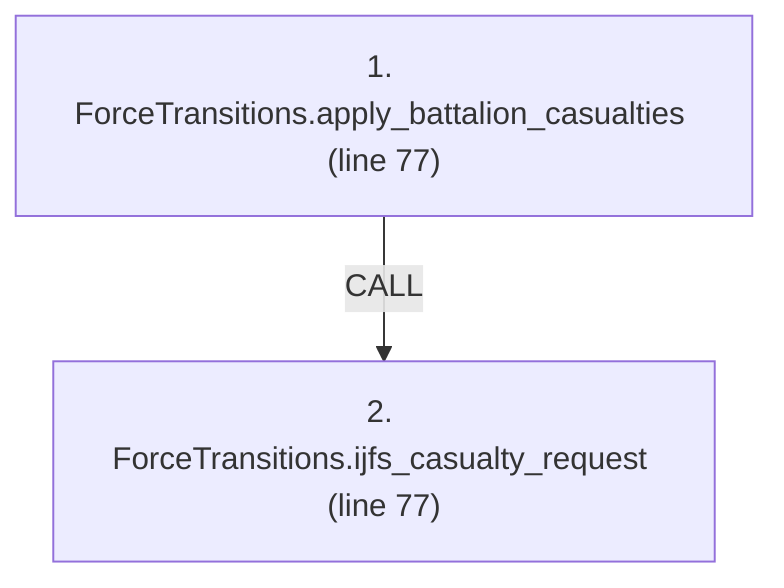
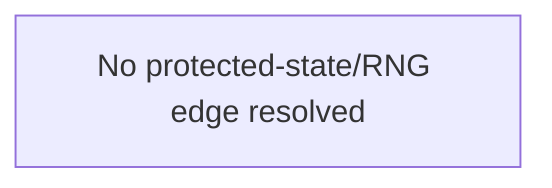

# Ordering: `FiresPhases.apply_ijfs_maneuver_casualties`

> **Reading aid, not an execution contract.** No detected edge is not permission to reorder.
> GDScript reads and writes are conservative source analysis; transition writes are also
> checked against the mutation manifest. Potential conflicts may refer to different object
> instances or conditional branches.

Generator format v1; scan scope `scripts/**/*.gd` plus `project.godot` autoload aliases.
Generated from commit `8829181ae4b6`; input SHA-256 `1c5ff5483615f0cca5b2767540c56e9a13e1387c4c1a3c66db909a97ad2e94fb`;
tool/manifest/fixture SHA-256 `ea366ecafdb8f5cc7ecae22bb7554cd8802d1ed3433c5a903ecc07bbb7230f6c`; stable generation time `2026-08-02T09:03:12-04:00`.
Unresolved-analysis diagnostics on this page: **6**.

Source: `scripts/phases/FiresPhases.gd:73`

## Lexical call-site map (CALL edges)

> Source order is not an execution count: loop calls repeat, branch calls may be skipped
> or mutually exclusive, and nested arguments execute before their outer call.

## State and RNG constraints

| Earlier node | Later node | Kinds | Shared evidence |
|---|---|---|---|
| _No constraint edge resolved_ | | | This is not evidence that calls are reorderable. |

## Detected campaign-state/RNG overview

This compact diagram shows up to 40 detected RAW/WAR/WAW/RNG constraints involving protected
campaign fields. The table above remains the complete conservative evidence.

## Call-site detail

Effects include the called method and every statically resolved helper beneath it.

| # | Call site | Reads | Writes | RNG streams |
|---:|---|---|---|---|
| 1 | `ForceTransitions.apply_battalion_casualties` at `scripts/phases/FiresPhases.gd:77` | `Battalion.qty`, `Battalion.type`, `Brigade.composition`, `Brigade.hex_id`, `Brigade.id`, `ForceCasualtyRequest.battalion_type`, `ForceCasualtyRequest.brigade_id`, `ForceCasualtyRequest.cause`, `ForceCasualtyRequest.count`, `ForceCasualtyRequest.source_location`; _+2 more_ | `Battalion.qty`, `Brigade.composition`, `Brigade.destroyed`, `Brigade.hex_id`, `ForceCasualtyReceipt.applied`, `ForceCasualtyReceipt.battalion_type`, `ForceCasualtyReceipt.brigade_id`, `ForceCasualtyReceipt.cause`, `ForceCasualtyReceipt.destroyed_brigade`, `ForceCasualtyReceipt.removed_from_hex`; _+3 more_ | — |
| 2 | `ForceTransitions.ijfs_casualty_request` at `scripts/phases/FiresPhases.gd:77` | — | `ForceCasualtyRequest.battalion_type`, `ForceCasualtyRequest.brigade_id`, `ForceCasualtyRequest.cause`, `ForceCasualtyRequest.count`, `ForceCasualtyRequest.source_location` | — |

## Analysis limits found here

Showing 6 of 6 diagnostics; class pages provide the narrower context.

| Kind | Source | Why it matters |
|---|---|---|
| `unresolved_receiver` | `scripts/model/Brigade.gd:60` `total += battalion.qty` | A protected field name appeared on an unresolved receiver. |
| `multi_call_statement` | `scripts/phases/FiresPhases.gd:77` `ForceTransitions.apply_battalion_casualties( GameData, ForceTransitions.ijfs_casualty_request(casualty))` | Multiple calls share one statement; the map preserves lexical sites, not nested evaluation order. |
| `callable_or_lambda` | `scripts/transitions/ForceTransitions.gd:587` `data_store.brigades_by_hex[old_hex] = (data_store.brigades_by_hex[old_hex] as Array).filter( func(id: String) -> bool: return id != brigade.id)` | Callable/lambda dataflow is outside this analyser. |
| `untyped_alias` | `scripts/transitions/ForceTransitions.gd:601` `var violations := data_store.validate_runtime_indexes()` | The receiver type could not be proven. |
| `untyped_iteration` | `scripts/transitions/ForceTransitions.gd:618` `for index in range(brigade.composition.size() - 1, -1, -1):` | The collection element type could not be proven. |
| `untyped_alias` | `scripts/transitions/ForceTransitions.gd:622` `var take := mini(battalion.qty, remaining)` | The receiver type could not be proven. |
