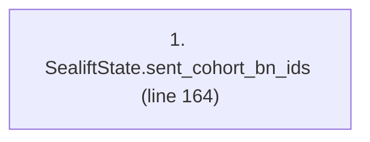
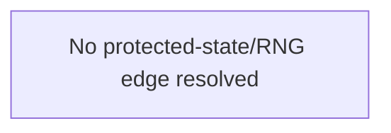

# Ordering: `FiresPhases.crossing_reserve_from_sent_cohorts`

> **Reading aid, not an execution contract.** No detected edge is not permission to reorder.
> GDScript reads and writes are conservative source analysis; transition writes are also
> checked against the mutation manifest. Potential conflicts may refer to different object
> instances or conditional branches.

Generator format v1; scan scope `scripts/**/*.gd` plus `project.godot` autoload aliases.
Generated from commit `7bbf08693b44`; input SHA-256 `c879af92cf7693c7df1119a11083764377c92a9410144e7b95f361f509613378`;
tool/manifest/fixture SHA-256 `ea366ecafdb8f5cc7ecae22bb7554cd8802d1ed3433c5a903ecc07bbb7230f6c`; stable generation time `2026-08-02T17:09:31-04:00`.
Unresolved-analysis diagnostics on this page: **4**.

Source: `scripts/phases/FiresPhases.gd:163`

## Lexical call-site map (CALL edges)

> Source order is not an execution count: loop calls repeat, branch calls may be skipped
> or mutually exclusive, and nested arguments execute before their outer call.

## State and RNG constraints

| Earlier node | Later node | Kinds | Shared evidence |
|---|---|---|---|
| _No constraint edge resolved_ | | | This is not evidence that calls are reorderable. |

## Detected campaign-state/RNG overview

This compact diagram shows up to 40 detected RAW/WAR/WAW/RNG constraints involving protected
campaign fields. The table above remains the complete conservative evidence.

## Call-site detail

Effects include the called method and every statically resolved helper beneath it.

| # | Call site | Reads | Writes | RNG streams |
|---:|---|---|---|---|
| 1 | `SealiftState.sent_cohort_bn_ids` at `scripts/phases/FiresPhases.gd:164` | `GameStateData.sealift_state`, `SealiftState.cohorts` | — | — |

## Analysis limits found here

Showing 4 of 4 diagnostics; class pages provide the narrower context.

| Kind | Source | Why it matters |
|---|---|---|
| `unresolved_receiver` | `scripts/model/SealiftState.gd:71` `for bn_id in cohort.bn_ids:` | A protected field name appeared on an unresolved receiver. |
| `untyped_iteration` | `scripts/model/SealiftState.gd:71` `for bn_id in cohort.bn_ids:` | The collection element type could not be proven. |
| `untyped_alias` | `scripts/phases/FiresPhases.gd:164` `var sailing := state.sealift_state.sent_cohort_bn_ids()` | The receiver type could not be proven. |
| `untyped_iteration` | `scripts/phases/FiresPhases.gd:168` `for entry_value in state.ship_reserve:` | The collection element type could not be proven. |
