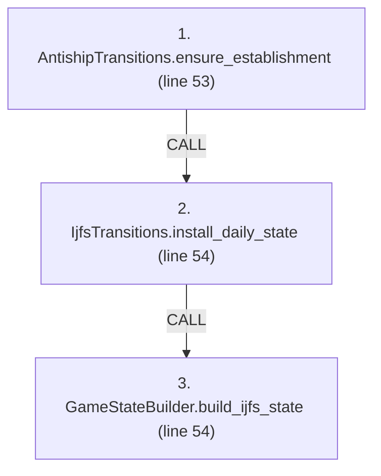
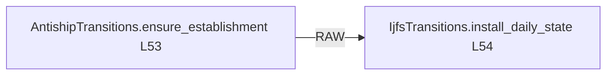

# Ordering: `FiresPhases.rebuild_ijfs_state`

> **Reading aid, not an execution contract.** No detected edge is not permission to reorder.
> GDScript reads and writes are conservative source analysis; transition writes are also
> checked against the mutation manifest. Potential conflicts may refer to different object
> instances or conditional branches.

Generator format v1; scan scope `scripts/**/*.gd` plus `project.godot` autoload aliases.
Generated from commit `8829181ae4b6`; input SHA-256 `1c5ff5483615f0cca5b2767540c56e9a13e1387c4c1a3c66db909a97ad2e94fb`;
tool/manifest/fixture SHA-256 `ea366ecafdb8f5cc7ecae22bb7554cd8802d1ed3433c5a903ecc07bbb7230f6c`; stable generation time `2026-08-02T09:03:12-04:00`.
Unresolved-analysis diagnostics on this page: **37**.

Source: `scripts/phases/FiresPhases.gd:51`

## Lexical call-site map (CALL edges)

> Source order is not an execution count: loop calls repeat, branch calls may be skipped
> or mutually exclusive, and nested arguments execute before their outer call.

## State and RNG constraints

| Earlier node | Later node | Kinds | Shared evidence |
|---|---|---|---|
| `AntishipTransitions.ensure_establishment` (L53) | `IjfsTransitions.install_daily_state` (L54) | **RAW** | `GameStateData.antiship_containers` |

## Detected campaign-state/RNG overview

This compact diagram shows up to 40 detected RAW/WAR/WAW/RNG constraints involving protected
campaign fields. The table above remains the complete conservative evidence.

## Call-site detail

Effects include the called method and every statically resolved helper beneath it.

| # | Call site | Reads | Writes | RNG streams |
|---:|---|---|---|---|
| 1 | `AntishipTransitions.ensure_establishment` at `scripts/phases/FiresPhases.gd:53` | `AntishipSystem.quantity`, `GameStateData._antiship_built` | `AntishipSystem.detectability`, `AntishipSystem.ijfs_profile`, `AntishipSystem.original_quantity`, `AntishipSystem.quantity`, `AntishipSystem.special`, `AntishipSystem.to_number`, `AntishipSystem.type_id`, `AntishipSystem.type_name`, `GameStateData._antiship_built`, `GameStateData.antiship_containers`; _+1 more_ | — |
| 2 | `IjfsTransitions.install_daily_state` at `scripts/phases/FiresPhases.gd:54` | `GameDataStore.brigades`, `GameDataStore.mobilization_holdback`, `GameStateData.antiship_containers` | `GameStateData._ijfs_day`, `GameStateData.ijfs_state` | — |
| 3 | `GameStateBuilder.build_ijfs_state` at `scripts/phases/FiresPhases.gd:54` | `Battalion.qty`, `Battalion.type`, `Brigade.composition`, `Brigade.destroyed`, `Brigade.id`, `Brigade.team`, `Brigade.to_number`, `IjfsDailyState.pairings`, `IjfsDailyState.scenario`, `IjfsDailyState.targets`; _+11 more_ | `IjfsDailyState.air_classes`, `IjfsDailyState.munitions`, `IjfsDailyState.pairings`, `IjfsDailyState.scenario`, `IjfsDailyState.squadron_force`, `IjfsDailyState.targets`, `IjfsMunition.category`, `IjfsMunition.display_label`, `IjfsMunition.inventory_remaining`, `IjfsMunition.manpads_vulnerability`; _+45 more_ | — |

## Analysis limits found here

Showing 30 of 37 diagnostics; class pages provide the narrower context.

| Kind | Source | Why it matters |
|---|---|---|
| `multi_call_statement` | `scripts/builders/AntishipSystemsBuilder.gd:19` `return { "systems": AntishipLoaders.load_systems(GROUPING_PATH, types), "containers": AntishipLoaders.load_containers(GROUPING_PATH, types), }` | Multiple calls share one statement; the map preserves lexical sites, not nested evaluation order. |
| `multi_call_statement` | `scripts/builders/IjfsStateBuilder.gd:40` `state.squadron_force = IjfsLoaders.expand_oob_to_squadrons(IjfsLoaders.load_oob(OOB_PATH))` | Multiple calls share one statement; the map preserves lexical sites, not nested evaluation order. |
| `multi_call_statement` | `scripts/builders/IjfsStateBuilder.gd:41` `IjfsLoaders.enrich_sam_scores(state.targets, IjfsLoaders.load_sam_capabilities(SAM_CAPS_PATH))` | Multiple calls share one statement; the map preserves lexical sites, not nested evaluation order. |
| `nested_index_unanalysed` | `scripts/loaders/AntishipLoaders.gd:19` `types[int(entry["id"])] = { "name": String(entry.get("name", "")), "detectability": String(entry.get("detectability", "")), "deprecated": bool(entry.get("deprecated", false)), "…` | Nested collection indexes exceed the balanced-chain subset; this statement contributes no field effects. |
| `callable_or_lambda` | `scripts/loaders/AntishipLoaders.gd:73` `systems.sort_custom(func(a: AntishipSystem, b: AntishipSystem) -> bool: if a.to_number != b.to_number: return a.to_number < b.to_number return a.type_id < b.type_id)` | Callable/lambda dataflow is outside this analyser. |
| `unresolved_receiver` | `scripts/loaders/AntishipLoaders.gd:73` `systems.sort_custom(func(a: AntishipSystem, b: AntishipSystem) -> bool: if a.to_number != b.to_number: return a.to_number < b.to_number return a.type_id < b.type_id)` | A protected field name appeared on an unresolved receiver. |
| `callable_or_lambda` | `scripts/loaders/AntishipLoaders.gd:88` `containers.sort_custom(func(a: Dictionary, b: Dictionary) -> bool: if int(a["to_number"]) != int(b["to_number"]): return int(a["to_number"]) < int(b["to_number"]) if int(a["type…` | Callable/lambda dataflow is outside this analyser. |
| `untyped_alias` | `scripts/loaders/AntishipLoaders.gd:185` `var parsed: Variant = JSON.parse_string(text)` | The receiver type could not be proven. |
| `untyped_alias` | `scripts/loaders/DataOverrides.gd:133` `var arr: Variant = container[key]` | The receiver type could not be proven. |
| `untyped_alias` | `scripts/loaders/IjfsLoaders.gd:76` `var unit_type := String(battalion.type)` | The receiver type could not be proven. |
| `untyped_iteration` | `scripts/loaders/IjfsLoaders.gd:78` `for _i in range(battalion.qty):` | The collection element type could not be proven. |
| `untyped_alias` | `scripts/loaders/IjfsLoaders.gd:80` `var battalion_id := "%s-MU-%d" % [brigade.id, n]` | The receiver type could not be proven. |
| `untyped_alias` | `scripts/loaders/IjfsLoaders.gd:82` `var row := { "target_id": source_id, "category": "Maneuver Units", "subcategory": String(profile[0]), "quantity": 1, "mobility": String(profile[1]), "hardness": String(profile[2…` | The receiver type could not be proven. |
| `callable_or_lambda` | `scripts/loaders/IjfsLoaders.gd:99` `targets.sort_custom(func(a: IjfsTarget, b: IjfsTarget) -> bool: return a.target_id < b.target_id)` | Callable/lambda dataflow is outside this analyser. |
| `unresolved_receiver` | `scripts/loaders/IjfsLoaders.gd:99` `targets.sort_custom(func(a: IjfsTarget, b: IjfsTarget) -> bool: return a.target_id < b.target_id)` | A protected field name appeared on an unresolved receiver. |
| `multi_call_statement` | `scripts/loaders/IjfsLoaders.gd:108` `var body: Variant = _unwrap_data(_read_json(path))` | Multiple calls share one statement; the map preserves lexical sites, not nested evaluation order. |
| `callable_or_lambda` | `scripts/loaders/IjfsLoaders.gd:137` `targets.sort_custom(func(a: IjfsTarget, b: IjfsTarget) -> bool: return a.target_id < b.target_id)` | Callable/lambda dataflow is outside this analyser. |
| `unresolved_receiver` | `scripts/loaders/IjfsLoaders.gd:137` `targets.sort_custom(func(a: IjfsTarget, b: IjfsTarget) -> bool: return a.target_id < b.target_id)` | A protected field name appeared on an unresolved receiver. |
| `untyped_alias` | `scripts/loaders/IjfsLoaders.gd:150` `var distribution: Variant = row.get("to_distribution", null)` | The receiver type could not be proven. |
| `callable_or_lambda` | `scripts/loaders/IjfsLoaders.gd:216` `targets.sort_custom(func(a: IjfsTarget, b: IjfsTarget) -> bool: return a.target_id < b.target_id)` | Callable/lambda dataflow is outside this analyser. |
| `unresolved_receiver` | `scripts/loaders/IjfsLoaders.gd:216` `targets.sort_custom(func(a: IjfsTarget, b: IjfsTarget) -> bool: return a.target_id < b.target_id)` | A protected field name appeared on an unresolved receiver. |
| `callable_or_lambda` | `scripts/loaders/IjfsLoaders.gd:230` `merged.sort_custom(func(a: IjfsTarget, b: IjfsTarget) -> bool: return a.target_id < b.target_id)` | Callable/lambda dataflow is outside this analyser. |
| `unresolved_receiver` | `scripts/loaders/IjfsLoaders.gd:230` `merged.sort_custom(func(a: IjfsTarget, b: IjfsTarget) -> bool: return a.target_id < b.target_id)` | A protected field name appeared on an unresolved receiver. |
| `multi_call_statement` | `scripts/loaders/IjfsLoaders.gd:235` `var body: Variant = _unwrap_data(_read_json(path))` | Multiple calls share one statement; the map preserves lexical sites, not nested evaluation order. |
| `multi_call_statement` | `scripts/loaders/IjfsLoaders.gd:277` `var body: Variant = _unwrap_data(_read_json(path))` | Multiple calls share one statement; the map preserves lexical sites, not nested evaluation order. |
| `callable_or_lambda` | `scripts/loaders/IjfsLoaders.gd:376` `modifiers = modifiers.filter(func(m: Dictionary) -> bool: return m.get("modifier_id") != modifier_id)` | Callable/lambda dataflow is outside this analyser. |
| `untyped_alias` | `scripts/loaders/IjfsLoaders.gd:453` `var score = by_sub.get(target.subcategory, null)` | The receiver type could not be proven. |
| `callable_or_lambda` | `scripts/loaders/IjfsLoaders.gd:468` `targets.sort_custom(func(a: IjfsTarget, b: IjfsTarget) -> bool: return a.target_id < b.target_id)` | Callable/lambda dataflow is outside this analyser. |
| `unresolved_receiver` | `scripts/loaders/IjfsLoaders.gd:468` `targets.sort_custom(func(a: IjfsTarget, b: IjfsTarget) -> bool: return a.target_id < b.target_id)` | A protected field name appeared on an unresolved receiver. |
| `untyped_alias` | `scripts/loaders/IjfsLoaders.gd:513` `var ldd = data.get("last_detected_day", -1)` | The receiver type could not be proven. |
| _…_ | _7 additional diagnostics omitted from this page_ | See the called class pages. |
