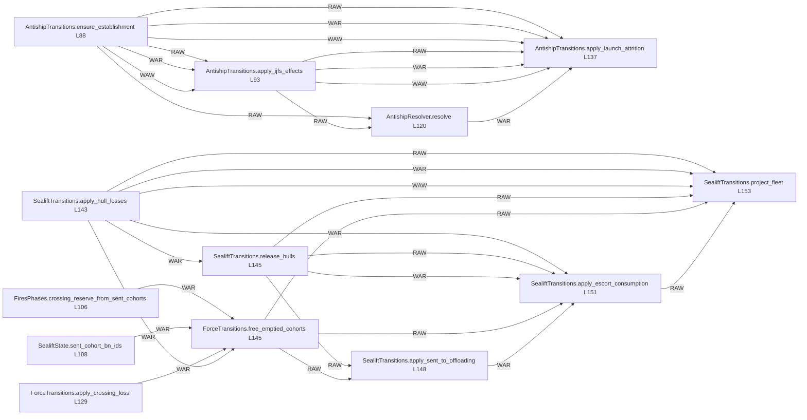

# Ordering: `FiresPhases.resolve_antiship_turn`

> **Reading aid, not an execution contract.** No detected edge is not permission to reorder.
> GDScript reads and writes are conservative source analysis; transition writes are also
> checked against the mutation manifest. Potential conflicts may refer to different object
> instances or conditional branches.

Generator format v1; scan scope `scripts/**/*.gd` plus `project.godot` autoload aliases.
Generated from commit `7bbf08693b44`; input SHA-256 `c879af92cf7693c7df1119a11083764377c92a9410144e7b95f361f509613378`;
tool/manifest/fixture SHA-256 `ea366ecafdb8f5cc7ecae22bb7554cd8802d1ed3433c5a903ecc07bbb7230f6c`; stable generation time `2026-08-02T17:09:31-04:00`.
Unresolved-analysis diagnostics on this page: **92**.

Source: `scripts/phases/FiresPhases.gd:87`

## Lexical call-site map (CALL edges)

> Source order is not an execution count: loop calls repeat, branch calls may be skipped
> or mutually exclusive, and nested arguments execute before their outer call.

```mermaid
flowchart TD
  n_09df4e2eb59b["1. AntishipTransitions.ensure_establishment (line 88)"]
  n_c4adc95afe23["2. AntishipTransitions.apply_ijfs_effects (line 93)"]
  n_e5b065cf1203["3. Dice.derive (line 100)"]
  n_e295d5a15f23["4. SeededDice.new (line 102)"]
  n_d5666f05a6f4["5. FiresPhases.crossing_reserve_from_sent_cohorts (line 106)"]
  n_1fe3a6aca3e1["6. SealiftState.sent_cohort_bn_ids (line 108)"]
  n_7ae3cddcd1a8["7. AntishipResolutionContext.new (line 110)"]
  n_ef4d29823cd2["8. AntishipResolver.resolve (line 120)"]
  n_f588c2d7584e["9. ForceTransitions.apply_crossing_loss (line 129)"]
  n_2e602762ae11["10. ForceTransitions.crossing_casualty_request (line 129)"]
  n_519e09109d98["11. AntishipTransitions.apply_launch_attrition (line 137)"]
  n_4a88635f78b4["12. SealiftTransitions.record_crossing_carryover (line 138)"]
  n_b9887ee31fbe["13. SealiftTransitions.apply_hull_losses (line 143)"]
  n_5b6e1ef18b0d["14. SealiftTransitions.release_hulls (line 145)"]
  n_4d99d384b496["15. ForceTransitions.free_emptied_cohorts (line 145)"]
  n_77a4b4cadd67["16. SealiftTransitions.apply_sent_to_offloading (line 148)"]
  n_498febcea926["17. SealiftTransitions.apply_escort_consumption (line 151)"]
  n_332d349368b5["18. SealiftTransitions.project_fleet (line 153)"]
  n_12aa1c2ebb1a["19. SealiftTransitions.register_ship_losses (line 154)"]
  n_897fd8bdbbf4["20. AntishipSummary.to_dict (line 157)"]
  n_8d0b0bbb8d9a["21. AntishipSummary.to_dict (line 158)"]
  n_e5b065cf1203 -->|CALL| n_e295d5a15f23
  n_e295d5a15f23 -->|CALL| n_d5666f05a6f4
  n_d5666f05a6f4 -->|CALL| n_1fe3a6aca3e1
  n_1fe3a6aca3e1 -->|CALL| n_7ae3cddcd1a8
  n_7ae3cddcd1a8 -->|CALL| n_ef4d29823cd2
  n_ef4d29823cd2 -->|CALL| n_f588c2d7584e
  n_2e602762ae11 -->|CALL| n_519e09109d98
  n_f588c2d7584e -->|CALL| n_2e602762ae11
  n_519e09109d98 -->|CALL| n_4a88635f78b4
  n_4a88635f78b4 -->|CALL| n_b9887ee31fbe
  n_b9887ee31fbe -->|CALL| n_5b6e1ef18b0d
  n_5b6e1ef18b0d -->|CALL| n_4d99d384b496
  n_4d99d384b496 -->|CALL| n_77a4b4cadd67
  n_77a4b4cadd67 -->|CALL| n_498febcea926
  n_498febcea926 -->|CALL| n_332d349368b5
  n_332d349368b5 -->|CALL| n_12aa1c2ebb1a
  n_12aa1c2ebb1a -->|CALL| n_897fd8bdbbf4
  n_897fd8bdbbf4 -->|CALL| n_8d0b0bbb8d9a
  n_09df4e2eb59b -->|CALL| n_c4adc95afe23
  n_c4adc95afe23 -->|CALL| n_e5b065cf1203
```

## State and RNG constraints

| Earlier node | Later node | Kinds | Shared evidence |
|---|---|---|---|
| `FiresPhases.crossing_reserve_from_sent_cohorts` (L106) | `ForceTransitions.free_emptied_cohorts` (L145) | **WAR** | `SealiftState.cohorts` |
| `SealiftState.sent_cohort_bn_ids` (L108) | `ForceTransitions.free_emptied_cohorts` (L145) | **WAR** | `SealiftState.cohorts` |
| `AntishipResolver.resolve` (L120) | `AntishipTransitions.apply_launch_attrition` (L137) | **RAW**, **WAR** | `AntishipLaunchOutcome.attempted`, `AntishipLaunchOutcome.launched`, `AntishipLaunchOutcome.postlaunch_destroyed`, `AntishipLaunchOutcome.prelaunch_destroyed`, `AntishipLaunchOutcome.to_number`, `AntishipLaunchOutcome.type_id`, `AntishipSystem.destroyed_this_turn`, `AntishipSystem.quantity` |
| `AntishipResolver.resolve` (L120) | `AntishipSummary.to_dict` (L157) | **RAW** | `AntishipSummary.bns_lost_at_sea`, `AntishipSummary.crossing_casualties`, `AntishipSummary.destroyed_by_ship_type`, `AntishipSummary.mine_status`, `AntishipSummary.resolved_turn`, `AntishipSummary.sent_by_type`, `AntishipSummary.systems_fired_count`, `AntishipSummary.target_beaches`; _+2 more_ |
| `AntishipResolver.resolve` (L120) | `AntishipSummary.to_dict` (L158) | **RAW** | `AntishipSummary.bns_lost_at_sea`, `AntishipSummary.crossing_casualties`, `AntishipSummary.destroyed_by_ship_type`, `AntishipSummary.mine_status`, `AntishipSummary.resolved_turn`, `AntishipSummary.sent_by_type`, `AntishipSummary.systems_fired_count`, `AntishipSummary.target_beaches`; _+2 more_ |
| `ForceTransitions.apply_crossing_loss` (L129) | `ForceTransitions.free_emptied_cohorts` (L145) | **WAR** | `SealiftState.cohorts` |
| `SealiftTransitions.apply_hull_losses` (L143) | `SealiftTransitions.release_hulls` (L145) | **WAR** | `SealiftState.return_pipeline` |
| `SealiftTransitions.apply_hull_losses` (L143) | `ForceTransitions.free_emptied_cohorts` (L145) | **WAR** | `SealiftState.cohorts` |
| `SealiftTransitions.apply_hull_losses` (L143) | `SealiftTransitions.apply_escort_consumption` (L151) | **WAR** | `SealiftState.escort_reload`, `SealiftState.escort_sam` |
| `SealiftTransitions.apply_hull_losses` (L143) | `SealiftTransitions.project_fleet` (L153) | **RAW**, **WAR**, **WAW** | `ShipState.destroyed`, `ShipState.fleet_surviving_total`, `ShipState.offloading`, `ShipState.ready`, `ShipState.returning`, `ShipState.surviving_sent` |
| `SealiftTransitions.release_hulls` (L145) | `SealiftTransitions.apply_sent_to_offloading` (L148) | **RAW** | `SealiftState.return_pipeline` |
| `SealiftTransitions.release_hulls` (L145) | `SealiftTransitions.apply_escort_consumption` (L151) | **RAW**, **WAR** | `SealiftState.escort_reload`, `SealiftState.escort_sam`, `SealiftState.return_pipeline` |
| `SealiftTransitions.release_hulls` (L145) | `SealiftTransitions.project_fleet` (L153) | **RAW** | `SealiftState.return_pipeline` |
| `ForceTransitions.free_emptied_cohorts` (L145) | `SealiftTransitions.apply_sent_to_offloading` (L148) | **RAW** | `SealiftState.cohorts` |
| `ForceTransitions.free_emptied_cohorts` (L145) | `SealiftTransitions.apply_escort_consumption` (L151) | **RAW** | `SealiftState.cohorts` |
| `ForceTransitions.free_emptied_cohorts` (L145) | `SealiftTransitions.project_fleet` (L153) | **RAW** | `SealiftState.cohorts` |
| `SealiftTransitions.apply_sent_to_offloading` (L148) | `SealiftTransitions.apply_escort_consumption` (L151) | **WAR** | `SealiftState.escort_reload`, `SealiftState.escort_sam` |
| `SealiftTransitions.apply_escort_consumption` (L151) | `SealiftTransitions.project_fleet` (L153) | **RAW** | `SealiftState.escort_reload`, `SealiftState.escort_sam` |
| `AntishipTransitions.ensure_establishment` (L88) | `AntishipResolver.resolve` (L120) | **RAW** | `AntishipSystem.quantity`, `AntishipSystem.to_number`, `AntishipSystem.type_id` |
| `AntishipTransitions.ensure_establishment` (L88) | `AntishipTransitions.apply_launch_attrition` (L137) | **RAW**, **WAR**, **WAW** | `AntishipSystem.original_quantity`, `AntishipSystem.quantity`, `AntishipSystem.to_number`, `AntishipSystem.type_id`, `GameStateData.antiship_systems` |
| `AntishipTransitions.ensure_establishment` (L88) | `AntishipTransitions.apply_ijfs_effects` (L93) | **RAW**, **WAR**, **WAW** | `AntishipSystem.original_quantity`, `AntishipSystem.quantity`, `AntishipSystem.to_number`, `AntishipSystem.type_id`, `GameStateData.antiship_systems` |
| `AntishipTransitions.apply_ijfs_effects` (L93) | `AntishipResolver.resolve` (L120) | **RAW** | `AntishipSystem.quantity`, `AntishipSystem.suppressed_now` |
| `AntishipTransitions.apply_ijfs_effects` (L93) | `AntishipTransitions.apply_launch_attrition` (L137) | **RAW**, **WAR**, **WAW** | `AntishipSystem.destroyed`, `AntishipSystem.ijfs_destroyed_cumulative`, `AntishipSystem.launch_destroyed_cumulative`, `AntishipSystem.quantity` |

## Detected campaign-state/RNG overview

This compact diagram shows up to 40 detected RAW/WAR/WAW/RNG constraints involving protected
campaign fields. The table above remains the complete conservative evidence.

## Call-site detail

Effects include the called method and every statically resolved helper beneath it.

| # | Call site | Reads | Writes | RNG streams |
|---:|---|---|---|---|
| 1 | `AntishipTransitions.ensure_establishment` at `scripts/phases/FiresPhases.gd:88` | `AntishipSystem.quantity`, `GameStateData._antiship_built` | `AntishipSystem.detectability`, `AntishipSystem.ijfs_profile`, `AntishipSystem.original_quantity`, `AntishipSystem.quantity`, `AntishipSystem.special`, `AntishipSystem.to_number`, `AntishipSystem.type_id`, `AntishipSystem.type_name`, `GameStateData._antiship_built`, `GameStateData.antiship_containers`; _+1 more_ | — |
| 2 | `AntishipTransitions.apply_ijfs_effects` at `scripts/phases/FiresPhases.gd:93` | `AntishipSystem.destroyed`, `AntishipSystem.ijfs_destroyed_cumulative`, `AntishipSystem.launch_destroyed_cumulative`, `AntishipSystem.original_quantity`, `AntishipSystem.quantity`, `AntishipSystem.to_number`, `AntishipSystem.type_id`, `GameStateData.antiship_systems`, `GameStateData.last_ijfs_writeback`, `IjfsWriteback.antiship_destroyed_by_type`; _+1 more_ | `AntishipSystem.destroyed`, `AntishipSystem.ijfs_destroyed_cumulative`, `AntishipSystem.quantity`, `AntishipSystem.suppressed_now` | — |
| 3 | `Dice.derive` at `scripts/phases/FiresPhases.gd:100` | `GameStateData.turn_number` | — | — |
| 4 | `SeededDice.new` at `scripts/phases/FiresPhases.gd:102` | `GameStateData.turn_number` | — | — |
| 5 | `FiresPhases.crossing_reserve_from_sent_cohorts` at `scripts/phases/FiresPhases.gd:106` | `GameStateData.sealift_state`, `GameStateData.ship_reserve`, `SealiftState.cohorts` | — | — |
| 6 | `SealiftState.sent_cohort_bn_ids` at `scripts/phases/FiresPhases.gd:108` | `GameStateData.sealift_state`, `SealiftState.cohorts` | — | — |
| 7 | `AntishipResolutionContext.new` at `scripts/phases/FiresPhases.gd:110` | — | — | — |
| 8 | `AntishipResolver.resolve` at `scripts/phases/FiresPhases.gd:120` | `AntishipCrossingContext.active_tos`, `AntishipCrossingContext.combat_catalog`, `AntishipCrossingContext.crossing_config`, `AntishipCrossingContext.escort_sam`, `AntishipCrossingContext.ship_snapshots`, `AntishipCrossingContext.systems_fired`, `AntishipCrossingContext.target_tos`, `AntishipCrossingContext.to_adjacency`, `AntishipMagazine.current_counts`, `AntishipMagazine.loadout`; _+27 more_ | `AntishipCrossingContext.active_tos`, `AntishipCrossingContext.combat_catalog`, `AntishipCrossingContext.crossing_config`, `AntishipCrossingContext.escort_sam`, `AntishipCrossingContext.ship_snapshots`, `AntishipCrossingContext.systems_fired`, `AntishipCrossingContext.target_tos`, `AntishipCrossingContext.to_adjacency`, `AntishipLaunchOutcome.attempted`, `AntishipLaunchOutcome.launched`; _+25 more_ | `as_dice` |
| 9 | `ForceTransitions.apply_crossing_loss` at `scripts/phases/FiresPhases.gd:129` | `Battalion.qty`, `Battalion.type`, `Brigade.composition`, `Brigade.hex_id`, `Brigade.id`, `ForceCasualtyRequest.battalion_type`, `ForceCasualtyRequest.brigade_id`, `ForceCasualtyRequest.cause`, `ForceCasualtyRequest.count`, `ForceCasualtyRequest.source_location`; _+8 more_ | `Battalion.qty`, `Brigade.composition`, `Brigade.destroyed`, `Brigade.hex_id`, `ForceCasualtyReceipt.applied`, `ForceCasualtyReceipt.battalion_type`, `ForceCasualtyReceipt.brigade_id`, `ForceCasualtyReceipt.cause`, `ForceCasualtyReceipt.destroyed_brigade`, `ForceCasualtyReceipt.removed_from_hex`; _+11 more_ | — |
| 10 | `ForceTransitions.crossing_casualty_request` at `scripts/phases/FiresPhases.gd:129` | — | `ForceCrossingCasualtyRequest.lost_ids`, `ForceCrossingCasualtyRequest.sealift_state`, `ForceCrossingCasualtyRequest.ship_reserve` | — |
| 11 | `AntishipTransitions.apply_launch_attrition` at `scripts/phases/FiresPhases.gd:137` | `AntishipLaunchOutcome.attempted`, `AntishipLaunchOutcome.launched`, `AntishipLaunchOutcome.postlaunch_destroyed`, `AntishipLaunchOutcome.prelaunch_destroyed`, `AntishipLaunchOutcome.to_number`, `AntishipLaunchOutcome.type_id`, `AntishipSystem.destroyed`, `AntishipSystem.destroyed_this_turn`, `AntishipSystem.fired`, `AntishipSystem.ijfs_destroyed_cumulative`; _+8 more_ | `AntishipSystem.active`, `AntishipSystem.destroyed`, `AntishipSystem.destroyed_this_turn`, `AntishipSystem.fired`, `AntishipSystem.launch_destroyed_cumulative`, `AntishipSystem.quantity`, `GameStateData._antiship_launch_turn` | — |
| 12 | `SealiftTransitions.record_crossing_carryover` at `scripts/phases/FiresPhases.gd:138` | — | `GameStateData.lost_at_sea_accumulator` | — |
| 13 | `SealiftTransitions.apply_hull_losses` at `scripts/phases/FiresPhases.gd:143` | `GameDataStore.ship_defs_by_name`, `GameStateData.fleet`, `GameStateData.sealift_state`, `SealiftHullLossReceipt.capped_types`, `SealiftState.cohorts`, `SealiftState.escort_reload`, `SealiftState.escort_sam`, `SealiftState.escort_sam_max`, `SealiftState.escort_sam_threshold`, `SealiftState.mainland_pool`; _+10 more_ | `SealiftHullLossReceipt.applied_by_type`, `SealiftHullLossReceipt.capped_types`, `SealiftHullLossReceipt.cause`, `SealiftHullLossReceipt.requested_by_type`, `SealiftHullLossReceipt.source_by_type`, `ShipState.destroyed`, `ShipState.fleet_surviving_total`, `ShipState.offloading`, `ShipState.ready`, `ShipState.returning`; _+1 more_ | — |
| 14 | `SealiftTransitions.release_hulls` at `scripts/phases/FiresPhases.gd:145` | `GameDataStore.amphibious_return_time_turns`, `GameStateData.sealift_state`, `SealiftHullReleasePlan.batches`, `SealiftState.cohorts`, `SealiftState.escort_reload`, `SealiftState.escort_sam`, `SealiftState.escort_sam_max`, `SealiftState.escort_sam_threshold`, `SealiftState.mainland_pool`, `SealiftState.return_pipeline` | `SealiftState.return_pipeline` | — |
| 15 | `ForceTransitions.free_emptied_cohorts` at `scripts/phases/FiresPhases.gd:145` | `SealiftHullReleasePlan.batches`, `SealiftState.cohorts` | `SealiftHullReleasePlan.batches`, `SealiftState.cohorts` | — |
| 16 | `SealiftTransitions.apply_sent_to_offloading` at `scripts/phases/FiresPhases.gd:148` | `GameStateData.sealift_state`, `SealiftState.cohorts`, `SealiftState.escort_reload`, `SealiftState.escort_sam`, `SealiftState.escort_sam_max`, `SealiftState.escort_sam_threshold`, `SealiftState.mainland_pool`, `SealiftState.return_pipeline` | — | — |
| 17 | `SealiftTransitions.apply_escort_consumption` at `scripts/phases/FiresPhases.gd:151` | `GameDataStore.escort_reload_time_turns`, `GameStateData.sealift_state`, `SealiftState.cohorts`, `SealiftState.escort_reload`, `SealiftState.escort_sam`, `SealiftState.escort_sam_max`, `SealiftState.escort_sam_threshold`, `SealiftState.mainland_pool`, `SealiftState.return_pipeline` | `SealiftState.escort_reload`, `SealiftState.escort_sam` | — |
| 18 | `SealiftTransitions.project_fleet` at `scripts/phases/FiresPhases.gd:153` | `GameStateData.fleet`, `GameStateData.sealift_state`, `SealiftState.cohorts`, `SealiftState.escort_reload`, `SealiftState.escort_sam`, `SealiftState.escort_sam_max`, `SealiftState.escort_sam_threshold`, `SealiftState.mainland_pool`, `SealiftState.return_pipeline`, `ShipState.destroyed`; _+7 more_ | `ShipState.offloading`, `ShipState.ready`, `ShipState.returning`, `ShipState.surviving_sent` | — |
| 19 | `SealiftTransitions.register_ship_losses` at `scripts/phases/FiresPhases.gd:154` | — | `GameStateData.pending_lost_at_sea` | — |
| 20 | `AntishipSummary.to_dict` at `scripts/phases/FiresPhases.gd:157` | `AntishipSummary.bns_lost_at_sea`, `AntishipSummary.crossing_casualties`, `AntishipSummary.destroyed_by_ship_type`, `AntishipSummary.mine_status`, `AntishipSummary.resolved_turn`, `AntishipSummary.sent_by_type`, `AntishipSummary.systems_fired_count`, `AntishipSummary.target_beaches`, `AntishipSummary.target_tos`, `AntishipSummary.unliftable_bn`; _+2 more_ | — | — |
| 21 | `AntishipSummary.to_dict` at `scripts/phases/FiresPhases.gd:158` | `AntishipSummary.bns_lost_at_sea`, `AntishipSummary.crossing_casualties`, `AntishipSummary.destroyed_by_ship_type`, `AntishipSummary.mine_status`, `AntishipSummary.resolved_turn`, `AntishipSummary.sent_by_type`, `AntishipSummary.systems_fired_count`, `AntishipSummary.target_beaches`, `AntishipSummary.target_tos`, `AntishipSummary.unliftable_bn`; _+2 more_ | — | — |

## Analysis limits found here

Showing 30 of 92 diagnostics; class pages provide the narrower context.

| Kind | Source | Why it matters |
|---|---|---|
| `multi_call_statement` | `scripts/builders/AntishipSystemsBuilder.gd:19` `return { "systems": AntishipLoaders.load_systems(GROUPING_PATH, types), "containers": AntishipLoaders.load_containers(GROUPING_PATH, types), }` | Multiple calls share one statement; the map preserves lexical sites, not nested evaluation order. |
| `callable_or_lambda` | `scripts/calc/AntishipCalculator.gd:59` `order.sort_custom(func(a: int, b: int) -> bool: var ra: float = raw[a] - float(floors[a]) var rb: float = raw[b] - float(floors[b]) if ra != rb: return ra > rb return a < b)` | Callable/lambda dataflow is outside this analyser. |
| `nested_index_unanalysed` | `scripts/calc/AntishipCalculator.gd:66` `floors[order[i]] += 1` | Nested collection indexes exceed the balanced-chain subset; this statement contributes no field effects. |
| `untyped_alias` | `scripts/calc/AntishipCalculator.gd:102` `var truly_available := maxi(0, system.quantity)` | The receiver type could not be proven. |
| `multi_call_statement` | `scripts/calc/AntishipCalculator.gd:159` `return _build_attrition_reports(_sorted_report_keys(meta), meta, grouped, destroyed_firing_plan)` | Multiple calls share one statement; the map preserves lexical sites, not nested evaluation order. |
| `callable_or_lambda` | `scripts/calc/AntishipCalculator.gd:232` `sorted_keys.sort_custom(func(a: String, b: String) -> bool: var meta_a: Array = meta[a] var meta_b: Array = meta[b] if int(meta_a[0]) != int(meta_b[0]): return int(meta_a[0]) < …` | Callable/lambda dataflow is outside this analyser. |
| `untyped_alias` | `scripts/calc/AntishipCalculator.gd:310` `var type_key: Variant = int(type_part) if type_part.is_valid_int() else type_part` | The receiver type could not be proven. |
| `untyped_alias` | `scripts/calc/AntishipCrossing.gd:76` `var store_group: Variant = munitions[name].get("store_group")` | The receiver type could not be proven. |
| `untyped_iteration` | `scripts/calc/AntishipCrossing.gd:101` `for row in _sorted_firing_rows(context.systems_fired):` | The collection element type could not be proven. |
| `callable_or_lambda` | `scripts/calc/AntishipCrossing.gd:129` `rows.sort_custom(func(a: Dictionary, b: Dictionary) -> bool: var la := str(a.get("location", a.get("to", ""))) var lb := str(b.get("location", b.get("to", ""))) if la != lb: ret…` | Callable/lambda dataflow is outside this analyser. |
| `untyped_alias` | `scripts/calc/AntishipCrossing.gd:165` `var source_to: Variant = _parse_source_to(row.get("location", row.get("to")))` | The receiver type could not be proven. |
| `untyped_alias` | `scripts/calc/AntishipCrossing.gd:205` `var group: Variant = munition_to_group[munition]` | The receiver type could not be proven. |
| `multi_call_statement` | `scripts/calc/AntishipCrossing.gd:247` `defenders.append({ "ship_type": ship_type, "attempts": int(_cfg_num(cfg, "attempts", 0)), "success_prob": _cfg_num(cfg, "success_prob", 0.0), })` | Multiple calls share one statement; the map preserves lexical sites, not nested evaluation order. |
| `nested_index_unanalysed` | `scripts/calc/AntishipCrossing.gd:374` `decoy_types[snap["ship_type"]] = true` | Nested collection indexes exceed the balanced-chain subset; this statement contributes no field effects. |
| `nested_index_unanalysed` | `scripts/calc/AntishipCrossing.gd:467` `surviving_sent[snap["ship_type"]] = int(snap["surviving_sent"])` | Nested collection indexes exceed the balanced-chain subset; this statement contributes no field effects. |
| `multi_call_statement` | `scripts/calc/AntishipCrossing.gd:551` `result["missile_stage_totals"] = { "launched": _sum(result["launched_by_munition"]), "failed_in_flight": _sum(result["failed_in_flight_by_munition"]), "intercepted": _sum(result…` | Multiple calls share one statement; the map preserves lexical sites, not nested evaluation order. |
| `multi_call_statement` | `scripts/calc/AntishipCrossing.gd:560` `result["casualty_totals"] = { "destroyed": _sum(result["destroyed_by_ship_type"]), "damaged": _sum(result["damaged_by_ship_type"]), }` | Multiple calls share one statement; the map preserves lexical sites, not nested evaluation order. |
| `unresolved_receiver` | `scripts/calc/AntishipCrossing.gd:573` `snaps.append({"ship_type": str(s.ship_type), "surviving_sent": int(s.surviving_sent)})` | A protected field name appeared on an unresolved receiver. |
| `untyped_alias` | `scripts/calc/AntishipCrossing.gd:584` `var value: Variant = mapping.get(key)` | The receiver type could not be proven. |
| `multi_call_statement` | `scripts/calc/AntishipCrossing.gd:624` `return arr[dice.weighted_choice(_ones(arr.size()))]` | Multiple calls share one statement; the map preserves lexical sites, not nested evaluation order. |
| `multi_call_statement` | `scripts/calc/AntishipCrossing.gd:628` `return dice.weighted_choice(_ones(n))` | Multiple calls share one statement; the map preserves lexical sites, not nested evaluation order. |
| `untyped_alias` | `scripts/calc/AntishipCrossing.gd:648` `var munitions: Variant = catalog.get("munitions")` | The receiver type could not be proven. |
| `untyped_alias` | `scripts/calc/AntishipCrossing.gd:649` `var launchers: Variant = catalog.get("launchers")` | The receiver type could not be proven. |
| `untyped_alias` | `scripts/calc/AntishipCrossing.gd:665` `var loadout: Variant = spec.get("missiles")` | The receiver type could not be proven. |
| `untyped_alias` | `scripts/calc/AntishipCrossing.gd:677` `var store_groups: Variant = catalog.get("store_groups", {})` | The receiver type could not be proven. |
| `untyped_alias` | `scripts/calc/AntishipCrossing.gd:681` `var group_spec: Variant = store_groups[group_name]` | The receiver type could not be proven. |
| `untyped_alias` | `scripts/calc/AntishipCrossing.gd:684` `var qty: Variant = group_spec.get("quantity")` | The receiver type could not be proven. |
| `untyped_alias` | `scripts/calc/AntishipCrossing.gd:688` `var group: Variant = munitions[name].get("store_group")` | The receiver type could not be proven. |
| `untyped_alias` | `scripts/calc/AntishipCrossing.gd:696` `var section: Variant = config.get(key)` | The receiver type could not be proven. |
| `multi_call_statement` | `scripts/calc/AntishipResolver.gd:98` `var losses := ShipLoadingModel.resolve_bn_losses( destroyed_by_type, ship_capacity_by_type(context.ship_defs), bns_at_sea, context.lost_at_sea_accumulator, dice)` | Multiple calls share one statement; the map preserves lexical sites, not nested evaluation order. |
| _…_ | _62 additional diagnostics omitted from this page_ | See the called class pages. |
