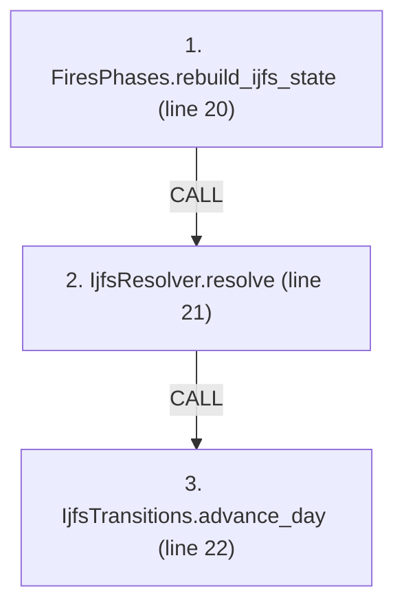
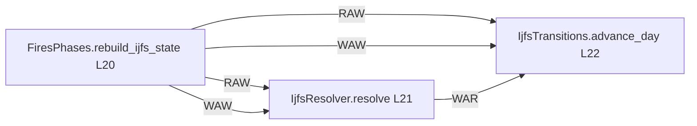

# Ordering: `FiresPhases.resolve_ijfs_turn`

> **Reading aid, not an execution contract.** No detected edge is not permission to reorder.
> GDScript reads and writes are conservative source analysis; transition writes are also
> checked against the mutation manifest. Potential conflicts may refer to different object
> instances or conditional branches.

Generator format v1; scan scope `scripts/**/*.gd` plus `project.godot` autoload aliases.
Generated from commit `7bbf08693b44`; input SHA-256 `c879af92cf7693c7df1119a11083764377c92a9410144e7b95f361f509613378`;
tool/manifest/fixture SHA-256 `ea366ecafdb8f5cc7ecae22bb7554cd8802d1ed3433c5a903ecc07bbb7230f6c`; stable generation time `2026-08-02T17:09:31-04:00`.
Unresolved-analysis diagnostics on this page: **147**.

Source: `scripts/phases/FiresPhases.gd:17`

## Lexical call-site map (CALL edges)

> Source order is not an execution count: loop calls repeat, branch calls may be skipped
> or mutually exclusive, and nested arguments execute before their outer call.

## State and RNG constraints

| Earlier node | Later node | Kinds | Shared evidence |
|---|---|---|---|
| `FiresPhases.rebuild_ijfs_state` (L20) | `IjfsResolver.resolve` (L21) | **RAW**, **WAW** | `GameStateData._ijfs_day`, `GameStateData.ijfs_state`, `IjfsDailyState.air_classes`, `IjfsDailyState.munitions`, `IjfsDailyState.pairings`, `IjfsDailyState.scenario`, `IjfsDailyState.squadron_force`, `IjfsDailyState.targets`; _+47 more_ |
| `FiresPhases.rebuild_ijfs_state` (L20) | `IjfsTransitions.advance_day` (L22) | **RAW**, **WAW** | `GameStateData._ijfs_day` |
| `IjfsResolver.resolve` (L21) | `IjfsTransitions.advance_day` (L22) | **WAR** | `GameStateData._ijfs_day` |

## Detected campaign-state/RNG overview

This compact diagram shows up to 40 detected RAW/WAR/WAW/RNG constraints involving protected
campaign fields. The table above remains the complete conservative evidence.

## Call-site detail

Effects include the called method and every statically resolved helper beneath it.

| # | Call site | Reads | Writes | RNG streams |
|---:|---|---|---|---|
| 1 | `FiresPhases.rebuild_ijfs_state` at `scripts/phases/FiresPhases.gd:20` | `AntishipSystem.quantity`, `Battalion.qty`, `Battalion.type`, `Brigade.composition`, `Brigade.destroyed`, `Brigade.id`, `Brigade.team`, `Brigade.to_number`, `GameDataStore.brigades`, `GameDataStore.mobilization_holdback`; _+16 more_ | `AntishipSystem.detectability`, `AntishipSystem.ijfs_profile`, `AntishipSystem.original_quantity`, `AntishipSystem.quantity`, `AntishipSystem.special`, `AntishipSystem.to_number`, `AntishipSystem.type_id`, `AntishipSystem.type_name`, `GameStateData._antiship_built`, `GameStateData._ijfs_day`; _+58 more_ | — |
| 2 | `IjfsResolver.resolve` at `scripts/phases/FiresPhases.gd:21` | `Brigade.composition`, `Brigade.destroyed`, `Brigade.fought_last_turn`, `Brigade.moved_last_turn`, `GameDataStore.brigades`, `GameStateData._ijfs_day`, `GameStateData.ijfs_state`, `GameStateData.turn_number`, `IjfsAirPackage.dedicated_size`, `IjfsAirPackage.initial_size`; _+91 more_ | `IjfsAirPackage.dedicated_size`, `IjfsAirPackage.initial_size`, `IjfsAirPackage.kind`, `IjfsAirPackage.members`, `IjfsAirPackage.munition_id`, `IjfsAirPackage.package_id`, `IjfsAirPackage.target_id`, `IjfsAirPackage.to_number`, `IjfsDailyState.contest_log`, `IjfsDailyState.detection_log`; _+48 more_ | `_derive_day_dice(dice, turn_number, 0)`, `ctx.air_engagement_dice`, `ijfs_dice` |
| 3 | `IjfsTransitions.advance_day` at `scripts/phases/FiresPhases.gd:22` | `GameStateData._ijfs_day`, `GameStateData.turn_number` | `GameStateData._ijfs_day` | — |

## Analysis limits found here

Showing 30 of 147 diagnostics; class pages provide the narrower context.

| Kind | Source | Why it matters |
|---|---|---|
| `multi_call_statement` | `scripts/builders/AntishipSystemsBuilder.gd:19` `return { "systems": AntishipLoaders.load_systems(GROUPING_PATH, types), "containers": AntishipLoaders.load_containers(GROUPING_PATH, types), }` | Multiple calls share one statement; the map preserves lexical sites, not nested evaluation order. |
| `multi_call_statement` | `scripts/builders/IjfsStateBuilder.gd:40` `state.squadron_force = IjfsLoaders.expand_oob_to_squadrons(IjfsLoaders.load_oob(OOB_PATH))` | Multiple calls share one statement; the map preserves lexical sites, not nested evaluation order. |
| `multi_call_statement` | `scripts/builders/IjfsStateBuilder.gd:41` `IjfsLoaders.enrich_sam_scores(state.targets, IjfsLoaders.load_sam_capabilities(SAM_CAPS_PATH))` | Multiple calls share one statement; the map preserves lexical sites, not nested evaluation order. |
| `multi_call_statement` | `scripts/calc/IjfsAttritionProfile.gd:71` `return clampf(base_rate * role_exposure(role) * rcs_survival(aircraft_class), 0.0, 1.0)` | Multiple calls share one statement; the map preserves lexical sites, not nested evaluation order. |
| `untyped_iteration` | `scripts/calc/IjfsLedgers.gd:30` `for entry in state.detection_log:` | The collection element type could not be proven. |
| `untyped_iteration` | `scripts/calc/IjfsLedgers.gd:37` `for entry in state.strike_log:` | The collection element type could not be proven. |
| `untyped_iteration` | `scripts/calc/IjfsLedgers.gd:42` `for entry in state.engagement_log:` | The collection element type could not be proven. |
| `multi_call_statement` | `scripts/calc/IjfsLedgers.gd:50` `return { "target_counts_by_category_status": target_counts, "detections_by_mobility": detections_by_mobility, "detections_by_category": detections_by_category, "attacks": attack…` | Multiple calls share one statement; the map preserves lexical sites, not nested evaluation order. |
| `untyped_iteration` | `scripts/calc/IjfsLedgers.gd:106` `for entry in state.manpads_intercept_log:` | The collection element type could not be proven. |
| `multi_call_statement` | `scripts/calc/IjfsLedgers.gd:111` `return { "ready_systems_by_to": IjfsManpads.ready_systems_by_to(state.targets), "attempts": state.manpads_intercept_log.size(), "kills": kills, "aborts": aborts, "unaffected": i…` | Multiple calls share one statement; the map preserves lexical sites, not nested evaluation order. |
| `callable_or_lambda` | `scripts/calc/IjfsLedgers.gd:126` `sorted_targets.sort_custom(func(a: IjfsTarget, b: IjfsTarget) -> bool: return a.target_id < b.target_id)` | Callable/lambda dataflow is outside this analyser. |
| `unresolved_receiver` | `scripts/calc/IjfsLedgers.gd:126` `sorted_targets.sort_custom(func(a: IjfsTarget, b: IjfsTarget) -> bool: return a.target_id < b.target_id)` | A protected field name appeared on an unresolved receiver. |
| `multi_call_statement` | `scripts/calc/IjfsLedgers.gd:131` `return { "metadata": { "current_day": current_day, "seed": state.seed, "source_files": state.source_files.duplicate(), "created_by": "ijfs_standalone", }, "detection_log": state…` | Multiple calls share one statement; the map preserves lexical sites, not nested evaluation order. |
| `untyped_alias` | `scripts/calc/IjfsStrikePhase.gd:43` `var pairing: Variant = selection["selected"]` | The receiver type could not be proven. |
| `untyped_alias` | `scripts/calc/IjfsStrikePhase.gd:47` `var reason: Variant = selection["reason"]` | The receiver type could not be proven. |
| `unresolved_receiver` | `scripts/calc/IjfsStrikePhase.gd:50` `var munition: Variant = state.munitions.get(pairing.munition_id, null)` | A protected field name appeared on an unresolved receiver. |
| `untyped_alias` | `scripts/calc/IjfsStrikePhase.gd:50` `var munition: Variant = state.munitions.get(pairing.munition_id, null)` | The receiver type could not be proven. |
| `unresolved_receiver` | `scripts/calc/IjfsStrikePhase.gd:51` `var is_organic: bool = munition != null and munition.category == "Organic"` | A protected field name appeared on an unresolved receiver. |
| `untyped_alias` | `scripts/calc/IjfsStrikePhase.gd:52` `var budget: Variant = ctx.organic_budget if is_organic else ctx.capacity_budget` | The receiver type could not be proven. |
| `unresolved_receiver` | `scripts/calc/IjfsStrikePhase.gd:53` `if budget != null and not budget.has_capacity(pairing.munition_id):` | A protected field name appeared on an unresolved receiver. |
| `unresolved_receiver` | `scripts/calc/IjfsStrikePhase.gd:63` `package = IjfsPackageIngress.assemble( state, pairing.munition_id, target, ctx.packages_launched, ctx.air_engagement_dice)` | A protected field name appeared on an unresolved receiver. |
| `unresolved_receiver` | `scripts/calc/IjfsStrikePhase.gd:69` `budget.try_consume(pairing.munition_id)` | A protected field name appeared on an unresolved receiver. |
| `untyped_alias` | `scripts/calc/IjfsStrikePhase.gd:107` `var row := target.to_dict()` | The receiver type could not be proven. |
| `untyped_alias` | `scripts/interleaved/IjfsDetection.gd:12` `var override: Variant = source.get("runtime_capability_override", null)` | The receiver type could not be proven. |
| `untyped_alias` | `scripts/interleaved/IjfsDetection.gd:118` `var components := { "detectability_label": label, "satellite_floor": float(satellite_by_mobility.get(posture, 0.0)), "base_probability": float(detectability_label_base_probabili…` | The receiver type could not be proven. |
| `untyped_alias` | `scripts/interleaved/IjfsDetection.gd:147` `var method := "intel_locked" if target.intel_locked and target.mobility != "static" else "static_known"` | The receiver type could not be proven. |
| `untyped_alias` | `scripts/interleaved/IjfsDetection.gd:191` `var entry := { "phase": phase, "target_id": target.target_id, "source_target_id": target.source_target_id, "category": target.category, "subcategory": target.subcategory, "mobil…` | The receiver type could not be proven. |
| `callable_or_lambda` | `scripts/interleaved/IjfsDetection.gd:219` `sorted.sort_custom(func(a: IjfsTarget, b: IjfsTarget) -> bool: return a.target_id < b.target_id)` | Callable/lambda dataflow is outside this analyser. |
| `unresolved_receiver` | `scripts/interleaved/IjfsDetection.gd:219` `sorted.sort_custom(func(a: IjfsTarget, b: IjfsTarget) -> bool: return a.target_id < b.target_id)` | A protected field name appeared on an unresolved receiver. |
| `untyped_alias` | `scripts/interleaved/IjfsDetection.gd:228` `var from_object: Variant = force.get("squadrons")` | The receiver type could not be proven. |
| _…_ | _117 additional diagnostics omitted from this page_ | See the called class pages. |
