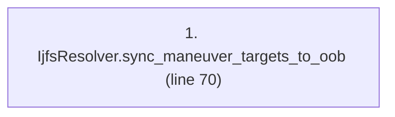

# Ordering: `FiresPhases.sync_maneuver_targets_to_oob`

> **Reading aid, not an execution contract.** No detected edge is not permission to reorder.
> GDScript reads and writes are conservative source analysis; transition writes are also
> checked against the mutation manifest. Potential conflicts may refer to different object
> instances or conditional branches.

Generator format v1; scan scope `scripts/**/*.gd` plus `project.godot` autoload aliases.
Generated from commit `8829181ae4b6`; input SHA-256 `1c5ff5483615f0cca5b2767540c56e9a13e1387c4c1a3c66db909a97ad2e94fb`;
tool/manifest/fixture SHA-256 `ea366ecafdb8f5cc7ecae22bb7554cd8802d1ed3433c5a903ecc07bbb7230f6c`; stable generation time `2026-08-02T09:03:12-04:00`.
Unresolved-analysis diagnostics on this page: **4**.

Source: `scripts/phases/FiresPhases.gd:69`

## Lexical call-site map (CALL edges)

> Source order is not an execution count: loop calls repeat, branch calls may be skipped
> or mutually exclusive, and nested arguments execute before their outer call.

## State and RNG constraints

| Earlier node | Later node | Kinds | Shared evidence |
|---|---|---|---|
| _No constraint edge resolved_ | | | This is not evidence that calls are reorderable. |

## Detected campaign-state/RNG overview

This compact diagram shows up to 40 detected RAW/WAR/WAW/RNG constraints involving protected
campaign fields. The table above remains the complete conservative evidence.

## Call-site detail

Effects include the called method and every statically resolved helper beneath it.

| # | Call site | Reads | Writes | RNG streams |
|---:|---|---|---|---|
| 1 | `IjfsResolver.sync_maneuver_targets_to_oob` at `scripts/phases/FiresPhases.gd:70` | `Brigade.composition`, `Brigade.destroyed`, `GameDataStore.brigades`, `GameStateData.ijfs_state`, `IjfsDailyState.targets`, `IjfsTarget.category`, `IjfsTarget.destroyed`, `IjfsTarget.metadata` | `IjfsTarget.destroyed` | — |

## Analysis limits found here

Showing 4 of 4 diagnostics; class pages provide the narrower context.

| Kind | Source | Why it matters |
|---|---|---|
| `untyped_alias` | `scripts/interleaved/IjfsResolver.gd:169` `var key := "%s|%s" % [String(target.metadata.get("brigade_id", "")), String(target.metadata.get("unit_type", ""))]` | The receiver type could not be proven. |
| `unresolved_receiver` | `scripts/interleaved/IjfsResolver.gd:182` `current_qty += battalion.qty` | A protected field name appeared on an unresolved receiver. |
| `callable_or_lambda` | `scripts/interleaved/IjfsResolver.gd:186` `live_targets.sort_custom(func(a: IjfsTarget, b: IjfsTarget) -> bool: return a.target_id > b.target_id)` | Callable/lambda dataflow is outside this analyser. |
| `unresolved_receiver` | `scripts/interleaved/IjfsResolver.gd:186` `live_targets.sort_custom(func(a: IjfsTarget, b: IjfsTarget) -> bool: return a.target_id > b.target_id)` | A protected field name appeared on an unresolved receiver. |
